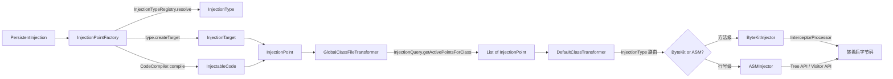
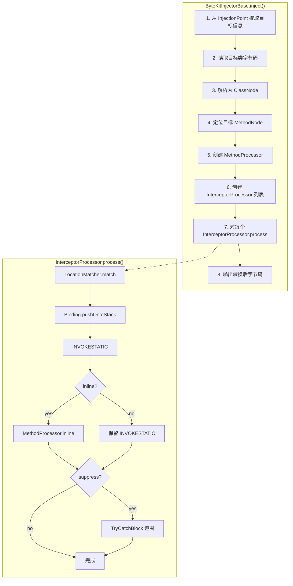
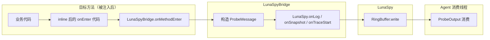
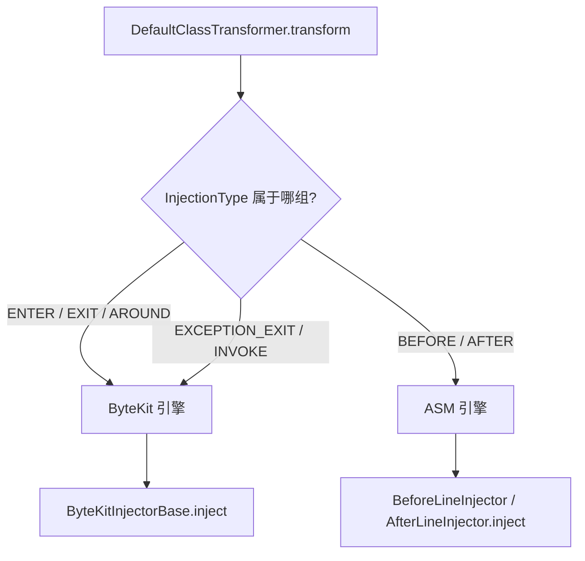

# ByteKit 集成重构 — 详细设计文档

> 日期：2026/05/31
> 原则：核心层不感知 ByteKit，也不感知 ASM；优先使用 ByteKit；ASM 只处理 ByteKit 无法覆盖的能力

---

## 一、整体架构

### 1.1 分层架构图

```mermaid
graph TB
    subgraph "Luna 核心层（零 ByteKit/ASM import）"
        IP[InjectionPoint]
        IT[InjectionType]
        IC[InjectionContext]
        EH[ExpressionHandler]
        BH[BytecodeHelper]
        BA[BytecodeAssembler]
        CR[ConditionRegistry]
        PO[ProbeOutput]
        CI[CodeInjector ← 新增]
        VS[VariableSnapshotter ← 新增]
        CA[ClassAnalyzer ← 新增]
    end

    subgraph "实现层（SPI）"
        subgraph "ByteKit 实现层"
            BKE[ByteKitEnterInjector]
            BKX[ByteKitExitInjector]
            BKA[ByteKitAroundInjector]
            BKEE[ByteKitExceptionExitInjector]
            BKI[ByteKitInvokeInjector]
            BKB[LunaSpyBridge]
        end
        subgraph "ASM 兜底实现层"
            BLI[BeforeLineInjector]
            ALI[AfterLineInjector]
            LVS[LocalVariableScanner]
            EBG[ExpressionBytecodeGenerator]
            GCF[GlobalClassFileTransformer]
        end
    end

    CI --> BKE
    CI --> BKX
    CI --> BKA
    CI --> BKEE
    CI --> BKI
    CI --> BLI
    CI --> ALI
    VS --> LVS
```



### 1.2 数据流转全景



---

## 二、核心层接口定义

### 2.1 CodeInjector — 字节码注入器接口

```java
/**
 * 实现无关的字节码注入器接口。
 * 核心层定义，ByteKit 和 ASM 分别提供实现。
 */
public interface CodeInjector {
    /**
     * 对字节码执行注入。
     *
     * @param point    注入点（目标 + 代码）
     * @param bytecode 原始类字节码
     * @return 注入结果（包含转换后字节码和状态）
     */
    InjectionResult inject(InjectionPoint point, byte[] bytecode);
}
```

**设计决策**：
- 入参使用 `InjectionPoint`（核心层已有模型），不引入新概念
- 返回 `InjectionResult`（核心层已有模型），保持一致性
- 不暴露 ByteKit / ASM 任何类型

### 2.2 VariableSnapshotter — 变量快照接口

```java
/**
 * 局部变量快照接口。
 * ByteKit 通过 @Binding.LocalVars 实现，ASM 通过 LocalVariableScanner 实现。
 */
public interface VariableSnapshotter {
    /**
     * 扫描指定方法在指定行号处可见的局部变量。
     *
     * @param bytecode 类字节码
     * @param method   方法名
     * @param desc     方法描述符
     * @param line     行号
     * @return 可见局部变量列表
     */
    List<VariableInfo> snapshot(byte[] bytecode, String method, String desc, int line);
}
```

### 2.3 VariableInfo — 变量信息数据类

```java
/**
 * 局部变量信息，实现无关。
 */
public final class VariableInfo {
    private final String name;
    private final String descriptor;
    private final int slot;

    // constructor, getters, equals, hashCode
}
```

### 2.4 ClassAnalyzer — 类分析接口

```java
/**
 * 类结构分析接口。
 * ByteKit 通过 AsmUtils 实现，ASM 通过 AsmClassAnalyzer 实现。
 */
public interface ClassAnalyzer {
    /**
     * 分析类字节码，返回类结构信息。
     */
    ClassInfo analyze(byte[] bytecode);

    /**
     * 获取类中各方法的行号映射。
     */
    Map<String, List<Integer>> getLineNumbers(byte[] bytecode);
}
```

---

## 三、ByteKit 适配器设计

### 3.1 适配器核心流程



### 3.2 ByteKitInjectorBase 抽象基类

```java
/**
 * ByteKit 注入器基类，封装 ByteKit 字节码处理通用流程。
 * 子类只需提供 InterceptorProcessor 列表。
 */
public abstract class ByteKitInjectorBase implements BytecodeInjector {

    @Override
    public byte[] inject(InjectionContext injectionContext, byte[] bytecode, BytecodeAssembler bytecodeAssembler) {
        // 1. 从 InjectionContext 提取目标类名、方法名、方法描述符
        // 2. 使用 ByteKit 的 ASM（com.alibaba.deps）解析 ClassNode
        // 3. 定位目标 MethodNode
        // 4. 创建 MethodProcessor
        // 5. 调用子类的 createInterceptorProcessors() 获取处理器列表
        // 6. 逐个执行 InterceptorProcessor.process()
        // 7. 使用 ClassLoaderAwareClassWriter 输出字节码
    }

    /**
     * 模板方法：子类提供 InterceptorProcessor 列表。
     */
    protected abstract List<InterceptorProcessor> createInterceptorProcessors(
            MethodProcessor methodProcessor, InjectionContext context);
}
```

### 3.3 Interceptor 模板类设计

ByteKit 的 Interceptor 模式要求定义带注解的 Java 类。Luna 需要动态生成或预定义这些类。

**方案选择**：**预定义模板类 + 运行时参数化**

原因：
- ByteKit 的注解解析依赖 `DefaultInterceptorClassParser`，需要真实的 Class 对象
- 动态生成注解类复杂度高，且 ByteKit 不支持
- 模板类回调内部调用 `LunaSpyBridge`，参数通过 Binding 自动传递

```java
/**
 * 方法入口拦截模板。
 * ByteKit 解析此类后，将 @AtEnter 方法内联到目标方法入口。
 */
public class EnterInterceptor {

    @AtEnter(inline = true, suppress = Throwable.class, suppressHandler = PrintSuppressHandler.class)
    public static void onEnter(
            @Binding.This Object target,
            @Binding.Args Object[] args,
            @Binding.MethodName String methodName) {
        // 桥接 Luna 探针系统
        LunaSpyBridge.onMethodEnter(target, args, methodName);
    }
}
```

### 3.4 LunaSpyBridge 桥接设计



**关键设计**：
- `LunaSpyBridge` 是静态方法类，注册到 `BootstrapClassRegistry`
- ByteKit inline 后的代码直接调用 `LunaSpyBridge` 静态方法，无 ClassLoader 隔离问题
- `LunaSpyBridge` 内部委托 `LunaSpy`，保持现有数据通道不变

---

## 四、关键算法

### 4.1 双引擎调度算法



**调度策略**：基于 `InjectionType` 的名称判断：
- 方法级注入类型 → ByteKit 引擎
- 行号级注入类型 → ASM 引擎

### 4.2 ByteKit Interceptor 解析与执行算法

```
输入: 目标类字节码, InjectionPoint
输出: 转换后字节码

1. 解析目标类字节码为 ClassNode（使用 ByteKit shade ASM）
2. 遍历 ClassNode.methods，匹配目标方法
3. 创建 MethodProcessor(classNode, methodNode)
4. 获取 InterceptorProcessor 列表（子类提供）
5. FOR EACH InterceptorProcessor:
   a. LocationMatcher.match(methodProcessor) → List<Location>
   b. FOR EACH Location:
      i.   如果 location.isStackNeedSave()，创建 StackSaver
      ii.  保存栈 → Binding.pushOntoStack → INVOKESTATIC → 恢复栈
      iii. 如果 suppress != None，用 TryCatchBlock 包围
      iv.  如果 inline == true，执行 MethodProcessor.inline()
6. 使用 ClassLoaderAwareClassWriter 输出字节码
7. 返回转换后字节码
```

### 4.3 ASM 版本隔离策略

```
ByteKit 使用: com.alibaba.deps.org.objectweb.asm.* (shade 重打包)
Luna   使用: org.objectweb.asm.* (原始包)

两者由不同的 ClassLoader 加载：
- ByteKit 的 ASM 类打包在 bytekit-core JAR 内
- Luna 的 ASM 类打包在 luna-core JAR 内
- 无类名冲突，无 LinkageError 风险

关键约束：
- ByteKit 适配器内部使用 com.alibaba.deps.org.objectweb.asm.*
- Luna 核心层和 ASM 兜底层使用 org.objectweb.asm.*
- 两者之间通过 byte[] 字节码交换数据，不传递 ASM 对象
```

---

## 五、设计模式

### 5.1 策略模式 — 双引擎调度

`DefaultClassTransformer` 根据 `InjectionType` 选择不同的注入策略（ByteKit / ASM），策略选择对调用方透明。

### 5.2 模板方法模式 — ByteKitInjectorBase

`ByteKitInjectorBase` 定义了 ByteKit 字节码处理的通用流程（解析 → 定位 → 处理 → 输出），子类只需实现 `createInterceptorProcessors()` 提供具体的拦截器配置。

### 5.3 适配器模式 — ByteKit → Luna

`ByteKitInjectorBase` 实现了 Luna 的 `BytecodeInjector` 接口，内部委托 ByteKit 的 `InterceptorProcessor` 完成实际工作。这是典型的适配器模式，将 ByteKit 的注解驱动模型适配到 Luna 的接口驱动模型。

### 5.4 桥接模式 — LunaSpyBridge

`LunaSpyBridge` 作为 ByteKit inline 代码与 Luna 运行时探针系统的桥梁，解耦了两者的直接依赖。ByteKit inline 后的代码只依赖 `LunaSpyBridge` 的静态方法，不依赖 `LunaSpy` 的具体实现。

### 5.5 注册表模式 — InjectionType 路由

通过 `InjectionTypeRegistry` 注册不同的注入类型，`DefaultClassTransformer` 根据类型查找对应的注入器，实现松耦合的扩展。

---

## 六、新增 InjectionType 设计

### 6.1 EXCEPTION_EXIT 注入类型

```java
/**
 * 异常退出注入类型。
 * 使用 ByteKit @AtExceptionExit 实现。
 */
public class ExceptionExitInjectionType extends InjectionType {
    public static final ExceptionExitInjectionType INSTANCE = new ExceptionExitInjectionType();

    private ExceptionExitInjectionType() {
        super("exception_exit", "方法异常退出注入",
              Arrays.asList("exceptionexit", "on_exception"));
    }

    @Override
    public InjectionTarget createTarget(String className, String methodName,
                                         String methodDescriptor, Integer lineNumber) {
        return new MethodTarget(className, methodName, methodDescriptor);
    }
}
```

### 6.2 INVOKE 注入类型

```java
/**
 * 子函数调用拦截注入类型。
 * 使用 ByteKit @AtInvoke 实现。
 */
public class InvokeInjectionType extends InjectionType {
    public static final InvokeInjectionType INSTANCE = new InvokeInjectionType();

    private InvokeInjectionType() {
        super("invoke", "子函数调用拦截",
              Arrays.asList("atinvoke", "on_invoke"));
    }

    @Override
    public InjectionTarget createTarget(String className, String methodName,
                                         String methodDescriptor, Integer lineNumber) {
        // InvokeTarget 需要额外的 invokeMethodName / invokeMethodDesc 字段
        return new InvokeTarget(className, methodName, methodDescriptor);
    }
}
```

### 6.3 InvokeTarget 目标类

```java
/**
 * 子函数调用拦截目标。
 * 除目标类/方法外，还需指定要拦截的子函数名称。
 */
public class InvokeTarget extends BaseTarget {
    private final String invokeMethodName;
    private final String invokeMethodDesc;
    private final boolean whenComplete;

    // constructor, getters
}
```

---

## 七、包结构设计

```
fun.efto.luna.core/
├── bytekit/                          ← 新增包
│   ├── adapter/                      ← ByteKit 适配器
│   │   ├── ByteKitInjectorBase.java  ← 抽象基类（含 InterceptorProcessor 缓存 + 注入结果缓存）
│   │   ├── ByteKitClassLoaderAwareClassWriter.java ← COMPUTE_FRAMES 安全 ClassWriter
│   │   ├── ByteKitEnterInjector.java
│   │   ├── ByteKitExitInjector.java
│   │   ├── ByteKitAroundInjector.java
│   │   ├── ByteKitExceptionExitInjector.java
│   │   └── ByteKitInvokeInjector.java
│   ├── interceptor/                  ← Interceptor 模板类
│   │   ├── SuppressHandler.java      ← @ExceptionHandler suppress 处理器（待创建）
│   │   ├── EnterInterceptor.java
│   │   ├── ExitInterceptor.java
│   │   ├── AroundInterceptor.java
│   │   ├── ExceptionExitInterceptor.java
│   │   └── InvokeInterceptor.java
│   └── bridge/                       ← LunaSpy 桥接
│       └── LunaSpyBridge.java
├── injection/
│   ├── CodeInjector.java             ← 新增接口
│   └── ... (现有类不变)
├── asm/
│   ├── VariableSnapshotter.java      ← 新增接口
│   ├── VariableInfo.java             ← 新增数据类
│   └── ... (现有类不变)
└── ... (其他包不变)
```

---

## 八、风险与缓解

| 风险 | 缓解措施 |
|------|---------|
| ByteKit shade ASM 与 Luna ASM 冲突 | ByteKit 使用 `com.alibaba.deps.org.objectweb.asm`，Luna 使用 `org.objectweb.asm`，包名完全不同 |
| ByteKit inline 后 LunaSpy 不可见 | `LunaSpyBridge` 注册到 `BootstrapClassRegistry`，确保 Agent ClassLoader 可加载 |
| ByteKit 不支持 retransform 动态增删 | 保留 `GlobalClassFileTransformer` 作为入口，ByteKit 仅负责字节码生成 |
| ByteKit @AtLine 精确度不足 | 精确场景保留 ASM `BeforeLineInjector` / `AfterLineInjector` |
| ByteKit 项目维护活跃度低 | 依赖 shade ASM 隔离，必要时可 fork 维护；核心层接口不依赖 ByteKit |
