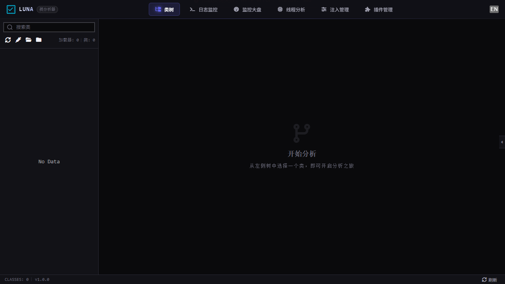

# Luna - Java Agent 动态诊断平台

[](https://openjdk.org/)
[](https://www.apache.org/licenses/LICENSE-2.0)

> 无侵入式 Java 应用运行时诊断工具，基于 Agent + 字节码注入实现方法级观测

## 截图



## 核心能力

| 探针类型 | 功能 | 示例 |
|----------|------|------|
| **LOG** | 方法入参/返回值/变量日志 | `line before: user=${user}, age=${age}` |
| **TRACE** | 方法耗时追踪与阈值告警 | `processOrder took 230ms` |
| **SNAPSHOT** | 执行快照（局部变量+调用栈） | 完整方法执行现场 |
| **INVOCATION** | 调用链追踪（树形层级） | `OrderService.processOrder → UserService.getUser → UserDao.findById` |

## 架构

```
┌─────────────┐     ┌──────────────────────────────────────┐
│  Luna UI     │◄───►│  Luna Agent                          │
│  (Vue.js)    │ API │  ┌──────────┐  ┌─────────────────┐  │
│              │     │  │ Web Layer│  │ Plugin System   │  │
│              │     │  │ (Jetty)  │  │ ┌─────────────┐ │  │
│              │     │  └──────────┘  │ │ ProbeHandler │ │  │
│              │     │                │ │ LOG/TRACE/   │ │  │
│              │◄──WS─│  ┌──────────┐  │ │ SNAPSHOT/   │ │  │
│              │     │  │Bootstrap │  │ │ INVOCATION   │ │  │
│              │     │  │   JAR    │  │ └─────────────┘ │  │
│              │     │  └──────────┘  └─────────────────┘  │
│              │     │  ┌──────────────────────────────┐   │
│              │     │  │ ASM Bytecode Injection Engine │   │
│              │     │  └──────────────────────────────┘   │
└─────────────┘     └──────────────────────────────────────┘
                                    │
                              attach to JVM
                                    │
                    ┌───────────────────────────────┐
                    │     Target Java Application    │
                    └───────────────────────────────┘
```

## 快速开始

```bash
# 构建
mvn clean package -DskipTests

# 启动 Demo 应用
cd example/scripts
start.bat

# 附加 Agent
attach.bat

# 访问 UI
open http://localhost:9090
```

## 技术栈

- **Agent Core**: Java Instrumentation API, ASM 字节码操作
- **Plugin System**: 可扩展的探针插件架构
- **Web Layer**: Jetty 嵌入式服务, WebSocket 实时推送
- **Frontend**: Vue 3 + Monaco Editor + TailwindCSS

## 项目结构

```
luna-core/          # 核心库：字节码注入引擎、插件系统、探针运行时
luna-agent/         # Agent 入口：premain/agentmain、Web 服务、REST API
luna-ui/            # 前端：类浏览器、注入对话框、日志查看器
example/            # Demo 应用与脚本
docs/knowledge-base/# 知识库驱动开发文档
```

## License

Apache License 2.0
