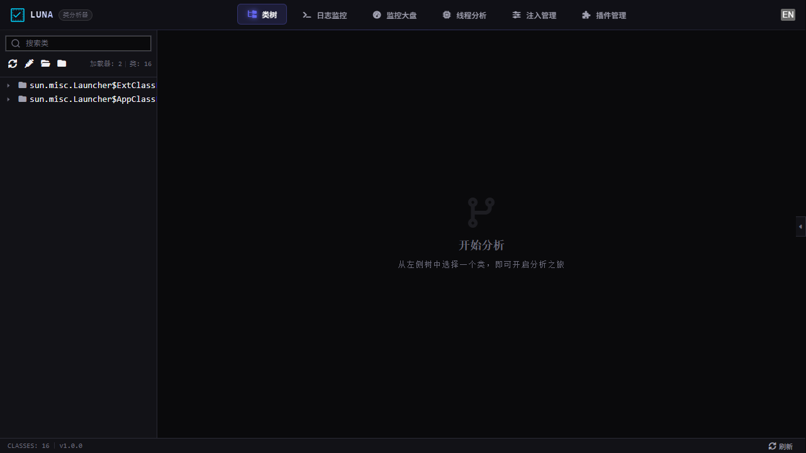
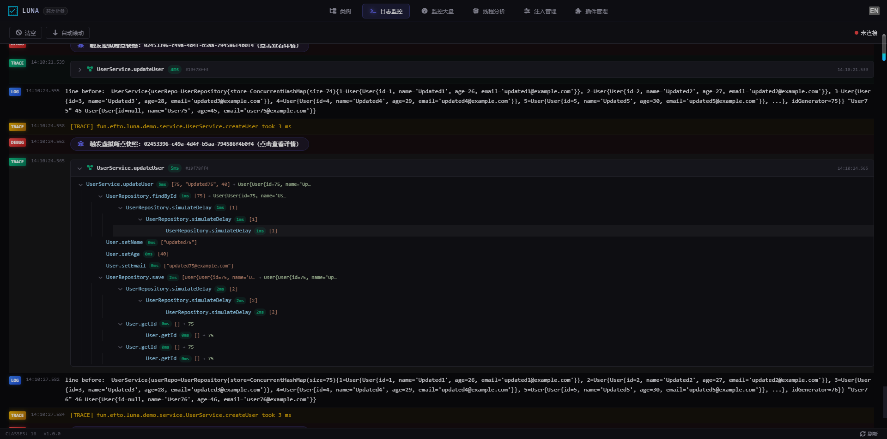
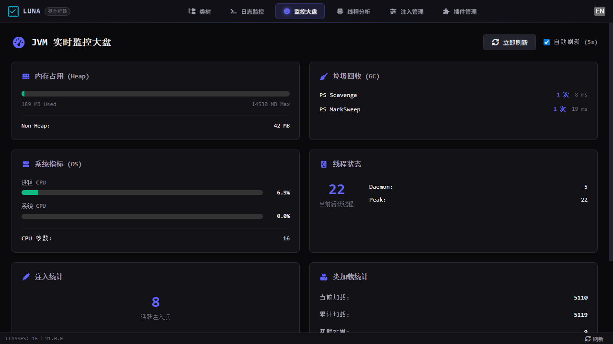
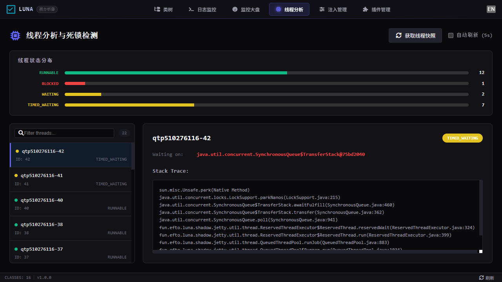
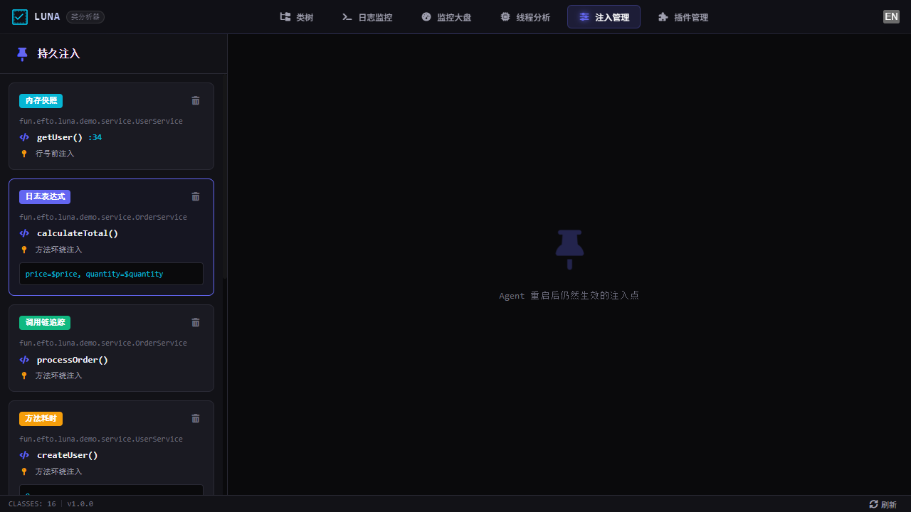
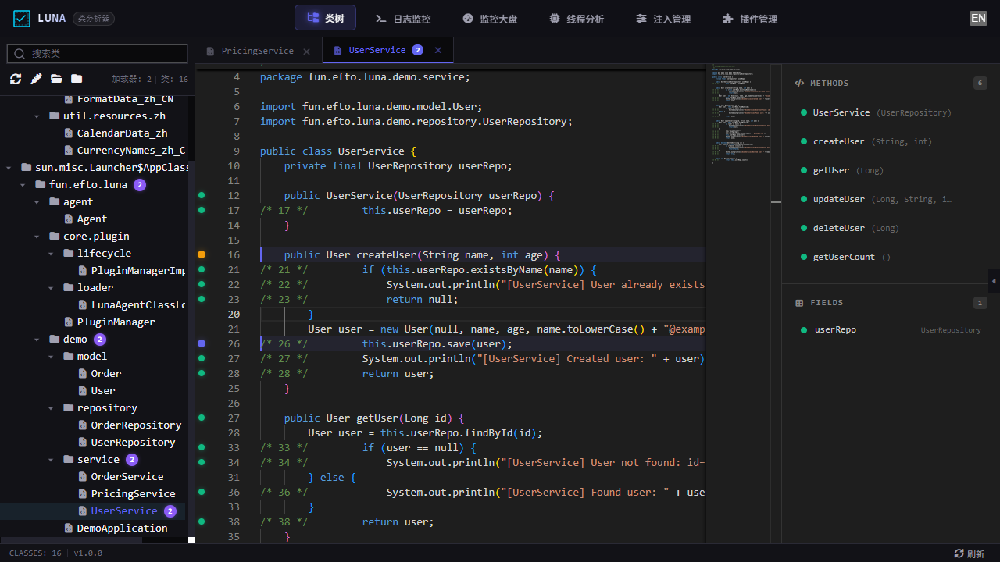

# Luna

[](https://openjdk.org/)
[](https://www.apache.org/licenses/LICENSE-2.0)

> **在代码的阴影里，露娜为你标记真相。**

在《三角洲行动》中，侦察干员露娜以箭矢洞穿迷雾，为队友标记威胁、共享情报；Luna 承袭其名，在 JVM 世界重演同样的侦察——无侵入、不干扰，实时标定运行真相，让排障不再盲目。

## Luna 是什么

Luna 是基于 Java Agent 的**运行时动态诊断工具**。无需修改业务代码、无需重启应用，即可按需注入观测逻辑，实时获取方法级运行时数据。

**解决的核心痛点：**

- **排障效率低** — 传统方式依赖加日志重启，无法实时获取运行时状态
- **侵入性强** — APM 方案需要修改代码或引入 SDK，影响业务稳定性
- **观测粒度粗** — 现有工具只能看到方法级耗时，无法深入到变量级别
- **缺乏动态性** — 问题出现时无法按需注入观测逻辑，必须预埋或重启

**Luna 不是什么：** 业务执行平台、业务逻辑扩展框架、持久业务状态管理器。Luna 只做观测、诊断、验证——安全扰动运行时行为，绝不替 JVM 执行业务。

## 核心能力

| 探针类型 | 功能 | 示例 |
|----------|------|------|
| **LOG** | 方法入参/返回值/变量日志 | `line before: user=${user}, age=${age}` |
| **TRACE** | 方法耗时追踪与阈值告警 | `processOrder took 230ms` |
| **SNAPSHOT** | 执行快照（局部变量+调用栈） | 完整方法执行现场 |
| **INVOCATION** | 调用链追踪（树形层级） | `OrderService.processOrder → UserService.getUser → UserDao.findById` |

### 关键特性

- **零侵入** — 不修改业务代码，基于 Java Instrumentation API 实现
- **不重启** — 支持运行时 Attach，诊断逻辑按需注入/移除
- **类隔离** — Agent 依赖通过 Bootstrap ClassLoader + Shade 隔离，不污染目标应用
- **安全可控** — 注入代码受沙箱保护，异常不传播到业务线程；RingBuffer 满时丢弃不阻塞
- **插件化** — 核心能力稳定，产品能力通过 ProbeHandler 插件扩展
- **实时推送** — WebSocket 实时推送诊断数据到 Web UI

## 功能截图

### 类浏览器 — 代码级注入


### 日志监控 — 实时探针输出


### 监控大盘 — 运行状态概览


### 线程分析


### 注入管理


### 插件管理


## 架构

```
┌─────────────┐     ┌──────────────────────────────────────┐
│  Luna UI     │◄───►│  Luna Agent                          │
│  (Vue.js)    │ API │  ┌──────────┐  ┌─────────────────┐  │
│              │     │  │ Web Layer│  │ Plugin System   │  │
│              │     │  │ (Jetty)  │  │ ┌─────────────┐ │  │
│              │     │  └──────────┘  │ │ ProbeHandler │ │  │
│              │     │                │ │ LOG/TRACE/   │ │  │
│              │◄──WS─│  ┌──────────┐  │ │ SNAPSHOT/   │ │  │
│              │     │  │Bootstrap │  │ │ INVOCATION   │ │  │
│              │     │  │   JAR    │  │ └─────────────┘ │  │
│              │     │  └──────────┘  └─────────────────┘  │
│              │     │  ┌──────────────────────────────┐   │
│              │     │  │ ASM Bytecode Injection Engine │   │
│              │     │  └──────────────────────────────┘   │
└─────────────┘     └──────────────────────────────────────┘
                                    │
                              attach to JVM
                                    │
                    ┌───────────────────────────────┐
                    │     Target Java Application    │
                    └───────────────────────────────┘
```

## 快速开始

### 前提条件

- JDK 8+ （构建需 JDK 8+，目标应用兼容 JDK 8+）
- Maven 3.6+

### 一键启动 Demo

```bash
# 克隆项目
git clone https://github.com/Tonys-L/Luna.git
cd Luna

# 构建并启动（Windows）
example\scripts\start.bat

# 或手动构建
mvn clean package -DskipTests

# 启动 Demo 应用（含 Agent）
java -javaagent:luna-agent/target/luna-agent-1.0-SNAPSHOT.jar \
     -jar example/luna-demo-app/target/luna-demo-app-1.0-SNAPSHOT.jar

# 访问 UI
open http://localhost:8421
```

### 运行时 Attach 到目标 JVM

无需重启目标应用，动态挂载 Agent：

```bash
# 查找目标 JVM 的 PID
jps -l

# 运行时 Attach
java -jar luna-agent/target/luna-agent-1.0-SNAPSHOT.jar <pid>

# 访问 UI
open http://localhost:8421
```

## 配置

| 参数 | 默认值 | 说明 |
|------|--------|------|
| Web 端口 | `8421` | Agent 内置 Jetty 服务端口 |
| WebSocket 路径 | `/ws/log` | 实时日志推送 |
| API 基路径 | `/api/` | REST API |

## 项目结构

```
luna-core/          # 核心库：字节码注入引擎、插件系统、探针运行时
luna-agent/         # Agent 入口：premain/agentmain、Web 服务、REST API
luna-ui/            # 前端：类浏览器、注入对话框、日志查看器
example/            # Demo 应用与启动脚本
docs/knowledge-base/# 知识库驱动开发文档
```

## 技术栈

- **Agent Core**: Java Instrumentation API, ASM 字节码操作, Shade 依赖隔离
- **Plugin System**: 可扩展的 ProbeHandler 插件架构
- **Web Layer**: Jetty 嵌入式服务, REST API + WebSocket 实时推送
- **Frontend**: Vue 3 + Monaco Editor + TailwindCSS

## 插件开发

Luna 通过 `ProbeHandler` 接口实现探针插件化扩展。实现该接口即可定义新的探针类型：

```java
public class MyProbeHandler implements ProbeHandler {

    @Override
    public String getProbeType() { return "MY_PROBE"; }

    @Override
    public boolean usesCode() { return true; }

    @Override
    public String getCodeType() { return "EXPRESSION"; }

    @Override
    public Set<String> supportedInjectionLocations() {
        return Set.of("method_around");
    }

    @Override
    public ValidationResult validate(InjectRequest request) {
        if (request.getCode() == null || request.getCode().isEmpty()) {
            return ValidationResult.fail("code is required");
        }
        return ValidationResult.ok();
    }

    @Override
    public void handle(CompiledCode code, GenerateContext ctx) {
        // 注入逻辑：在方法入口/出口处插入探针代码
    }

    // 可选：自定义前端展示
    @Override public String getDisplayName() { return "自定义探针"; }
    @Override public String getGlyphColor()  { return "#ff6b6b"; }
    @Override public String getIcon()        { return "fas fa-bolt"; }
}
```

注册为 `LunaPlugin` 即可被 Agent 自动加载：

```java
public class MyPlugin implements LunaPlugin {
    @Override
    public void register(PluginRegistry registry) {
        registry.registerProbeHandler(new MyProbeHandler());
    }
}
```

## 性能约束

| 指标 | 基准值 |
|------|--------|
| 启动延迟 | < 450ms |
| 单次插桩判定 | < 0.1ms |
| CPU 抖动 | < 2% |
| RingBuffer 满时策略 | 丢弃不阻塞业务线程 |

Luna 的定位差异：**面向开发者的可视化诊断工具**，而非命令行排障工具。通过类浏览器 + 代码编辑器的交互模式，降低诊断门槛，让"选方法 → 选探针 → 填参数"替代"写命令/写脚本"。

## 贡献

### 开发环境搭建

```bash
# 克隆并构建
git clone https://github.com/Tonys-L/Luna.git
cd Luna
mvn clean package -DskipTests

# 前端开发（热更新）
cd luna-ui
npm install
npm run dev

# 后端开发
# 使用 start.bat 启动 Agent，前端通过 dev server 代理 API
```

## 常见问题

<details>
<summary><b>Luna 会影响目标应用的性能吗？</b></summary>

Luna 设计了多层安全边界：
- 注入代码的异常不会传播到业务线程
- RingBuffer 满时丢弃数据，不阻塞业务线程
- 单次插桩判定 < 0.1ms，CPU 抖动 < 2%
- 未被注入的方法零开销
</details>

<details>
<summary><b>Luna 支持哪些 JDK 版本？</b></summary>

JDK 8+。Luna 自身编译为 JDK 8 字节码，Agent 通过 ASM 操作字节码时兼容 JDK 8 ~ 21+ 的 class 文件格式。
</details>

<details>
<summary><b>注入的探针可以移除吗？</b></summary>

可以。在"注入管理"页面点击删除，或通过 REST API 调用 `DELETE /api/injections/{id}`。Luna 会触发 retransform 还原原始字节码。
</details>

<details>
<summary><b>重启目标 JVM 后注入会失效吗？</b></summary>

是的。Luna 的注入是运行时的，JVM 重启后字节码恢复原始状态。这是"零侵入"设计的必然结果——不修改 class 文件、不打补丁。
</details>

## License

[Apache License 2.0](LICENSE)

Copyright © 2025-2026 Tony.L
