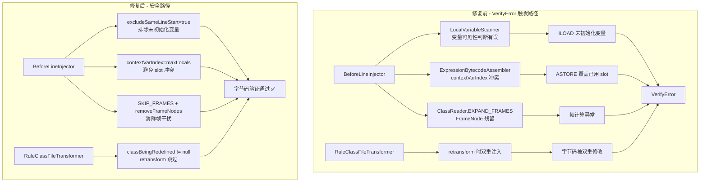
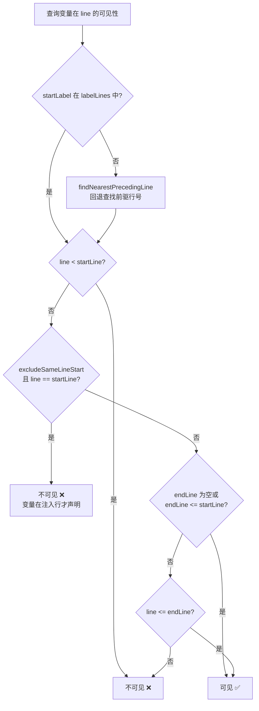

# Luna VerifyError 修复设计规约

> **版本**: v1.0
> **日期**: 2026/05/10
> **作者**: Tony.L

---

## 1. 问题描述

Luna Agent 在执行 `line_before` 行号级注入时，`InstrumentationImpl.retransformClasses0()` 抛出 `java.lang.VerifyError: null`，导致字节码注入失败。

---

## 2. 根因分析

经 3 轮深度排查，共发现 **4 个相互作用的 Bug**：

### Bug 1: 加载未初始化的局部变量

**位置**: `LocalVariableScanner` + `ExpressionBytecodeAssembler`

**原因**: `BeforeLineInjector` 在第 N 行之前插入代码时，`LocalVariableScanner` 将第 N 行声明的变量报告为"可见"（因为其作用域从第 N 行开始）。但在 `LineNumberNode` 之前的位置，该变量**尚未被赋值**。

`ExpressionBytecodeAssembler.generateConditionCheck()` 加载所有可见局部变量绑定到 `EvaluationContext`，对未初始化变量执行 `ILOAD` 导致 JVM 验证器拒绝。

**修复**: `LocalVariableScanner` 新增 `excludeSameLineStart` 参数，排除在注入行才声明的变量。

### Bug 2: FrameNode 与 COMPUTE_FRAMES 冲突

**位置**: `BeforeLineInjector` + `AfterLineInjector`

**原因**: 使用 `ClassReader.EXPAND_FRAMES` 读取类文件时，`MethodNode.instructions` 中产生 `FrameNode` 对象。当 `MethodNode.accept()` 写入 `ClassWriter` 时，残留的 `FrameNode` 干扰帧计算。

**修复**: 改用 `ClassReader.SKIP_FRAMES` 读取 + 写入前移除所有 `FrameNode`。

### Bug 3: RuleClassFileTransformer 在 retransform 时双重注入

**位置**: `RuleClassFileTransformer`

**原因**: 该转换器在 retransform 阶段也被调用，先于 `ClassFileTransformerAdapter` 对同一方法进行额外注入，导致字节码被双重修改。

**修复**: 添加 `classBeingRedefined != null` 检查，retransform 时跳过。

### Bug 4: contextVarIndex 与局部变量 slot 冲突

**位置**: `ExpressionBytecodeAssembler`

**原因**: `contextVarIndex = maxSlot + 1` 仅基于当前可见的参数和局部变量计算，但方法中可能存在不可见但已占用 slot 的变量（如循环变量 `i`），导致 `contextVarIndex` 与已占用 slot 冲突。

**修复**: 优先使用 `MethodNode.maxLocals` 作为 `contextVarIndex`，并在注入后更新 `maxLocals`。

---

## 3. 修复架构



---

## 4. 修改文件清单

| 文件 | 修改内容 | Bug |
|------|----------|-----|
| `LocalVariableScanner.java` | 新增 `excludeSameLineStart` 参数；`isVariableVisibleAtLine` 增加同行起始排除逻辑；`findNearestPrecedingLine` 回退查找 | Bug1 |
| `BeforeLineInjector.java` | 传入 `excludeSameLineStart=true`；改用 `SKIP_FRAMES`；新增 `removeFrameNodes()`；更新 `maxLocals` | Bug1,2,4 |
| `AfterLineInjector.java` | 改用 `SKIP_FRAMES`；新增 `removeFrameNodes()`；更新 `maxLocals` | Bug2,4 |
| `RuleClassFileTransformer.java` | 添加 `classBeingRedefined != null` 检查 | Bug3 |
| `ExpressionBytecodeAssembler.java` | `contextVarIndex` 优先使用 `maxLocals` | Bug4 |
| `AsmInjectionContext.java` | 新增 `maxLocals` 字段和 getter/setter | Bug4 |

---

## 5. 关键算法

### 5.1 变量可见性判断（修复后）



### 5.2 contextVarIndex 计算（修复后）

```java
// 修复前：仅基于可见变量，可能冲突
int contextVarIndex = maxSlot + 1;

// 修复后：优先使用方法实际最大局部变量数
int contextVarIndex = asmContext.getMaxLocals() > 0
        ? asmContext.getMaxLocals()    // 使用 maxLocals，避免 slot 冲突
        : maxSlot + 1;                // 回退到旧逻辑
```

---

## 6. 测试验证

### 6.1 后端单元测试

| 测试类 | 用例数 | 覆盖 |
|--------|--------|------|
| `LineBeforeInjectionVerifyTest` | 4 | snapshot/log/条件注入 + BytecodeClassLoader 验证 |
| `LineInjectorTest` | 12 | BeforeLine/AfterLine/Enter/Exit/Around 全注入器 |
| `LocalVariableScannerTest` | 6 | 参数可见性、excludeSameLineStart、循环变量排除、边界条件 |

### 6.2 前端 Playwright E2E 测试

| 测试套件 | 用例数 | 覆盖 |
|----------|--------|------|
| 类浏览与反编译 | 6 | 类列表、反编译、分析、行号表、局部变量表 |
| 方法级注入 | 4 | ENTER/EXIT/AROUND log + ENTER snapshot |
| 行号级注入 | 5 | LINE_BEFORE/AFTER log + BEFORE snapshot + 条件注入 |
| 注入生命周期 | 3 | 注入→查询→移除、dry-run、移除不存在 |
| 规则 CRUD | 3 | 创建/查询/删除 |
| 系统状态与指标 | 4 | status/jvm/threads/health |

**总计**: 后端 22+ 用例 + 前端 65 用例，全部通过，0 跳过，0 失败。
