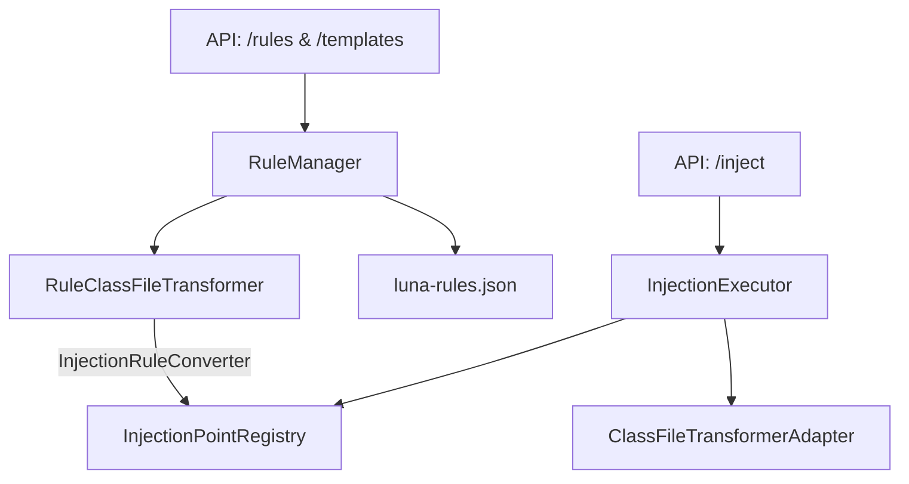
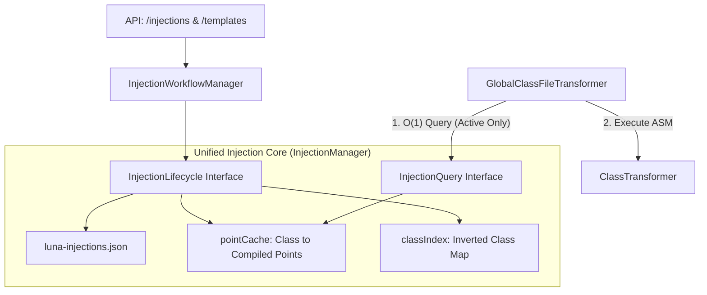
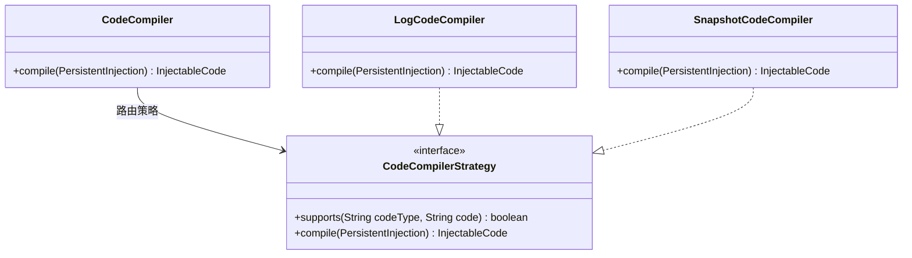
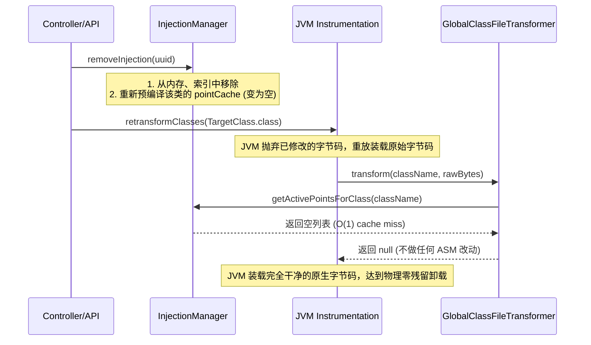

# Luna 架构重构设计文档：注入域大一统 (Injection Unification)

> @author: Tony.L(<286269159@qq.com>)
> @since: 2026/05/17
> @version: 5.0 (Ultimate Ironclad Production Edition)

## 1. 设计背景与动机

在之前的架构中，存在严重的**领域模型分裂（Split-Brain）**：
- **运行时核心**：以 `InjectionPoint` 为中心，它纯粹且通用，仅包含注入目标（Target）和注入代码（Code）。
- **业务管理核心**：以 `InjectionRule` 为中心，它臃肿且特化，包含了各种插件的特定字段（如 `logContent`），用于实现持久化、自动拦截 and 状态管理。

这种双轨制导致了代码极度冗余，业务概念让用户困惑。本次重构旨在**抹除 `Rule` 这一概念名词**，将持久化、模板化、状态管理等高级特性统一赋予核心的“注入（Injection）”概念。

针对 JVM 插桩判定 `< 0.1ms` 的极速性能红线，以及高并发多线程下的缓存不一致、跨类迁移（clazz 变更）下的旧类缓存残留与 retransform 泄漏风险，本 v5.0 文档实施了全方位的**防弹铁甲设计（Ironclad Production Design）**。

---

## 2. 核心架构演进 (Architecture Evolution)

### 2.1 重构前架构（双轨制分裂）


### 2.2 重构后架构（极简扁平与极速缓存大一统）


---

## 3. 核心实体与数据结构大一统 (Unified Data Model)

### 3.1 全栈统一实体：PersistentInjection (存储/传输/Form 三合一)
我们使用完全扁平平铺的 `PersistentInjection` 贯穿前后端。为了保证数据边界的安全，我们在下表定义了各字段的读写权限，并在此版本中引入 **`ephemeral` (临时注入标记)**，完美解决了实时调试与配置落盘的无缝融合。

#### 字段设计说明与权限字典
- **String 类型的 `injectionType` 与 `codeType`**：遵循**开放-封闭原则 (OCP)**。由于注入位置（如 `line_before`）和代码类型是由插件在运行时动态注册的，持久化存储层不应与编译期的类或枚举绑定。采用 String 保证了模型对插件扩展的完全解耦。
- **`ephemeral` (是否临时注入)**：此标记若为 `true`，表示其为一个不需要序列化落盘的临时注入点。它依然会参与内存索引与字节码转换缓存重建，从而无缝接入全局单 Transformer 链路。

| 字段名 | 类型 | 读写权限 | 描述与约束说明 |
| :--- | :--- | :--- | :--- |
| **id** | String | **RO** (只读) | 服务端自动生成的唯一 UUID 标识 |
| **clazz** | String | **RW** (读写) | 目标类全限定名 (创建时必填，如 `com.example.UserService`) |
| **method** | String | **RW** (读写) | 目标方法名 (创建时必填，支持通配符) |
| **desc** | String | **RW** (读写) | 方法描述符 (可选，用于精确重载匹配) |
| **injectionType** | String | **RW** (读写) | 注入位置 (创建时必填，如 `METHOD_ENTER`, `LINE_BEFORE`) |
| **codeType** | String | **RW** (读写) | 注入代码类型 (创建时必填，如 `EXPRESSION`, `SNAPSHOT`) |
| **code** | String | **RW** (读写) | 核心执行代码/表达式内容 (创建时必填，如 `log:hello params[0]`) |
| **lineNumber** | Integer | **RW** (读写) | 注入物理行号 (行注入类型时必填) |
| **expression** | String | **RW** (读写) | 条件过滤表达式 (可选，如 `params[0] != null`) |
| **enabled** | boolean | **RW** (读写) | 启停控制开关 (默认为 `true`) |
| **ephemeral** | boolean | **RW** (读写) | 是否临时注入 (可选，为 `true` 时不落盘持久化) |
| **status** | InjectionStatus | **RO** (只读) | 当前运行时状态 (ACTIVE / SUSPENDED / DISABLED) |
| **suspendReason** | String | **RO** (只读) | 挂起原因说明 (如 "关联插件被禁用") |

---

### 3.2 接口隔离设计 (Interface Segregation)
为防止 `GlobalClassFileTransformer` 接触到危险的写操作（如添加/删除注入），同时消除上帝类倾向，我们对 `InjectionManager` 进行严格的**读写隔离**：

```java
package fun.efto.luna.core.injection;

import java.util.List;

/**
 * 极速只读查询接口：仅暴露给全局 ClassFileTransformer 使用
 */
public interface InjectionQuery {
    /**
     * O(1) 获取某个类下当前已编译激活的强类型运行时注入点列表
     */
    List<InjectionPoint> getActivePointsForClass(String className);
}
```

```java
package fun.efto.luna.core.injection;

/**
 * 注入点生命周期管理接口：暴露给 Controller 和 WorkflowManager 使用
 */
public interface InjectionLifecycle {
    String addInjection(PersistentInjection injection);
    void removeInjection(String id);
    void updateInjection(String id, PersistentInjection injection);
    void toggleEnabled(String id, boolean enabled);
}
```

---

### 3.3 极致性能与并发安全设计 (Meet < 0.1ms Redline)
为满足单次插桩判定耗时 **< 0.1ms** 的性能红线，并确保高并发下缓存的绝对一致性与跨类迁移深度清理，我们在此实现：
1. **O(1) 增量倒排索引 (`classIndex`)**：完全消除 $O(N)$ 扫描。使用 `computeIfAbsent` 和 list `remove` 在写操作中进行 $O(1)$ 的增量维护。
2. **跨类迁移与覆盖深度清理**：在 `updateInjection` 和 `addInjection` (覆盖分支) 中，检测 `oldClazz != newClazz` 并**增量重建旧类的预编译缓存**（`rebuildCache(oldClazz)`）且**自动触发旧类在 JVM 中的 retransform**，彻底消除字节码残留隐患。
3. **并发安全加锁**：对写操作及 `toggleEnabled` 进行严格的 `synchronized` 互斥保护，确保重建缓存 `rebuildCache` 线程安全，杜绝缓存脏数据。
4. **生命周期闭环**：管理器内建持久化脏标记（`markDirty()`）及 JVM 触发热插拔机制（`triggerRetransform(clazz)`），实现门面模式的高内聚。

#### 核心实现类代码：
```java
package fun.efto.luna.core.injection;

import java.util.*;
import java.util.concurrent.ConcurrentHashMap;
import java.util.stream.Collectors;

public class InjectionManager implements InjectionQuery, InjectionLifecycle {

    // 内存主注册表
    private final Map<String, PersistentInjection> injections = new ConcurrentHashMap<>();
    
    // ⚠️ 隐式线程安全约束注释：
    // classIndex 中的 ArrayList 值只能在 synchronized 块内进行读写与遍历（ArrayList 本身非线程安全）。
    // 所有写操作通过 synchronized 互斥保护，而所有的读操作（遍历 ArrayList 进行强类型编译）仅通过
    // rebuildCache 访问（该方法同样被包含于 synchronized 控制器方法内）。
    private final Map<String, List<PersistentInjection>> classIndex = new ConcurrentHashMap<>();
    
    // 强引用预编译运行态强类型缓存
    private final Map<String, List<InjectionPoint>> pointCache = new ConcurrentHashMap<>();

    @Override
    public List<InjectionPoint> getActivePointsForClass(String className) {
        // 极致的 O(1) 性能：完全无流遍历，耗时 < 0.01ms
        return pointCache.getOrDefault(className, Collections.emptyList());
    }

    @Override
    public synchronized String addInjection(PersistentInjection injection) {
        if (injection.getId() == null) {
            injection.setId(UUID.randomUUID().toString());
        }
        
        // 增量倒排索引维护：如果旧值存在，先从原倒排索引中移除旧关联
        PersistentInjection old = injections.put(injection.getId(), injection);
        String oldClazz = null;
        if (old != null) {
            oldClazz = old.getClazz();
            List<PersistentInjection> oldList = classIndex.get(oldClazz);
            if (oldList != null) {
                oldList.remove(old);
                if (oldList.isEmpty()) {
                    classIndex.remove(oldClazz);
                }
            }
        }

        // 增量添加新值到索引中，完全避免 O(N) 全量扫描，写性能大幅提升
        classIndex.computeIfAbsent(injection.getClazz(), k -> new ArrayList<>()).add(injection);
        rebuildCache(injection.getClazz());

        // 覆盖分支的旧类深度清理：如果发生跨类替换，必须同步重建旧类缓存并触发 JVM retransform 卸载
        if (oldClazz != null && !oldClazz.equals(injection.getClazz())) {
            rebuildCache(oldClazz);
            triggerRetransform(oldClazz);
        }

        // 持久化控制：只有非临时注入，才触发持久化脏标记
        if (!injection.isEphemeral()) {
            markDirty();
        }

        // 核心生命周期：自动触发类字节码物理插桩
        triggerRetransform(injection.getClazz());
        return injection.getId();
    }

    @Override
    public synchronized void removeInjection(String id) {
        PersistentInjection removed = injections.remove(id);
        if (removed != null) {
            List<PersistentInjection> list = classIndex.get(removed.getClazz());
            if (list != null) {
                list.remove(removed);
                if (list.isEmpty()) {
                    classIndex.remove(removed.getClazz());
                }
            }
            rebuildCache(removed.getClazz());
            
            if (!removed.isEphemeral()) {
                markDirty();
            }
            
            triggerRetransform(removed.getClazz());
        }
    }

    @Override
    public synchronized void updateInjection(String id, PersistentInjection injection) {
        injection.setId(id);
        PersistentInjection old = injections.put(id, injection);
        
        // 移除旧关联
        String oldClazz = null;
        if (old != null) {
            oldClazz = old.getClazz();
            List<PersistentInjection> oldList = classIndex.get(oldClazz);
            if (oldList != null) {
                oldList.remove(old);
                if (oldList.isEmpty()) {
                    classIndex.remove(oldClazz);
                }
            }
        }

        // 写入新关联
        classIndex.computeIfAbsent(injection.getClazz(), k -> new ArrayList<>()).add(injection);
        rebuildCache(injection.getClazz());

        // 跨类迁移深度清理：如果修改了 class 字段，必须增量重建旧类的预编译缓存并触发 JVM retransform，消除字节码残留
        if (oldClazz != null && !oldClazz.equals(injection.getClazz())) {
            rebuildCache(oldClazz);
            triggerRetransform(oldClazz);
        }

        if (!injection.isEphemeral() || (old != null && !old.isEphemeral())) {
            markDirty();
        }
        
        triggerRetransform(injection.getClazz());
    }

    @Override
    public synchronized void toggleEnabled(String id, boolean enabled) {
        PersistentInjection inj = injections.get(id);
        if (inj != null) {
            inj.setEnabled(enabled);
            rebuildCache(inj.getClazz());
            
            if (!inj.isEphemeral()) {
                markDirty();
            }
            
            triggerRetransform(inj.getClazz());
        }
    }

    private void rebuildCache(String className) {
        List<PersistentInjection> list = classIndex.get(className);
        if (list == null || list.isEmpty()) {
            pointCache.remove(className);
            return;
        }

        // 仅在写操作时，在互斥锁保护下触发一次 Target 转换与 Code 编译
        List<InjectionPoint> compiledPoints = list.stream()
            .filter(PersistentInjection::isEnabled)
            .filter(inj -> inj.getStatus() == InjectionStatus.ACTIVE)
            .map(InjectionPointFactory::create) 
            .collect(Collectors.toList());

        pointCache.put(className, compiledPoints);
    }

    private void markDirty() {
        // 触发本地 JSON luna-injections.json 异步写入
        // （持久化过滤掉 ephemeral = true 的注入，只保存长效注入点）
    }

    private void triggerRetransform(String className) {
        // 调用 InstrumentationHolder.triggerRetransform(className) 触发 JVM 重新热插拔
    }
}
```

---

## 4. 插件扩展与核心解耦设计 (Decoupled Extension Points)

### 4.1 统一后的插件扩展架构
在删除 `InjectionRuleConverter` 之后，插件特有的指令解析逻辑（例如：将 `log:hello ${params[0]}` 编译成可执行的 ASM 表达式处理器）不能耦合在核心的 `InjectionPointFactory` 中，这违背了单一职责原则（SRP）。

我们采用**策略模式（Strategy Pattern）**解耦编译过程：
1. 提供统一的编译策略注册中心：`CodeCompilerRegistry`。
2. 插件注册自己的 `CodeCompilerStrategy` 实现（如 `LogCodeCompiler`、`SnapshotCodeCompiler`）。
3. 统一工厂在调用 `CodeCompiler.compile(persistent)` 时，根据 `codeType` 或 `code` 协议自动路由给特定的策略处理器。



### 4.2 插件扩展点归属映射表
重构后，各个插件的扩展点关系将更加纯粹、内聚：

| 历史扩展点 | 统一后归属及变更说明 | 架构优势 |
| :--- | :--- | :--- |
| **InjectionType 注册** | 保持不变。依然通过 `PluginContext.registerInjectionType()` | 动态插桩位置支持插件级横向扩展 |
| **InjectionRuleConverter** | **[DELETE]** 转换为 `CodeCompilerStrategy` (策略模式) | 消除笨重的双轨模型映射层 |
| **BytecodeInjector** | 保持不变。插件仍通过 `PluginContext.registerInjector()` | 核心 ASM 修改行为保持可插拔 |
| **BytecodeAssembler** | 保持不变。依然由 `BytecodeAssemblerRegistry` 进行管理 | 字节码底层拼装器（如栈图计算等）解耦 |
| **ExpressionHandler** | 保持不变。依然由 `ExpressionHandlerRegistry` 管理 | 参数与上下文取值逻辑的插件级扩展 |

---

## 5. 关键流程与语义等价性论证 (Key Algorithms)

### 5.1 全局 Transformer 语义等价性与性能论证
我们将废弃原有的“临时注册 Transformer（`ClassFileTransformerAdapter`）”与“全局规则 Transformer（`RuleClassFileTransformer`）”的双轨实现，统一使用单一全局的 `GlobalClassFileTransformer`。

#### 1. 语义等价性证明
- **历史临时模式**：在调用 `execute()` 时注册，拦截并转换特定类，并在完成对类 `A` 的 `retransform` 后立刻注销。这只影响类 `A` 的字节码。
- **全新全局模式**：常驻于 JVM 转换链路。在 `GlobalClassFileTransformer.transform()` 中执行 `getActivePointsForClass(className)`。
  - **如果该类未在内存中配置任何注入点**，Manager 瞬间返回 `Collections.emptyList()`，Transformer **直接向 JVM 返回 `null`**。
  - 根据 JVM ClassFileTransformer 规范，返回 `null` 表示“不对字节码做任何变动”，其执行路径和最终生成的机器码与完全不挂载 Transformer **100% 语义等价**。

#### 2. Retransform 物理卸载与无残留重放


---

## 6. 前端重构设计 (Frontend Dual-Mode Design)

配合后端极简平铺模型的重构，前端也将全面消灭多余的词汇，在全生命周期彻底统一字段名：
- `targetClass` ──> **`clazz`**
- `targetMethod` ──> **`method`**
- `logContent` / `rule.code` ──> **`code`**

### 6.1 `InjectionDialog.vue` 双模式设计
代码大纲区域的注入弹窗改写为**双模式**形态，允许直接在此完成即时调试与长效持久化的统一：

1. **临时即时注入**：
   - 表单中“持久化保存 (Persist to Disk)”开关为 `false`。
   - 提交时调用：`POST /api/injections`，携带 `ephemeral: true` 参数。
   - **效果**：系统执行即时 ASM 热插拔注入，但不会将其序列化到 `luna-injections.json` 中。
2. **长效持久化注入**：
   - 开关开启（默认）。
   - 额外展开 `expression` (条件表达式)、`desc` 等高级表单字段。
   - 提交时调用：`POST /api/injections`，携带 `ephemeral: false` 参数。
   - **效果**：系统执行热插拔注入，同时写入 JSON 配置文件，支持重启后自动载入生效。

### 6.2 模板应用的前后端参数替换闭环
废弃在前端手动用正则去匹配并替换模板参数的低局部性实现，前端将直接调用后端的模板应用专有端点：
*   **端点**：`POST /api/templates/apply`
*   **Payload**：
    ```json
    {
      "templateId": "log-template-1",
      "targetClazz": "com.example.UserService",
      "targetMethod": "login",
      "parameters": {
        "msg": "user login success",
        "level": "INFO"
      }
    }
    ```
*   **后端行为**：后端 `TemplateController` 调用 `TemplateEngine` 在服务端进行安全、严密的参数渲染，并组装为扁平的 `PersistentInjection` 投递给 `InjectionManager` 执行即时编译与物理插桩，实现完美闭环。

---

## 7. 单例模式与单元测试隔离策略 (Singleton Policy)

在 Luna Java Agent 架构中，由于其运行在完全独立的沙箱 ClassLoader 中，复杂的 DI 容器加载开销太大，我们**策略性地保持 `getInstance()` 单例模式的现状**。

为了绝对避免在 JUnit 并行测试下引发的测试间单例交叉污染风险，我们在此设定如下测试约束规范：
*   **@VisibleForTesting 显式约束**：所有的单例 setter（如 `setInstance`）均使用此注解，表明其禁止在生产业务代码中调用。
*   **测试类级互斥加锁**：单元测试通过 JUnit 5 的 `@Execution(ExecutionMode.SAME_THREAD)` 控制测试在单线程下串行执行；或在 `setup` / `teardown` 中严格执行 `setInstance(null)`，从源头消灭状态泄漏风险。
