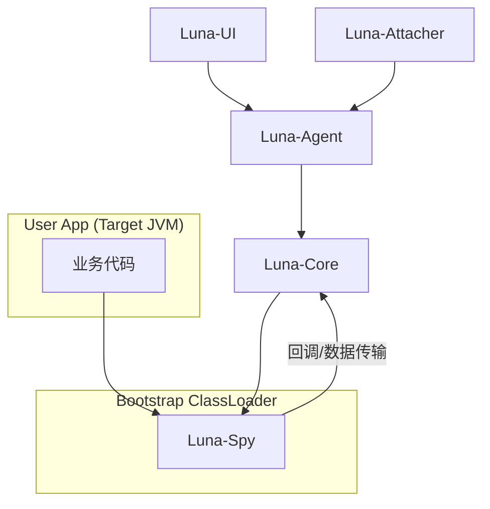
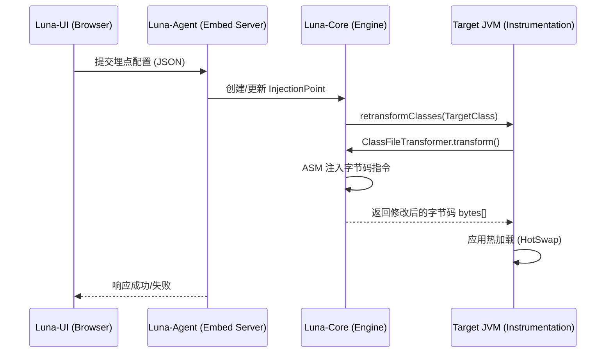

# Luna 技术架构与核心设计

> **版本**: v1.0
> **更新日期**: 2026-03-28
> **项目定位**: 基于 Java Agent 的动态日志埋点系统核心架构文档

---

## 1. 架构理念

### 1.1 洋葱架构思想 (Flexible Onion Architecture)

Luna 在设计上吸收了洋葱架构的核心思想，即**依赖倒置**与**核心隔离**：

| 原则          | 说明                                         |
|-------------|--------------------------------------------|
| **内层逻辑独立性** | 核心业务逻辑（如埋点控制、安全校验策略）位于中心，不依赖任何外部框架或技术细节    |
| **依赖向内流动**  | 所有的依赖关系都指向内层。Web 接口层引用核心接口，而非核心逻辑引用 Web 接口 |
| **技术实现外置**  | 具体的字节码引擎实现、日志框架适配器、反编译工具等均作为"插件化"的基础设施实现   |

### 1.2 模块依赖关系



---

## 2. 模块详细职责

### 2.1 模块职责表

| 模块名称              | 职责描述                                          | 核心类/组件                                                   |
|:------------------|:----------------------------------------------|:---------------------------------------------------------|
| **Luna-Core**     | 核心业务建模、注入契约定义、字节码分析与重写                        | `InjectionPoint`, `ClassTransformer`, `AsmClassAnalyzer` |
| **Luna-Spy**      | **[核心间谍模块]** 注入到 Bootstrap 加载器，负责跨类加载器通讯与数据桥接 | `LunaSpy`, `SpyHandler`                                  |
| **Luna-Agent**    | 系统入口、生命周期管理、代理加载器隔离、依赖重定位 (Shade)             | `LunaAgent`, `IsolatedAgentClassLoader`                  |
| **Luna-Attacher** | 运行时 Attach 工具，负责通过 PID 将 Agent 注入目标 JVM       | `Attacher`, `VirtualMachine`                             |
| **Luna-UI**       | 诊断控制台、实时监控看板、反编译查看器                           | `LunaApiServlet`, `WebSocketHandler`                     |

---

## 3. 字节码注入流程

### 3.1 注入流程时序图



### 3.2 注入逻辑分段说明

当用户通过 Web 界面提交一个"行号埋点"请求时，系统执行以下流程：

1. **Request Parsing**: `Luna-UI` 接收 JSON 请求，解析为 `LogInjectionPoint` 对象
2. **Source Mapping**: `Luna-Core` 调用 `InstrumentationManager.retransformClasses()`
3. **Class Transformation**:
    - `LunaAgent` 拦截该类的转换
    - `ASMEngine` (in `Luna-Core`) 扫描该类的字节码
    - 找到对应的 `LineNumberNode`
    - 插入字节码指令（模拟日志打印代码）

---

## 4. 核心机制设计

### 4.1 JVM Attach 机制

Luna 使用 JDK 自带的 `com.sun.tools.attach.VirtualMachine` API 实现运行时注入：

```java
VirtualMachine vm = VirtualMachine.attach(pid);
try {
    vm.loadAgent(agentJarPath, options);
} finally {
    vm.detach();
}
```

### 4.2 类隔离策略

为了确保 Luna 的依赖（如 Jetty, ASM）不影响目标进程：

**策略一：隔离加载**

- 自定义 `IsolatedAgentClassLoader`
- 代理 `findClass` 方法，优先从 Luna 内部维护的 JAR 资源中读取
- **打破双亲委派**：除了 `java.*` 等核心类外，Luna 自身的类均由该 ClassLoader 隔离加载

**策略二：字节码更名 (Shading)**

- 利用 Maven Shade Plugin，将 `org.objectweb.asm` 重命名为 `fun.efto.luna.shade.asm`
- 即使宿主应用也依赖了不同版本的 ASM，由于全限定名不同，加载时完全隔离

### 4.3 字节码注入策略

**方法级别注入 (Method-Level)**：

- 利用 ASM 的 `AdviceAdapter`
- `Entry` 注入：在 `onMethodEnter` 插入
- `Exit` 注入：在 `onMethodExit` 插入（需处理抛异常退出的情况）

**行号级别注入 (Line-Number)**：

- 扫描 `MethodNode` 中的指令序列，识别 `LineNumberNode`
- `前置注入 (Before)`：在 `LineNumberNode` 之前的 Label 后插入
- `后置注入 (After)`：在 `LineNumberNode` 之后的下一条有效指令前插入

### 4.4 多次注入与类缓存管理

Luna 会在内存中维护一个双层缓存：

- **Original Bytes (原始字节码)**：第一次被 Luna 转换前的纯净字节码，用于"一键重置（Un-inject）"
- **Current Modified Bytes (当前修改本)**：包含了当前所有已生效埋点的字节码

**同一个类的多次注入处理**：遵循 **"Clean Slate + Re-apply"** 策略

1. 从 `Original Bytes` 缓存取出纯净数据
2. 获取该类当前所有的活跃埋点列表
3. **一次性聚合注入**：在单一的一次 `transform` 调用中，按顺序穿插所有埋点指令
4. 调用 `retransformClasses` 覆盖载入

---

## 5. 关键解决方案

### 5.1 精准埋点定位

**行号匹配**：

- 源码中的第 N 行对应字节码中的 `LineNumberNode` 标签
- ASM 引擎会扫描方法体内所有的 `Label`，找到第一个不小于目标行号的 `LineNumberNode` 进行偏移注入

**变量捕获**：

- 通过读取 Class 文件中的 `LocalVariableTable` 属性，获取变量名与 Slot 的映射关系
- 对于非 Debug 编译（无变量表）的类，Agent 会降级按 Slot 索引抓取数据

### 5.2 日志框架适配器

采用"自愈"代理模式：

- 当 Agent 发现应用使用了 Logback，会动态生成调用 `ch.qos.logback.classic.Logger.info()` 的指令
- 若无框架，则生成 `System.out.println()`

### 5.3 消息通信机制

Agent 内部集成轻量级 EventBus：

- **ConfigUpdateEvent**：配置中心下发新埋点
- **LogMatchedEvent**：字节码捕获到运行数据后触发，交由 WebSocket 实时推送

### 5.4 Luna 自生日志处理

为了确保 Agent 自身的运行日志与目标应用的日志及配置完全隔离：

1. **独立初始化**：在 `LoggerInitializer` 中，通过 `Configurator.initialize("luna-agent", ...)` 显式创建一个名为
   `luna-agent` 的日志上下文
2. **配置隔离**：显式指定加载 `luna-log4j2.xml` 配置文件
3. **防冲突设计**：
    - Luna 使用的 Log4j2 相关类库在打包阶段通过 `shade` 进行重定位
    - 日志初始化动作被放置在 Agent 启动的最早期阶段

---

## 6. 类型系统设计

### 6.1 当前实现问题

现有的 `RegisterableType` 设计采用了 F-bounded polymorphism（F-界多态），存在以下问题：

1. **过度复杂**：递归泛型增加认知负担，违反 KISS 原则
2. **职责混乱**：同时承担类型定义、注册管理、自注册三个职责，违反单一职责原则
3. **注册表分散**：每个子类维护独立的 `REGISTRY`，难以统一管理

### 6.2 推荐方案：简化类型 + 集中式注册表

**简化类型定义**：

```java
public class InjectionType extends BaseType {
    private final Class<? extends InjectionTarget> targetClass;

    public InjectionType(String name, String description,
                         Class<? extends InjectionTarget> targetClass) {
        super(name, description);
        this.targetClass = targetClass;
    }
}
```

**集中式注册表**：

```java
public class InjectionTypeRegistry {
    private static final Map<String, InjectionType> REGISTRY = new ConcurrentHashMap<>();

    public static void register(InjectionType type) {
        REGISTRY.put(type.getName(), type);
    }

    public static InjectionType valueOf(String name) {
        return REGISTRY.get(name);
    }
}
```

---

## 7. 插件机制与初始化器设计

### 7.1 当前方案：显式注册

```java
public final class InitializerManager {
    private static final InitializerManager INSTANCE = new InitializerManager();
    private final List<Initializer> initializers = new ArrayList<>();

    private InitializerManager() {
        registerInitializer(new DefaultInitializer());
        registerInitializer(new AsmInitializer());
    }

    public void initializeAll() {
        for (Initializer initializer : initializers) {
            initializer.initialize();
        }
    }
}
```

### 7.2 方案优势

| 优势                   | 说明            |
|----------------------|---------------|
| **简单直接**             | 一眼看出加载了哪些初始化器 |
| **顺序可控**             | 明确的初始化顺序      |
| **易于调试**             | 编译期就能发现问题     |
| **无 ClassLoader 陷阱** | 不依赖上下文类加载器    |
| **类型安全**             | 编译期检查，避免配置错误  |

### 7.3 为什么不使用 SPI

SPI 在 Luna 场景下是过度设计，原因如下：

- Luna 是**封闭系统**，不是开放平台
- 所有模块都是内部维护，编译时依赖关系已明确
- SPI 的动态发现能力在这里是过度设计
- SPI 加载顺序不可控，调试困难

---

## 8. 扩展性机制

### 8.1 轻量级扩展方式

| 扩展方式      | 说明                                     |
|-----------|----------------------------------------|
| **类型扩展**  | 通过 `RegisterableType` 注册新类型            |
| **分析器扩展** | 通过 `AnalyzerRegistry` 注册新的字节码分析器       |
| **注入器扩展** | 通过 `BytecodeInjectorRegistry` 注册新的注入策略 |

### 8.2 未来演进路径

当出现以下情况时，再考虑拆分独立的 `luna-plugin-api` 模块：

- 有 **3+ 个复杂插件**（每个 >10 个类）
- 需要支持**第三方开发者**
- 插件有**复杂的外部依赖**（如 Spring、MyBatis）

---

## 9. 字节码引擎接口

```java
public interface BytecodeEngine {
    byte[] transform(String className, ClassLoader loader, byte[] classfileBuffer);
    boolean canTransform(String className);
}
```

主要实现为 `ASMEngine`，它通过 `ClassNode` 解析类结构，并在指定的 `LineNumberNode` 后插入生成的指令流。

---

**文档状态**：已完成
**整合日期**：2026-03-28
