# Luna 技术架构与核心设计

> **版本**: v2.0
> **更新日期**: 2026/05/11
> **项目定位**: 基于 Java Agent 的动态字节码注入诊断系统核心架构文档

---

## 1. 架构理念

### 1.1 洋葱架构思想 (Flexible Onion Architecture)

Luna 在设计上吸收了洋葱架构的核心思想，即**依赖倒置**与**核心隔离**：

| 原则          | 说明                                         |
|-------------|--------------------------------------------|
| **内层逻辑独立性** | 核心业务逻辑（如注入控制、类型判定、规则匹配）位于中心，不依赖任何外部框架或技术细节    |
| **依赖向内流动**  | 所有的依赖关系都指向内层。Web 接口层引用核心接口，而非核心逻辑引用 Web 接口 |
| **技术实现外置**  | 具体的 ASM 字节码实现、反编译工具、Web 服务器等均作为"可替换"的基础设施实现   |

### 1.2 模块依赖关系

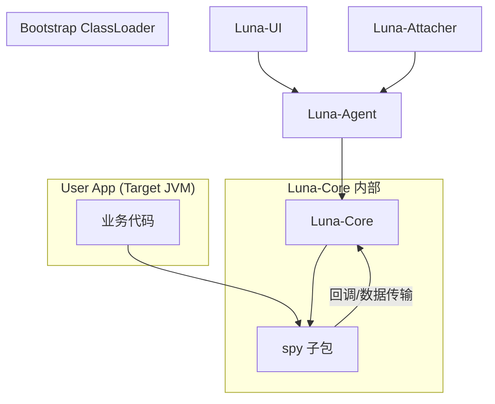
```mermaid
graph TD
    UI[Luna-UI] --> Agent[Luna-Agent]
    Attacher[Luna-Attacher] --> Agent
    Agent --> Core[Luna-Core]

    subgraph "Luna-Core 内部"
        Core --> SpyPkg[spy 子包]
    end

    subgraph "Bootstrap ClassLoader"
        SpyPkg
    end

    subgraph "User App (Target JVM)"
        BusinessCode[业务代码] --> SpyPkg
    end

    SpyPkg -- "回调/数据传输" --> Core
```

> **注意**：Luna-Spy **不是**独立模块，而是 `luna-core` 的 `fun.efto.luna.core.spy` 子包。通过 `appendToBootstrapClassLoaderSearch` 将整个 agent jar 加入 Bootstrap ClassLoader 搜索路径，使得 `LunaSpy` 类全局可见。

---

## 2. 模块详细职责

### 2.1 模块职责表

| 模块名称              | 职责描述                                          | 核心类/组件                                                   |
|:------------------|:----------------------------------------------|:---------------------------------------------------------|
| **Luna-Core**     | 核心业务建模、注入契约定义、字节码分析与重写、规则管理、条件表达式引擎、快照序列化、注入测试框架 | `InjectionPoint`, `DefaultClassTransformer`, `AsmClassAnalyzer`, `LunaSpy`, `ExpressionBytecodeAssembler`, `RuleManager`, `ConditionRegistry`, `RingBuffer`, `SnapshotSerializer`, `InjectionTestHarness` |
| **Luna-Agent**    | 系统入口、生命周期管理、类隔离加载器、内嵌 Jetty Web 服务器、自定义 MVC 框架、WebSocket 实时推送 | `Agent`, `LunaAgentClassLoader`, `JettyWebServer`, `DispatcherServlet`, 各 `Controller` |
| **Luna-Attacher** | 运行时 Attach 工具，负责通过 PID 将 Agent 注入目标 JVM       | `Attacher`, `VirtualMachine`                             |
| **Luna-UI**       | 诊断控制台、实时监控看板、反编译查看器、规则编辑器                      | Vue 3 + Vite + Element Plus + Tailwind CSS + Monaco Editor |

---

## 3. luna-core 完整包结构

```
fun.efto.luna.core
├── analyzer/          # 类分析抽象层
│   ├── ClassAnalyzer          # 类分析器接口
│   ├── AbstractAnalyzer       # 抽象分析器基类
│   ├── AnalyzerType           # 分析器类型（BaseType 子类）
│   ├── AnalyzerRegistry       # 分析器注册中心
│   ├── ClassAnalysisResult    # 类分析结果
│   └── ClassAnalysisResultWithReadableAccess  # 含可读性信息的分析结果
├── asm/               # ASM 字节码操作核心
│   ├── AsmInitializer          # ASM 初始化器
│   ├── AsmInjectionContext     # ASM 注入上下文（含 LocalVarInfo）
│   ├── ClassLoaderAwareClassWriter  # ClassLoader 感知的 ClassWriter
│   ├── Constants               # ASM 常量定义
│   ├── LocalVariableScanner    # 局部变量扫描器
│   ├── analyzer/               # ASM 类分析器实现
│   │   └── AsmClassAnalyzer    # 基于 ASM 的类分析器
│   ├── assmebler/              # ASM 字节码组装器
│   │   ├── BaseAsmBytecodeAssembler       # 抽象基类（模板方法）
│   │   └── ExpressionBytecodeAssembler    # 表达式字节码组装器
│   └── injector/               # ASM 字节码注入器
│       ├── AbstractMethodInjector          # 方法注入器抽象基类（模板方法 + Visitor API）
│       ├── EnterMethodInjector             # 方法进入注入器
│       ├── ExitMethodInjector              # 方法退出注入器
│       ├── AroundMethodInjector            # 方法环绕注入器
│       ├── BeforeLineInjector              # 行号前注入器（Tree API）
│       ├── AfterLineInjector               # 行号后注入器（Tree API）
│       ├── MethodEnterInjector             # 方法进入注入器（旧版遗留，占位实现）
│       ├── TreeApiBytecodeHelper           # Visitor API → Tree API 桥接工具
│       └── visitor/                        # ASM MethodVisitor 实现
│           ├── EnterMethodVisitor          # visitCode() 回调注入
│           ├── ExitMethodVisitor           # visitInsn() 拦截 return 指令
│           ├── AroundMethodVisitor         # 组合模式（Enter + Exit）
│           └── LineNumberVisitor           # visitLineNumber() + beforeLine 标志
├── buffer/            # 无锁 RingBuffer
│   └── RingBuffer              # MPSC 无锁队列
├── bytecode/          # 字节码组装器抽象层
│   ├── BytecodeAssembler       # 组装器接口
│   └── BytecodeAssemblerRegistry  # 组装器注册中心
├── cache/             # 字节码缓存
│   └── BytecodeCache           # 双层缓存（字节码 + 分析结果）
├── decompile/         # 反编译器
│   ├── Decompiler              # 反编译器接口
│   ├── CfrDecompiler           # CFR 引擎实现
│   ├── DecompilerFactory       # 反编译器工厂
│   └── SimpleOutputSinkFactory # CFR 输出接收器
├── expression/        # 条件表达式引擎
│   ├── Token                   # 词法标记
│   ├── Tokenizer               # 词法分析器
│   ├── ExpressionUtils         # 表达式工具类（运行时运算）
│   ├── ConditionRegistry       # 条件注册表（预编译缓存）
│   ├── ast/                    # AST 节点
│   │   ├── ExpressionNode              # 表达式节点基类
│   │   ├── BinaryExpressionNode        # 二元运算节点
│   │   ├── UnaryExpressionNode         # 一元运算节点
│   │   ├── VariableNode                # 变量引用节点
│   │   ├── ConstantNode                # 常量节点
│   │   ├── PropertyAccessNode          # 属性访问节点
│   │   └── FunctionCallNode            # 函数调用节点
│   ├── bytecode/                # 表达式字节码生成
│   │   ├── ExpressionBytecodeGenerator # 表达式→字节码编译器
│   │   └── VariableSlotResolver        # 变量槽位解析器
│   ├── context/                 # 求值上下文
│   │   └── EvaluationContext    # ThreadLocal 求值上下文
│   └── parser/                  # 表达式解析器
│       ├── ExpressionParser             # 递归下降语法分析器
│       └── ConditionalExpressionParser  # 条件表达式门面（${...} 解包）
├── init/              # 初始化机制
│   ├── Initializer              # 初始化器接口
│   ├── DefaultInitializer       # 默认初始化器（注册注入器/组装器/分析器）
│   └── InitializerManager       # 初始化器管理器
├── injection/         # 注入点模型
│   ├── InjectionPoint           # 注入点（UUID 标识 + Target + Code）
│   └── InjectionPointRegistry   # 注入点注册表
│   ├── code/                    # 可注入代码
│   │   ├── InjectableCode              # 可注入代码接口
│   │   ├── ExpressBaseInjectableCode   # 表达式基类
│   │   └── type/                       # 代码类型枚举
│   │       └── CodeType                # JAVA / EXPRESSION / SNAPSHOT
│   └── target/                  # 注入目标
│       ├── BaseTarget                  # 目标基类
│       ├── InjectionTarget             # 注入目标接口
│       ├── MethodTarget                # 方法目标
│       ├── LineNumberTarget            # 行号目标
│       └── type/                       # 注入类型
│           ├── InjectionType           # 注入类型抽象基类
│           ├── MethodInjectionType     # ENTER / EXIT / AROUND
│           └── LineNumberInjectionType # BEFORE / AFTER（含 lineNumber）
├── injector/          # 字节码注入器抽象层
│   ├── BytecodeInjector         # 注入器接口
│   ├── BytecodeInjectorRegistry # 注入器注册中心
│   └── InjectorProvider         # 注入器提供者
├── rule/              # 规则管理
│   ├── InjectionRule            # 注入规则数据模型
│   ├── RuleConverter            # 规则→注入点转换器
│   ├── RuleManager              # 规则管理器（单例 + 持久化）
│   ├── RulePersistenceService   # 规则持久化服务（JSON 文件）
│   └── template/                # 规则模板
│       ├── RuleTemplate                 # 模板定义（参数 + 规则列表）
│       ├── TemplateEngine               # 模板引擎（参数替换）
│       ├── TemplateRegistry             # 模板注册中心
│       └── BuiltinTemplates             # 6 个内置模板
├── snapshot/          # 快照序列化
│   ├── StackFrameCapture        # 调用栈与变量捕获
│   └── SnapshotSerializer       # 防御式对象序列化器
├── spy/               # Spy 桥梁类
│   └── LunaSpy                  # 跨 ClassLoader 通信桥梁
├── testing/           # 注入测试框架
│   ├── InjectionTestHarness     # 注入测试工具
│   └── TestResult               # 测试结果
├── transformer/       # ClassFileTransformer 适配层
│   ├── ClassTransformer         # 类转换器接口
│   ├── DefaultClassTransformer  # 默认实现（委托注册表）
│   ├── ClassFileTransformerAdapter  # Luna → Java Agent 适配器
│   ├── RuleClassFileTransformer     # 全局规则自动转换器
│   ├── InjectionResult          # 注入结果
│   └── TransformerResult        # 转换结果
├── type/              # 类型注册体系基础
│   ├── BaseType                 # 基础类型
│   └── RegisterableType         # 可注册类型
├── util/              # 工具类
│   ├── AccessFlagsConverter     # 访问标志转换器
│   └── ClassNameUtils           # 类名工具
├── InjectionContext.java        # 注入上下文
├── InjectionExecutor.java       # 注入执行器
├── InstrumentationManager.java  # Instrumentation 管理器
├── Registry.java                # 通用注册表接口
└── TypeRegistry.java            # 类型注册表
```

---

## 4. 字节码注入流程

### 4.1 API 实时注入流程

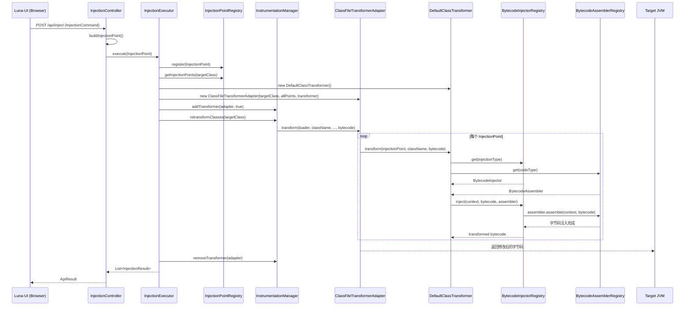
```mermaid
sequenceDiagram
    participant UI as Luna-UI (Browser)
    participant IC as InjectionController
    participant IE as InjectionExecutor
    participant IPR as InjectionPointRegistry
    participant IM as InstrumentationManager
    participant CFA as ClassFileTransformerAdapter
    participant DCT as DefaultClassTransformer
    participant BIR as BytecodeInjectorRegistry
    participant BAR as BytecodeAssemblerRegistry
    participant JVM as Target JVM

    UI->>IC: POST /api/inject (InjectionCommand)
    IC->>IC: buildInjectionPoint()
    IC->>IE: execute(InjectionPoint)
    IE->>IPR: register(InjectionPoint)
    IE->>IPR: getInjectionPoints(targetClass)
    IE->>DCT: new DefaultClassTransformer()
    IE->>CFA: new ClassFileTransformerAdapter(targetClass, allPoints, transformer)
    IE->>IM: addTransformer(adapter, true)
    IE->>IM: retransformClasses(targetClass)
    IM->>CFA: transform(loader, className, ..., bytecode)
    loop 每个 InjectionPoint
        CFA->>DCT: transform(injectionPoint, className, bytecode)
        DCT->>BIR: get(injectionType)
        DCT->>BAR: get(codeType)
        BIR-->>DCT: BytecodeInjector
        BAR-->>DCT: BytecodeAssembler
        DCT->>BIR: inject(context, bytecode, assembler)
        BIR->>BAR: assembler.assemble(context, bytecode)
        BAR-->>BIR: 字节码注入完成
        BIR-->>DCT: transformed bytecode
    end
    CFA-->>JVM: 返回修改后的字节码
    IE->>IM: removeTransformer(adapter)
    IE-->>IC: List<InjectionResult>
    IC-->>UI: ApiResult
```

### 4.2 规则自动注入流程

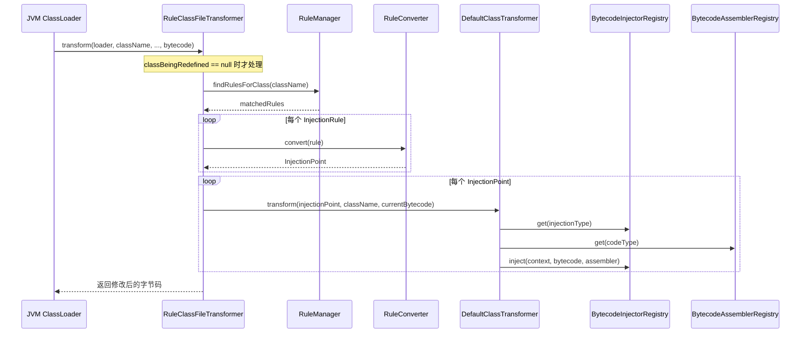
```mermaid
sequenceDiagram
    participant JVM as JVM ClassLoader
    participant RCFT as RuleClassFileTransformer
    participant RM as RuleManager
    participant RC as RuleConverter
    participant DCT as DefaultClassTransformer
    participant BIR as BytecodeInjectorRegistry
    participant BAR as BytecodeAssemblerRegistry

    JVM->>RCFT: transform(loader, className, ..., bytecode)
    Note over RCFT: classBeingRedefined == null 时才处理
    RCFT->>RM: findRulesForClass(className)
    RM-->>RCFT: matchedRules
    loop 每个 InjectionRule
        RCFT->>RC: convert(rule)
        RC-->>RCFT: InjectionPoint
    end
    loop 每个 InjectionPoint
        RCFT->>DCT: transform(injectionPoint, className, currentBytecode)
        DCT->>BIR: get(injectionType)
        DCT->>BAR: get(codeType)
        DCT->>BIR: inject(context, bytecode, assembler)
    end
    RCFT-->>JVM: 返回修改后的字节码
```

### 4.3 两条注入路径对比

| 特性 | API 实时注入 | 规则自动注入 |
|:---|:---|:---|
| **触发方式** | 用户通过 Web API 手动触发 | 类首次加载时自动触发 |
| **入口类** | `InjectionController` → `InjectionExecutor` | `RuleClassFileTransformer` |
| **Transformer** | `ClassFileTransformerAdapter`（临时注册，用完移除） | `RuleClassFileTransformer`（全局注册，持久存在） |
| **适用场景** | 对已加载的类进行 retransform | 对后续新加载的类自动注入 |
| **注入点来源** | `InjectionCommand` 直接构建 | `RuleManager` 查询匹配规则 → `RuleConverter` 转换 |

---

## 5. 注入体系详细设计

### 5.1 注入器体系

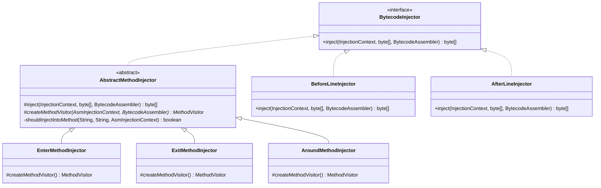
```mermaid
classDiagram
    class BytecodeInjector {
        <<interface>>
        +inject(InjectionContext, byte[], BytecodeAssembler) byte[]
    }
    class AbstractMethodInjector {
        <<abstract>>
        #inject(InjectionContext, byte[], BytecodeAssembler) byte[]
        #createMethodVisitor(AsmInjectionContext, BytecodeAssembler) MethodVisitor*
        -shouldInjectIntoMethod(String, String, AsmInjectionContext) boolean
    }
    class EnterMethodInjector {
        #createMethodVisitor() MethodVisitor
    }
    class ExitMethodInjector {
        #createMethodVisitor() MethodVisitor
    }
    class AroundMethodInjector {
        #createMethodVisitor() MethodVisitor
    }
    class BeforeLineInjector {
        +inject(InjectionContext, byte[], BytecodeAssembler) byte[]
    }
    class AfterLineInjector {
        +inject(InjectionContext, byte[], BytecodeAssembler) byte[]
    }

    BytecodeInjector <|.. AbstractMethodInjector
    BytecodeInjector <|.. BeforeLineInjector
    BytecodeInjector <|.. AfterLineInjector
    AbstractMethodInjector <|-- EnterMethodInjector
    AbstractMethodInjector <|-- ExitMethodInjector
    AbstractMethodInjector <|-- AroundMethodInjector
```

**设计模式**：`AbstractMethodInjector` 采用**模板方法模式**，定义了 `inject()` 的骨架流程（ClassReader → ClassVisitor → ClassWriter），子类只需实现 `createMethodVisitor()` 返回对应的 MethodVisitor 即可。

**两种实现路径**：

| 实现路径 | 使用 API | 适用注入器 | 特点 |
|:---|:---|:---|:---|
| **Visitor API** | `ClassReader.accept(ClassVisitor, ...)` | `EnterMethodInjector`, `ExitMethodInjector`, `AroundMethodInjector` | 流式处理，内存效率高，适合方法级注入 |
| **Tree API** | `ClassNode` + `MethodNode.instructions.insertBefore/insert` | `BeforeLineInjector`, `AfterLineInjector` | 可随机访问指令列表，适合行号级精确插入 |

### 5.2 Visitor 体系

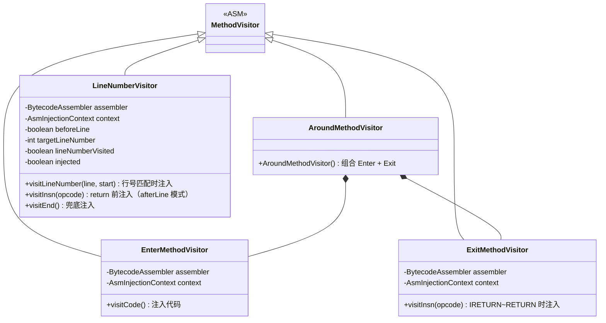
```mermaid
classDiagram
    class MethodVisitor {
        <<ASM>>
    }
    class EnterMethodVisitor {
        -BytecodeAssembler assembler
        -AsmInjectionContext context
        +visitCode() 注入代码
    }
    class ExitMethodVisitor {
        -BytecodeAssembler assembler
        -AsmInjectionContext context
        +visitInsn(opcode) IRETURN~RETURN 时注入
    }
    class AroundMethodVisitor {
        +AroundMethodVisitor() 组合 Enter + Exit
    }
    class LineNumberVisitor {
        -BytecodeAssembler assembler
        -AsmInjectionContext context
        -boolean beforeLine
        -int targetLineNumber
        -boolean lineNumberVisited
        -boolean injected
        +visitLineNumber(line, start) 行号匹配时注入
        +visitInsn(opcode) return 前注入（afterLine 模式）
        +visitEnd() 兜底注入
    }

    MethodVisitor <|-- EnterMethodVisitor
    MethodVisitor <|-- ExitMethodVisitor
    MethodVisitor <|-- AroundMethodVisitor
    MethodVisitor <|-- LineNumberVisitor
    AroundMethodVisitor *-- EnterMethodVisitor
    AroundMethodVisitor *-- ExitMethodVisitor
```

**各 Visitor 注入时机**：

| Visitor | 注入时机 | 对应 Java 伪代码 |
|:---|:---|:---|
| `EnterMethodVisitor` | `visitCode()` 回调 | `void method() { /* ← 注入点 */ ... }` |
| `ExitMethodVisitor` | `visitInsn()` 拦截 `IRETURN`~`RETURN` | `void method() { ... /* ← return 前 */ return; }` |
| `AroundMethodVisitor` | 组合 `EnterMethodVisitor` + `ExitMethodVisitor` | 进入 + 退出双重注入 |
| `LineNumberVisitor` | `visitLineNumber()` 匹配目标行号 | 在指定源码行处注入 |

### 5.3 TreeApiBytecodeHelper

`TreeApiBytecodeHelper` 是 Visitor API → Tree API 的**桥接工具**，解决行号注入器需要 `InsnList` 的问题：

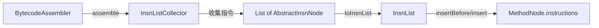
```mermaid
flowchart LR
    A[BytecodeAssembler] -->|assemble| B[InsnListCollector]
    B -->|收集指令| C[List of AbstractInsnNode]
    C -->|toInsnList| D[InsnList]
    D -->|insertBefore/insert| E[MethodNode.instructions]
```

**核心机制**：
- `InsnListCollector` 是一个内部类，继承 `MethodVisitor`
- 将 `BytecodeAssembler` 输出的 Visitor API 调用拦截并转换为 `AbstractInsnNode` 列表
- 最终通过 `toInsnList()` 转为 `InsnList`，供 `BeforeLineInjector`/`AfterLineInjector` 使用 `insertBefore()`/`insert()` 插入

### 5.4 ExpressionBytecodeAssembler

`ExpressionBytecodeAssembler` 是核心的字节码组装器，继承 `BaseAsmBytecodeAssembler`，负责将注入代码协议翻译为 ASM 字节码指令：

**协议分发**：

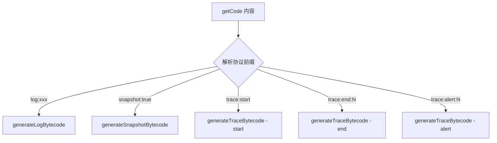
```mermaid
flowchart TD
    A[getCode 内容] --> B{解析协议前缀}
    B -->|log:xxx| C[generateLogBytecode]
    B -->|snapshot:true| D[generateSnapshotBytecode]
    B -->|trace:start| E[generateTraceBytecode - start]
    B -->|trace:end:N| F[generateTraceBytecode - end]
    B -->|trace:alert:N| G[generateTraceBytecode - alert]
```

**条件前缀解析**：

```
${condition}::protocol:content
     ↑           ↑        ↑
  条件表达式    协议类型   协议内容
```

- 若存在 `${condition}::` 前缀，先注册条件到 `ConditionRegistry`，并在字节码中生成条件检查跳转
- 若不存在条件前缀，调用 `ConditionRegistry.unregister()` 移除旧条件

**三种协议的字节码生成**：

| 协议 | 生成逻辑 | 等价 Java 伪代码 |
|:---|:---|:---|
| `log:消息 $1 $varName` | 解析 `$N` 参数引用和 `$varName` 局部变量引用 → `String.format()` + `LunaSpy.onLog()` | `LunaSpy.onLog(String.format("消息 %s %s", $1, varName))` |
| `snapshot:true` | 收集参数 + 局部变量 → `Object[]` + `String[]` → `LunaSpy.onSnapshot()` | `LunaSpy.onSnapshot(pointId, new Object[]{...}, new String[]{...})` |
| `trace:start` | 直接调用 `LunaSpy.onTraceStart()` | `LunaSpy.onTraceStart()` |
| `trace:end:N` | 调用 `LunaSpy.onTraceEnd(className, methodName, threshold)` | `LunaSpy.onTraceEnd("ClassName", "methodName", N)` |
| `trace:alert:N` | 调用 `LunaSpy.onTraceAlert(className, methodName, threshold)` | `LunaSpy.onTraceAlert("ClassName", "methodName", N)` |

**参数引用解析**（`parseExpression` 方法）：
- `$1`, `$2`, ... → 方法参数引用，通过 `ParameterInfo` 映射到局部变量 Slot
- `$varName` → 局部变量引用，通过 `LocalVarInfo` 匹配变量名
- 混合文本和引用时，使用 `String.format()` 格式化

**条件检查字节码**（`generateConditionCheck` 方法）：

```java
// 等价 Java 伪代码：
EvaluationContext ctx = EvaluationContext.getThreadLocal();
ctx.bind("param[1]", $1);
ctx.bind("param[2]", $2);
ctx.bind("varName", $varName);
if (!ConditionRegistry.test(injectionId, ctx)) {
    goto endLabel;
}
// ... 实际注入代码 ...
endLabel:
```

### 5.5 LocalVariableScanner

基于 ASM Tree API 扫描指定行号处**可见**的局部变量：

**核心流程**：
1. 解析字节码为 `ClassNode`
2. 定位目标方法
3. 构建 `LabelNode → 行号` 映射（`buildLabelLineMap`）
4. 遍历 `LocalVariableNode` 列表，判断变量在目标行号处是否可见
5. 可见性判断：`startLine ≤ targetLine ≤ endLine`

**`excludeSameLineStart` 参数**：
- `true`（BeforeLine 注入使用）：排除 `startLine == targetLine` 的变量，避免访问尚未初始化的变量
- `false`（AfterLine 注入使用）：包含 `startLine == targetLine` 的变量

**降级策略**：当 Label 无法直接映射到行号时，通过 `findNearestPrecedingLine()` 查找最近的先前行号作为近似值。

### 5.6 ClassLoaderAwareClassWriter

重写 `getCommonSuperClass()` 方法，使用指定的 ClassLoader 进行类查找：

```java
// 核心逻辑：
protected String getCommonSuperClass(String type1, String type2) {
    Class<?> class1 = Class.forName(type1, false, targetClassLoader);
    Class<?> class2 = Class.forName(type2, false, targetClassLoader);
    // ... 类型继承关系判断 ...
}
```

- 使用 `COMPUTE_MAXS | COMPUTE_FRAMES` 标志，自动计算栈帧和最大操作数栈
- 解决了默认 `ClassWriter` 在 Agent 场景下因 ClassLoader 不一致导致 `ClassNotFoundException` 的问题

---

## 6. 条件表达式引擎

### 6.1 完整流程

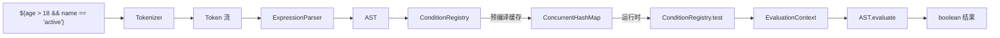
```mermaid
flowchart LR
    A["${age > 18 && name == 'active'}"] --> B[Tokenizer]
    B --> C[Token 流]
    C --> D[ExpressionParser]
    D --> E[AST]
    E --> F[ConditionRegistry]
    F -->|预编译缓存| G["ConcurrentHashMap<String, ExpressionNode>"]
    G -->|运行时| H[ConditionRegistry.test]
    H --> I[EvaluationContext]
    I --> J[AST.evaluate]
    J --> K[boolean 结果]
```

### 6.2 词法分析：Tokenizer

将表达式字符串转换为 Token 序列，支持的 Token 类型：

| Token 类型 | 示例 | 说明 |
|:---|:---|:---|
| `DOLLAR_BRACE_OPEN` | `${` | Luna 条件语法糖开始 |
| `BRACE_CLOSE` | `}` | 条件语法糖结束 |
| `IDENTIFIER` | `age`, `param` | 变量名 |
| `NUMBER` | `18`, `3.14` | 整数或浮点数 |
| `STRING` | `"active"`, `'hello'` | 字符串字面量 |
| `BOOLEAN` | `true`, `false` | 布尔字面量 |
| `EQUAL` | `==` | 等于 |
| `NOT_EQUAL` | `!=` | 不等于 |
| `GREATER` / `GREATER_EQUAL` | `>`, `>=` | 大于 / 大于等于 |
| `LESS` / `LESS_EQUAL` | `<`, `<=` | 小于 / 小于等于 |
| `AND` | `&&` | 逻辑与 |
| `OR` | `\|\|` | 逻辑或 |
| `NOT` | `!` | 逻辑非 |
| `PLUS` / `MINUS` / `MULTIPLY` / `DIVIDE` | `+`, `-`, `*`, `/` | 算术运算 |
| `DOT` | `.` | 属性访问 |
| `LEFT_BRACKET` / `RIGHT_BRACKET` | `[`, `]` | 数组下标 |
| `LEFT_PAREN` / `RIGHT_PAREN` | `(`, `)` | 括号 |
| `COMMA` | `,` | 逗号 |

### 6.3 语法分析：ExpressionParser

递归下降解析器，运算符优先级从低到高：

```
parse() → parseLogicalOr()
  → parseLogicalAnd()        (||)
    → parseEquality()        (&&)
      → parseComparison()    (==, !=)
        → parseAdditive()    (>, >=, <, <=)
          → parseMultiplicative() (+, -)
            → parseUnary()   (*, /)
              → parsePrimary() (!, -)
```

**`parsePrimary()` 处理**：
- 数字 → `ConstantNode`
- 字符串 → `ConstantNode`
- 布尔值 → `ConstantNode`
- 标识符 + `(` → `FunctionCallNode`
- 标识符 + `[` → `VariableNode`（如 `param[0]`）
- 标识符 → `VariableNode`
- `(` → 递归解析子表达式
- 后缀 `.property` → `PropertyAccessNode`

### 6.4 AST 节点体系

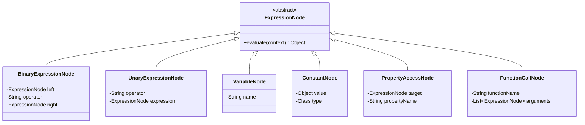
```mermaid
classDiagram
    class ExpressionNode {
        <<abstract>>
        +evaluate(context) Object
    }
    class BinaryExpressionNode {
        -ExpressionNode left
        -String operator
        -ExpressionNode right
    }
    class UnaryExpressionNode {
        -String operator
        -ExpressionNode expression
    }
    class VariableNode {
        -String name
    }
    class ConstantNode {
        -Object value
        -Class type
    }
    class PropertyAccessNode {
        -ExpressionNode target
        -String propertyName
    }
    class FunctionCallNode {
        -String functionName
        -List~ExpressionNode~ arguments
    }

    ExpressionNode <|-- BinaryExpressionNode
    ExpressionNode <|-- UnaryExpressionNode
    ExpressionNode <|-- VariableNode
    ExpressionNode <|-- ConstantNode
    ExpressionNode <|-- PropertyAccessNode
    ExpressionNode <|-- FunctionCallNode
```

### 6.5 预编译缓存：ConditionRegistry

- 内部使用 `ConcurrentHashMap<String, ExpressionNode>` 缓存已解析的 AST
- `register(injectionId, expression)`：解析表达式并缓存 AST
- `unregister(injectionId)`：移除缓存
- `test(injectionId, context)`：直接对缓存的 AST 求值，避免重复解析
- 无条件时默认返回 `true`（放行）
- 求值异常时返回 `false`（静默跳过，不影响业务）

### 6.6 运行时求值：EvaluationContext

- 使用 `ThreadLocal<EvaluationContext>` 实现线程复用，减少 GC
- `getThreadLocal()` 自动清空上下文
- 支持绑定变量：`bind(name, value)`
- 支持参数绑定：`bindParams(Object...)` → `param[0]`, `arg0`
- 支持 `this` 引用和返回值绑定
- `asMap()` 返回底层 Map 供 `ExpressionNode.evaluate()` 使用

### 6.7 字节码编译：ExpressionBytecodeGenerator

将表达式编译为独立的 `.class` 字节码：
- 生成 `ExpressionEvaluator` 类，包含 `static Object evaluate(Object context)` 方法
- 运算逻辑委托给 `ExpressionUtils` 的静态方法（如 `add()`, `equals()`, `greaterThan()` 等）
- 变量访问通过 `ExpressionUtils.getVariableValue(context, name)` 从上下文获取

---

## 7. 规则与模板体系

### 7.1 InjectionRule 数据模型

| 字段 | 类型 | 说明 |
|:---|:---|:---|
| `id` | `long` | 规则 ID（AtomicLong 自增） |
| `targetClass` | `String` | 目标类全限定名（支持通配符 `*`） |
| `targetMethod` | `String` | 目标方法名 |
| `injectionType` | `String` | 注入类型（METHOD_ENTER / METHOD_EXIT / METHOD_AROUND / LINE_BEFORE / LINE_AFTER） |
| `lineNumber` | `int` | 行号（行号注入时使用） |
| `expression` | `String` | 条件表达式 |
| `logContent` | `String` | 注入内容（支持协议前缀） |
| `codeType` | `String` | 代码类型（JAVA / EXPRESSION / SNAPSHOT） |
| `enabled` | `boolean` | 是否启用 |

**logContent 协议前缀**：
- `trace:start` → 耗时追踪开始
- `trace:end:N` → 耗时追踪结束（阈值 N 毫秒）
- `trace:alert:N` → 慢方法告警（阈值 N 毫秒）
- `snapshot:true` → 变量快照
- `log:消息内容` → 日志输出

### 7.2 RuleConverter

将持久化规则 `InjectionRule` 转换为运行时 `InjectionPoint`：

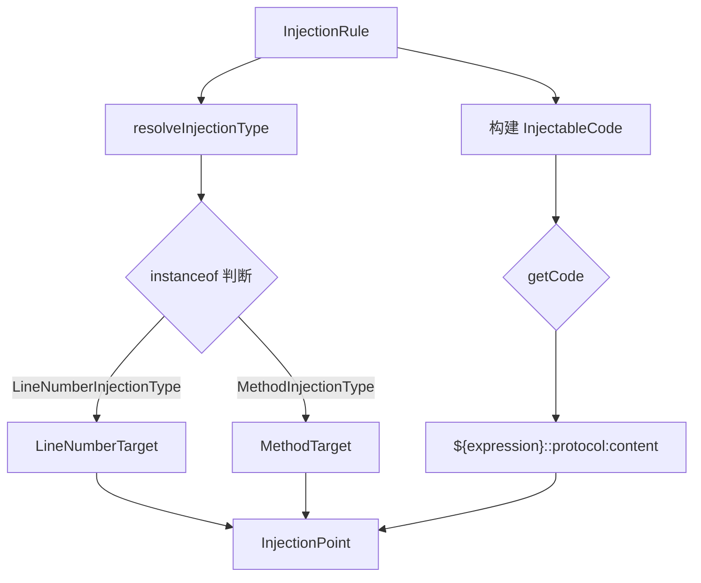
```mermaid
flowchart TD
    A[InjectionRule] --> B[resolveInjectionType]
    B --> C{instanceof 判断}
    C -->|LineNumberInjectionType| D[LineNumberTarget]
    C -->|MethodInjectionType| E[MethodTarget]
    A --> F[构建 InjectableCode]
    F --> G{getCode}
    G --> H["${expression}::protocol:content"]
    D --> I[InjectionPoint]
    E --> I
    H --> I
```

**关键方法**：
- `resolveInjectionType()`：字符串 → `InjectionType` 枚举实例
- `hasProtocolPrefix()`：识别 `trace:` / `snapshot:` / `log:` 前缀
- `getCode()`：拼接条件前缀 + 协议内容，如 `${param[1] > 0}::log:参数值: $1`

### 7.3 RuleManager

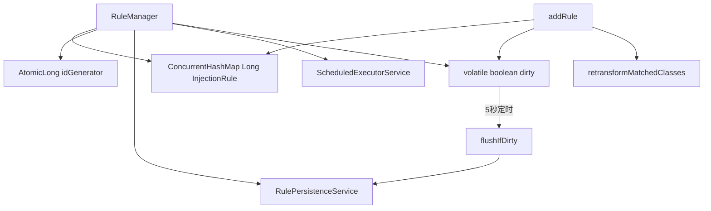
```mermaid
flowchart TD
    A[RuleManager] --> B[ConcurrentHashMap Long InjectionRule]
    A --> C[AtomicLong idGenerator]
    A --> D[RulePersistenceService]
    A --> E[ScheduledExecutorService]
    A --> F[volatile boolean dirty]

    G[addRule] --> B
    G --> F
    F -->|5秒定时| H[flushIfDirty]
    H --> D
    G --> I[retransformMatchedClasses]
```

**核心特性**：
- **单例模式**，`ConcurrentHashMap<Long, InjectionRule>` 存储
- **AtomicLong ID 生成**，启动时从持久化文件中恢复最大 ID
- **脏标志 + 定时刷盘**：修改规则时仅标记 `dirty = true`，`ScheduledExecutorService` 每 5 秒检查并持久化
- **立即 retransform**：`addRule()` / `updateRule()` / `deleteRule()` 后立即调用 `retransformMatchedClasses()`
- **通配符匹配**：`findRulesForClass()` 支持简单的 `*` 通配符匹配

### 7.4 TemplateEngine

```java
// 核心签名：
List<InjectionRule> apply(RuleTemplate template, String targetClass,
                          String targetMethod, String methodDesc,
                          Map<String, String> paramValues)
```

**参数替换**：
- `${paramName}` → 实际值（优先使用传入值，其次使用默认值）
- `condition` 字段独立处理，也支持参数替换

### 7.5 6 个内置模板

| 模板名 | 显示名 | 分类 | 规则数 | 说明 |
|:---|:---|:---|:---|:---|
| `method-timing` | 方法耗时统计 | performance | 2 | ENTER: `trace:start` + EXIT: `trace:end:0` |
| `method-timing-threshold` | 方法耗时统计（阈值过滤） | performance | 2 | ENTER: `trace:start` + EXIT: `trace:end:${threshold}` |
| `method-access-log` | 方法访问日志 | observability | 2 | ENTER: `log:→ call: $0` + EXIT: `log:← return` |
| `slow-method-alert` | 慢方法告警 | performance | 2 | ENTER: `trace:start` + EXIT: `trace:alert:${threshold}` |
| `line-snapshot` | 行号快照 | debug | 1 | LINE_BEFORE: `snapshot:true` |
| `conditional-breakpoint` | 条件断点 | debug | 1 | LINE_BEFORE: `snapshot:true` + condition: `${condition}` |

**模板注册**：`TemplateRegistry` 在构造时通过 `BuiltinTemplates` 注册内置模板，同时通过 `ServiceLoader` 发现社区模板。

---

## 8. 通信与数据流

### 8.1 LunaSpy

`LunaSpy` 是注入字节码与 Agent 核心通信的桥梁，被注入的方法会直接调用其静态方法：

| 方法 | 签名 | 说明 |
|:---|:---|:---|
| `onLog` | `(String) → void` | 投递日志消息到 RingBuffer |
| `onSnapshot` | `(String, Object[], String[]) → void` | 捕获变量快照并序列化后投递 |
| `onTraceStart` | `() → void` | 记录方法入口时间（ThreadLocal） |
| `onTraceEnd` | `(String, String, long) → void` | 计算耗时并投递追踪消息 |
| `onTraceAlert` | `(String, String, long) → void` | 超阈值时投递告警消息 |

**关键设计**：
- `LOG_BUFFER`: `RingBuffer<String>(4096)` — 所有数据统一投递到同一个 RingBuffer
- `TRACE_START_TIME`: `ThreadLocal<Long>` — 每线程独立的计时器
- 所有方法极度轻量，`onSnapshot` 和 `onTraceEnd/Alert` 使用 `try-catch(Throwable)` 防御

### 8.2 RingBuffer

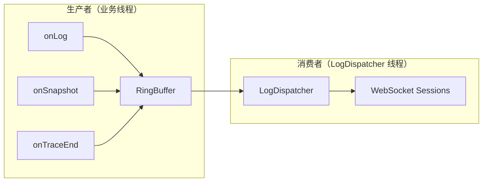
```mermaid
flowchart LR
    subgraph "生产者（业务线程）"
        P1[onLog] --> RB[RingBuffer]
        P2[onSnapshot] --> RB
        P3[onTraceEnd] --> RB
    end
    subgraph "消费者（LogDispatcher 线程）"
        RB --> C[LogDispatcher]
        C --> WS[WebSocket Sessions]
    end
```

**MPSC 无锁队列实现**：

| 特性 | 实现方式 |
|:---|:---|
| **数据结构** | `AtomicReferenceArray<T>` + 容量自动取整为 2 的幂次方 |
| **写索引** | `AtomicLong writeIndex`，CAS 争抢写槽位 |
| **读索引** | `AtomicLong readIndex`，单消费者安全推进 |
| **满队列处理** | `offer()` 返回 `false`，**丢弃不阻塞**（保护业务线程） |
| **内存可见性** | `buffer.lazySet()` 减少内存屏障开销 |
| **容量** | 默认 4096 |

### 8.3 WebSocket 三层架构

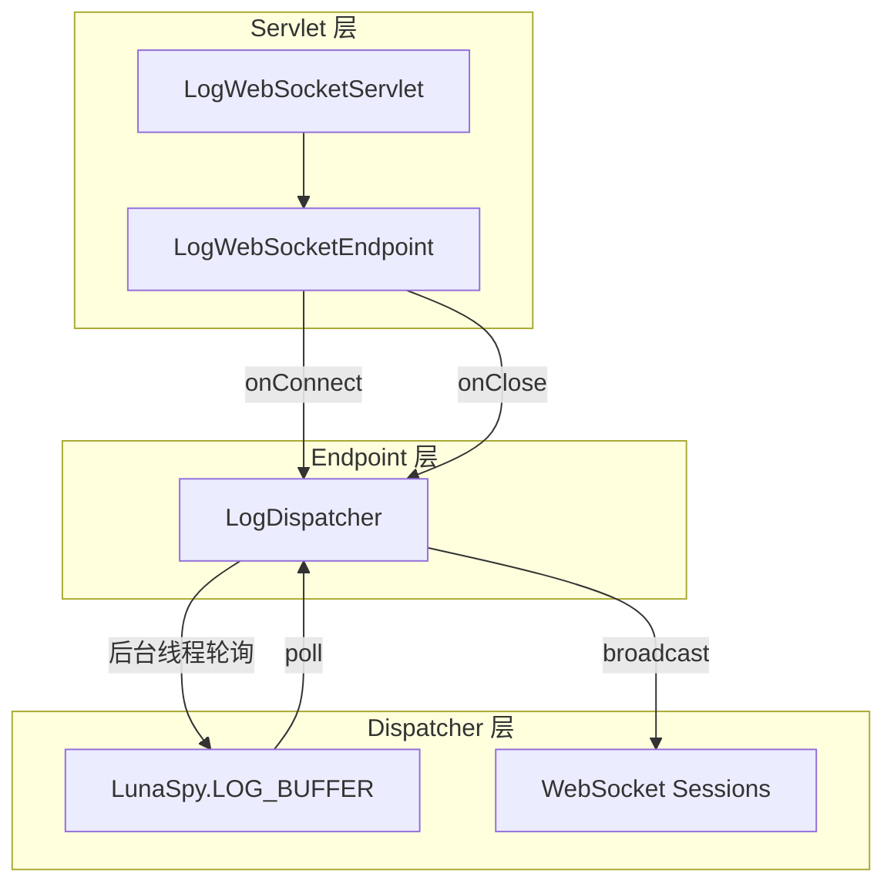
```mermaid
flowchart TD
    subgraph "Servlet 层"
        LWS[LogWebSocketServlet] --> LWE[LogWebSocketEndpoint]
    end
    subgraph "Endpoint 层"
        LWE -->|onConnect| LD[LogDispatcher]
        LWE -->|onClose| LD
    end
    subgraph "Dispatcher 层"
        LD -->|后台线程轮询| RB[LunaSpy.LOG_BUFFER]
        RB -->|poll| LD
        LD -->|broadcast| SS[WebSocket Sessions]
    end
```

| 层次 | 类 | 职责 |
|:---|:---|:---|
| **Servlet 层** | `LogWebSocketServlet` | Jetty WebSocket Servlet 适配器，配置超时和消息大小限制 |
| **Endpoint 层** | `LogWebSocketEndpoint` | 管理 WebSocket 连接生命周期，维护 Session 注册/注销 |
| **Dispatcher 层** | `LogDispatcher` | 后台守护线程轮询 `RingBuffer.poll()`，`sendStringByFuture()` 异步广播 |

**消费循环**：
- `LogDispatcher` 后台线程持续调用 `LunaSpy.LOG_BUFFER.poll()`
- 有数据时广播给所有 WebSocket Session
- 无数据时 `Thread.sleep(1)` 避免 CPU 空转
- 无连接时仍消费数据（丢弃），防止 RingBuffer 积压导致 OOM

---

## 9. Web 层

### 9.1 自定义 MVC 框架

Luna 实现了轻量级的注解驱动 MVC 框架，避免引入 Spring 等重型框架：

**注解体系**：

| 注解 | 作用 |
|:---|:---|
| `@Controller` | 标记控制器类 |
| `@RequestMapping` | 类级路由前缀 |
| `@GetMapping` | GET 路由 |
| `@PostMapping` | POST 路由 |
| `@PutMapping` | PUT 路由 |
| `@DeleteMapping` | DELETE 路由 |
| `@PathVariable` | 路径变量注入 |
| `@RequestParam` | 查询参数注入 |
| `@RequestBody` | 请求体 JSON 反序列化 |

**路由匹配**：
- **精确路由**：`Map<String, RouteHandler>`，key 为 `METHOD:PATH`
- **模式路由**：`List<PatternRoute>`，路径中 `{varName}` 编译为正则捕获组
- 优先匹配精确路由，未命中再遍历模式路由

**参数解析**：`ParamResolver` 策略接口，6 种实现：
- `RequestParamResolver` / `RequestBodyResolver` / `PathVariableResolver`
- `ServletRequestResolver` / `ServletResponseResolver` / `NullResolver`

**统一响应**：`ApiResult` 封装 `success`（boolean） / `status`（int） / `error`（String） / `data`（Object）

### 9.2 Controller 与 API 路由表

| Controller | 路由前缀 | API | 方法 |
|:---|:---|:---|:---|
| `StatusController` | 无 | `GET /api/status` | 系统状态 |
| `ClassController` | 无 | `GET /api/classes` | 已加载类列表 |
| | | `GET /api/decompile?class=` | 反编译 |
| | | `GET /api/analysis?class=` | 类分析 |
| | | `GET /api/line-numbers?class=` | 行号表 |
| | | `GET /api/local-variables?class=&method=&line=` | 局部变量表 |
| `InjectionController` | `/inject` | `GET /api/inject/list?class=` | 注入点列表 |
| | | `POST /api/inject` | 执行注入 |
| | | `POST /api/inject/test` | 测试注入（dry-run + inject + verify + validate） |
| | | `POST /api/inject/dry-run` | 预览注入（不实际 retransform） |
| | | `POST /api/inject/verify` | 验证注入 |
| | | `POST /api/inject/remove` | 移除注入点 |
| `RuleController` | `/rules` | `GET /api/rules` | 规则列表 |
| | | `GET /api/rules/{id}` | 规则详情 |
| | | `POST /api/rules` | 创建规则 |
| | | `PUT /api/rules/{id}` | 更新规则 |
| | | `DELETE /api/rules/{id}` | 删除规则 |
| `TemplateController` | `/templates` | `GET /api/templates` | 模板列表 |
| | | `GET /api/templates/categories` | 模板分类 |
| | | `GET /api/templates/{name}` | 模板详情 |
| | | `POST /api/templates/apply` | 应用模板 |
| `MetricsController` | 无 | `GET /api/metrics/jvm` | JVM 指标 |
| | | `GET /api/metrics/threads` | 线程转储 |
| `TestController` | `/test` | `GET /api/test/health` | 健康检查 |
| | | `GET /api/test/classes` | 测试用类列表 |
| | | `GET /api/test/debug` | 调试信息 |
| | | `POST /api/test/invoke` | 反射调用方法 |

---

## 10. 类型系统与注册体系

### 10.1 类型继承体系

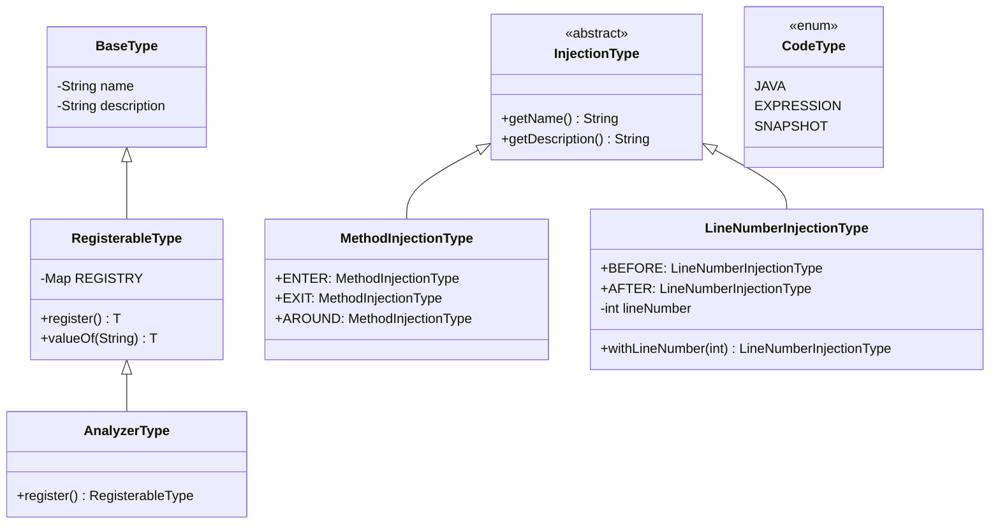
```mermaid
classDiagram
    class BaseType {
        -String name
        -String description
    }
    class RegisterableType {
        -Map REGISTRY
        +register() T
        +valueOf(String) T
    }
    class InjectionType {
        <<abstract>>
        +getName() String
        +getDescription() String
    }
    class MethodInjectionType {
        +ENTER: MethodInjectionType
        +EXIT: MethodInjectionType
        +AROUND: MethodInjectionType
    }
    class LineNumberInjectionType {
        +BEFORE: LineNumberInjectionType
        +AFTER: LineNumberInjectionType
        -int lineNumber
        +withLineNumber(int) LineNumberInjectionType
    }
    class AnalyzerType {
        +register() RegisterableType
    }
    class CodeType {
        <<enum>>
        JAVA
        EXPRESSION
        SNAPSHOT
    }

    BaseType <|-- RegisterableType
    RegisterableType <|-- AnalyzerType
    InjectionType <|-- MethodInjectionType
    InjectionType <|-- LineNumberInjectionType
```

### 10.2 注册表体系

| 注册表 | Key 类型 | Value 类型 | 初始化位置 |
|:---|:---|:---|:---|
| `BytecodeInjectorRegistry` | `InjectionType` | `BytecodeInjector` | 构造函数 + `DefaultInitializer` |
| `BytecodeAssemblerRegistry` | `CodeType` | `BytecodeAssembler` | 构造函数 + `DefaultInitializer` |
| `AnalyzerRegistry` | `AnalyzerType` | `ClassAnalyzer` | `DefaultInitializer` + `AsmInitializer` |
| `InjectionPointRegistry` | `String` (className) | `List<InjectionPoint>` | 运行时动态注册 |
| `TemplateRegistry` | `String` (name) | `RuleTemplate` | 构造函数 + `ServiceLoader` |

所有注册表均实现 `Registry<K, V>` 接口，使用 `ConcurrentHashMap` 保证线程安全。

### 10.3 初始化体系

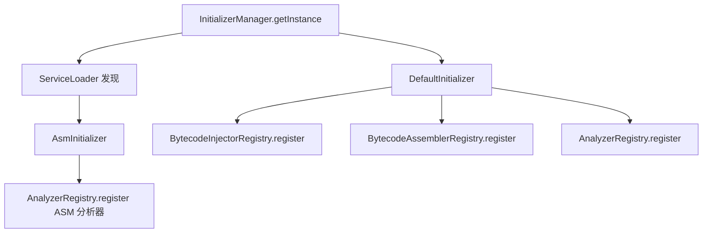
```mermaid
flowchart TD
    A[InitializerManager.getInstance] --> B[DefaultInitializer]
    A --> C[ServiceLoader 发现]
    C --> D[AsmInitializer]
    B --> E[BytecodeInjectorRegistry.register]
    B --> F[BytecodeAssemblerRegistry.register]
    B --> G[AnalyzerRegistry.register]
    D --> H[AnalyzerRegistry.register ASM 分析器]
```

**初始化顺序**：
1. `DefaultInitializer`：注册 5 个注入器 + 2 个组装器 + ASM 分析器
2. `ServiceLoader` 发现的初始化器（如 `AsmInitializer`）

**为什么不使用 SPI 作为主要发现机制**：
- Luna 是封闭系统，所有模块编译时依赖关系已明确
- SPI 加载顺序不可控，调试困难
- 显式注册更简单直接、类型安全

---

## 11. 反编译与类分析

### 11.1 反编译器

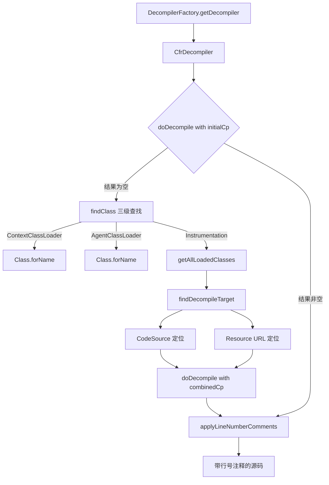
```mermaid
flowchart TD
    A[DecompilerFactory.getDecompiler] --> B[CfrDecompiler]
    B --> C{doDecompile with initialCp}
    C -->|结果为空| D[findClass 三级查找]
    D -->|ContextClassLoader| E[Class.forName]
    D -->|AgentClassLoader| F[Class.forName]
    D -->|Instrumentation| G[getAllLoadedClasses]
    G --> H[findDecompileTarget]
    H --> I[CodeSource 定位]
    H --> J[Resource URL 定位]
    I --> K[doDecompile with combinedCp]
    J --> K
    C -->|结果非空| L[applyLineNumberComments]
    K --> L
    L --> M[带行号注释的源码]
```

**CfrDecompiler 特性**：
- 使用 CFR 引擎，启用 `trackbytecodeloc` 选项追踪字节码位置
- **三级类查找**：ContextClassLoader → AgentClassLoader → Instrumentation.getAllLoadedClasses
- **行号注释**：`applyLineNumberComments()` 在反编译结果每行前添加 `/* N */` 格式的源码行号
- **降级处理**：反编译失败时返回包含错误信息的注释

### 11.2 类分析器

| 组件 | 说明 |
|:---|:---|
| `ClassAnalyzer` | 分析器接口，`analyze(byte[]) → ClassAnalysisResult` |
| `AsmClassAnalyzer` | 基于 ASM 的实现 |
| `AnalyzerType` | 分析器类型（`BaseType` 子类，支持注册） |
| `AnalyzerRegistry` | 分析器注册中心 |
| `ClassAnalysisResult` | 分析结果（方法列表、字段列表、行号表等） |
| `ClassAnalysisResultWithReadableAccess` | 扩展结果，包含可读性访问标志 |

---

## 12. 转换器层

### 12.1 转换器体系

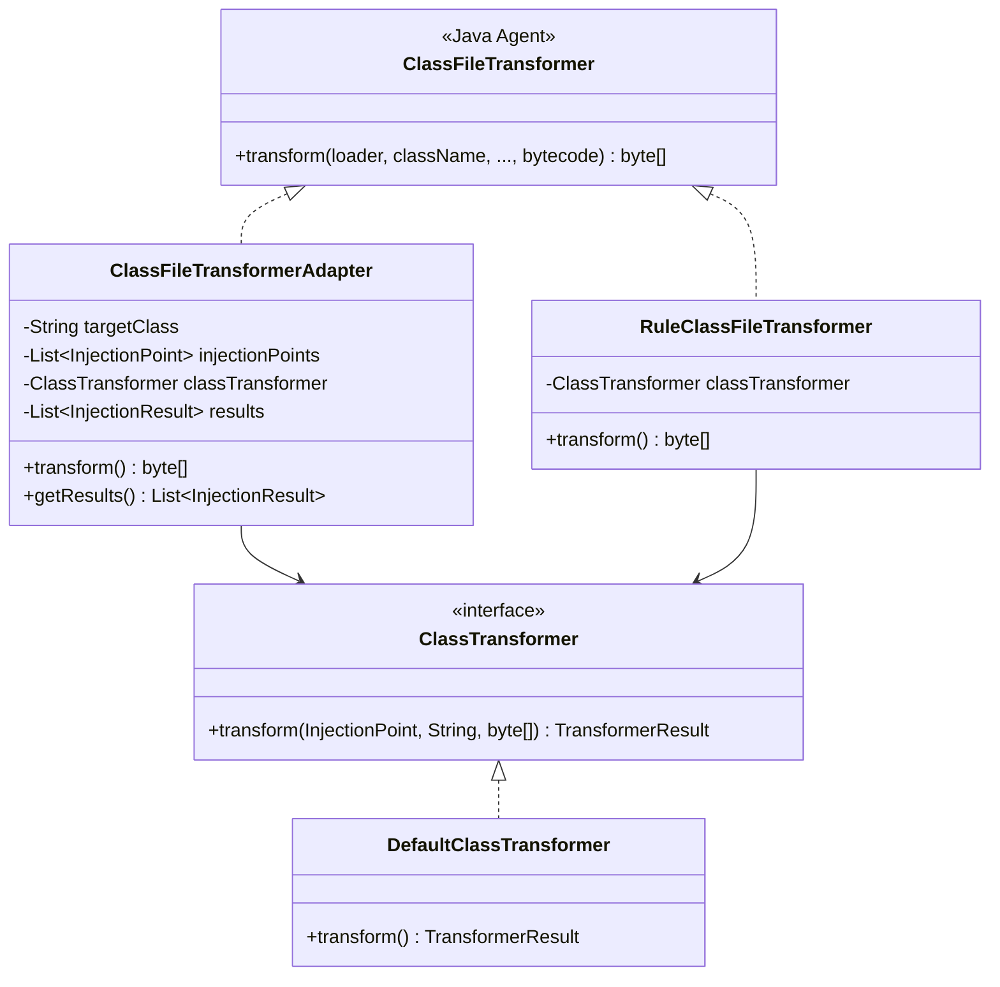
```mermaid
classDiagram
    class ClassTransformer {
        <<interface>>
        +transform(InjectionPoint, String, byte[]) TransformerResult
    }
    class DefaultClassTransformer {
        +transform() TransformerResult
    }
    class ClassFileTransformer {
        <<Java Agent>>
        +transform(loader, className, ..., bytecode) byte[]
    }
    class ClassFileTransformerAdapter {
        -String targetClass
        -List~InjectionPoint~ injectionPoints
        -ClassTransformer classTransformer
        -List~InjectionResult~ results
        +transform() byte[]
        +getResults() List~InjectionResult~
    }
    class RuleClassFileTransformer {
        -ClassTransformer classTransformer
        +transform() byte[]
    }

    ClassTransformer <|.. DefaultClassTransformer
    ClassFileTransformer <|.. ClassFileTransformerAdapter
    ClassFileTransformer <|.. RuleClassFileTransformer
    ClassFileTransformerAdapter --> ClassTransformer
    RuleClassFileTransformer --> ClassTransformer
```

### 12.2 DefaultClassTransformer

核心转换逻辑：
1. 从 `BytecodeInjectorRegistry` 查找注入器
2. 从 `BytecodeAssemblerRegistry` 查找组装器
3. 调用 `injector.inject(context, bytecode, assembler)` 执行注入
4. 返回 `TransformerResult`

### 12.3 ClassFileTransformerAdapter

Luna 内部模型 → Java Agent `ClassFileTransformer` 的适配器：
- **临时注册**：在 `InjectionExecutor.execute()` 中注册，retransform 完成后移除
- **多点聚合**：对同一类的多个注入点，按顺序逐个执行 `classTransformer.transform()`
- **结果收集**：`CopyOnWriteArrayList<InjectionResult>` 收集每个注入点的执行结果

### 12.4 RuleClassFileTransformer

全局规则自动转换器：
- **仅首次加载**：`classBeingRedefined == null` 时才处理（新加载的类）
- **规则匹配**：调用 `RuleManager.findRulesForClass()` 查找匹配规则
- **规则转换**：通过 `RuleConverter.convert()` 将规则转为注入点
- **逐个执行**：对每个注入点调用 `DefaultClassTransformer.transform()`

---

## 13. 类隔离策略

为了确保 Luna 的依赖（如 Jetty, ASM, CFR, FastJSON）不影响目标进程：

### 策略一：隔离加载

- 自定义 `LunaAgentClassLoader`（继承 `URLClassLoader`）
- Agent 入口类 `Agent` 使用 `SystemClassLoader` 加载
- 在 `executeWithAgentClassLoader()` 中切换到 `LunaAgentClassLoader`，通过反射调用 `startAgent()`
- **打破双亲委派**：除了 `java.*` 等核心类外，Luna 自身的类均由该 ClassLoader 隔离加载

### 策略二：字节码更名 (Shading)

- 利用 Maven Shade Plugin，将 `org.objectweb.asm` 重命名为 `fun.efto.luna.shade.asm`
- 即使宿主应用也依赖了不同版本的 ASM，由于全限定名不同，加载时完全隔离

### 策略三：Bootstrap ClassLoader 注入

- 通过 `inst.appendToBootstrapClassLoaderSearch(new JarFile(agentJarPath))` 将 Agent JAR 加入 Bootstrap ClassLoader 搜索路径
- 使得 `LunaSpy` 类在所有 ClassLoader 中均可见，业务代码可直接调用

---

## 14. JVM Attach 机制

Luna 使用 JDK 自带的 `com.sun.tools.attach.VirtualMachine` API 实现运行时注入：

```java
// Attacher 核心逻辑
VirtualMachineDescriptor selected = waitUserInput();  // 列出 JVM 进程，用户选择
VirtualMachine vm = VirtualMachine.attach(selected);
vm.loadAgent(agentJarPath);  // 加载 Agent
// ... 使用完毕后 ...
vm.detach();
```

**Agent 入口方法**：
- `premain()`：通过 `-javaagent` 参数启动时调用
- `agentmain()`：通过 Attach API 动态加载时调用
- 两者均委托给 `executeWithAgentClassLoader()` → `startAgent()`

---

## 15. Luna 自生日志处理

为了确保 Agent 自身的运行日志与目标应用的日志及配置完全隔离：

1. **独立初始化**：在 `LoggerInitializer` 中，通过 `Configurator.initialize("luna-agent", ...)` 显式创建一个名为 `luna-agent` 的日志上下文
2. **配置隔离**：显式指定加载 `luna-log4j2.xml` 配置文件
3. **防冲突设计**：
    - Luna 使用的 Log4j2 相关类库在打包阶段通过 `shade` 进行重定位
    - 日志初始化动作被放置在 Agent 启动的最早期阶段（`startAgent()` 第一步）

---

## 16. 多次注入与类缓存管理

Luna 会在内存中维护一个双层缓存（`BytecodeCache`）：

- **bytecodeCache**：`ConcurrentHashMap<String, byte[]>` — 缓存字节码
- **analysisCache**：`ConcurrentHashMap<String, Object>` — 缓存分析结果

**同一个类的多次注入处理**：遵循 **"Clean Slate + Re-apply"** 策略

1. `InjectionPointRegistry` 维护每个类的所有活跃注入点
2. `InjectionExecutor.execute()` 注册新注入点后，获取该类所有注入点
3. 创建 `ClassFileTransformerAdapter`，在 `transform()` 中按顺序逐个应用所有注入点
4. 调用 `retransformClasses` 覆盖载入

**移除注入点**：
- `InjectionPointRegistry.removeById()` 移除指定注入点
- 若该类仍有剩余注入点，重新 retransform（只应用剩余注入点）
- 若该类无剩余注入点，retransform 回原始字节码（无注入点匹配时 `transform()` 返回 `null`）

---

## 17. 扩展性机制与演进路径

### 17.1 当前扩展方式

| 扩展方式 | 机制 | 示例 |
|:---|:---|:---|
| **注入器扩展** | 通过 `BytecodeInjectorRegistry` 注册新的 `BytecodeInjector` | 添加新的方法级注入策略 |
| **组装器扩展** | 通过 `BytecodeAssemblerRegistry` 注册新的 `BytecodeAssembler` | 添加新的代码类型（如 `CodeType.JAVA`） |
| **分析器扩展** | 通过 `AnalyzerRegistry` 注册新的 `ClassAnalyzer` | 添加基于其他引擎的分析器 |
| **模板扩展** | 通过 `TemplateRegistry` 注册新的 `RuleTemplate` | 添加社区模板 |
| **初始化器扩展** | 通过 `ServiceLoader` 发现 `Initializer` 实现 | 添加插件化初始化逻辑 |

### 17.2 未来插件化演进路径

当出现以下情况时，再考虑拆分独立的 `luna-plugin-api` 模块：

- 有 **3+ 个复杂插件**（每个 >10 个类）
- 需要支持**第三方开发者**
- 插件有**复杂的外部依赖**（如 Spring、MyBatis）

当前阶段，显式注册 + ServiceLoader 的方式已满足需求，避免过度设计。

---

**文档状态**：已完成
**整合日期**：2026/05/11
