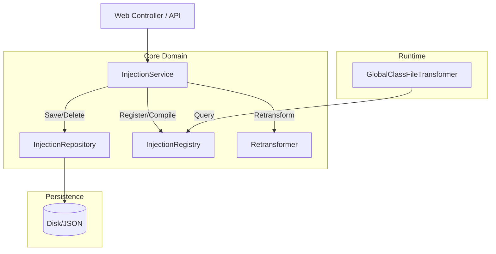

# 架构深化：Injection 模块边界重构设计文档

## 1. 目标与背景

由于原来的 `InjectionManager` 是一个上帝类（God Class），内部耦合了缓存（类精确索引、正则匹配）、持久化落盘以及基于 Instrumentation 的重转换触发机制。此外，在运行时 `GlobalClassFileTransformer` 会频繁调用 `InjectionManager` 获取活动注入点，在类加载频繁的情况下，大量的正则匹配会导致系统性能急剧下降。

为了提升模块的**局部性（Locality）**并提供高**杠杆（Leverage）**接口，我们需要对 Injection 模块进行边界重塑（Seam Refactoring）。

## 2. 核心架构设计

我们将原有的 God Class 拆解为三个职责单一、领域明确的深层模块（Deep Modules）。



### 2.1 InjectionRepository (纯存储层)
- **职责**: 只负责 `PersistentInjection` 对象的持久化操作（增删改查）。
- **解耦**: 彻底剥离字节码解析、类正则匹配等逻辑，仅将其视作一个数据对象。

### 2.2 InjectionRegistry (高性能内存注册表)
- **职责**: 在内存中管理所有当前处于激活（Active）状态且已经过编译（Compiled）的 `InjectionPoint`，供 Transformer 在类加载时高速查询。
- **性能红线**: 单次查询耗时必须严格控制在 **< 0.1ms**。
- **优化算法设计**: 
    - 绝大部分“正则注入规则”实际上是包前缀匹配（如 `fun.efto.luna.*`）。
    - 引入 **字典树（Trie Tree）** 将包名分段映射，前缀查询的时间复杂度为 O(k) （k为包层级深度）。
    - 对于少数不支持前缀的复杂正则（例如中缀、后缀匹配 `.*ServiceImpl`），保留一个备用的极小 Fallback List 遍历池。

### 2.3 InjectionService (领域编排服务)
- **职责**: 接管所有业务流操作。
- **工作流**: 参数验证 -> 调用 `InjectionRepository` 存储 -> 编译组装 -> 调用 `InjectionRegistry` 注册 -> 触发 `Retransformer` 让修改生效。

## 3. 接口定义

```java
// 存储层
public interface InjectionRepository {
    void save(PersistentInjection injection);
    void delete(String id);
    PersistentInjection findById(String id);
    List<PersistentInjection> findAll();
}

// 运行时注册查询源
public interface InjectionQuery {
    List<InjectionPoint> getActivePointsForClass(String className);
}

// 注册表 (实现 InjectionQuery)
public interface InjectionRegistry extends InjectionQuery {
    void register(InjectionPoint point);
    void unregister(String pointId);
    void unregisterByPluginId(String pluginId);
}
```

## 4. 关键算法：Trie 树优化

为了实现 O(k) 的前缀匹配：
1. 节点设计：以包名的字符或包层级（由 `.` 分割）为层级构建树。
2. 插入逻辑：`fun.efto.luna.*` 转化为 `[fun, efto, luna, *]`，在 `*` 节点处挂载对应的 `InjectionPoint` 列表。
3. 查询逻辑：类名 `fun.efto.luna.agent.Agent` 被切割后，沿着 Trie 下钻，如果遇到通配符节点 `*` 或是叶子匹配，则收集该节点挂载的所有 InjectionPoints。

## 5. 验证指标
- 使用 TDD 模式编写针对 Trie 和 Fallback 池并发修改与查询的单元测试，确保不出现脏读或并发错误。
- 压力测试断言单次匹配在 < 0.1ms。
