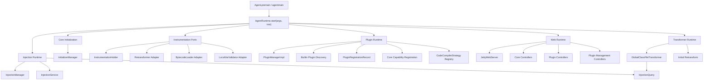
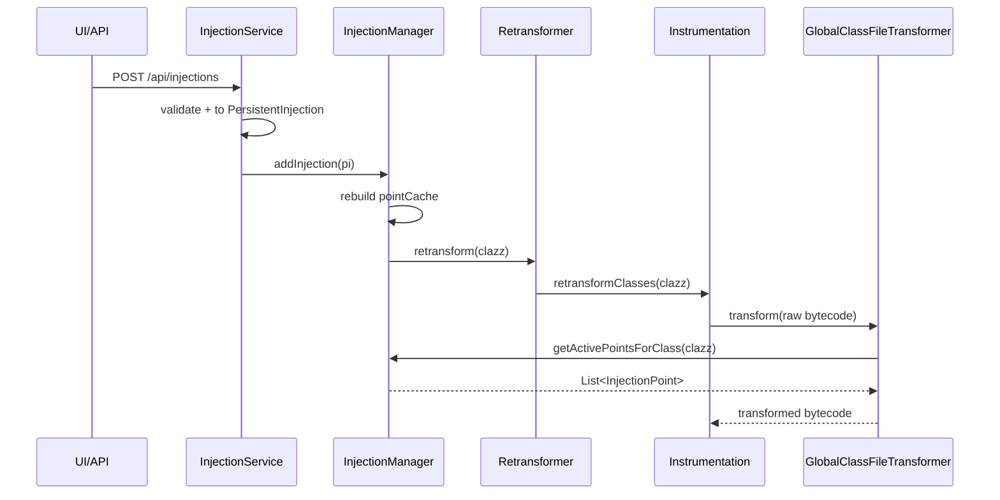

# Agent Runtime 与统一注入运行时详细设计

> 日期：2026-05-29  
> 来源：`docs/design/architecture-deepening-assessment-2026-05-29.md`  
> 目标：把生产 Agent 启动路径收束为 `Agent -> AgentRuntime -> PluginManagerImpl.initializeAll(builtin plugins) -> GlobalClassFileTransformer`，让插件初始化、CodeCompiler 策略、统一注入缓存和 Transformer 在真实运行时合流。

## 1. 背景

当前代码已经具备插件化和统一注入的关键 Module：

- `PluginManagerImpl` 能管理插件生命周期，并通过 `PluginRegistrationRecord` 追踪注册项。
- `CodeCompilerStrategy` 能把 `PersistentInjection` 编译成 `InjectableCode`。
- `InjectionManager` 能维护 `PersistentInjection`、`classIndex`、`pointCache`，并通过 `InjectionQuery` 暴露 active points。
- `GlobalClassFileTransformer` 能从 `InjectionQuery` 查询当前类的注入点并执行织入。
- `PluginUIController`、`PluginManagerController`、`MarketController` 已具备插件管理接口基础。

但生产 `Agent` 启动仍直接注册 `RuleClassFileTransformer`，且没有组装 `PluginManagerImpl`。这导致测试路径和生产路径不一致：测试能通过 `PluginManagerImpl.initializeAll()` 初始化插件，但真实 Agent 启动不会初始化 `LogPlugin`、`SnapshotPlugin`、`TracePlugin` 等插件，也不会把 `CodeCompilerStrategy` 稳定注册到生产运行时。

本设计的核心是建立一个深的 `AgentRuntime` Module，让启动顺序、插件初始化、注入运行时和 Web Runtime 形成单一入口。

## 2. 设计目标

### 2.1 必达目标

- `Agent` 只作为 Java Agent 入口 Adapter，启动 Implementation 移入 `AgentRuntime`。
- 生产启动路径初始化内置插件，确保 expression handlers、templates、code compiler strategies 在注入前可用。
- 生产启动注册 `GlobalClassFileTransformer`，让 `InjectionManager.pointCache` 成为唯一新注入运行时 Interface。
- 插件管理 Controller 和 UI manifest Controller 能在生产 Web Runtime 中注册。
- 项目尚未发布，不为外部兼容性保留旧注入路径；允许破坏性变更，但必须通过 TDD 证明功能不回退。

### 2.2 非目标

- 本轮不以外部兼容为理由保留 `RuleManager`。
- 本轮不以外部兼容为理由保留 `RuleClassFileTransformer` 源码。
- 本轮不完整实现插件市场下载与安装。
- 本轮不引入 DI 容器。
- 本轮不重写 UI，只保证后端 manifest 和 plugin manager 端点能进入生产路由。

## 3. 目标架构



## 4. Module 设计

### 4.1 Agent Adapter

**Module**：`fun.efto.luna.agent.Agent`

**Interface**

- `premain(String args, Instrumentation inst)`
- `agentmain(String args, Instrumentation inst)`

**Implementation 变化**

`Agent` 只负责：

- 创建或切换 `LunaAgentClassLoader`。
- 反射调用隔离 ClassLoader 中的 `AgentRuntime.start()`。
- 打印极少量启动失败信息。

`Agent` 不再直接组装：

- `InjectionService`
- `JettyWebServer`
- `RuleManager`
- `RuleClassFileTransformer`
- 已加载类扫描逻辑

这样 `Agent` 成为薄 Adapter，启动行为的 Locality 进入 `AgentRuntime`。

### 4.2 AgentRuntime

**建议路径**

- `luna-agent/src/main/java/fun/efto/luna/agent/runtime/AgentRuntime.java`
- `luna-agent/src/main/java/fun/efto/luna/agent/runtime/AgentRuntimeContext.java`
- `luna-agent/src/main/java/fun/efto/luna/agent/runtime/BuiltinPluginProvider.java`

**Interface 草图**

```java
public final class AgentRuntime {
    public static AgentRuntime start(String args, Instrumentation inst);
    public void stop();
}
```

**Implementation 职责**

启动顺序必须显式且可测试：

1. 初始化日志。
2. append agent jar to bootstrap classpath。
3. 初始化 core infrastructure。
4. 初始化 `InstrumentationHolder`。
5. 创建 `ClassScanner`、`ClassResourceHelper`。
6. 创建并注册 `Retransformer`、`InjectionStore`、`BytecodeLoader`、`LocalVarValidator`、`InjectionVerifier`。
7. 创建 `InjectionService`。
8. 创建 `JettyWebServer`。
9. 创建 `PluginManagerImpl`。
10. 初始化 builtin plugins。
11. 注册 plugin management controllers。
12. 启动 Web Runtime。
13. 注册 `GlobalClassFileTransformer`。
14. 对已有 active injections 或 legacy rules 做 initial retransform。
15. 注册 shutdown hook。

**AgentRuntimeContext**

用于保存运行期对象，避免静态方法之间隐式传递：

```java
public final class AgentRuntimeContext {
    private final Instrumentation instrumentation;
    private final InjectionManager injectionManager;
    private final InjectionService injectionService;
    private final PluginManager pluginManager;
    private final JettyWebServer webServer;
    private final Retransformer retransformer;
}
```

### 4.3 BuiltinPluginProvider

**目的**

统一生产启动和测试启动的 builtin plugin 集合。

**Interface 草图**

```java
public final class BuiltinPluginProvider {
    public static List<LunaPlugin> builtins();
}
```

**第一阶段内置插件集合**

- `LogPlugin`
- `SnapshotPlugin`
- `TracePlugin`
- `ConditionalBreakpointPlugin`

**核心内置能力**

method/line 不放入 `BuiltinPluginProvider`，也不重新包装为 `MethodInjectionPlugin` / `LineInjectionPlugin`。它们是 Luna 字节码注入的内核能力，不是可选扩展：

- 不走 `PluginClassLoader`。
- 不参与 load/unload/update。
- 不允许 disable。
- 仍由 `CoreModuleInitializer` 直接初始化。

真正需要补齐的是 registration tracking：`CoreModuleInitializer` 在注册 method/line 的 `InjectionType`、`BytecodeInjector`、`RuleConverter` 时，应同步写入一个核心能力注册记录，例如 `CoreRegistrationRecord` 或 `CoreCapabilityRegistry`。这个记录只提供观测和 manifest 数据，不提供插件生命周期语义。

完整 core capability 分层见 `docs/design/luna-core-capabilities-map-2026-05-29.md`。这里的 method/line 只是第一期必须补齐的核心注册项；`instrumentation`、`injection-lifecycle`、`transform-pipeline`、`bytecode-assembly`、`code-compiler-dispatch` 等也应作为核心能力被逐步记录。

### 4.4 Plugin Runtime

**Module**：`PluginManagerImpl`

本设计不要求重写 `PluginManagerImpl`，但要求它进入生产启动路径。

生产启动时创建：

```java
ReadyGate readyGate = new ReadyGate();
PluginManagerImpl pluginManager = new PluginManagerImpl(
    readyGate,
    new DefaultLogEmitter(),
    LunaSpy.LOG_BUFFER,
    retransformer,
    AnalyzerRegistry.getInstance().get(...),
    DecompilerFactory.getDecompiler(),
    webServer
);
pluginManager.initializeAll(BuiltinPluginProvider.builtins());
readyGate.markReady();
```

实际代码可按现有 registry 获取方式调整，不要求一次性美化。

**ReadyGate 处理**

第一阶段只要求生产路径调用 `markReady()`，让 ready 状态和插件初始化绑定。

第二阶段再实现完整 barrier：

- `await(timeout)`
- 插件 ready 前跳过或缓存 transform 请求
- `markReady()` 后对 ready 前加载的受影响类做补偿性 retransform

### 4.5 Injection Runtime

**Module**

- `InjectionManager`
- `InjectionService`
- `GlobalClassFileTransformer`

**目标 Interface**

`GlobalClassFileTransformer` 只依赖：

```java
InjectionQuery.getActivePointsForClass(String className)
```

所有新注入入口都必须先写入 `InjectionManager`，再由 `GlobalClassFileTransformer` 在 retransform 时读取 active points。

**新注入路径**



**旧路径收敛**

`RuleClassFileTransformer` 不作为新注入路径。因为项目尚未发布，不需要设计长期兼容窗口；只需要选择一条能用测试保护现有功能的迁移路径：

- 选择 A：先为旧 rules 的可观察行为补测试，启动时仍注册 `RuleClassFileTransformer`，但仅处理迁移前仍存在的 rules。
- 选择 B：先为旧 rules 的可观察行为补测试，启动时不注册 `RuleClassFileTransformer`，新增一次 migration，把 `RuleManager` 中的 rules 转成 `PersistentInjection` 后进入 `InjectionManager`。

推荐先做选择 A，获得生产启动合流的 tracer bullet；随后迁移模板和规则旧模型。一旦测试覆盖证明新路径行为等价，删除旧路径，而不是继续维护兼容层。

### 4.6 Web Runtime

**当前问题**

`JettyWebServer` 构造函数直接注册固定 Controller，而插件管理 Controller 已经存在但未进入生产启动路径。

**第一阶段设计**

在 `AgentRuntime` 创建 `JettyWebServer` 后，显式注册插件管理 Controller：

- `PluginManagerController`
- `PluginUIController`
- `MarketController`，如当前依赖满足

如果 `MarketController` 构造依赖尚未齐全，先注册前两个。

**第二阶段设计**

提炼 route registration Module：

- `CoreRouteRegistrar`
- `PluginRouteRegistrar`
- `ManagementRouteRegistrar`

`JettyWebServer` 只暴露 `registerControllers/unregisterControllers`，不再知道所有 Controller 清单。

## 5. 破坏性演进策略

项目当前尚未发布，因此不需要为外部用户保留稳定 API 或旧数据模型兼容。`RuleManager`、`RuleClassFileTransformer`、`InjectionRule` 相关路径可以做破坏性变更，甚至在对应能力迁移完成后删除。

破坏性演进的边界不是“旧接口必须保留”，而是“现有功能不能回退”。所有迁移必须按 TDD 执行：

1. 先用行为测试锁住现有功能。
2. 再把实现迁到新运行时。
3. 确认测试通过后删除或降级旧路径。
4. 重构只在 green 状态下进行。

### 5.1 RuleManager 迁移

`RuleManager` 不再作为需要兼容的公开接口，而是待迁移的旧实现。下列对象可以被改签名、移动、内联或删除：

- `/api/rules`
- `RuleManager`
- `RulePersistenceService`
- `RuleClassFileTransformer`
- `InjectionRuleConverter`

迁移目标是把可观察行为收束到新入口：

```text
InjectionCommand -> PersistentInjection -> InjectionManager -> GlobalClassFileTransformer
```

TDD 要求：

- 为 `/api/rules` 当前仍承载的核心行为补行为测试，而不是测试 `RuleManager` 内部结构。
- 每迁移一个行为，只写一个失败测试，然后实现最小变更让它通过。
- 迁移后的测试应通过新入口验证行为，例如注入创建、查询、删除、字节码恢复。
- 当某个旧方法只剩转发逻辑且无独立行为时，优先删除旧方法，而不是继续维护兼容层。

### 5.2 CoreModuleInitializer 策略

保留 method/line direct registration。这里不是短期妥协，而是符合它们内核能力定位的长期设计。

限制：

- 不再向其中新增新的注入类型。
- 不再向其中新增 expression protocol。
- 不再向其中新增 CodeCompilerStrategy。

需要补齐：

- method/line 注册时同步写入核心能力 registration record。
- UI manifest 聚合“核心能力记录 + 插件记录”。
- 测试断言 direct registration 与 tracking record 一致。

### 5.3 ClassFileTransformerAdapter 迁移

`ClassFileTransformerAdapter` 只作为旧验证路径存在，不作为兼容承诺。只要新验证运行时覆盖对应行为，就可以删除旧 Adapter 路径。

限制：

- 新生产注入路径不得使用它。
- 新测试优先覆盖 `GlobalClassFileTransformer`。
- Phase 3 后验证运行迁到统一注入运行时。

## 6. 风险与应对

| 风险 | 说明 | 应对 |
| --- | --- | --- |
| 插件初始化顺序错误 | `TracePlugin` 依赖 method injection，而 method/line 不走插件流程 | `CoreModuleInitializer` 先完成 method/line direct registration，再执行 `BuiltinPluginProvider` 的插件初始化 |
| CodeCompiler 策略缺失 | `InjectionPointFactory` 调用 `CodeCompiler.compile()` 时找不到策略 | AgentRuntime 启动验收：`CodeCompiler.getStrategies()` 包含 log/snapshot |
| 双 Transformer 重复织入 | 同时注册 `RuleClassFileTransformer` 和 `GlobalClassFileTransformer` 可能重复处理同一类 | 先用行为测试锁住旧 rules 与新 injections 的输入边界；迁移完成后删除旧 Transformer |
| 插件 Controller 未注册 | UI manifest/API 不可访问 | AgentRuntime 启动后注册 plugin management controllers |
| ReadyGate 语义不完整 | ready 前类已加载，插件初始化后没有补偿 retransform | Phase 1 只 markReady；Phase 3 实现补偿 retransform |
| 单例测试污染 | 多个 registry 和 manager 是 singleton/static | 测试增加 setup/teardown 清理 registry 和 manager |

## 7. 迭代计划

### Iteration 1：AgentRuntime 骨架

**目标**

让 `Agent` 变薄，启动顺序进入 `AgentRuntime`。

**任务**

1. 新增 `AgentRuntime` 和 `AgentRuntimeContext`。
2. 把 `Agent.startAgent()` 中的启动代码搬入 `AgentRuntime.start()`。
3. `Agent.startAgent()` 只调用 `AgentRuntime.start(args, inst)`。
4. 先补生产启动行为测试，再暂留现有 `RuleClassFileTransformer` 注册，确保迁移切片行为不变。

**验收**

- Agent 能按现有方式启动。
- Web 服务仍在 8421 启动。
- 现有 `/api/status`、`/api/classes`、`/api/injections` 不回退。

**测试**

- 新增 `AgentRuntime` 单元测试，至少验证 runtime context 非空。
- 如 fake `Instrumentation` 成本太高，可先保留编译测试和启动 smoke 测试。

### Iteration 2：生产路径初始化 builtin plugins

**目标**

让生产 Agent 启动路径和插件测试路径合流。

**任务**

1. 新增 `BuiltinPluginProvider.builtins()`。
2. 在 `AgentRuntime` 中创建 `ReadyGate` 和 `PluginManagerImpl`。
3. 调用 `pluginManager.initializeAll(BuiltinPluginProvider.builtins())`。
4. 初始化完成后 `readyGate.markReady()`。
5. 注册 `PluginManagerController` 和 `PluginUIController` 到 `WebServer`。

**验收**

- 启动后 `ExpressionHandlerRegistry` 包含 log/snapshot/trace/conditional。
- 启动后 `CodeCompiler.getStrategies()` 至少包含 log/snapshot。
- `/api/plugins` 返回 builtin plugins。
- `/api/plugins/ui-manifest` 返回 injection types、expression protocols、templates。

**测试**

- 新增 `BuiltinPluginProviderTest`。
- 扩展 `PluginIntegrationTest`，覆盖生产等价初始化集合。
- 对 `PluginUIController` 增加 manifest 测试。

### Iteration 3：接入 GlobalClassFileTransformer

**目标**

让新注入路径由 `GlobalClassFileTransformer` 驱动。

**任务**

1. 在 `AgentRuntime` 中创建 `GlobalClassFileTransformer(InjectionManager.getInstance())`。
2. 注册 `GlobalClassFileTransformer`。
3. 暂留 `RuleClassFileTransformer` 但标记为待删除路径，只处理迁移前仍存在的 rules。
4. 调整 initial retransform：对 `InjectionManager` 中已有 active injection classes 做 retransform；旧 rules 仍走原逻辑。

**验收**

- `POST /api/injections` 后，`InjectionManager.pointCache` 有 active point。
- retransform 时 `GlobalClassFileTransformer` 能应用该 point。
- 删除注入后 retransform 返回干净字节码。

**测试**

- 新增 `GlobalClassFileTransformerIntegrationTest`。
- 覆盖空 points 返回 `null`。
- 覆盖多个 points 顺序织入。

### Iteration 4：模板应用迁移到 PersistentInjection

**目标**

模板应用不再创建 `InjectionRule`，而是创建 `PersistentInjection`。

**任务**

1. 新增模板输出 draft，例如 `InjectionTemplateDraft` 或直接输出 `PersistentInjection`。
2. `TemplateEngine.apply()` 增加新方法：`applyToInjections(...)`。
3. `TemplateService` 改依赖 `InjectionLifecycle`。
4. `TemplateService.applyTemplate()` 调用 `InjectionLifecycle.addInjection()`。
5. 旧 `RuleTemplate -> InjectionRule` 方法仅作为待删除路径存在；迁移切片通过后删除或内联。

**验收**

- 模板应用返回新 injection ids。
- 模板生成的注入可通过 `/api/injections/list` 查询。
- 模板生成的注入删除后能恢复字节码。

**测试**

- 更新 `TemplateEngineTest`，新增 PersistentInjection 输出断言。
- 更新 `TemplateServiceTest`，使用 fake `InjectionLifecycle`。

### Iteration 5：method/line 内置能力补齐注册追踪

**目标**

method/line 保持 core direct initialization，但补齐统一 registration tracking，消除“注册了但 manifest 和诊断不可解释”的分叉。

**任务**

1. 新增 `CoreRegistrationRecord` 或 `CoreCapabilityRegistry`。
2. `CoreModuleInitializer` 直接注册 method/line 时同步写入核心能力记录。
3. `PluginUIController` 的 manifest 构建合并核心能力记录和插件记录。
4. 明确核心能力不支持 load/unload/update/disable。
5. 文档中把 method/line 定义为 core capability，而不是 builtin plugin。

**验收**

- `/api/plugins/ui-manifest` 中 method/line 能显示为 core capability。
- method/line 不出现在可卸载插件列表，或显示为不可操作的核心能力。
- `CoreModuleInitializer` 中 method/line direct registration 与 core registration record 一致。

**测试**

- core capability registration 测试。
- manifest 合并核心能力和插件能力的测试。
- method/line 不可 unload/disable 的行为测试。

### Iteration 6：插件生命周期事务深化

**目标**

显式化 load/unload/update 的事务阶段和 rollback invariants。

**任务**

1. 提炼内部 `PluginLifecycleTransaction`。
2. 修复 `AffectedClassTracker.remove(typeName, affectedClasses.toString())` 清理风险。
3. `initializeAll()` 和 `load()` 对 transform lock/ready gate 的语义对齐。
4. update 失败 rollback 增加明确状态验证。

**验收**

- load 初始化失败不留下 registry 项。
- unload 后 CodeCompiler、Template、ExpressionHandler、Controller 无残留。
- update 失败后旧插件仍可用。
- affected classes tracker 清理正确。

**测试**

- 插件初始化中途失败测试。
- update 新插件失败回滚测试。
- unload 后 registry 残留测试。

### Iteration 7：验证运行统一化

**目标**

验证不再临时注册 `ClassFileTransformerAdapter`，协议期望也不再泄漏到 `InjectionService`。

**任务**

1. 新增 `VerificationRun` Module。
2. 抽象 invocation adapter 和 output sink。
3. 把 `expectedContent.startsWith("log:")` 移出 `InjectionService`。
4. `InjectionTestHarnessAdapter` 降级为 invocation Adapter。
5. 删除或废弃 `InjectionVerifier.testInjection()` 中的临时 Transformer 路径。

**验收**

- 新增表达式协议不需要改 `InjectionService`。
- 验证运行复用 `InjectionManager + GlobalClassFileTransformer`。
- log/snapshot/trace 可以各自定义 observation 期望。

**测试**

- fake invocation adapter 测验证流程。
- log expectation parser 测试。
- `testInjection()` 旧入口删除前后的行为等价测试。

## 8. 里程碑

| 里程碑 | 覆盖迭代 | 结果 |
| --- | --- | --- |
| M1：生产启动合流 | Iteration 1-2 | Agent 生产路径初始化插件，插件管理端点可用 |
| M2：统一注入运行时 | Iteration 3-4 | 新注入和模板注入走 `InjectionManager + GlobalClassFileTransformer` |
| M3：内置能力可观测化 | Iteration 5 | method/line 由核心能力记录追踪，log/snapshot/trace 由插件记录追踪 |
| M4：事务与验证深化 | Iteration 6-7 | 插件热更新和验证运行具备集中 Locality |

## 9. 推荐执行顺序

先做 M1，再做 M2。不要先删除旧规则路径，也不要先做市场能力。

最小第一 PR 建议只包含：

- `AgentRuntime` 骨架。
- `BuiltinPluginProvider`。
- 生产路径调用 `PluginManagerImpl.initializeAll()`。
- 注册 `PluginManagerController` 和 `PluginUIController`。
- 对启动后 registry 状态的测试。

这个 PR 不需要切换到 `GlobalClassFileTransformer`，以降低风险。第二个 PR 再切换新注入 Transformer。这样每一步都有清楚的回滚点，也更容易判断行为变化来自哪里。
