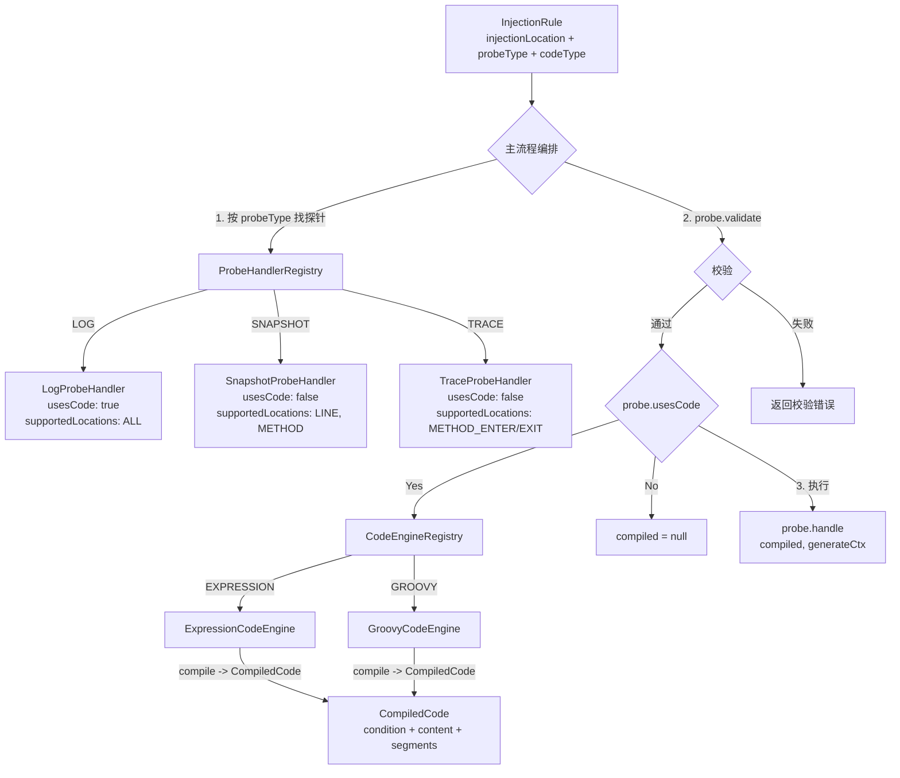

# codeType / probeType 正交分离重构设计

## 1. 背景与问题

### 1.1 现状

当前 `codeType` 字段同时承载了两个正交维度：

| 维度 | 含义 | 应有的值 |
|------|------|---------|
| **执行引擎** | 代码用什么运行 | `EXPRESSION`, `GROOVY`, `JS` |
| **探针类型** | 做什么事 | `LOG`, `SNAPSHOT`, `TRACE` |

两者耦合在一个字段里，导致：

1. **`CodeType` 枚举混入业务语义**：`SNAPSHOT` 是探针类型，不是执行引擎，却出现在枚举中
2. **`CodeCompilerStrategy` 按业务用途分**：`LogCodeCompilerStrategy` 和 `SnapshotCodeCompilerStrategy` 按探针类型拆分，而非按执行引擎
3. **`LogCodeCompilerStrategy` 抢占 `EXPRESSION`**：所有 EXPRESSION 类型的规则都被 LOG 策略截走
4. **`code` 前缀承担业务路由**：`"log:"`、`"snapshot:"` 前缀在 `ExpressionBytecodeAssembler` 中解析，做第二层分派
5. **不可自由搭配**：无法实现 `GROOVY + LOG` 或 `JS + TRACE` 等组合
6. **不可扩展**：`CodeType` 是枚举，插件无法新增执行引擎
7. **`codeType` 分派两次**：`CodeCompilerStrategy` 和 `BytecodeAssemblerRegistry` 都按 `codeType` 路由，冗余
8. **命名不一致**：`InjectionCommand` 用模式名而非领域名；`logContent` 暗示只有 LOG 用；`generateBytecode` 暴露实现细节
9. **`GenerateContext.Phase` 与 `InjectionType` 重叠**：`Phase` 只覆盖 `ENTER/EXIT/AROUND`，未覆盖 `line_before`、`invoke`、`exception_exit` 等，且与 `InjectionType` 语义重复
10. **条件检查逻辑重复**：`LogExpressionHandler` 和 `SnapshotExpressionHandler` 的 `generateConditionCheck()` 完全一样，应为基础功能
11. **`codeType` 对所有探针都是必填**：但 SNAPSHOT/TRACE 不需要用户代码，`codeType` 对它们无意义

### 1.2 目标

- **三个维度完全分离**：`injectionLocation`（WHERE）、`probeType`（WHAT）、`codeType`（HOW，可选）
- **Probe 为顶级插件**：自描述能力（是否使用代码、支持哪些位置），自行校验参数合法性
- **`codeType` 可选**：只有使用用户代码的探针（如 LOG）才需要，SNAPSHOT/TRACE 不需要
- **条件检查提升为基础功能**：由 Injector 层统一处理，ProbeHandler 不感知
- **插件可扩展**：两个维度都通过 Registry 注册，不使用枚举
- **消除冗余分派**：`codeType` 只分派一次
- **命名一致性**：领域语言，不暴露实现细节

---

## 2. 核心设计

### 2.1 概念模型

```
┌──────────────────────────────────────────────────────────────┐
│                       InjectionRule                           │
│                                                               │
│  injectionLocation = "method_enter"  ← WHERE（注入位置）      │
│  probeType         = "LOG"           ← WHAT（探针行为）      │
│  codeType          = "EXPRESSION"    ← HOW（执行引擎，可选）  │
│  code              = "→ call: $0"    ← 用户代码（可选）      │
│  condition         = "x > 0"         ← 条件（可选）          │
│                                                               │
└──────────────────────────────────────────────────────────────┘
```

**三个维度完全正交：**

| 维度 | 回答的问题 | 必填 | 值 |
|------|-----------|------|---|
| `injectionLocation` | WHERE — 注入位置 | ✅ | `method_enter`, `line_before`, `invoke`, ... |
| `probeType` | WHAT — 探针行为 | ✅ | `LOG`, `SNAPSHOT`, `TRACE` |
| `codeType` | HOW — 执行引擎 | ❌ 可选 | `EXPRESSION`, `GROOVY`, `JS` |

**`codeType` 可选的原因：**

| probeType | 需要 code 吗 | 需要 codeType 吗 | 说明 |
|-----------|-------------|-----------------|------|
| LOG | ✅ 需要 | ✅ 需要 | 用户输入表达式，需引擎执行 |
| SNAPSHOT | ❌ 不需要 | ❌ 不需要 | 固定行为：采集所有上下文变量 |
| TRACE | ❌ 不需要 | ❌ 不需要 | 固定行为：记录时间戳 |

### 2.2 分派架构

**核心原则：Probe 是顶级插件，自描述能力，自行校验参数；CodeEngine 是 Probe 的附属工具，仅 `usesCode=true` 时使用。**



**主流程伪代码：**

```java
ProbeHandler probe = ProbeHandlerRegistry.get(rule.getProbeType())
    .orElseThrow(() -> new IllegalArgumentException("Unsupported probeType: " + rule.getProbeType()));

ValidationResult result = probe.validate(request);
if (!result.isValid()) {
    return Result.fail(result.getErrorMessage());
}

CompiledCode compiled = null;
if (probe.usesCode()) {
    CodeEngine engine = CodeEngineRegistry.get(rule.getCodeType())
        .orElseThrow(() -> new IllegalArgumentException("Unsupported codeType: " + rule.getCodeType()));
    compiled = engine.compile(rule);
}

probe.handle(compiled, generateContext);
```

**校验分层：**

| 层 | 行为 | 说明 |
|---|---|---|
| **API 层（规则创建时）** | `probe.validate(request)` 校验拒绝 | 用户提交规则时就检查参数合法性，返回 400 |
| **注入层（运行时）** | 静默跳过 | 如果运行时遇到不支持的组合，跳过注入，打 warn 日志 |

```java
// 注入层 — 运行时防御
if (!probe.supportedInjectionLocations().contains(location.getName())) {
    logger.warn("Skip injection: {} does not support location {}",
        probe.getProbeType(), location.getName());
    return bytecode;
}
```

### 2.3 ProbeHandler 概念

`ProbeHandler` 是**顶级插件**，自描述能力边界，自行校验参数合法性，只负责探针行为：

```java
public interface ProbeHandler {
    String getProbeType();
    boolean usesCode();
    Set<String> supportedInjectionLocations();
    ValidationResult validate(InjectRequest request);
    void handle(CompiledCode code, GenerateContext ctx);
}
```

**`usesCode()` vs `requiresCode()`**：`usesCode()` 更准确——表示"是否使用用户代码"，而非"必须要有代码"。校验逻辑由 `validate()` 自行决定是否强制要求。

**`supportedInjectionLocations()`**：存 canonical name（如 `"method_enter"`），匹配时通过 `InjectionLocationRegistry.resolve()` 解析别名后比对。

**`validate(InjectRequest)`**：Probe 自行校验用户参数，返回 `ValidationResult`。通用校验（位置、usesCode）由 `AbstractProbeHandler` 处理，专有校验由子类补充。

#### ValidationResult

```java
public class ValidationResult {
    private final boolean valid;
    private final String errorMessage;
    private final List<String> warnings;

    public static ValidationResult ok() { ... }
    public static ValidationResult fail(String message) { ... }
    public static ValidationResult okWithWarnings(List<String> warnings) { ... }
}
```

#### AbstractProbeHandler

```java
public abstract class AbstractProbeHandler implements ProbeHandler {

    @Override
    public ValidationResult validate(InjectRequest request) {
        // 通用校验：位置
        InjectionLocation location = InjectionLocationRegistry.resolve(request.getInjectionLocation());
        if (!supportedInjectionLocations().contains(location.getName())) {
            return ValidationResult.fail(
                getProbeType() + " does not support location: " + location.getName());
        }
        // 通用校验：usesCode
        if (usesCode() && request.getCodeType() == null) {
            return ValidationResult.fail(getProbeType() + " uses code, codeType is required");
        }
        // 子类专有校验
        return doValidate(request);
    }

    protected ValidationResult doValidate(InjectRequest request) {
        return ValidationResult.ok();
    }
}
```

**各 ProbeHandler 的能力声明与校验：**

```java
// LOG — 使用用户代码，支持所有位置
public class LogProbeHandler extends AbstractProbeHandler {
    @Override public String getProbeType() { return "LOG"; }
    @Override public boolean usesCode() { return true; }
    @Override public Set<String> supportedInjectionLocations() {
        return Set.of("method_enter", "method_exit", "method_around",
                      "line_before", "line_after", "invoke",
                      "exception_exit");
    }
    @Override
    protected ValidationResult doValidate(InjectRequest request) {
        if (request.getCode() == null || request.getCode().isBlank()) {
            return ValidationResult.fail("LOG requires code");
        }
        return ValidationResult.ok();
    }
    @Override public void handle(CompiledCode code, GenerateContext ctx) { ... }
}

// SNAPSHOT — 不使用用户代码，只支持有上下文的位置
public class SnapshotProbeHandler extends AbstractProbeHandler {
    @Override public String getProbeType() { return "SNAPSHOT"; }
    @Override public boolean usesCode() { return false; }
    @Override public Set<String> supportedInjectionLocations() {
        return Set.of("line_before", "line_after", "method_enter", "method_exit");
    }
    @Override
    protected ValidationResult doValidate(InjectRequest request) {
        if (request.getCodeType() != null) {
            return ValidationResult.okWithWarnings(
                List.of("SNAPSHOT does not use code, codeType will be ignored"));
        }
        return ValidationResult.ok();
    }
    @Override public void handle(CompiledCode code, GenerateContext ctx) { ... }
}

// TRACE — 不使用用户代码，只支持方法级（需要成对 enter/exit）
public class TraceProbeHandler extends AbstractProbeHandler {
    @Override public String getProbeType() { return "TRACE"; }
    @Override public boolean usesCode() { return false; }
    @Override public Set<String> supportedInjectionLocations() {
        return Set.of("method_enter", "method_exit");
    }
    @Override
    protected ValidationResult doValidate(InjectRequest request) {
        if ("method_around".equals(request.getInjectionLocation())) {
            return ValidationResult.fail(
                "TRACE does not support method_around, use method_enter + method_exit pair");
        }
        return ValidationResult.ok();
    }
    @Override public void handle(CompiledCode code, GenerateContext ctx) { ... }
}
```

### 2.4 CodeEngine 概念

`CodeEngine` 是 Probe 的**附属工具**，仅 `usesCode=true` 时使用，只负责**编译**——将原始规则编译为结构化的 `CompiledCode`：

```java
public interface CodeEngine {
    String getCodeType();
    CompiledCode compile(PersistentInjection persistent);
}
```

> **注意**：删除了 `supports()` 方法。`CodeEngineRegistry.get()` 已做大小写不敏感匹配，`supports()` 冗余。

### 2.5 CompiledCode

```java
public class CompiledCode {
    private final String condition;                       // 条件表达式（nullable）
    private final String content;                         // 纯内容（无前缀）
    private final List<ExpressionSegment> segments;       // 解析后的引用段（EXPRESSION 引擎特有，nullable）

    public CompiledCode(String condition, String content) {
        this(condition, content, null);
    }

    public CompiledCode(String condition, String content, List<ExpressionSegment> segments) {
        this.condition = condition;
        this.content = content;
        this.segments = segments;
    }

    public boolean hasCondition() {
        return condition != null && !condition.trim().isEmpty();
    }
    // getter ...
}
```

> **注意**：`CompiledCode` 不包含 `probeType` 和 `codeType`。引擎只编译代码，不需要知道探针类型；`codeType` 由主流程从规则直接取。

**`segments` 字段说明**：`ExpressionCodeEngine.compile()` 会调用 `ReferenceExpressionParser.parseExpression()` 解析 `$0`/`$1` 等引用，解析结果通过 `segments` 传递给 `ProbeHandler`，避免 ProbeHandler 重复解析。

### 2.6 条件检查提升到 Injector 层

条件检查与 `codeType`/`probeType` 无关，是所有探针共享的基础功能。当前 `LogExpressionHandler` 和 `SnapshotExpressionHandler` 的 `generateConditionCheck()` 完全重复（56 行一模一样）。

**重构后由 Injector 层统一处理：**

```java
// Injector 层伪代码（BeforeLineInjector / AsmMethodExpressionInjector 等）
if (compiledCode != null && compiledCode.hasCondition()) {
    Label skipLabel = new Label();
    generateConditionCheck(mv, asmContext, compiledCode.getCondition(), skipLabel);
    probe.handle(compiledCode, generateContext);
    mv.visitLabel(skipLabel);
} else {
    probe.handle(compiledCode, generateContext);
}
```

**ProbeHandler 不再感知条件逻辑，`generateConditionCheck()` 从所有 Handler 中删除。**

`ConditionRegistry.register()` / `ConditionRegistry.unregister()` 也由 Injector 层负责。

### 2.7 GenerateContext 适配

删除 `GenerateContext.Phase`（与 `InjectionLocation` 重复，且未覆盖全部位置），适配为：

```java
public interface GenerateContext {
    String expression();                // 表达式内容（来自 CompiledCode.content）
    AsmInjectionContext asmContext();    // ASM 上下文
    boolean hasCondition();             // 是否有条件（来自 CompiledCode.hasCondition()）
    BytecodeHelper helper();            // 字节码辅助工具
    MethodVisitor mv();                 // 方法访问器
}
```

**变更点：**
- 删除 `Phase injectionPhase()` — 位置信息从 `InjectionPoint.getInjectionLocation()` 获取
- `expression()` 来源从 `GenerateContext` 内部创建改为从 `CompiledCode.content` 传入
- `hasCondition()` 来源从 `GenerateContext` 内部创建改为从 `CompiledCode.hasCondition()` 传入

**`GenerateContext` 由 `BytecodeInjector`（或 `TreeApiBytecodeHelper`）创建**，传入 `CompiledCode` + `AsmInjectionContext` + `MethodVisitor`。

### 2.8 前缀消除

```
Before:  codeType=EXPRESSION, code="log:→ call: $0"       ← 要解析 "log:" 前缀
Before:  codeType=EXPRESSION, code="snapshot:true"          ← 要解析 "snapshot:" 前缀
Before:  codeType=SNAPSHOT,   code="snapshot:true"          ← codeType 和前缀重复表达

After:   probeType=LOG,      codeType=EXPRESSION, code="→ call: $0"
After:   probeType=SNAPSHOT, codeType=null,       code=null
After:   probeType=LOG,      codeType=GROOVY,     code='println "hello"'
```

`code` 字段只存纯内容，不再包含协议前缀。SNAPSHOT/TRACE 不需要 `code`。

---

## 3. 详细变更

### 3.1 InjectionType → InjectionLocation 重命名

| 旧名 | 新名 | 理由 |
|------|------|------|
| `InjectionType` | `InjectionLocation` | 语义明确：注入位置，而非泛化的"类型" |
| `MethodInjectionType` | `MethodInjectionLocation` | 同上 |
| `LineNumberInjectionType` | `LineNumberInjectionLocation` | 同上 |
| `InvokeInjectionType` | `InvokeInjectionLocation` | 同上 |
| `ExceptionExitInjectionType` | `ExceptionExitInjectionLocation` | 同上 |
| `FieldAccessType` | `FieldAccessLocation` | 同上 |
| `ConstructorType` | `ConstructorLocation` | 同上 |
| `InjectionTarget.getType()` | `InjectionTarget.getLocation()` | 同上 |
| `InjectionPoint.getInjectionType()` | `InjectionPoint.getInjectionLocation()` | 同上 |
| `BytecodeInjectorRegistry` 的 Key | `InjectionLocation` 替代 `InjectionType` | 同上 |

### 3.2 数据模型变更

#### InjectionRule（API 层）

```java
public class InjectionRule {
    private String injectionLocation; // 重命名：injectionType → injectionLocation
    private String probeType;         // 新增：探针类型
    private String codeType;          // 保留：执行引擎（可选，nullable）
    private String code;              // 重命名：logContent → code（可选，nullable）
    private String condition;         // 保留：条件表达式
    // ...
}
```

#### PersistentInjection（持久化层）

```java
public class PersistentInjection {
    private String injectionLocation; // 重命名：injectionType → injectionLocation
    private String probeType;         // 新增：探针类型
    private String codeType;          // 保留：执行引擎（可选，nullable）
    private String code;              // 保留：纯内容（可选，nullable）
    private String expression;        // 保留：条件表达式
    // ...
}
```

#### InjectRequest（命令层，原 InjectionCommand）

```java
public class InjectRequest {          // 重命名：InjectionCommand → InjectRequest
    private String injectionLocation; // 重命名
    private String probeType;         // 新增
    private String codeType;          // 保留（可选，nullable）
    private String code;              // 保留（可选，nullable）
    // ...
}
```

#### InjectionPointVO（输出层）

```java
public class InjectionPointVO {
    private String injectionLocation; // 重命名
    private String probeType;         // 新增
    private String codeType;          // 保留（可选，nullable）
    // ...
}
```

#### RuleTemplate.TemplateRule（模板层）

```java
public static class TemplateRule {
    private String injectionLocation; // 重命名
    private String probeType;         // 新增
    private String codeType;          // 保留（可选，nullable）
    private String code;              // 保留（可选，nullable）
    // ...
}
```

### 3.3 CodeType 枚举 → String

**删除 `CodeType` 枚举**，所有使用 `CodeType` 的地方改为 `String`。

| 文件 | 变更 |
|------|------|
| `CodeType.java` | **删除** |
| `InjectableCode.java` | **删除**（替代为 CompiledCode） |
| `ExpressBaseInjectableCode.java` | **删除**（替代为 CompiledCode） |
| `InjectionPoint.java` | 适配 CompiledCode |
| `DefaultClassTransformer.java` | 适配 CodeEngine（见 3.5） |
| `PluginContext.java` | `registerAssembler(CodeType, ...)` → `registerCodeEngine(CodeEngine)` |
| `PluginContextImpl.java` | 同上 |
| `PluginRegistrationRecord.java` | 移除 assembler 记录，改为 CodeEngine 记录 |
| `InjectionController.java` | `point.getCodeType().toString()` → `point.getCodeType()` |
| `LineRuleConverter.java` | `CodeType.fromName(...)` → 直接用 String |
| `MethodRuleConverter.java` | 同上 |
| `SnapshotCodeCompilerStrategy.java` | **删除** |
| `SnapshotPlugin.java` | 注册 CodeEngine |
| `LogPlugin.java` | 注册 CodeEngine |
| 所有测试文件 | 移除 `CodeType` 引用 |

### 3.4 CodeCompilerStrategy + BytecodeAssembler → CodeEngine

**删除** `CodeCompilerStrategy`、`CodeCompiler`、`BytecodeAssembler`、`BytecodeAssemblerRegistry`、`BaseAsmBytecodeAssembler`，统一为 `CodeEngine` 体系。

#### CodeEngine 接口（新增）

```java
public interface CodeEngine {
    String getCodeType();
    CompiledCode compile(PersistentInjection persistent);
}
```

#### CodeEngineRegistry（新增，替代 CodeCompiler + BytecodeAssemblerRegistry）

```java
public final class CodeEngineRegistry implements Registry<String, CodeEngine> {
    private static final Map<String, CodeEngine> ENGINE_REGISTRY = new ConcurrentHashMap<>();
    private static final CodeEngineRegistry INSTANCE = new CodeEngineRegistry();

    public static CodeEngineRegistry getInstance() { return INSTANCE; }

    public Optional<CodeEngine> get(String codeType) {
        return Optional.ofNullable(ENGINE_REGISTRY.get(codeType.toUpperCase()));
    }
    // register, unregister, clear ...
}
```

#### ExpressionCodeEngine（新增，替代 ExpressionCodeCompilerStrategy）

```java
/**
 * @author : Tony.L(286269159@qq.com)
 * @since  : 2026/05/31 22:00
 */
public class ExpressionCodeEngine implements CodeEngine {

    @Override
    public String getCodeType() { return "EXPRESSION"; }

    @Override
    public CompiledCode compile(PersistentInjection persistent) {
        String condition = persistent.getExpression();
        String content = persistent.getCode();

        List<ExpressionSegment> segments = null;
        if (content != null) {
            segments = ReferenceExpressionParser.parseExpression(content, ...);
        }

        return new CompiledCode(condition, content, segments);
    }
}
```

> **注意**：`ExpressionCodeEngine` 接管了 `ReferenceExpressionParser.parseExpression()` 的调用，解析结果通过 `CompiledCode.segments` 传递给 `ProbeHandler`，避免 Handler 重复解析。

### 3.5 主流程编排（DefaultClassTransformer 适配）

```java
// Before
Optional<BytecodeAssembler> assemblerOptional = BytecodeAssemblerRegistry.getInstance().get(injectionPoint.getCodeType());
byte[] transformedBytecode = injector.inject(new InjectionContext(injectionPoint), bytecode, assemblerOptional.get());

// After：主流程编排探针校验 + 引擎编译（可选）+ 探针处理
ProbeHandler probe = ProbeHandlerRegistry.getInstance().get(injectionPoint.getProbeType())
    .orElseThrow(() -> new IllegalArgumentException("Unsupported probeType: " + injectionPoint.getProbeType()));

// API 层已通过 probe.validate() 校验，注入层做防御性检查
InjectionLocation location = InjectionLocationRegistry.resolve(injectionPoint.getInjectionLocation());
if (!probe.supportedInjectionLocations().contains(location.getName())) {
    logger.warn("Skip injection: {} does not support location {}",
        probe.getProbeType(), location.getName());
    return bytecode;
}

CompiledCode compiled = null;
if (probe.usesCode() && injectionPoint.getCodeType() != null) {
    CodeEngine engine = CodeEngineRegistry.getInstance().get(injectionPoint.getCodeType())
        .orElseThrow(() -> new IllegalArgumentException("Unsupported codeType: " + injectionPoint.getCodeType()));
    compiled = engine.compile(persistent);
}

byte[] transformedBytecode = injector.inject(compiled, probe, context, bytecode);
```

### 3.6 BytecodeInjector 接口变更

```java
// Before
byte[] inject(InjectionContext context, byte[] bytecode, BytecodeAssembler assembler);

// After
byte[] inject(CompiledCode code, ProbeHandler probe, InjectionContext context, byte[] bytecode);
```

各 BytecodeInjector 实现（BeforeLineInjector、AfterLineInjector、AsmMethodExpressionInjector 等）中：
- 不再调用 `assembler.assemble(...)`
- 条件检查由 Injector 层统一处理（见 2.6）
- 改为调用 `probe.handle(compiledCode, generateContext)`

#### TreeApiBytecodeHelper 适配

```java
// Before
public static InsnList assemble(AsmInjectionContext asmContext, byte[] bytecode, BytecodeAssembler bytecodeAssembler)

// After
public static InsnList assemble(AsmInjectionContext asmContext, CompiledCode code, ProbeHandler probe) {
    InsnListCollector collector = new InsnListCollector();
    MethodVisitor originalMv = asmContext.getMethodVisitor();
    asmContext.setMethodVisitor(collector);
    GenerateContext ctx = new DefaultGenerateContext(
        code != null ? code.getContent() : "",
        asmContext,
        code != null && code.hasCondition(),
        collector
    );
    probe.handle(code, ctx);
    asmContext.setMethodVisitor(originalMv);
    return collector.toInsnList();
}
```

#### ByteKit 路径适配

`ByteKitInjectorBase` 当前通过 `instanceof ExpressionBytecodeAssembler` 判断走 ASM 还是 ByteKit 路径。删除 `ExpressionBytecodeAssembler` 后，改为通过 `probe.usesCode()` 判断：

```java
// Before
if (bytecodeAssembler instanceof ExpressionBytecodeAssembler) {
    return injectWithExpression(injectionContext, bytecode, bytecodeAssembler);
}
return injectWithByteKit(injectionContext, bytecode);

// After
if (probe.usesCode() && compiled != null) {
    return injectWithExpression(compiled, probe, injectionContext, bytecode);
}
return injectWithByteKit(injectionContext, bytecode);
```

### 3.7 InjectionPoint 适配

```java
public class InjectionPoint {
    private final String id;
    private final InjectionTarget target;
    private final CompiledCode compiledCode;    // nullable（SNAPSHOT/TRACE 为 null）
    private final String codeType;              // 独立存储（nullable）
    private final String probeType;             // 独立存储

    public String getInjectionLocation() { return target.getLocation().getName(); }
    public String getCodeType() { return codeType; }
    public String getProbeType() { return probeType; }
    // ...
}
```

> **注意**：`codeType` 独立存储，不再从 `compiledCode` 推导，避免硬编码。

### 3.8 删除清单

| 删除项 | 原因 |
|--------|------|
| `CodeType.java` | 枚举不可扩展，改用 String |
| `CodeCompilerStrategy.java` | 合并到 CodeEngine |
| `CodeCompiler.java` | 合并到 CodeEngineRegistry |
| `LogCodeCompilerStrategy.java` | 合并到 ExpressionCodeEngine |
| `SnapshotCodeCompilerStrategy.java` | 合并到 ExpressionCodeEngine |
| `BytecodeAssembler.java` | 合并到 CodeEngine + ProbeHandler |
| `BaseAsmBytecodeAssembler.java` | 不再需要 |
| `ExpressionBytecodeAssembler.java` | 逻辑拆分到 ExpressionCodeEngine + ProbeHandler |
| `BytecodeAssemblerRegistry.java` | 合并到 CodeEngineRegistry |
| `InjectableCode.java` | 替代为 CompiledCode |
| `ExpressBaseInjectableCode.java` | 替代为 CompiledCode |
| `InjectionCommand.java` | 重命名为 InjectRequest |
| `GenerateContext.Phase` | 与 InjectionLocation 重复，删除 |

### 3.9 ExpressionHandler → ProbeHandler 重命名

| 旧名 | 新名 | 理由 |
|------|------|------|
| `ExpressionHandler` | `ProbeHandler` | 不再绑定 Expression，体现探针语义 |
| `ExpressionHandlerRegistry` | `ProbeHandlerRegistry` | 同上 |
| `getProtocol()` | `getProbeType()` | 从协议名改为探针类型 |
| `generateBytecode()` | `handle()` | Handler + handle 命名一致 |
| `LogExpressionHandler` | `LogProbeHandler` | 对齐 LogProbe |
| `SnapshotExpressionHandler` | `SnapshotProbeHandler` | 对齐 SnapshotProbe |
| `TraceExpressionHandler` | `TraceProbeHandler` | 对齐 TraceProbe |

#### ProbeHandler 接口

```java
public interface ProbeHandler {
    String getProbeType();
    boolean usesCode();
    Set<String> supportedInjectionLocations();
    ValidationResult validate(InjectRequest request);
    void handle(CompiledCode code, GenerateContext ctx);
}
```

### 3.10 InjectableCode → CompiledCode

**删除** `InjectableCode` 接口和 `ExpressBaseInjectableCode`，替代为 `CompiledCode`（见 2.5）。

所有引用 `InjectableCode` 的地方改为 `CompiledCode`：

| 文件 | 变更 |
|------|------|
| `InjectableCode.java` | **删除** |
| `ExpressBaseInjectableCode.java` | **删除** |
| `InjectionPoint.java` | `InjectableCode code` → `CompiledCode compiledCode` |
| `InjectionPointFactory.java` | 返回 `CompiledCode` |
| `InjectionContext.java` | `getInjectableCode()` → `getCompiledCode()` |

### 3.11 InjectionCommand → InjectRequest

| 旧名 | 新名 | 理由 |
|------|------|------|
| `InjectionCommand` | `InjectRequest` | 领域语言：请求注入，而非模式名 |

所有引用 `InjectionCommand` 的地方改为 `InjectRequest`：

| 文件 | 变更 |
|------|------|
| `InjectionCommand.java` | **重命名** → `InjectRequest.java` |
| `InjectionService.java` | `InjectionCommand` → `InjectRequest` |
| `InjectionController.java` | 同上 |

### 3.12 InjectionRule.logContent → code

| 旧名 | 新名 | 理由 |
|------|------|------|
| `logContent` | `code` | 通用：不只 LOG 用，且 SNAPSHOT/TRACE 可为 null |

所有引用 `logContent` 的地方改为 `code`。

### 3.13 AsmInjectionContext 传递 probeType

`AsmInjectionContext` 已持有 `InjectionPoint` 引用，`probeType` 通过 `injectionPoint.getProbeType()` 获取，无需额外字段。

### 3.14 模板变更

**SNAPSHOT 模板**：`codeType` 设为 null，`code` 设为 null

```java
// Before
rule.setCodeType("SNAPSHOT");
rule.setCode("snapshot:true");

// After
rule.setInjectionLocation("LINE_BEFORE");
rule.setProbeType("SNAPSHOT");
rule.setCodeType(null);
rule.setCode(null);
```

**LOG 模板**：`codeType` 保留，`code` 去前缀

```java
// Before
enterRule.setCodeType("EXPRESSION");
enterRule.setCode("log:→ call: $0");

// After
enterRule.setInjectionLocation("METHOD_ENTER");
enterRule.setProbeType("LOG");
enterRule.setCodeType("EXPRESSION");
enterRule.setCode("→ call: $0");
```

**TRACE 模板**：`codeType` 设为 null，`code` 保留为指令格式（短期方案）

```java
// Before
enterRule.setCodeType("EXPRESSION");
enterRule.setCode("trace:start");

// After
enterRule.setInjectionLocation("METHOD_ENTER");
enterRule.setProbeType("TRACE");
enterRule.setCodeType(null);
enterRule.setCode("start");
```

> **TRACE 的 `code` 说明**：短期保留指令格式（`"start"` / `"end:500"` / `"alert:500"`），由 `TraceProbeHandler` 自行解析。长期可改为通过模板参数传入阈值，`code` 彻底为空。

### 3.15 前端变更

#### 后端 API：Probe 能力描述

新增 API，前端动态获取 Probe 和 Engine 能力，不再写死：

```java
// ProbeDescriptor — 输出 DTO
public class ProbeDescriptor {
    private String probeType;
    private boolean usesCode;
    private Set<String> supportedInjectionLocations;
}

// EngineDescriptor — 输出 DTO
public class EngineDescriptor {
    private String codeType;
}

// ProbeController — 新增 API
@GetMapping("/api/probes")
public List<ProbeDescriptor> listProbes() {
    return ProbeHandlerRegistry.getInstance().getAll().stream()
        .map(p -> new ProbeDescriptor(
            p.getProbeType(),
            p.usesCode(),
            p.supportedInjectionLocations()
        ))
        .collect(Collectors.toList());
}

@GetMapping("/api/engines")
public List<EngineDescriptor> listEngines() {
    return CodeEngineRegistry.getInstance().getAll().stream()
        .map(e -> new EngineDescriptor(e.getCodeType()))
        .collect(Collectors.toList());
}
```

后端新增插件时前端自动适配，无需改前端代码。

#### ClassDetail.vue

```javascript
// code 不再需要加前缀，probeType 单独传
payload: {
    injectionLocation: formData.injectionLocation,
    probeType: formData.probeType,
    codeType: formData.codeType || null,
    code: formData.code || null
}
```

#### RuleEditor.vue / RuleCard.vue

- 启动时请求 `/api/probes` 和 `/api/engines`，动态渲染下拉选项
- `probeType` 下拉：从 API 获取
- `codeType` 下拉：仅当 `probe.usesCode === true` 时显示
- `code` 编辑器：仅当 `probe.usesCode === true` 时显示
- `injectionLocation` 下拉：仅显示当前 probeType 支持的位置

### 3.16 InjectionService / InjectionController 前缀逻辑移除

**Before**（InjectionService.java）：
```java
if (expectedContent.startsWith("log:")) {
    expectedContent = expectedContent.substring(4);
}
```

**After**：
```java
String expectedContent = request.getCode();
```

---

## 4. 变更影响矩阵

| 文件 | 变更类型 | 变更内容 |
|------|---------|---------|
| `InjectionType.java` | **重命名** | → `InjectionLocation.java` |
| `MethodInjectionType.java` | **重命名** | → `MethodInjectionLocation.java` |
| `LineNumberInjectionType.java` | **重命名** | → `LineNumberInjectionLocation.java` |
| `InvokeInjectionType.java` | **重命名** | → `InvokeInjectionLocation.java` |
| `ExceptionExitInjectionType.java` | **重命名** | → `ExceptionExitInjectionLocation.java` |
| `FieldAccessType.java` | **重命名** | → `FieldAccessLocation.java` |
| `ConstructorType.java` | **重命名** | → `ConstructorLocation.java` |
| `CodeType.java` | **删除** | 枚举不再需要 |
| `CodeCompilerStrategy.java` | **删除** | 合并到 CodeEngine |
| `CodeCompiler.java` | **删除** | 合并到 CodeEngineRegistry |
| `LogCodeCompilerStrategy.java` | **删除** | 合并到 ExpressionCodeEngine |
| `SnapshotCodeCompilerStrategy.java` | **删除** | 合并到 ExpressionCodeEngine |
| `BytecodeAssembler.java` | **删除** | 合并到 CodeEngine + ProbeHandler |
| `BaseAsmBytecodeAssembler.java` | **删除** | 不再需要 |
| `ExpressionBytecodeAssembler.java` | **删除** | 逻辑拆分到 ExpressionCodeEngine + ProbeHandler |
| `BytecodeAssemblerRegistry.java` | **删除** | 合并到 CodeEngineRegistry |
| `InjectableCode.java` | **删除** | 替代为 CompiledCode |
| `ExpressBaseInjectableCode.java` | **删除** | 替代为 CompiledCode |
| `InjectionCommand.java` | **重命名** | → `InjectRequest.java` |
| `ExpressionHandler.java` | **重命名** | → `ProbeHandler.java` |
| `ExpressionHandlerRegistry.java` | **重命名** | → `ProbeHandlerRegistry.java` |
| `LogExpressionHandler.java` | **重命名** | → `LogProbeHandler.java` |
| `SnapshotExpressionHandler.java` | **重命名** | → `SnapshotProbeHandler.java` |
| `TraceExpressionHandler.java` | **重命名** | → `TraceProbeHandler.java` |
| `CodeEngine.java` | **新增** | 编译接口（只编译，不组装） |
| `CodeEngineRegistry.java` | **新增** | 替代 CodeCompiler + BytecodeAssemblerRegistry |
| `ExpressionCodeEngine.java` | **新增** | 替代 ExpressionCodeCompilerStrategy |
| `CompiledCode.java` | **新增** | 替代 InjectableCode + ExpressBaseInjectableCode |
| `ValidationResult.java` | **新增** | Probe 校验结果 |
| `AbstractProbeHandler.java` | **新增** | 通用校验基类 |
| `ProbeDescriptor.java` | **新增** | Probe 能力描述 DTO |
| `EngineDescriptor.java` | **新增** | Engine 能力描述 DTO |
| `ProbeController.java` | **新增** | `/api/probes` + `/api/engines` |
| `InjectionPoint.java` | 修改 | `InjectableCode` → `CompiledCode`，增加 `probeType`/`codeType`，`getInjectionType()` → `getInjectionLocation()` |
| `InjectionRule.java` | 修改 | 增加 probeType，`logContent` → `code`，`injectionType` → `injectionLocation` |
| `PersistentInjection.java` | 修改 | 增加 probeType 字段，`injectionType` → `injectionLocation` |
| `InjectRequest.java` | 修改 | 原 InjectionCommand，增加 probeType，`injectionType` → `injectionLocation` |
| `InjectionPointVO.java` | 修改 | 增加 probeType 字段，`injectionType` → `injectionLocation` |
| `RuleTemplate.TemplateRule` | 修改 | 增加 probeType 字段，`injectionType` → `injectionLocation` |
| `DefaultClassTransformer.java` | 修改 | 主流程编排：Probe 校验 + 引擎编译（可选）+ 探针处理 |
| `BytecodeInjector.java` | 修改 | 参数 BytecodeAssembler → CompiledCode + ProbeHandler |
| `BeforeLineInjector.java` | 修改 | 条件检查提升到 Injector 层，assembler.assemble() → probe.handle() |
| `AfterLineInjector.java` | 修改 | 同上 |
| `AsmMethodExpressionInjector.java` | 修改 | 同上 |
| `ByteKitInjectorBase.java` | 修改 | `instanceof ExpressionBytecodeAssembler` → `probe.usesCode()` |
| `TreeApiBytecodeHelper.java` | 修改 | 适配 CompiledCode + ProbeHandler |
| `GenerateContext.java` | 修改 | 删除 `Phase`，删除 `injectionPhase()` |
| `DefaultGenerateContext.java` | 修改 | 适配新 GenerateContext |
| `InjectionContext.java` | 修改 | `getInjectableCode()` → `getCompiledCode()` |
| `LineRuleConverter.java` | 修改 | 移除 CodeType.fromName()，增加 probeType 传递 |
| `MethodRuleConverter.java` | 修改 | 同上 |
| `AbstractRuleConverter.java` | 修改 | buildExpression 不再拼接协议前缀 |
| `LogPlugin.java` | 修改 | 注册 ExpressionCodeEngine + LogProbeHandler |
| `SnapshotPlugin.java` | 修改 | 注册 SnapshotProbeHandler（无需 CodeEngine） |
| `TracePlugin.java` | 修改 | 注册 TraceProbeHandler（无需 CodeEngine） |
| `LogTemplates.java` | 修改 | setProbeType("LOG"), code 去前缀 |
| `SnapshotTemplates.java` | 修改 | setProbeType("SNAPSHOT"), codeType=null, code=null |
| `TraceTemplates.java` | 修改 | setProbeType("TRACE"), codeType=null, code 去前缀 |
| `ConditionalBreakpointTemplates.java` | 修改 | 同 SnapshotTemplates |
| `BuiltinTemplates.java` | 修改 | 所有模板增加 probeType |
| `TemplateEngine.java` | 修改 | 传递 probeType |
| `RuleManager.java` | 修改 | 传递 probeType，`logContent` → `code` |
| `InjectionService.java` | 修改 | 传递 probeType，移除前缀剥离，InjectionCommand → InjectRequest |
| `InjectionController.java` | 修改 | 输出 probeType，移除前缀剥离，InjectionCommand → InjectRequest |
| `PluginContext.java` | 修改 | registerCodeEngine(CodeEngine) |
| `PluginContextImpl.java` | 修改 | 适配 CodeEngine |
| `PluginRegistrationRecord.java` | 修改 | 记录 CodeEngine |
| `PluginRegistryCleaner.java` | 修改 | 适配 CodeEngineRegistry |
| `InjectionPointFactory.java` | 修改 | 用 CodeEngineRegistry 替代 CodeCompiler |
| `BytecodeInjectorRegistry.java` | 修改 | Key 从 InjectionType → InjectionLocation |
| `ClassDetail.vue` | 修改 | 分离 codeType/probeType，移除前缀拼接 |
| `RuleEditor.vue` | 修改 | 动态获取 probe/engine 能力，根据 usesCode 动态显示 |
| `RuleCard.vue` | 修改 | 用 probeType 判断显示 |
| `InjectionDialog.vue` | 修改 | 分离 codeType/probeType |
| `ConfigurationViewer.vue` | 修改 | 增加 probeType |
| 所有测试文件 | 修改 | 移除 CodeType 枚举，适配 String + CodeEngine + InjectionLocation |

---

## 5. TDD 任务拆解

### 迭代 1：数据模型扩展（只加不改）

> 目标：在所有数据模型中增加 `probeType` 字段，`injectionType` → `injectionLocation`

- [ ] **Task 1.1**：`InjectionRule` 增加 `probeType` 字段，`injectionType` → `injectionLocation`
- [ ] **Task 1.1 测试**：验证 InjectionRule 的 probeType/injectionLocation getter/setter
- [ ] **Task 1.2**：`PersistentInjection` 增加 `probeType` 字段，`injectionType` → `injectionLocation`
- [ ] **Task 1.2 测试**：验证 PersistentInjection 的 probeType 传递
- [ ] **Task 1.3**：`InjectionCommand` 增加 `probeType` 字段，`injectionType` → `injectionLocation`
- [ ] **Task 1.3 测试**：验证 InjectionCommand 的 probeType 传递
- [ ] **Task 1.4**：`InjectionPointVO` 增加 `probeType` 字段，`injectionType` → `injectionLocation`
- [ ] **Task 1.5**：`RuleTemplate.TemplateRule` 增加 `probeType` 字段，`injectionType` → `injectionLocation`

### 迭代 2：InjectionType → InjectionLocation 重命名

> 目标：所有 InjectionType 体系重命名为 InjectionLocation

- [ ] **Task 2.1**：`InjectionType` → `InjectionLocation`（基类重命名）
- [ ] **Task 2.1 测试**：验证 InjectionLocation 基类
- [ ] **Task 2.2**：`MethodInjectionType` → `MethodInjectionLocation`
- [ ] **Task 2.3**：`LineNumberInjectionType` → `LineNumberInjectionLocation`
- [ ] **Task 2.4**：`InvokeInjectionType` → `InvokeInjectionLocation`
- [ ] **Task 2.5**：`ExceptionExitInjectionType` → `ExceptionExitInjectionLocation`
- [ ] **Task 2.6**：`FieldAccessType` → `FieldAccessLocation`
- [ ] **Task 2.7**：`ConstructorType` → `ConstructorLocation`
- [ ] **Task 2.8**：`InjectionTarget.getType()` → `getLocation()`
- [ ] **Task 2.9**：`InjectionPoint.getInjectionType()` → `getInjectionLocation()`
- [ ] **Task 2.10**：`BytecodeInjectorRegistry` Key 适配
- [ ] **Task 2.10 测试**：回归测试——编译通过，所有测试通过

### 迭代 3：ProbeHandler 重命名 + 自描述能力 + 校验

> 目标：ExpressionHandler 体系重命名为 ProbeHandler，增加 `usesCode()`、`supportedInjectionLocations()`、`validate()`

- [ ] **Task 3.1**：创建 `ValidationResult` 类（ok / fail / okWithWarnings）
- [ ] **Task 3.1 测试**：验证 ValidationResult 构造和状态
- [ ] **Task 3.2**：创建 `ProbeHandler` 接口（`getProbeType()`, `usesCode()`, `supportedInjectionLocations()`, `validate()`, `handle()`）
- [ ] **Task 3.2 测试**：验证 ProbeHandler 接口定义
- [ ] **Task 3.3**：创建 `AbstractProbeHandler`（通用校验：位置 + usesCode，子类 `doValidate()`）
- [ ] **Task 3.3 测试**：验证通用校验逻辑
- [ ] **Task 3.4**：创建 `ProbeHandlerRegistry`（Key 语义改为 probeType）
- [ ] **Task 3.4 测试**：验证注册/查找/卸载
- [ ] **Task 3.5**：`LogExpressionHandler` → `LogProbeHandler`（usesCode=true, supportedLocations=ALL, validate: code 必填）
- [ ] **Task 3.5 测试**：验证 LogProbeHandler 自描述属性、校验和探针行为
- [ ] **Task 3.6**：`SnapshotExpressionHandler` → `SnapshotProbeHandler`（usesCode=false, validate: codeType 忽略警告）
- [ ] **Task 3.6 测试**：验证 SnapshotProbeHandler 自描述属性、校验和探针行为
- [ ] **Task 3.7**：`TraceExpressionHandler` → `TraceProbeHandler`（usesCode=false, validate: method_around 拒绝）
- [ ] **Task 3.7 测试**：验证 TraceProbeHandler 自描述属性、校验和探针行为
- [ ] **Task 3.8**：插件注册改为 `ProbeHandler`（LogPlugin、SnapshotPlugin、TracePlugin）
- [ ] **Task 3.9**：`InjectionService` 增加 `probe.validate(request)` 校验
- [ ] **Task 3.9 测试**：验证 API 层校验拒绝非法参数
- [ ] **Task 3.10**：删除旧 `ExpressionHandler` 接口和 `ExpressionHandlerRegistry`

### 迭代 4：CodeEngine + CompiledCode 统一

> 目标：合并 CodeCompilerStrategy + BytecodeAssembler → CodeEngine + CompiledCode，主流程编排引擎和探针

- [ ] **Task 4.1**：创建 `CompiledCode` 类（condition + content + segments，hasCondition()）
- [ ] **Task 4.1 测试**：验证 CompiledCode 构造和 getter
- [ ] **Task 4.2**：创建 `CodeEngine` 接口（只编译，不组装，无 supports()）
- [ ] **Task 4.2 测试**：验证 CodeEngine 接口定义
- [ ] **Task 4.3**：创建 `CodeEngineRegistry`
- [ ] **Task 4.3 测试**：验证注册/查找/卸载
- [ ] **Task 4.4**：创建 `ExpressionCodeEngine`（替代 ExpressionCodeCompilerStrategy，含 ReferenceExpressionParser 解析）
- [ ] **Task 4.4 测试**：验证 compile 输出 CompiledCode（含 segments）
- [ ] **Task 4.5**：`GenerateContext` 适配：删除 `Phase`，删除 `injectionPhase()`
- [ ] **Task 4.6**：`DefaultGenerateContext` 适配
- [ ] **Task 4.7**：`ProbeHandler.handle(CompiledCode, GenerateContext)` 适配
- [ ] **Task 4.7 测试**：验证各 ProbeHandler 接收 CompiledCode 正常处理
- [ ] **Task 4.8**：`DefaultClassTransformer` 改为主流程编排（Probe 校验 + 引擎编译（可选）+ 探针处理）
- [ ] **Task 4.8 测试**：验证注入流程正常
- [ ] **Task 4.9**：`BytecodeInjector` 接口参数 `BytecodeAssembler` → `CompiledCode + ProbeHandler`
- [ ] **Task 4.10**：各 Injector 实现适配（BeforeLineInjector 等），条件检查提升到 Injector 层
- [ ] **Task 4.11**：`TreeApiBytecodeHelper` 适配
- [ ] **Task 4.12**：`ByteKitInjectorBase` 适配（`instanceof` → `probe.usesCode()`）
- [ ] **Task 4.13**：`InjectionPointFactory` 改用 `CodeEngineRegistry`
- [ ] **Task 4.14**：`InjectionPoint` 内部 `InjectableCode` → `CompiledCode`，独立存储 `codeType`/`probeType`
- [ ] **Task 4.15**：插件注册改为 `CodeEngine`（LogPlugin、SnapshotPlugin）
- [ ] **Task 4.16**：删除 `CodeCompilerStrategy`、`CodeCompiler`、`LogCodeCompilerStrategy`、`SnapshotCodeCompilerStrategy`
- [ ] **Task 4.17**：删除 `BytecodeAssembler`、`BaseAsmBytecodeAssembler`、`ExpressionBytecodeAssembler`、`BytecodeAssemblerRegistry`
- [ ] **Task 4.18**：删除 `InjectableCode`、`ExpressBaseInjectableCode`
- [ ] **Task 4.18 测试**：回归测试——所有现有规则仍能正常编译和注入

### 迭代 5：CodeType 枚举消除

> 目标：CodeType 枚举 → String

- [ ] **Task 5.1**：`PluginContext` / `PluginContextImpl` / `PluginRegistrationRecord` 适配 String
- [ ] **Task 5.2**：`LineRuleConverter` / `MethodRuleConverter` 移除 `CodeType.fromName()`
- [ ] **Task 5.3**：`InjectionController` 移除 `.toString()` 调用
- [ ] **Task 5.4**：删除 `CodeType.java`
- [ ] **Task 5.4 测试**：回归测试——编译通过，所有测试通过

### 迭代 6：模板与规则转换器适配

> 目标：所有模板和转换器传递 probeType，code 去除前缀，SNAPSHOT/TRACE 的 codeType 设为 null

- [ ] **Task 6.1**：`LogTemplates` 改用 `setProbeType("LOG")`，code 去除 `"log:"` 前缀
- [ ] **Task 6.1 测试**：验证 LogTemplates 输出的 probeType 和 code
- [ ] **Task 6.2**：`SnapshotTemplates` 改用 `setProbeType("SNAPSHOT")`，codeType=null，code=null
- [ ] **Task 6.3**：`TraceTemplates` 改用 `setProbeType("TRACE")`，codeType=null，code 去前缀
- [ ] **Task 6.4**：`ConditionalBreakpointTemplates` 同 SnapshotTemplates
- [ ] **Task 6.5**：`BuiltinTemplates` 所有模板适配
- [ ] **Task 6.6**：`LineRuleConverter` / `MethodRuleConverter` 传递 probeType
- [ ] **Task 6.7**：`AbstractRuleConverter.buildExpression()` 不再拼接协议前缀
- [ ] **Task 6.8**：`RuleManager.toPersistentInjection()` 传递 probeType
- [ ] **Task 6.9**：`InjectionService` 移除 `"log:"` 前缀剥离逻辑
- [ ] **Task 6.9 测试**：回归测试——规则创建和注入正常

### 迭代 7：命名清理

> 目标：`logContent` → `code`，`InjectionCommand` → `InjectRequest`

- [ ] **Task 7.1**：`InjectionRule.logContent` → `code`
- [ ] **Task 7.1 测试**：验证所有引用更新
- [ ] **Task 7.2**：`InjectionCommand` → `InjectRequest`
- [ ] **Task 7.2 测试**：验证所有引用更新
- [ ] **Task 7.3**：`InjectionContext.getInjectableCode()` → `getCompiledCode()`
- [ ] **Task 7.3 测试**：回归测试——编译通过，所有测试通过

### 迭代 8：前端适配

> 目标：前端动态获取 Probe/Engine 能力，分离 codeType 和 probeType，根据 Probe 自描述能力动态渲染

- [ ] **Task 8.1**：后端新增 `/api/probes` 和 `/api/engines` API（ProbeDescriptor、EngineDescriptor）
- [ ] **Task 8.1 测试**：验证 API 返回正确的 Probe 和 Engine 能力描述
- [ ] **Task 8.2**：前端启动时请求 `/api/probes` 和 `/api/engines`，动态渲染下拉选项
- [ ] **Task 8.3**：`ClassDetail.vue` 分离 codeType/probeType，移除前缀拼接
- [ ] **Task 8.4**：`RuleEditor.vue` 根据 `usesCode` 动态显示 codeType/code，根据 `supportedLocations` 过滤位置
- [ ] **Task 8.5**：`RuleCard.vue` 用 probeType 判断显示
- [ ] **Task 8.6**：`InjectionDialog.vue` 分离 codeType/probeType
- [ ] **Task 8.7**：`ConfigurationViewer.vue` 增加 probeType
- [ ] **Task 8.8**：`LogViewer.vue` 适配新消息格式（如需要）
- [ ] **Task 8.9**：E2E 测试适配

### 迭代 9：集成验证与清理

> 目标：端到端验证，清理遗留代码

- [ ] **Task 9.1**：全量回归测试
- [ ] **Task 9.2**：启动 Demo App，验证 LOG / SNAPSHOT / TRACE 三种探针正常工作
- [ ] **Task 9.3**：验证 Probe 校验：TRACE + line_before 应被 API 拒绝
- [ ] **Task 9.4**：验证 Probe 校验：LOG 不填 codeType 应被 API 拒绝
- [ ] **Task 9.5**：验证前端动态获取 Probe/Engine 能力正常
- [ ] **Task 9.6**：清理所有残留引用（`ExpressionHandler`、`CodeType`、`code.startsWith("log:")` 等）

---

## 6. 风险与缓解

| 风险 | 缓解措施 |
|------|---------|
| 重命名导致 Git 历史断裂 | 使用 `git mv` 保留文件历史 |
| 迭代间功能中断 | 每个迭代完成后运行全量回归测试 |
| CodeEngine 合并范围大 | 迭代 4 拆分为 18 个子任务，逐步替换 |
| InjectionLocation 重命名范围广 | 迭代 2 拆分为 10 个子任务，逐个重命名 |
| 条件检查提升到 Injector 层 | 需同时修改所有 Injector 实现，回归测试覆盖 |
| Probe 校验逻辑遗漏 | `AbstractProbeHandler` 提供通用校验，子类 `doValidate()` 补充 |

---

## 7. 验收标准

1. `injectionLocation` 只包含位置值（`method_enter`、`line_before`、`invoke` 等）
2. `probeType` 只包含探针类型值（`LOG`、`SNAPSHOT`、`TRACE` 等）
3. `codeType` 可选（nullable），只有 `usesCode=true` 的探针需要
4. `code` 可选（nullable），SNAPSHOT/TRACE 不需要
5. `code` 字段不含协议前缀
6. `CodeType` 枚举已删除
7. `InjectableCode`、`ExpressBaseInjectableCode` 已删除，替代为 `CompiledCode`
8. `CodeCompilerStrategy`、`CodeCompiler`、`BytecodeAssembler`、`BytecodeAssemblerRegistry` 已删除
9. `ExpressionHandler` / `ExpressionHandlerRegistry` 已重命名为 `ProbeHandler` / `ProbeHandlerRegistry`
10. `LogCodeCompilerStrategy` / `SnapshotCodeCompilerStrategy` 已删除
11. **`ProbeHandler` 是顶级插件**，自描述 `usesCode()` 和 `supportedInjectionLocations()`
12. **`ProbeHandler.validate()` 自行校验参数**，通用校验由 `AbstractProbeHandler` 处理，专有校验由子类 `doValidate()` 补充
13. **API 层通过 `probe.validate()` 校验**，非法参数返回 400；注入层静默跳过
14. **条件检查由 Injector 层统一处理**，ProbeHandler 不感知
15. **`GenerateContext.Phase` 已删除**，位置信息从 `InjectionLocation` 获取
16. **`CodeEngine.supports()` 已删除**，只保留 `getCodeType()`
17. `InjectionType` 已重命名为 `InjectionLocation`
18. `InjectionCommand` 已重命名为 `InjectRequest`
19. `logContent` 已重命名为 `code`
20. `generateBytecode` 已重命名为 `handle`（Handler + handle 命名一致）
21. `InjectionPoint.getCodeType()` 独立存储，不再硬编码
22. **后端暴露 `/api/probes` 和 `/api/engines` API**，前端动态获取 Probe/Engine 能力
23. 所有现有测试通过
24. Demo App 的 LOG / SNAPSHOT / TRACE 功能正常
25. TRACE + line_before 等非法组合被 API 拒绝
26. LOG 不填 codeType 被 API 拒绝
