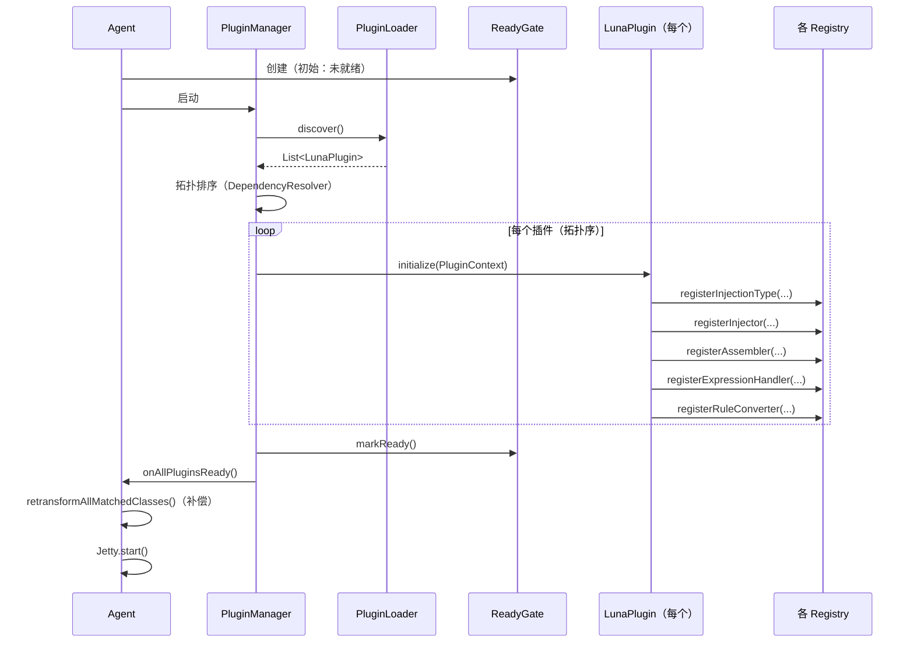
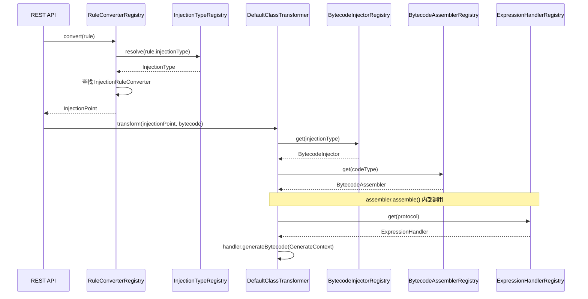

# Luna 插件化架构重新设计 v2.0

> **版本**: 2.0
> **基于**: 技术架构设计 v2.0 + 插件化架构设计 v1.0（问题修订版）
> **日期**: 2026/05/11

---

## 0. 原设计问题清单与本次修订对照

| # | 原设计问题 | 本次设计方案 |
|---|-----------|------------|
| 1 | `CodeType` 从 `enum` 改为 `RegisterableType` 后，持久化 JSON 兼容性完全未提及 | § 3.5：保持名称字符串不变，静态常量自注册，JSON 格式零改动 |
| 2 | 插件 ClassLoader 隔离策略完全缺失 | § 4：两层 ClassLoader 方案，社区插件可选独立 ClassLoader |
| 3 | `PluginContext.getSpy()` 返回 `LunaSpy` 实例（纯静态类，无实例） | § 3.2：替换为 `LogEmitter` 接口，屏蔽静态实现细节 |
| 4 | `RuleConverter` 命名冲突（现有同名类 vs 新接口） | § 3.4：新接口命名为 `InjectionRuleConverter`；原类拆解消除 |
| 5 | `ExpressionHandler` 直接暴露 ASM `MethodVisitor`，社区门槛过高 | § 3.3：新增 `GenerateContext` + `BytecodeHelper` 高层 API |
| 6 | `registerCodeType` 与 `registerAssembler` 分离，可出现不完整注册 | § 3.2：合并为 `registerAssembler(CodeType, BytecodeAssembler)`，原子操作 |
| 7 | `getControllers()` 返回 `List<Object>`，无类型安全 | § 3.1：返回 `List<LunaController>`，标记接口保障类型安全 |
| 8 | `RuleClassFileTransformer` 与插件初始化存在并发竞态 | § 5：启动屏障（`ReadyGate`），插件全部就绪后才开启 Transform |
| 9 | `FieldWatchPlugin` 示例用匿名子类，与正文的显式子类不一致 | § 3.4：`InjectionType` 提供 `of()` 工厂方法，统一用法 |
| 10 | 内置插件依赖关系图不完整 | § 6：完整依赖图 + 逐插件说明 |

---

## 1. 架构总览

```
┌───────────────────────────────────────────────────────────────────┐
│                      Luna Plugin Platform                         │
│                                                                   │
│  ┌─────────────────────────────────────────────────────────────┐  │
│  │                    框架层 (Framework)                        │  │
│  │                                                             │  │
│  │  Registry 体系  │  ASM 基础设施  │  表达式引擎  │  规则引擎  │  │
│  │  启动屏障 Gate  │  类分析 / 反编译  │  LunaSpy 桥梁        │  │
│  └──────────────────────────────┬──────────────────────────────┘  │
│                                 │ Plugin SPI                      │
│  ┌──────────────────────────────▼──────────────────────────────┐  │
│  │                    插件层 (Plugins)                          │  │
│  │                                                             │  │
│  │  method-injection │ line-injection │ log │ snapshot │ trace │  │
│  │  conditional-breakpoint │ [社区插件 A] │ [社区插件 B] ...   │  │
│  └─────────────────────────────────────────────────────────────┘  │
└───────────────────────────────────────────────────────────────────┘
```

**核心原则**：
1. **微内核**：框架层只提供基础设施，不包含任何业务逻辑
2. **开闭原则**：新增注入类型 / 表达式协议，零修改框架代码
3. **可观测启动**：插件全量就绪后字节码转换才开始工作，杜绝竞态

---

## 2. 扩展点总览

插件通过 `PluginContext` 向框架注册以下 6 类扩展点：

| 扩展点 | 注册方法 | 对应 Registry | 解决的问题 |
|--------|---------|--------------|-----------|
| 注入类型 | `registerInjectionType(InjectionType)` | `InjectionTypeRegistry` | 消除枚举封闭 |
| 字节码注入器 + 代码类型（原子） | `registerAssembler(CodeType, BytecodeAssembler)` | `BytecodeAssemblerRegistry` | 消除不完整注册 |
| 字节码注入器 | `registerInjector(InjectionType, BytecodeInjector)` | `BytecodeInjectorRegistry` | 同上 |
| 表达式协议处理器 | `registerExpressionHandler(ExpressionHandler)` | `ExpressionHandlerRegistry` | 消除 `switch` 硬编码 |
| 规则转换器 | `registerRuleConverter(InjectionType, InjectionRuleConverter)` | `RuleConverterRegistry` | 消除 `instanceof` 硬编码 |
| REST 控制器 | `getControllers()` | `DispatcherServlet` | 插件自带 API |
| 规则模板 | `getTemplates()` | `TemplateRegistry` | 插件自带模板 |

---

## 3. 核心 API 设计

### 3.1 LunaPlugin 接口

```java
/**
 * Luna 插件接口。
 *
 * 发现机制：Java SPI
 *   META-INF/services/fun.efto.luna.core.plugin.LunaPlugin
 */
public interface LunaPlugin {

    /** 插件唯一 ID，如 "method-injection"，全局不重复 */
    String getId();

    String getDisplayName();
    String getVersion();
    String getAuthor();

    /** 分类：injection / observability / debug / performance */
    String getCategory();

    /**
     * 声明依赖的其他插件 ID。
     * PluginManager 按拓扑顺序初始化，循环依赖启动失败。
     */
    default List<String> getDependencies() {
        return Collections.emptyList();
    }

    /**
     * 插件初始化入口，在此注册所有扩展点。
     * 框架保证：调用此方法前，所有 getDependencies() 中的插件已完成初始化。
     */
    void initialize(PluginContext context);

    default void destroy() {}

    /**
     * 插件提供的 REST 控制器。
     * 返回实现了 {@link LunaController} 标记接口、
     * 且标注了 @Controller/@RequestMapping 注解的对象列表。
     */
    default List<LunaController> getControllers() {
        return Collections.emptyList();
    }

    /** 插件提供的规则模板，框架自动注册到 TemplateRegistry */
    default List<RuleTemplate> getTemplates() {
        return Collections.emptyList();
    }
}

/**
 * 类型安全标记接口：所有插件 Controller 必须实现此接口。
 * 替代原设计中裸 Object 的 getControllers() 返回值。
 */
public interface LunaController {}
```

---

### 3.2 PluginContext 接口（修订版）

```java
public interface PluginContext {

    // ======== 注入类型 ========

    void registerInjectionType(InjectionType type);

    // ======== 注入器 / 组装器（原子注册）========

    void registerInjector(InjectionType type, BytecodeInjector injector);

    /**
     * 注册代码类型 + 对应组装器（原子操作）。
     * 删除原设计中分离的 registerCodeType / registerAssembler，
     * 防止只注册类型而忘记注册组装器。
     */
    void registerAssembler(CodeType type, BytecodeAssembler assembler);

    // ======== 表达式协议 ========

    void registerExpressionHandler(ExpressionHandler handler);

    // ======== 规则转换 ========

    void registerRuleConverter(InjectionType type, InjectionRuleConverter converter);

    // ======== 框架服务 ========

    ClassAnalyzer getClassAnalyzer();
    Decompiler getDecompiler();

    /**
     * 获取日志发射器（替代原设计中暴露 LunaSpy 实例的错误设计）。
     * LunaSpy 是纯静态类，此接口屏蔽该细节，也便于单元测试。
     */
    LogEmitter getLogEmitter();

    RingBuffer<String> getLogBuffer();
    Instrumentation getInstrumentation();
}

/**
 * 日志发射器抽象接口，替代直接调用 LunaSpy 静态方法。
 * 框架默认实现委托给 LunaSpy；测试时可注入 Mock。
 */
public interface LogEmitter {
    void emitLog(String message);
    void emitSnapshot(String pointId, Object[] values, String[] names);
    void emitTraceStart();
    void emitTraceEnd(String className, String methodName, long thresholdMs);
    void emitTraceAlert(String className, String methodName, long thresholdMs);
}
```

---

### 3.3 ExpressionHandler + GenerateContext（社区友好改进）

**原设计问题**：`generateBytecode(MethodVisitor, ...)` 直接暴露 ASM API，要求插件开发者掌握 ASM 的 Visitor 编程模型。

**新设计**：引入 `GenerateContext`，提供两个层次的 API：

```java
/**
 * 表达式协议处理器。
 *
 * 常见协议（log/snapshot/trace）只需调用 ctx.helper() 的高层 API；
 * 高级协议可通过 ctx.mv() 直接操作原始 ASM MethodVisitor。
 */
public interface ExpressionHandler {

    /** 协议名称，如 "log", "snapshot", "trace"，全局唯一 */
    String getProtocol();

    /**
     * 生成字节码。
     *
     * @param ctx 生成上下文，包含高层 Helper 和原始 ASM 访问能力
     */
    void generateBytecode(GenerateContext ctx);
}

/**
 * 字节码生成上下文——两层 API：
 *   - helper()：高层语义 API，80% 场景够用，无需 ASM 知识
 *   - mv()    ：原始 ASM MethodVisitor，剩余 20% 高级场景使用
 */
public interface GenerateContext {

    /** 协议体内容，如 "start"、"end:100"、"userId > 0 && name" */
    String expression();

    /** 当前注入上下文（含局部变量信息、注入点信息） */
    AsmInjectionContext asmContext();

    /** 是否携带条件前缀 ${...}:: */
    boolean hasCondition();

    /** 高层字节码 Helper，推荐社区插件优先使用 */
    BytecodeHelper helper();

    /** 原始 ASM MethodVisitor（高级用法，转义舱口） */
    MethodVisitor mv();
}

/**
 * 高层字节码辅助 API，封装常见的字节码生成模式。
 */
public interface BytecodeHelper {

    /** 加载第 N 个方法参数（1-based）到操作数栈 */
    void loadArgument(int paramIndex);

    /** 按名称加载当前作用域内的局部变量 */
    void loadLocalVar(String varName);

    /** 压入字符串常量 */
    void loadString(String value);

    /** 压入 long 常量 */
    void loadLong(long value);

    /**
     * 生成 String.format 调用。
     * template 中 {0}、{1} 对应 varRefs 列表中的变量引用。
     * varRef 格式：
     *   "$1"       → 第 1 个方法参数
     *   "$varName" → 名为 varName 的局部变量
     */
    void buildFormattedString(String template, List<String> varRefs);

    /**
     * 生成静态方法调用，并自动弹出所需参数（调用前需先将参数压栈）。
     *
     * @param owner      类的内部名，如 "fun/efto/luna/core/spy/LunaSpy"
     * @param name       方法名
     * @param descriptor 方法描述符，如 "(Ljava/lang/String;)V"
     */
    void invokeStatic(String owner, String name, String descriptor);

    /** 生成 void 返回（RETURN 指令） */
    void returnVoid();
}
```

**实际使用对比**：

```java
// ---- 原设计（需要熟悉 ASM）----
public void generateBytecode(MethodVisitor mv, String expression,
                              AsmInjectionContext context, boolean hasCondition) {
    mv.visitLdcInsn(context.getInjectionPoint().getTarget().getClassName());
    mv.visitLdcInsn(context.getInjectionPoint().getTarget().getMethodName());
    mv.visitLdcInsn(parseThreshold(expression.substring(4)));
    mv.visitMethodInsn(INVOKESTATIC, "fun/efto/luna/core/spy/LunaSpy",
        "onTraceEnd", "(Ljava/lang/String;Ljava/lang/String;J)V", false);
}

// ---- 新设计（使用高层 API）----
public void generateBytecode(GenerateContext ctx) {
    String className  = ctx.asmContext().getInjectionPoint().getTarget().getClassName();
    String methodName = ctx.asmContext().getInjectionPoint().getTarget().getMethodName();
    long   threshold  = parseThreshold(ctx.expression().substring(4));

    BytecodeHelper h = ctx.helper();
    h.loadString(className);
    h.loadString(methodName);
    h.loadLong(threshold);
    h.invokeStatic("fun/efto/luna/core/spy/LunaSpy",
        "onTraceEnd", "(Ljava/lang/String;Ljava/lang/String;J)V");
}
```

---

### 3.4 InjectionRuleConverter（重命名 + 接口化）

**原设计问题**：`luna-core` 已有 `RuleConverter` 类，新设计又定义同名接口，导致命名冲突。

**处理方案**：
- 原 `RuleConverter` 类的职责**拆解消除**（不重命名，直接替换）：
  - `resolveInjectionType()` → 迁移至 `InjectionTypeRegistry.resolve()`
  - `hasProtocolPrefix()` → 迁移至 `ExpressionHandlerRegistry.hasProtocol()`
  - 各类型的 convert 逻辑 → 分散至各插件的 `InjectionRuleConverter` 实现
- 新接口命名为 `InjectionRuleConverter`（避免冲突，含义更精确）

```java
/**
 * 注入规则转换器策略。
 * 每种 InjectionType 由对应的插件提供一个实现。
 *
 * 命名特意区别于原 RuleConverter 类，避免歧义。
 */
public interface InjectionRuleConverter {

    /**
     * 将持久化规则转换为运行时注入点。
     *
     * @param rule 数据库/JSON 中的持久化规则
     * @return 运行时注入点
     */
    InjectionPoint convert(InjectionRule rule);
}
```

---

### 3.5 InjectionType 工厂方法（统一用法）

**原设计问题**：`FieldWatchPlugin` 示例用匿名子类 `new InjectionType("field_access", "...") {}`，而 `MethodInjectionType` 使用显式子类，用法不一致。

**处理方案**：`InjectionType` 提供 `of()` 工厂方法；子类仅在需要**携带额外状态**（如 `lineNumber`）时才有意义。

```java
public abstract class InjectionType {

    private final String name;
    private final String description;
    private final List<String> aliases;

    protected InjectionType(String name, String description, String... aliases) {
        this.name = name;
        this.description = description;
        this.aliases = aliases.length > 0
            ? Arrays.asList(aliases)
            : Collections.emptyList();
    }

    /**
     * 工厂方法：创建无额外状态的通用注入类型。
     * 社区插件应优先使用此方法，而非自定义子类。
     *
     * 示例：
     *   InjectionType fieldAccess = InjectionType.of("field_access", "字段访问注入");
     */
    public static InjectionType of(String name, String description, String... aliases) {
        return new InjectionType(name, description, aliases) {};
    }

    public String getName() { return name; }
    public String getDescription() { return description; }
    public List<String> getAliases() { return aliases; }

    @Override
    public boolean equals(Object o) {
        if (this == o) return true;
        if (!(o instanceof InjectionType)) return false;
        return name.equals(((InjectionType) o).name);
    }

    @Override
    public int hashCode() { return name.hashCode(); }
}

// 内置具体子类（携带额外状态）
public final class LineNumberInjectionType extends InjectionType {
    public static final LineNumberInjectionType BEFORE =
        new LineNumberInjectionType("line_before", "行号前注入", "LINE_BEFORE");
    public static final LineNumberInjectionType AFTER  =
        new LineNumberInjectionType("line_after",  "行号后注入", "LINE_AFTER");

    // ... 携带 lineNumber 等额外字段
    private int lineNumber;
    public LineNumberInjectionType withLineNumber(int n) { ... }
}
```

---

### 3.6 CodeType 平滑迁移方案（持久化兼容）

**核心原则**：名称字符串保持不变（`"JAVA"` / `"EXPRESSION"` / `"SNAPSHOT"`），JSON 文件格式零改动。

```java
/**
 * 代码类型，从 enum 迁移为 RegisterableType。
 *
 * 迁移关键：静态常量的 name 与原 enum 常量名完全相同，
 * 保证 JSON 序列化 / 反序列化行为不变。
 *
 * 对比：
 *   Before: enum CodeType { JAVA, EXPRESSION, SNAPSHOT }
 *   After:  class CodeType with static final CodeType JAVA = new CodeType("JAVA", ...)
 *
 * JSON 存储前后均为 "JAVA"、"EXPRESSION"、"SNAPSHOT"，无需迁移文件。
 */
public final class CodeType extends RegisterableType<CodeType> {

    // ===== 内置类型（名称与原 enum 常量一致）=====
    public static final CodeType JAVA       = new CodeType("JAVA",       "Java 源码注入");
    public static final CodeType EXPRESSION = new CodeType("EXPRESSION", "表达式注入");
    public static final CodeType SNAPSHOT   = new CodeType("SNAPSHOT",   "快照注入");

    // 静态初始化块确保内置类型在类加载时即注册，
    // 不依赖任何插件初始化顺序。
    static {
        JAVA.register();
        EXPRESSION.register();
        SNAPSHOT.register();
    }

    public CodeType(String name, String description) {
        super(name, description);
    }

    public static CodeType valueOf(String name) {
        return REGISTRY.get(name);  // 统一查找入口
    }
}
```

**与旧 enum 用法对比**：

| 旧代码（enum） | 新代码（RegisterableType） | 是否需要修改 |
|--------------|--------------------------|------------|
| `CodeType.EXPRESSION` | `CodeType.EXPRESSION` | 否 |
| `switch (codeType)` | `if/else` 或 `Map` 分发 | 是（必须改） |
| `codeType.name()` | `codeType.getName()` | 是（小改） |
| `CodeType.valueOf("EXPRESSION")` | `CodeType.valueOf("EXPRESSION")` | 否 |
| JSON `"codeType": "EXPRESSION"` | JSON `"codeType": "EXPRESSION"` | 否 |

> **注意**：项目内所有 `switch(codeType)` 语句必须替换为 `BytecodeAssemblerRegistry.get(codeType)` 的 Map 查找。迁移阶段 2 重点处理此问题。

---

## 4. ClassLoader 隔离方案

### 4.1 ClassLoader 层次结构

```
Bootstrap ClassLoader
    │
    ├── System ClassLoader（目标应用 + 目标业务代码）
    │       │
    │       └── LunaAgentClassLoader（Luna 框架 + 内置插件）
    │               │
    │               ├── PluginClassLoader-A（社区插件 A，可选）
    │               └── PluginClassLoader-B（社区插件 B，可选）
    │
    └── Bootstrap 搜索路径（LunaSpy，全局可见）
```

### 4.2 分级策略

| 插件类型 | ClassLoader | 理由 |
|---------|-------------|------|
| **内置插件**（method/line/log/snapshot/trace） | `LunaAgentClassLoader`（与框架同级） | 零额外开销，无外部依赖 |
| **社区插件**（无外部依赖） | `LunaAgentClassLoader`（追加 URL） | 简单，直接放入 `luna-plugins/` 目录 |
| **社区插件**（有外部依赖，如 Groovy） | `PluginClassLoader`（父 = `LunaAgentClassLoader`） | 隔离依赖冲突 |

### 4.3 社区插件加载流程

```java
public class PluginLoader {

    private final LunaAgentClassLoader agentClassLoader;
    private final Path pluginsDir;

    /**
     * 发现并加载所有插件。
     *
     * 加载策略：
     * 1. 扫描 luna-plugins/ 目录下所有 jar
     * 2. 读取 jar MANIFEST.MF 中的 Luna-Plugin-Isolated 属性
     *    - "true"  → 创建独立 PluginClassLoader（隔离外部依赖）
     *    - "false" → 追加到 LunaAgentClassLoader（默认）
     * 3. 通过 ServiceLoader 从对应 ClassLoader 发现 LunaPlugin 实现
     */
    public List<LunaPlugin> discover() {
        List<LunaPlugin> plugins = new ArrayList<>();

        // 1. 从 LunaAgentClassLoader 发现内置插件
        ServiceLoader.load(LunaPlugin.class, agentClassLoader)
            .forEach(plugins::add);

        // 2. 扫描 luna-plugins/ 目录
        if (Files.isDirectory(pluginsDir)) {
            Files.list(pluginsDir)
                .filter(p -> p.toString().endsWith(".jar"))
                .forEach(jar -> loadPluginJar(jar, plugins));
        }

        return plugins;
    }

    private void loadPluginJar(Path jar, List<LunaPlugin> plugins) {
        boolean isolated = isIsolatedPlugin(jar);   // 读 MANIFEST.MF
        ClassLoader cl = isolated
            ? new PluginClassLoader(jar, agentClassLoader)
            : agentClassLoader.appendUrl(jar.toUri().toURL());

        ServiceLoader.load(LunaPlugin.class, cl).forEach(plugins::add);
    }
}
```

> **社区插件打包说明**：
> - 无外部依赖：打普通 jar，直接放入 `luna-plugins/`
> - 有外部依赖：在 `MANIFEST.MF` 中添加 `Luna-Plugin-Isolated: true`，打 fat-jar

---

## 5. 启动时序与并发安全

### 5.1 启动屏障（ReadyGate）

**问题**：`RuleClassFileTransformer` 在 Agent 挂载时即开始工作，若此时插件尚未就绪，`ExpressionHandlerRegistry` / `RuleConverterRegistry` 为空，会直接抛出异常。

**解决方案**：在 `RuleClassFileTransformer` 内置 `ReadyGate`，插件全量就绪前的类加载请求直接放行（不做注入），等就绪后对已加载的类触发一次补偿 retransform。

```java
/**
 * 启动屏障：协调插件初始化与字节码转换的时序。
 */
public final class ReadyGate {

    private volatile boolean ready = false;

    /** PluginManager 完成所有插件初始化后调用 */
    public void markReady() {
        this.ready = true;
    }

    public boolean isReady() {
        return ready;
    }
}

public class RuleClassFileTransformer implements ClassFileTransformer {

    private final ReadyGate gate;
    private final RuleManager ruleManager;

    @Override
    public byte[] transform(ClassLoader loader, String className,
                            Class<?> classBeingRedefined,
                            ProtectionDomain domain, byte[] bytecode) {
        // 屏障：插件未就绪，直接放行
        if (!gate.isReady()) {
            return null;
        }
        // 仅处理新加载的类（非 retransform）
        if (classBeingRedefined != null) {
            return null;
        }
        // ... 正常规则注入逻辑
    }
}
```

### 5.2 完整启动时序

```
Agent.agentmain()
    │
    ├─ 1. 框架层初始化
    │       ├── Registry 体系（空注册表）
    │       ├── ReadyGate（未就绪）
    │       ├── LunaSpy / RingBuffer
    │       └── RuleClassFileTransformer 注册（屏障关闭，不工作）
    │
    ├─ 2. 插件发现
    │       └── PluginLoader.discover() → 拓扑排序
    │
    ├─ 3. 插件初始化（按拓扑序）
    │       └── for each plugin: plugin.initialize(context)
    │               └── 各 Registry 被填充
    │
    ├─ 4. Web 层启动
    │       └── 收集 plugin.getControllers() → DispatcherServlet
    │
    ├─ 5. ReadyGate.markReady()           ← 开启 Transform 屏障
    │
    ├─ 6. 补偿 retransform
    │       └── RuleManager.retransformAllMatchedClasses()
    │           （处理步骤 3 之前已加载的目标类）
    │
    └─ 7. Jetty Web Server 启动
```

---

## 6. 框架层关键组件

### 6.1 InjectionTypeRegistry（消除 resolveInjectionType 三处重复）

```java
/**
 * 注入类型统一注册与查找。
 * 替代原来散落在 3 处的 resolveInjectionType() 独立实现。
 */
public final class InjectionTypeRegistry {

    private static final Map<String, InjectionType> REGISTRY = new ConcurrentHashMap<>();

    public static void register(InjectionType type) {
        REGISTRY.put(type.getName().toLowerCase(), type);
        type.getAliases().forEach(alias ->
            REGISTRY.put(alias.toLowerCase(), type));
    }

    /**
     * 按名称（大小写不敏感）查找注入类型。
     * 支持规范名（"line_before"）和历史别名（"LINE_BEFORE"）。
     *
     * @throws IllegalArgumentException 如果类型未注册
     */
    public static InjectionType resolve(String name) {
        InjectionType type = REGISTRY.get(name.toLowerCase());
        if (type == null) {
            throw new IllegalArgumentException(
                "未知注入类型: " + name + "，已注册类型: " + REGISTRY.keySet());
        }
        return type;
    }

    public static Optional<InjectionType> find(String name) {
        return Optional.ofNullable(REGISTRY.get(name.toLowerCase()));
    }
}
```

### 6.2 ExpressionHandlerRegistry（消除 switch 硬编码）

```java
public final class ExpressionHandlerRegistry {

    private static final Map<String, ExpressionHandler> HANDLERS = new ConcurrentHashMap<>();

    public static void register(ExpressionHandler handler) {
        HANDLERS.put(handler.getProtocol(), handler);
    }

    public static ExpressionHandler get(String protocol) {
        return HANDLERS.get(protocol);
    }

    /**
     * 判断内容是否以已注册的协议前缀开头（"log:", "trace:", 等）。
     * 替代原 RuleConverter 中硬编码的 hasProtocolPrefix()。
     */
    public static boolean hasProtocol(String content) {
        if (content == null || content.isEmpty()) return false;
        int colon = content.indexOf(':');
        if (colon <= 0) return false;
        return HANDLERS.containsKey(content.substring(0, colon));
    }
}
```

### 6.3 RuleConverterRegistry（消除 instanceof 硬编码）

```java
/**
 * 替代原 RuleConverter 类中的 instanceof + if-else 分发。
 */
public final class RuleConverterRegistry {

    private static final Map<InjectionType, InjectionRuleConverter> REGISTRY =
        new ConcurrentHashMap<>();

    public static void register(InjectionType type, InjectionRuleConverter converter) {
        REGISTRY.put(type, converter);
    }

    public static InjectionPoint convert(InjectionRule rule) {
        InjectionType type = InjectionTypeRegistry.resolve(rule.getInjectionType());
        InjectionRuleConverter converter = REGISTRY.get(type);
        if (converter == null) {
            throw new IllegalStateException(
                "没有找到类型 [" + type.getName() + "] 对应的规则转换器，"
                + "请确认提供该注入类型的插件已正确加载");
        }
        return converter.convert(rule);
    }
}
```

---

## 7. 内置插件清单与依赖图

### 7.1 依赖图

```
（无依赖）
    ├── method-injection-plugin
    └── line-injection-plugin

（依赖注入插件）
    ├── log-plugin          （无强依赖，可配合任意注入类型使用）
    ├── snapshot-plugin     （无强依赖，通常配合 line-injection 使用）
    └── trace-plugin        （依赖 method-injection，模板需要 ENTER/EXIT 类型）

（依赖多个）
    └── conditional-breakpoint-plugin （依赖 snapshot-plugin + line-injection-plugin）
```

> **说明**：`log-plugin` / `snapshot-plugin` 仅注册 `ExpressionHandler`，表达式处理器与注入类型正交，不存在强依赖。`getDependencies()` 仅声明需要在自己之前初始化的插件，如果模板或转换器需要依赖某种注入类型，再声明。

### 7.2 各插件职责表

| 插件 ID | 注册内容 | 提供模板 |
|---------|---------|---------|
| `method-injection` | `MethodInjectionType`（ENTER/EXIT/AROUND）+ 对应注入器 + `MethodInjectionRuleConverter` | 无 |
| `line-injection` | `LineNumberInjectionType`（BEFORE/AFTER）+ 对应注入器 + `LineInjectionRuleConverter` | 无 |
| `log` | `LogExpressionHandler`（协议 `"log"`）+ `CodeType.EXPRESSION` + 对应 Assembler | `method-access-log` |
| `snapshot` | `SnapshotExpressionHandler`（协议 `"snapshot"`）+ `CodeType.SNAPSHOT` + 对应 Assembler | `line-snapshot` |
| `trace` | `TraceExpressionHandler`（协议 `"trace"`）| `method-timing`、`method-timing-threshold`、`slow-method-alert` |
| `conditional-breakpoint` | 无新类型（复用 snapshot + line-injection） | `conditional-breakpoint` |

### 7.3 方法注入插件示例（完整代码）

```java
public class MethodInjectionPlugin implements LunaPlugin {

    @Override public String getId()          { return "method-injection"; }
    @Override public String getDisplayName() { return "方法注入"; }
    @Override public String getVersion()     { return "1.0.0"; }
    @Override public String getAuthor()      { return "Luna Core Team"; }
    @Override public String getCategory()    { return "injection"; }

    @Override
    public void initialize(PluginContext ctx) {
        // 注册注入类型（同时注册别名，兼容旧规则文件中的大写格式）
        ctx.registerInjectionType(MethodInjectionType.ENTER);
        ctx.registerInjectionType(MethodInjectionType.EXIT);
        ctx.registerInjectionType(MethodInjectionType.AROUND);

        // 注册注入器
        ctx.registerInjector(MethodInjectionType.ENTER,  new EnterMethodInjector());
        ctx.registerInjector(MethodInjectionType.EXIT,   new ExitMethodInjector());
        ctx.registerInjector(MethodInjectionType.AROUND, new AroundMethodInjector());

        // 注册规则转换器（一个转换器服务三种类型）
        InjectionRuleConverter methodConverter = new MethodInjectionRuleConverter();
        ctx.registerRuleConverter(MethodInjectionType.ENTER,  methodConverter);
        ctx.registerRuleConverter(MethodInjectionType.EXIT,   methodConverter);
        ctx.registerRuleConverter(MethodInjectionType.AROUND, methodConverter);
    }
}
```

### 7.4 Trace 插件示例（使用新 GenerateContext API）

```java
public class TracePlugin implements LunaPlugin {

    @Override public String getId()          { return "trace"; }
    @Override public String getDisplayName() { return "方法耗时追踪"; }
    @Override public String getVersion()     { return "1.0.0"; }
    @Override public String getAuthor()      { return "Luna Core Team"; }
    @Override public String getCategory()    { return "performance"; }

    @Override
    public List<String> getDependencies() {
        return Arrays.asList("method-injection");
    }

    @Override
    public void initialize(PluginContext ctx) {
        ctx.registerExpressionHandler(new TraceExpressionHandler(ctx.getLogEmitter()));
    }

    @Override
    public List<RuleTemplate> getTemplates() {
        return Arrays.asList(
            BuiltinTemplates.methodTiming(),
            BuiltinTemplates.methodTimingThreshold(),
            BuiltinTemplates.slowMethodAlert()
        );
    }
}

public class TraceExpressionHandler implements ExpressionHandler {

    private final LogEmitter logEmitter;

    public TraceExpressionHandler(LogEmitter logEmitter) {
        this.logEmitter = logEmitter;
    }

    @Override public String getProtocol() { return "trace"; }

    @Override
    public void generateBytecode(GenerateContext ctx) {
        String expr      = ctx.expression();
        BytecodeHelper h = ctx.helper();
        String className  = ctx.asmContext().getInjectionPoint().getTarget().getClassName();
        String methodName = ctx.asmContext().getInjectionPoint().getTarget().getMethodName();

        if ("start".equals(expr)) {
            h.invokeStatic("fun/efto/luna/core/spy/LunaSpy",
                "onTraceStart", "()V");

        } else if (expr.startsWith("end:")) {
            long threshold = Long.parseLong(expr.substring(4));
            h.loadString(className);
            h.loadString(methodName);
            h.loadLong(threshold);
            h.invokeStatic("fun/efto/luna/core/spy/LunaSpy",
                "onTraceEnd", "(Ljava/lang/String;Ljava/lang/String;J)V");

        } else if (expr.startsWith("alert:")) {
            long threshold = Long.parseLong(expr.substring(6));
            h.loadString(className);
            h.loadString(methodName);
            h.loadLong(threshold);
            h.invokeStatic("fun/efto/luna/core/spy/LunaSpy",
                "onTraceAlert", "(Ljava/lang/String;Ljava/lang/String;J)V");
        }
    }
}
```

### 7.5 社区插件示例（字段监控，统一使用 `InjectionType.of()`）

```java
public class FieldWatchPlugin implements LunaPlugin {

    // 使用工厂方法，不再需要匿名子类
    private static final InjectionType FIELD_ACCESS =
        InjectionType.of("field_access", "字段访问注入", "FIELD_ACCESS");

    @Override public String getId()          { return "field-watch"; }
    @Override public String getDisplayName() { return "字段访问监控"; }
    @Override public String getVersion()     { return "1.0.0"; }
    @Override public String getAuthor()      { return "Community"; }
    @Override public String getCategory()    { return "observability"; }

    @Override
    public void initialize(PluginContext ctx) {
        ctx.registerInjectionType(FIELD_ACCESS);
        ctx.registerInjector(FIELD_ACCESS, new FieldAccessInjector());
        ctx.registerExpressionHandler(new FieldExpressionHandler());
        ctx.registerRuleConverter(FIELD_ACCESS, new FieldRuleConverter());
    }
}
```

---

## 8. 包结构

### 8.1 luna-core（框架层）

```
fun.efto.luna.core
│
├── plugin/                             # 插件框架
│   ├── LunaPlugin.java                 # 插件接口
│   ├── LunaController.java             # 控制器标记接口（类型安全）
│   ├── PluginContext.java              # 插件访问框架的门户
│   ├── PluginManager.java              # 插件生命周期管理
│   ├── PluginLoader.java               # SPI + 目录扫描加载器
│   ├── PluginDependencyResolver.java   # 拓扑排序（Kahn 算法）
│   ├── PluginClassLoader.java          # 社区插件隔离 ClassLoader
│   ├── ReadyGate.java                  # 启动屏障
│   └── LogEmitter.java                 # 日志发射抽象（替代直接用 LunaSpy）
│
├── framework/                          # 框架基础设施
│   ├── asm/                            # ASM 基础设施
│   │   ├── AsmInjectionContext.java
│   │   ├── ClassLoaderAwareClassWriter.java
│   │   ├── LocalVariableScanner.java
│   │   ├── Constants.java
│   │   └── TreeApiBytecodeHelper.java
│   ├── decompile/                      # 反编译抽象
│   │   ├── Decompiler.java
│   │   ├── CfrDecompiler.java
│   │   └── DecompilerFactory.java
│   ├── analyzer/                       # 类分析抽象
│   │   ├── ClassAnalyzer.java
│   │   ├── AbstractAnalyzer.java
│   │   ├── AnalyzerRegistry.java
│   │   └── ClassAnalysisResult.java
│   ├── buffer/
│   │   └── RingBuffer.java
│   ├── expression/                     # 条件表达式引擎（不变）
│   │   ├── ConditionRegistry.java
│   │   ├── parser/, ast/, bytecode/, context/
│   ├── registry/                       # 注册体系基础
│   │   ├── Registry.java
│   │   ├── TypeRegistry.java
│   │   ├── BaseType.java
│   │   └── RegisterableType.java
│   └── spy/
│       ├── LunaSpy.java                # 不变，仍为纯静态类
│       └── DefaultLogEmitter.java      # LogEmitter 的默认实现（委托 LunaSpy）
│
├── injection/                          # 注入模型（框架层抽象）
│   ├── InjectionPoint.java
│   ├── InjectionType.java              # 含 of() 工厂方法
│   ├── InjectionTypeRegistry.java      # 统一类型查找（消除 3 处重复）
│   ├── CodeType.java                   # 从 enum 改为 RegisterableType（持久化兼容）
│   ├── BytecodeInjector.java
│   ├── BytecodeAssembler.java
│   ├── BytecodeInjectorRegistry.java
│   ├── BytecodeAssemblerRegistry.java
│   ├── ExpressionHandler.java          # 含 GenerateContext + BytecodeHelper
│   ├── GenerateContext.java
│   ├── BytecodeHelper.java
│   ├── ExpressionHandlerRegistry.java
│   ├── InjectionRuleConverter.java     # 重命名（原 RuleConverter 接口）
│   └── RuleConverterRegistry.java
│
├── rule/
│   ├── InjectionRule.java
│   ├── RuleManager.java
│   ├── RulePersistenceService.java
│   └── template/
│       ├── RuleTemplate.java
│       ├── TemplateEngine.java
│       └── TemplateRegistry.java
│
├── transformer/
│   ├── ClassTransformer.java
│   ├── DefaultClassTransformer.java
│   ├── ClassFileTransformerAdapter.java
│   └── RuleClassFileTransformer.java   # 含 ReadyGate 启动屏障
│
└── ...（其余不变）
```

### 8.2 内置插件包

```
fun.efto.luna.core.plugins
├── method/
│   ├── MethodInjectionPlugin.java
│   ├── MethodInjectionType.java        # 含 ENTER/EXIT/AROUND 常量
│   ├── MethodInjectionRuleConverter.java
│   └── injector/, visitor/
│
├── line/
│   ├── LineInjectionPlugin.java
│   ├── LineNumberInjectionType.java    # 含 BEFORE/AFTER + lineNumber
│   ├── LineInjectionRuleConverter.java
│   └── injector/, visitor/
│
├── log/
│   ├── LogPlugin.java
│   └── LogExpressionHandler.java
│
├── snapshot/
│   ├── SnapshotPlugin.java
│   ├── SnapshotExpressionHandler.java
│   ├── StackFrameCapture.java
│   └── SnapshotSerializer.java
│
├── trace/
│   ├── TracePlugin.java
│   ├── TraceExpressionHandler.java
│   └── BuiltinTemplates.java
│
└── conditional/
    └── ConditionalBreakpointPlugin.java
```

---

## 9. 关键流程

### 9.1 插件发现与初始化



### 9.2 注入执行（插件化后）



---

## 10. 迁移策略（三阶段，渐进式）

### 阶段 1：基础设施准备（不破坏任何现有功能）

| 步骤 | 内容 | 风险 | 验证 |
|------|------|------|------|
| 1.1 | 新增 `plugin/` 包：`LunaPlugin`、`PluginContext`、`LunaController`、`LogEmitter`、`ReadyGate` | 低 | 编译通过即可 |
| 1.2 | 新增 `ExpressionHandlerRegistry` | 低 | 单元测试 |
| 1.3 | 新增 `InjectionTypeRegistry`（含别名支持） | 低 | 单元测试 |
| 1.4 | 新增 `RuleConverterRegistry` | 低 | 单元测试 |
| 1.5 | `InjectionType` 增加 `of()` 工厂方法 | 低 | 编译通过即可 |
| 1.6 | **`CodeType` 从 `enum` 改为 `RegisterableType`** | **中** | 全量替换 `switch`；JSON 序列化回归测试 |
| 1.7 | `MethodInjectionType` / `LineNumberInjectionType` 构造器改为 `public` | 低 | 编译 |

> **1.6 重点说明**：全文搜索 `switch.*codeType` 和 `switch.*CodeType`，逐一替换为 `BytecodeAssemblerRegistry.get(codeType)` 的 Map 查找。`CodeType.valueOf()` 和 JSON 格式不变，不影响持久化。

### 阶段 2：适配层桥接（新旧并存，功能不退化）

| 步骤 | 内容 | 风险 |
|------|------|------|
| 2.1 | `ExpressionBytecodeAssembler` 中的 `switch` 改为委托 `ExpressionHandlerRegistry` | 中 |
| 2.2 | 将 `log`/`snapshot`/`trace` 逻辑提取为独立 `ExpressionHandler` 实现（使用新 `GenerateContext` API） | 中 |
| 2.3 | `RuleConverter` 类逻辑拆解：类型解析 → `InjectionTypeRegistry`，协议判断 → `ExpressionHandlerRegistry` | 中 |
| 2.4 | 各注入类型的 convert 逻辑提取为独立 `InjectionRuleConverter` 实现 | 低 |
| 2.5 | `DefaultInitializer` 改为由 `PluginManager` 驱动：启动内置插件 | 中 |
| 2.6 | `RuleClassFileTransformer` 接入 `ReadyGate` 屏障 | 中 |
| 2.7 | `PluginLoader` 接入 ClassLoader 分级策略 | 中 |

> 阶段 2 全程保持双轨：新 Registry 查找失败时 fallback 到旧逻辑，保证功能不退化。

### 阶段 3：清理旧代码

| 步骤 | 内容 | 风险 |
|------|------|------|
| 3.1 | 删除 `BytecodeInjectorRegistry` 构造器的硬编码注册 | 低 |
| 3.2 | 删除 `BytecodeAssemblerRegistry` 构造器的硬编码注册 | 低 |
| 3.3 | 删除原 `RuleConverter` 类（功能已全量迁移） | 低 |
| 3.4 | 删除 `DefaultInitializer` 中的所有硬编码注册逻辑 | 低 |
| 3.5 | 删除 `Controller` 层残留的 `resolveInjectionType()` 调用 | 中 |
| 3.6 | 删除阶段 2 中的所有 fallback 兼容代码 | 低 |

---

## 11. 性能分析

### 11.1 启动开销

| 操作 | 预估耗时 | 频率 |
|------|---------|------|
| 内置插件 SPI 扫描 | ~3ms | 启动 1 次 |
| 社区插件目录扫描 | ~5ms/10 个 jar | 启动 1 次 |
| 拓扑排序（10 个插件） | < 1ms | 启动 1 次 |
| 插件 `initialize()` 合计 | < 10ms | 启动 1 次 |

**结论**：插件加载总额外开销 < 20ms，在原有 450ms 启动延迟内几乎可忽略。

### 11.2 运行时查找开销

| 操作 | Before | After | 差异 |
|------|--------|-------|------|
| 查找 Injector | `ConcurrentHashMap.get()` | `ConcurrentHashMap.get()` | 无 |
| 查找 Assembler | `ConcurrentHashMap.get()` | `ConcurrentHashMap.get()` | 无 |
| 查找 ExpressionHandler | `switch(String)` O(1) | `ConcurrentHashMap.get()` O(1) | 等价 |
| 查找 RuleConverter | `instanceof` 链 O(n) | `ConcurrentHashMap.get()` O(1) | **更快** |
| 解析 InjectionType | 3 处独立实现（逻辑不一致） | `InjectionTypeRegistry.resolve()` | 一致且正确 |

### 11.3 红线校验（与原架构保持一致）

| 红线 | 结论 |
|------|------|
| 单次插桩判定耗时 < 0.1ms | ✅ 所有新 Registry 均为 O(1) |
| 非侵入性 | ✅ retransform 机制不变 |
| 线程安全 | ✅ 所有 Registry 使用 `ConcurrentHashMap`；`ReadyGate` 使用 `volatile` |
| Bootstrap 类可见性 | ✅ `LunaSpy` 仍为纯静态，位于 Bootstrap 搜索路径，插件通过 `DefaultLogEmitter` 间接使用 |

---

## 12. 社区贡献流程

### 贡献步骤

```
1. 创建 Maven 项目，添加依赖：
   <dependency>
     <groupId>fun.efto.luna</groupId>
     <artifactId>luna-core</artifactId>
     <scope>provided</scope>     ← 运行时已由 Agent 提供，不打入 jar
   </dependency>

2. 实现 LunaPlugin 接口

3. 在 initialize() 中通过 PluginContext 注册扩展点

4. 添加 SPI 声明：
   META-INF/services/fun.efto.luna.core.plugin.LunaPlugin
   → 填写实现类的全限定名

5. 打包：
   - 无外部依赖 → 普通 jar
   - 有外部依赖 → fat-jar + MANIFEST.MF 中添加：Luna-Plugin-Isolated: true

6. 将 jar 放入 luna-plugins/ 目录，重启 Agent
```

### 可扩展维度速查

| 维度 | 接口 | 示例 |
|------|------|------|
| 注入时机 | `InjectionType` + `BytecodeInjector` | 字段访问、构造函数、同步块 |
| 表达式协议 | `ExpressionHandler` | 自定义 metric 协议 |
| 代码类型 | `CodeType` + `BytecodeAssembler` | Groovy 脚本注入 |
| 规则转换 | `InjectionRuleConverter` | 自定义规则格式解析 |
| 规则模板 | `RuleTemplate` | 业务专属模板库 |
| REST API | `LunaController` + `@Controller` | 自定义管理页面 |
| 反编译器 | `Decompiler` | 替换 CFR 为 FernFlower |
| 类分析器 | `ClassAnalyzer` | 基于 Javassist 的分析器 |
