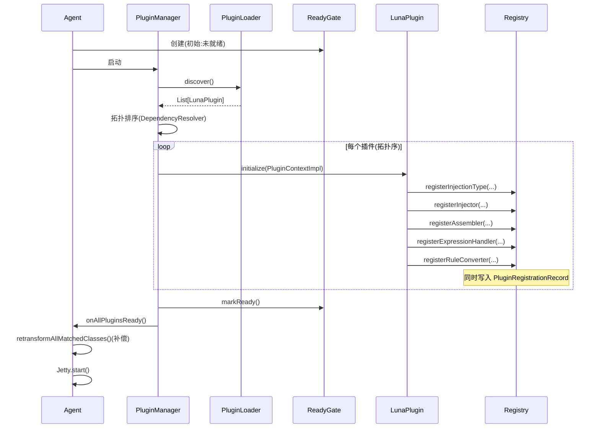
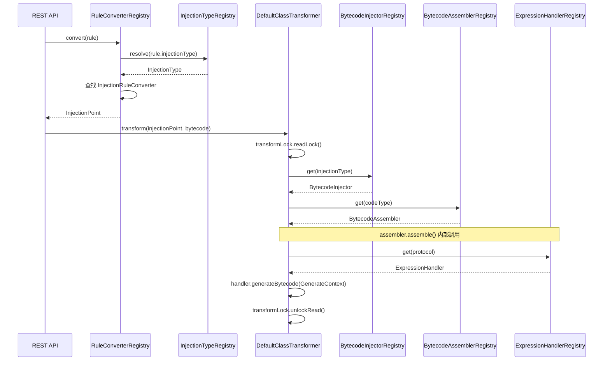
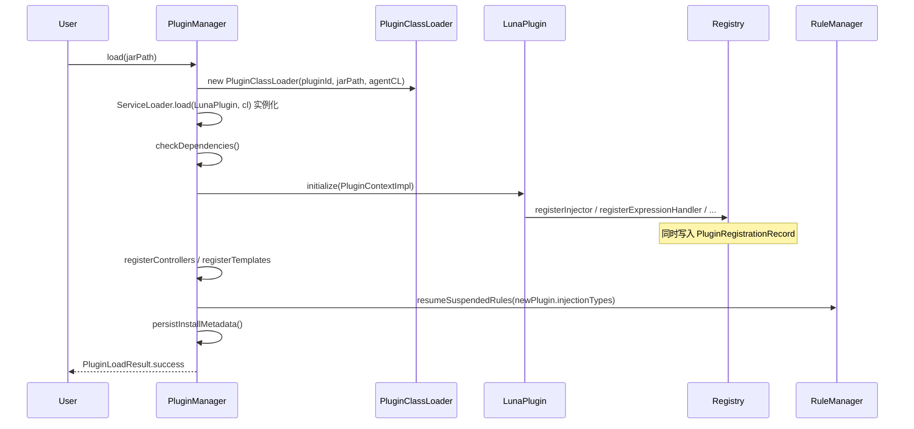
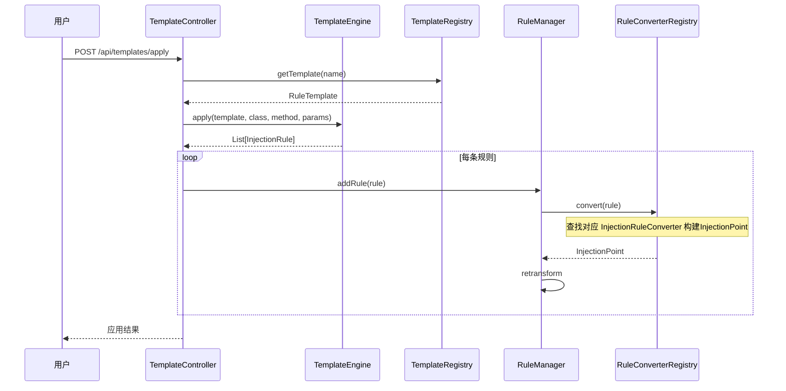
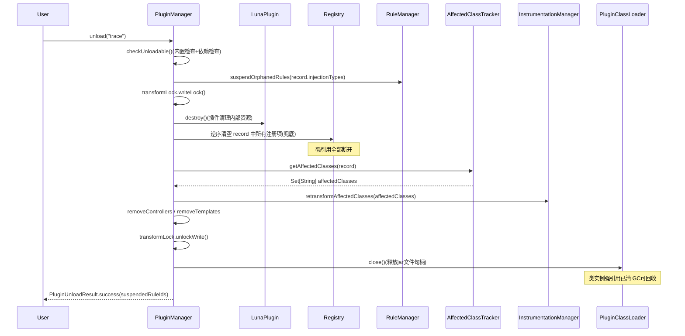
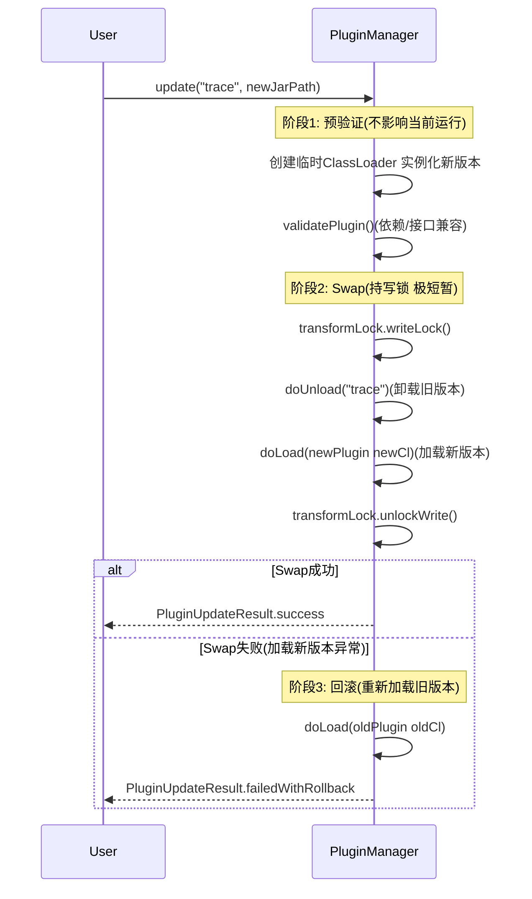
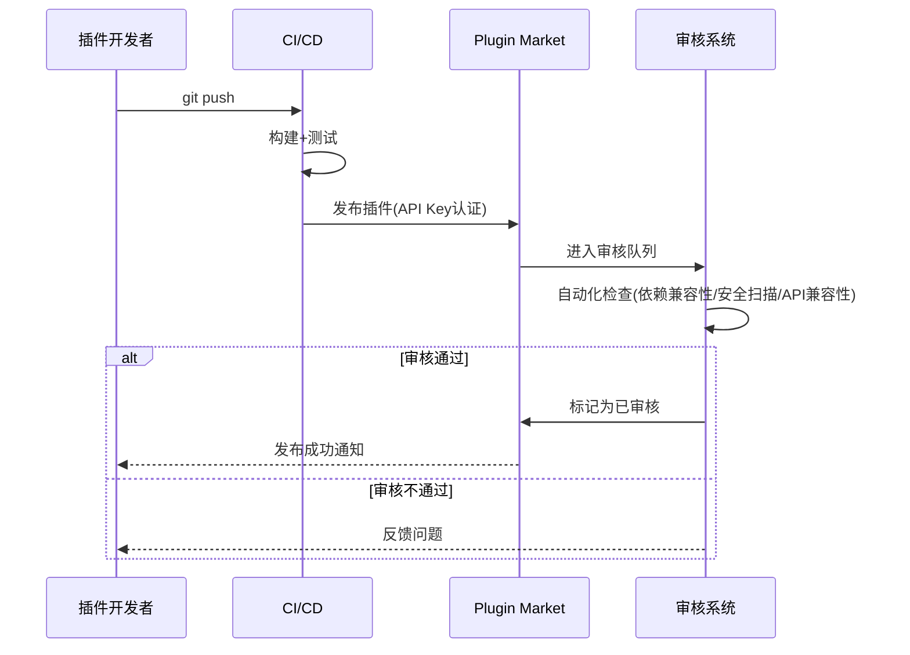

# Luna 插件化架构设计文档 v4.0（终版）

> **版本**: 4.0
> **基于**: v1.0（全景蓝图）+ v2.0（技术修订）+ v3.0（热加载/卸载）
> **作者**: Tony.L
> **日期**: 2026/05/11

***

## 0. 版本演进与问题修订对照

### 0.1 来自 v1.0 的遗留问题（v2.0 修订，v4.0 继承）

| #  | 问题                                                    | 方案                                                        | 所在章节  |
| -- | ----------------------------------------------------- | --------------------------------------------------------- | ----- |
| 1  | `CodeType` 从 enum 改 RegisterableType 后，JSON 持久化兼容性未提及 | 静态常量名称与原 enum 一致，JSON 格式零改动                               | § 3.6 |
| 2  | 插件 ClassLoader 隔离策略缺失                                 | 两层 ClassLoader + child-first + PARENT\_FIRST 前缀           | § 5   |
| 3  | `getSpy()` 返回纯静态类实例                                   | 替换为 `LogEmitter` 接口                                       | § 3.2 |
| 4  | `RuleConverter` 命名冲突                                  | 重命名为 `InjectionRuleConverter`，原类拆解消除                      | § 3.4 |
| 5  | `ExpressionHandler` 直接暴露 ASM API                      | `GenerateContext` + `BytecodeHelper` 高层 API               | § 3.3 |
| 6  | `registerCodeType` 与 `registerAssembler` 分离，可出现不完整注册  | 合并为 `registerAssembler(CodeType, BytecodeAssembler)` 原子操作 | § 3.2 |
| 7  | `getControllers()` 返回 `List<Object>`，无类型安全            | 改为 `List<LunaController>` 标记接口                            | § 3.1 |
| 8  | `RuleClassFileTransformer` 与插件初始化并发竞态                 | `ReadyGate` 启动屏障                                          | § 6   |
| 9  | `FieldWatchPlugin` 匿名子类与显式子类用法不一致                     | `InjectionType.of()` 工厂方法                                 | § 3.5 |
| 10 | 内置插件依赖关系图不完整                                          | 完整依赖图 + 逐插件说明                                             | § 9   |

### 0.2 热加载/卸载专项问题（v3.0 修订，v4.0 继承）

| # | 问题                                        | 方案                                     | 所在章节  |
| - | ----------------------------------------- | -------------------------------------- | ----- |
| A | `destroy()` 靠插件自己 unregister，框架无兜底        | `PluginRegistrationRecord` 自动追踪，框架主导清理 | § 4   |
| B | ClassLoader 关闭后 Registry 强引用无法 GC         | 先清空引用再关 CL，顺序强制                        | § 8.2 |
| C | `update()` 非原子，unload 成功 + load 失败 → 插件消失 | 三阶段原子热更新，失败自动回滚                        | § 8.4 |
| D | 卸载中并发竞态                                   | `StampedLock` 读写分离                     | § 8.5 |
| E | 规则孤儿问题                                    | 规则挂起/恢复机制                              | § 8.6 |
| F | 重启后已安装插件不会自动恢复                            | 启动时扫描 `~/.luna/plugins/`               | § 5.3 |
| G | `PluginContext` 暴露 `unregister*` 方法放错位置   | unregister 从 PluginContext 移除，框架主导     | § 4.2 |
| H | 内置插件无法防止被误卸载                              | `isBuiltin()` 标记 + PluginManager 拦截    | § 8.7 |
| I | `PluginLoadResult/UnloadResult` 未定义       | 完整定义                                   | § 8.1 |

### 0.3 v4.0 新增补充

| # | 补充内容                             | 来源      | 所在章节   |
| - | -------------------------------- | ------- | ------ |
| α | Before/After 代码对比（用 v4 新 API 重写） | v1 亮点恢复 | § 11   |
| β | 模板应用完整流程                         | v1 亮点恢复 | § 10.3 |
| γ | `PluginLifecycleListener` 事件消费说明 | 新增      | § 8.8  |
| δ | 卸载后 retransform 范围计算             | 新增      | § 8.9  |
| ε | `InstrumentationManager` 框架层组件   | 代码库已有但设计遗漏 | § 7.4 |
| ζ | `BytecodeCache` 原始字节码缓存         | 代码库已有但设计遗漏 | § 7.5 |
| η | `ConfigManager` 配置管理             | 代码库和设计均缺失 | § 7.6 |
| θ | `LunaWebServer` Web 基础设施        | 设计多处提及但框架层未定义 | § 7.7 |
| ι | 前端扩展点体系（4 个 EP，数据驱动） | 前端完全硬编码，无法响应后端插件化 | § 17 |

***

## 1. 背景与目标

### 1.1 现状问题

当前 Luna 的所有功能（方法注入、行号注入、快照、trace）硬编码在 `luna-core` 中：

| 问题          | 具体表现                                                                                          |
| ----------- | --------------------------------------------------------------------------------------------- |
| **扩展性差**    | 新增注入类型需修改 7+ 个文件（InjectionType 枚举、Registry 构造器、DefaultInitializer、RuleConverter、Controller 等） |
| **注册逻辑重复**  | BytecodeInjectorRegistry 构造器与 DefaultInitializer 双重注册同一映射                                     |
| **分发逻辑硬编码** | ExpressionBytecodeAssembler 中 `switch("log"/"snapshot"/"trace")` 无法扩展                         |
| **类型体系封闭**  | InjectionType 私有构造器 + static final 常量，CodeType 是 enum，外部无法扩展                                  |
| **层次穿透**    | Controller 层直接 new 核心领域对象，包含 ASM 逻辑                                                           |
| **解析逻辑重复**  | `resolveInjectionType()` 在 3 处独立实现，行为不一致                                                      |

### 1.2 目标架构

```
┌───────────────────────────────────────────────────────────────────┐
│                       Luna Plugin Platform                        │
│                                                                   │
│  ┌───────────────────────────────────────────────────────────┐   │
│  │                     框架层 (Framework)                     │   │
│  │                                                           │   │
│  │  Plugin Lifecycle  │  Registry 体系  │  ReadyGate 屏障    │   │
│  │  Registration Tracker  │  StampedLock  │  Config Manager  │   │
│  │  ASM 基础设施  │  反编译/类分析  │  表达式引擎  │  规则引擎 │   │
│  │  InstrumentationManager  │  BytecodeCache  │  Web Server  │   │
│  └─────────────────────────────┬─────────────────────────────┘   │
│                                 │ Plugin SPI / Dynamic Load       │
│  ┌──────────────────────────────▼──────────────────────────────┐  │
│  │                     插件层 (Plugins)                        │   │
│  │  [内置，不可卸载]                   [动态，可热加载/卸载]    │   │
│  │  method │ line │ log │ snapshot    社区插件 A / B / ...      │   │
│  │  trace  │ conditional-breakpoint                             │   │
│  └─────────────────────────────────────────────────────────────┘  │
└───────────────────────────────────────────────────────────────────┘
```

### 1.3 设计原则

1. **微内核 + 插件**：框架只提供基础设施，所有业务功能以插件形式存在
2. **开闭原则**：新增注入类型/表达式协议/模板，零修改框架代码
3. **隔离性**：插件之间互不依赖，可独立加载/卸载
4. **动态性**：支持运行时加载/卸载/热更新插件，无需重启 Agent
5. **社区友好**：一个插件 = 一个 jar + 一个 SPI 声明，贡献门槛最低
6. **市场生态**：提供插件市场，用户可一键浏览、安装、更新插件
7. **可观测启动**：插件全量就绪后字节码转换才开始工作，杜绝竞态
8. **框架主导清理**：卸载时框架根据注册快照兜底，不依赖插件自觉

***

## 2. 插件状态机

```
            load()           initialize() 完成
UNLOADED ──────────► LOADING ─────────────────► ACTIVE
              │                                    │  ▲
    失败，自动 rollback                        unload() │ enable()
              │                                    │  │
              │                              UNLOADING  │ DISABLED
              │                                    │  │
              └────────────────────────────────────┘  │
                                         (CL 关闭)    │
                                                └─────┘
                                             disable()
```

| 状态          | 说明                                       |
| ----------- | ---------------------------------------- |
| `LOADING`   | 正在创建 ClassLoader、实例化、调用 `initialize()`   |
| `ACTIVE`    | 完全就绪，扩展点已注册，参与业务                         |
| `DISABLED`  | 已禁用，扩展点仍注册但不参与注入（读锁跳过）                   |
| `UNLOADING` | 正在执行 `destroy()`、清空 Registry、retransform |

**关键约束**：

- 处于 `UNLOADING` 状态的插件，框架拒绝新的注入请求使用其扩展点
- 处于 `DISABLED` 状态的插件，`DefaultClassTransformer` 跳过其注册的 InjectionType
- `LOADING` 失败时自动 rollback（关闭 ClassLoader，不残留）

***

## 3. 核心 API 设计

### 3.1 LunaPlugin 接口

```java
/**
 * @author : Tony.L(<286269159@qq.com>)
 * @since  : 2026/05/11 22:00
 */
public interface LunaPlugin {

    /** 插件唯一 ID，如 "method-injection"，全局不重复 */
    String getId();

    /** 人类可读名称 */
    String getDisplayName();

    /** 插件版本 */
    String getVersion();

    /** 插件作者 */
    String getAuthor();

    /** 分类：injection / observability / debug / performance */
    String getCategory();

    /**
     * 声明依赖的其他插件 ID。
     * PluginManager 按拓扑顺序初始化，循环依赖启动失败。
     */
    default List<String> getDependencies() {
        return Collections.emptyList();
    }

    /**
     * 插件初始化入口，在此注册所有扩展点。
     * 框架保证：调用此方法前，所有 getDependencies() 中的插件已完成初始化。
     */
    void initialize(PluginContext context);

    /**
     * 插件销毁——仅负责清理插件内部资源（线程、连接、缓存等）。
     * Registry 清理由框架根据 PluginRegistrationRecord 自动完成，
     * 插件不需要也不应该手动 unregister。
     */
    default void destroy() {}

    /**
     * 插件提供的 REST 控制器。
     * 返回实现了 LunaController 标记接口、
     * 且标注了 @Controller/@RequestMapping 注解的对象列表。
     */
    default List<LunaController> getControllers() {
        return Collections.emptyList();
    }

    /** 插件提供的规则模板，框架自动注册到 TemplateRegistry */
    default List<RuleTemplate> getTemplates() {
        return Collections.emptyList();
    }

    /**
     * 是否为内置插件（不可卸载）。
     * 内置插件：method-injection、line-injection、log、snapshot、trace
     */
    default boolean isBuiltin() { return false; }
}

/**
 * 类型安全标记接口：所有插件 Controller 必须实现此接口。
 * 替代裸 Object 的 getControllers() 返回值，编译期即可发现类型错误。
 */
public interface LunaController {}
```

***

### 3.2 PluginContext 接口

```java
/**
 * @author : Tony.L(<286269159@qq.com>)
 * @since  : 2026/05/11 22:00
 */
public interface PluginContext {

    // ======== 注入类型 ========

    void registerInjectionType(InjectionType type);

    // ======== 注入器 / 组装器（原子注册）========

    void registerInjector(InjectionType type, BytecodeInjector injector);

    /**
     * 注册代码类型 + 对应组装器（原子操作）。
     * 删除分离的 registerCodeType / registerAssembler，
     * 防止只注册类型而忘记注册组装器。
     */
    void registerAssembler(CodeType type, BytecodeAssembler assembler);

    // ======== 表达式协议 ========

    void registerExpressionHandler(ExpressionHandler handler);

    // ======== 规则转换 ========

    void registerRuleConverter(InjectionType type, InjectionRuleConverter converter);

    // ======== 框架服务 ========

    ClassAnalyzer getClassAnalyzer();
    Decompiler getDecompiler();

    /**
     * 获取日志发射器（替代直接暴露 LunaSpy 静态类）。
     * LunaSpy 是纯静态类，此接口屏蔽该细节，也便于单元测试。
     */
    LogEmitter getLogEmitter();

    RingBuffer<String> getLogBuffer();
    Instrumentation getInstrumentation();

    /**
     * 获取插件专属配置。
     * 配置文件路径: ~/.luna/config/plugins/{pluginId}.properties
     */
    Map<String, String> getPluginConfig();

    // ======== 无任何 unregister* 方法 ========
    // 卸载清理由框架根据 PluginRegistrationRecord 自动完成
}

/**
 * 日志发射器抽象接口，替代直接调用 LunaSpy 静态方法。
 * 框架默认实现委托给 LunaSpy；测试时可注入 Mock。
 */
public interface LogEmitter {
    void emitLog(String message);
    void emitSnapshot(String pointId, Object[] values, String[] names);
    void emitTraceStart();
    void emitTraceEnd(String className, String methodName, long thresholdMs);
    void emitTraceAlert(String className, String methodName, long thresholdMs);
}
```

***

### 3.3 ExpressionHandler + GenerateContext（社区友好）

**原设计问题**：`generateBytecode(MethodVisitor, ...)` 直接暴露 ASM API，要求插件开发者掌握 Visitor 编程模型。

**新设计**：引入 `GenerateContext`，提供两个层次的 API：

```java
/**
 * @author : Tony.L(<286269159@qq.com>)
 * @since  : 2026/05/11 22:00
 */
public interface ExpressionHandler {

    /** 协议名称，如 "log", "snapshot", "trace"，全局唯一 */
    String getProtocol();

    /**
     * 生成字节码。
     *
     * @param ctx 生成上下文，包含高层 Helper 和原始 ASM 访问能力
     */
    void generateBytecode(GenerateContext ctx);
}

/**
 * 字节码生成上下文——两层 API：
 *   - helper()：高层语义 API，80% 场景够用，无需 ASM 知识
 *   - mv()    ：原始 ASM MethodVisitor，剩余 20% 高级场景使用
 */
public interface GenerateContext {

    /** 协议体内容，如 "start"、"end:100"、"userId > 0 && name" */
    String expression();

    /** 当前注入上下文（含局部变量信息、注入点信息） */
    AsmInjectionContext asmContext();

    /** 是否携带条件前缀 ${...}:: */
    boolean hasCondition();

    /** 高层字节码 Helper，推荐社区插件优先使用 */
    BytecodeHelper helper();

    /** 原始 ASM MethodVisitor（高级用法，转义舱口） */
    MethodVisitor mv();
}

/**
 * 高层字节码辅助 API，封装常见的字节码生成模式。
 */
public interface BytecodeHelper {

    /** 加载第 N 个方法参数（1-based）到操作数栈 */
    void loadArgument(int paramIndex);

    /** 按名称加载当前作用域内的局部变量 */
    void loadLocalVar(String varName);

    /** 压入字符串常量 */
    void loadString(String value);

    /** 压入 long 常量 */
    void loadLong(long value);

    /**
     * 生成 String.format 调用。
     * template 中 {0}、{1} 对应 varRefs 列表中的变量引用。
     * varRef 格式：
     *   "$1"       → 第 1 个方法参数
     *   "$varName" → 名为 varName 的局部变量
     */
    void buildFormattedString(String template, List<String> varRefs);

    /**
     * 生成静态方法调用。
     *
     * @param owner      类的内部名，如 "fun/efto/luna/core/spy/LunaSpy"
     * @param name       方法名
     * @param descriptor 方法描述符
     */
    void invokeStatic(String owner, String name, String descriptor);

    /** 生成 void 返回（RETURN 指令） */
    void returnVoid();
}
```

**实际使用对比**：

```java
// ---- 旧代码（需要熟悉 ASM）----
public void generateBytecode(MethodVisitor mv, String expression,
                              AsmInjectionContext context, boolean hasCondition) {
    mv.visitLdcInsn(context.getInjectionPoint().getTarget().getClassName());
    mv.visitLdcInsn(context.getInjectionPoint().getTarget().getMethodName());
    mv.visitLdcInsn(parseThreshold(expression.substring(4)));
    mv.visitMethodInsn(INVOKESTATIC, "fun/efto/luna/core/spy/LunaSpy",
        "onTraceEnd", "(Ljava/lang/String;Ljava/lang/String;J)V", false);
}

// ---- 新代码（使用高层 API）----
public void generateBytecode(GenerateContext ctx) {
    String className  = ctx.asmContext().getInjectionPoint().getTarget().getClassName();
    String methodName = ctx.asmContext().getInjectionPoint().getTarget().getMethodName();
    long   threshold  = parseThreshold(ctx.expression().substring(4));

    BytecodeHelper h = ctx.helper();
    h.loadString(className);
    h.loadString(methodName);
    h.loadLong(threshold);
    h.invokeStatic("fun/efto/luna/core/spy/LunaSpy",
        "onTraceEnd", "(Ljava/lang/String;Ljava/lang/String;J)V");
}
```

***

### 3.4 InjectionRuleConverter（重命名 + 接口化）

**原设计问题**：`luna-core` 已有 `RuleConverter` 类，新设计又定义同名接口，导致命名冲突。

**处理方案**：

- 原 `RuleConverter` 类的职责**拆解消除**（不重命名，直接替换）：
  - `resolveInjectionType()` → 迁移至 `InjectionTypeRegistry.resolve()`
  - `hasProtocolPrefix()` → 迁移至 `ExpressionHandlerRegistry.hasProtocol()`
  - 各类型的 convert 逻辑 → 分散至各插件的 `InjectionRuleConverter` 实现
- 新接口命名为 `InjectionRuleConverter`（避免冲突，含义更精确）

```java
/**
 * @author : Tony.L(<286269159@qq.com>)
 * @since  : 2026/05/11 22:00
 */
public interface InjectionRuleConverter {

    /**
     * 将持久化规则转换为运行时注入点。
     *
     * @param rule 数据库/JSON 中的持久化规则
     * @return 运行时注入点
     */
    InjectionPoint convert(InjectionRule rule);
}
```

***

### 3.5 InjectionType 工厂方法（统一用法）

```java
/**
 * @author : Tony.L(<286269159@qq.com>)
 * @since  : 2026/05/11 22:00
 */
public abstract class InjectionType {

    private final String name;
    private final String description;
    private final List<String> aliases;

    protected InjectionType(String name, String description, String... aliases) {
        this.name = name;
        this.description = description;
        this.aliases = aliases.length > 0
            ? Arrays.asList(aliases)
            : Collections.emptyList();
    }

    /**
     * 工厂方法：创建无额外状态的通用注入类型。
     * 社区插件应优先使用此方法，而非自定义子类。
     *
     * 示例：
     *   InjectionType fieldAccess = InjectionType.of("field_access", "字段访问注入");
     */
    public static InjectionType of(String name, String description, String... aliases) {
        return new InjectionType(name, description, aliases) {};
    }

    public String getName() { return name; }
    public String getDescription() { return description; }
    public List<String> getAliases() { return aliases; }

    @Override
    public boolean equals(Object o) {
        if (this == o) return true;
        if (!(o instanceof InjectionType)) return false;
        return name.equals(((InjectionType) o).name);
    }

    @Override
    public int hashCode() { return name.hashCode(); }
}

// 内置具体子类（携带额外状态）
public final class LineNumberInjectionType extends InjectionType {
    public static final LineNumberInjectionType BEFORE =
        new LineNumberInjectionType("line_before", "行号前注入", "LINE_BEFORE");
    public static final LineNumberInjectionType AFTER  =
        new LineNumberInjectionType("line_after",  "行号后注入", "LINE_AFTER");

    private int lineNumber;
    public LineNumberInjectionType withLineNumber(int n) {
        this.lineNumber = n;
        return this;
    }
    public int getLineNumber() { return lineNumber; }
}
```

***

### 3.6 CodeType 平滑迁移方案（持久化兼容）

**核心原则**：名称字符串保持不变（`"JAVA"` / `"EXPRESSION"` / `"SNAPSHOT"`），JSON 文件格式零改动。

```java
/**
 * @author : Tony.L(<286269159@qq.com>)
 * @since  : 2026/05/11 22:00
 */
public final class CodeType extends RegisterableType<CodeType> {

    // ===== 内置类型（名称与原 enum 常量一致）=====
    public static final CodeType JAVA       = new CodeType("JAVA",       "Java 源码注入");
    public static final CodeType EXPRESSION = new CodeType("EXPRESSION", "表达式注入");
    public static final CodeType SNAPSHOT   = new CodeType("SNAPSHOT",   "快照注入");

    // 静态初始化块确保内置类型在类加载时即注册，
    // 不依赖任何插件初始化顺序。
    static {
        JAVA.register();
        EXPRESSION.register();
        SNAPSHOT.register();
    }

    public CodeType(String name, String description) {
        super(name, description);
    }

    public static CodeType valueOf(String name) {
        return REGISTRY.get(name);
    }
}
```

**与旧 enum 用法对比**：

| 旧代码（enum）                        | 新代码（RegisterableType）            | 是否需要修改 |
| -------------------------------- | -------------------------------- | ------ |
| `CodeType.EXPRESSION`            | `CodeType.EXPRESSION`            | 否      |
| `switch (codeType)`              | `if/else` 或 `Map` 分发             | 是（必须改） |
| `codeType.name()`                | `codeType.getName()`             | 是（小改）  |
| `CodeType.valueOf("EXPRESSION")` | `CodeType.valueOf("EXPRESSION")` | 否      |
| JSON `"codeType": "EXPRESSION"`  | JSON `"codeType": "EXPRESSION"`  | 否      |

> **注意**：项目内所有 `switch(codeType)` 语句必须替换为 `BytecodeAssemblerRegistry.get(codeType)` 的 Map 查找。

***

## 4. 框架主导的注册追踪

### 4.1 PluginRegistrationRecord

框架为每个插件维护一份注册快照，无需依赖插件的 `destroy()` 正确撤销注册：

```java
/**
 * @author : Tony.L(<286269159@qq.com>)
 * @since  : 2026/05/11 22:00
 */
final class PluginRegistrationRecord {

    private final String pluginId;

    // 有序记录，确保逆序卸载
    final List<InjectionType>                            injectionTypes    = new CopyOnWriteArrayList<>();
    final Map<InjectionType, BytecodeInjector>           injectors         = new LinkedHashMap<>();
    final Map<CodeType, BytecodeAssembler>               assemblers        = new LinkedHashMap<>();
    final List<ExpressionHandler>                        expressionHandlers = new ArrayList<>();
    final Map<InjectionType, InjectionRuleConverter>     ruleConverters    = new LinkedHashMap<>();
    final List<RuleTemplate>                             templates         = new ArrayList<>();
    final List<LunaController>                           controllers       = new ArrayList<>();

    PluginRegistrationRecord(String pluginId) {
        this.pluginId = pluginId;
    }

    String getPluginId() { return pluginId; }
}
```

### 4.2 PluginContext 移除 unregister\*

`PluginContext` 的 `unregister*` 方法**全部移除**。框架通过 `PluginRegistrationRecord` 完成清理，插件不应也不需要手动 unregister。

### 4.3 PluginContextImpl 双写（Registry + Record）

```java
/**
 * @author : Tony.L(<286269159@qq.com>)
 * @since  : 2026/05/11 22:00
 */
class PluginContextImpl implements PluginContext {

    private final PluginRegistrationRecord record;
    private final LogEmitter logEmitter;
    private final RingBuffer<String> logBuffer;
    private final Instrumentation instrumentation;
    private final ClassAnalyzer classAnalyzer;
    private final Decompiler decompiler;

    PluginContextImpl(PluginRegistrationRecord record, ...) {
        this.record = record;
        // ...
    }

    @Override
    public void registerInjectionType(InjectionType type) {
        InjectionTypeRegistry.register(type);
        record.injectionTypes.add(type);
    }

    @Override
    public void registerInjector(InjectionType type, BytecodeInjector injector) {
        BytecodeInjectorRegistry.register(type, injector);
        record.injectors.put(type, injector);
    }

    @Override
    public void registerAssembler(CodeType type, BytecodeAssembler assembler) {
        BytecodeAssemblerRegistry.register(type, assembler);
        record.assemblers.put(type, assembler);
    }

    @Override
    public void registerExpressionHandler(ExpressionHandler handler) {
        ExpressionHandlerRegistry.register(handler);
        record.expressionHandlers.add(handler);
    }

    @Override
    public void registerRuleConverter(InjectionType type, InjectionRuleConverter converter) {
        RuleConverterRegistry.register(type, converter);
        record.ruleConverters.put(type, converter);
    }

    @Override public LogEmitter getLogEmitter() { return logEmitter; }
    @Override public RingBuffer<String> getLogBuffer() { return logBuffer; }
    @Override public Instrumentation getInstrumentation() { return instrumentation; }
    @Override public ClassAnalyzer getClassAnalyzer() { return classAnalyzer; }
    @Override public Decompiler getDecompiler() { return decompiler; }
}
```

***

## 5. ClassLoader 隔离方案

### 5.1 ClassLoader 层次结构

```
Bootstrap ClassLoader  (LunaSpy，全局可见)
        │
System ClassLoader  (目标应用)
        │
LunaAgentClassLoader  (框架 + 内置插件)
        │
        ├── PluginClassLoader-A  (社区插件 A，child-first)
        └── PluginClassLoader-B  (社区插件 B，child-first)
```

### 5.2 分级策略

| 插件类型                                     | ClassLoader                                     | 理由                         |
| ---------------------------------------- | ----------------------------------------------- | -------------------------- |
| **内置插件**（method/line/log/snapshot/trace） | `LunaAgentClassLoader`（与框架同级）                   | 零额外开销，无外部依赖                |
| **社区插件**（无外部依赖）                          | `LunaAgentClassLoader`（追加 URL）                  | 简单，直接放入 `luna-plugins/` 目录 |
| **社区插件**（有外部依赖，如 Groovy）                 | `PluginClassLoader`（父 = `LunaAgentClassLoader`） | 隔离依赖冲突                     |

### 5.3 PluginClassLoader：child-first 隔离

```java
/**
 * @author : Tony.L(<286269159@qq.com>)
 * @since  : 2026/05/11 22:00
 */
public final class PluginClassLoader extends URLClassLoader {

    private final String pluginId;

    // 框架包前缀列表：这些类必须从父加载，避免类型转换异常
    private static final List<String> PARENT_FIRST_PREFIXES = Arrays.asList(
        "fun.efto.luna.core.",
        "java.", "javax.", "sun.", "com.sun."
    );

    public PluginClassLoader(String pluginId, URL[] urls, ClassLoader parent) {
        super(urls, parent);
        this.pluginId = pluginId;
    }

    @Override
    protected Class<?> loadClass(String name, boolean resolve) throws ClassNotFoundException {
        if (PARENT_FIRST_PREFIXES.stream().anyMatch(name::startsWith)) {
            return super.loadClass(name, resolve);
        }
        synchronized (getClassLoadingLock(name)) {
            Class<?> loaded = findLoadedClass(name);
            if (loaded != null) return loaded;
            try {
                Class<?> found = findClass(name);
                if (resolve) resolveClass(found);
                return found;
            } catch (ClassNotFoundException e) {
                return super.loadClass(name, resolve);
            }
        }
    }

    String getPluginId() { return pluginId; }
}
```

### 5.4 启动时扫描已安装插件

Agent 启动时，除扫描 SPI 外，还自动扫描持久化目录：

```java
/**
 * @author : Tony.L(<286269159@qq.com>)
 * @since  : 2026/05/11 22:00
 */
public class PluginLoader {

    private static final Path PLUGINS_DIR =
        Paths.get(System.getProperty("user.home"), ".luna", "plugins");

    private final LunaAgentClassLoader agentClassLoader;

    public PluginLoader(LunaAgentClassLoader agentClassLoader) {
        this.agentClassLoader = agentClassLoader;
    }

    /**
     * 发现并加载所有插件。
     *
     * 加载策略：
     * 1. 从 LunaAgentClassLoader 发现内置插件
     * 2. 扫描 ~/.luna/plugins/ 目录下所有 jar
     * 3. 读取 jar MANIFEST.MF 中的 Luna-Plugin-Isolated 属性
     *    - "true"  → 创建独立 PluginClassLoader（隔离外部依赖）
     *    - "false" → 追加到 LunaAgentClassLoader（默认）
     * 4. 通过 ServiceLoader 从对应 ClassLoader 发现 LunaPlugin 实现
     */
    public List<LunaPlugin> discover() {
        List<LunaPlugin> plugins = new ArrayList<>();

        // 1. 内置插件
        ServiceLoader.load(LunaPlugin.class, agentClassLoader)
            .forEach(plugins::add);

        // 2. 已安装插件：扫描 ~/.luna/plugins/**/*.jar
        if (Files.isDirectory(PLUGINS_DIR)) {
            try (Stream<Path> dirs = Files.list(PLUGINS_DIR)) {
                dirs.filter(Files::isDirectory).forEach(pluginDir -> {
                    findLatestJar(pluginDir).ifPresent(j -> loadFromJar(j, plugins));
                });
            } catch (IOException e) {
                log.error("扫描插件目录失败", e);
            }
        }
        return plugins;
    }

    private void loadFromJar(Path jarPath, List<LunaPlugin> out) {
        try {
            boolean isolated = isIsolatedPlugin(jarPath);
            ClassLoader cl = isolated
                ? new PluginClassLoader(
                    jarPath.getParent().getFileName().toString(),
                    new URL[]{ jarPath.toUri().toURL() },
                    agentClassLoader)
                : agentClassLoader.appendUrl(jarPath.toUri().toURL());

            ServiceLoader.load(LunaPlugin.class, cl).forEach(out::add);
        } catch (Exception e) {
            log.error("加载插件 jar 失败: {}", jarPath, e);
        }
    }

    private boolean isIsolatedPlugin(Path jarPath) {
        // 读取 MANIFEST.MF 中的 Luna-Plugin-Isolated 属性
        try (JarFile jar = new JarFile(jarPath.toFile())) {
            Attributes attrs = jar.getManifest().getMainAttributes();
            return "true".equalsIgnoreCase(attrs.getValue("Luna-Plugin-Isolated"));
        } catch (Exception e) {
            return false;
        }
    }
}
```

> **社区插件打包说明**：
>
> - 无外部依赖：打普通 jar，直接放入 `luna-plugins/`
> - 有外部依赖：在 `MANIFEST.MF` 中添加 `Luna-Plugin-Isolated: true`，打 fat-jar

***

## 6. 启动时序与并发安全

### 6.1 启动屏障（ReadyGate）

**问题**：`RuleClassFileTransformer` 在 Agent 挂载时即开始工作，若此时插件尚未就绪，Registry 为空，会直接抛异常。

**解决方案**：在 `RuleClassFileTransformer` 内置 `ReadyGate`，插件全量就绪前的类加载请求直接放行，等就绪后对已加载的类触发一次补偿 retransform。

```java
/**
 * @author : Tony.L(<286269159@qq.com>)
 * @since  : 2026/05/11 22:00
 */
public final class ReadyGate {

    private volatile boolean ready = false;

    /** PluginManager 完成所有插件初始化后调用 */
    public void markReady() {
        this.ready = true;
    }

    public boolean isReady() {
        return ready;
    }
}
```

```java
/**
 * @author : Tony.L(<286269159@qq.com>)
 * @since  : 2026/05/11 22:00
 */
public class RuleClassFileTransformer implements ClassFileTransformer {

    private final ReadyGate gate;
    private final RuleManager ruleManager;

    @Override
    public byte[] transform(ClassLoader loader, String className,
                            Class<?> classBeingRedefined,
                            ProtectionDomain domain, byte[] bytecode) {
        if (!gate.isReady()) {
            return null;
        }
        if (classBeingRedefined != null) {
            return null;
        }
        // ... 正常规则注入逻辑
    }
}
```

### 6.2 完整启动时序

```
Agent.agentmain()
    │
    ├─ 1. 框架层初始化
    │       ├── Registry 体系（空注册表）
    │       ├── ReadyGate（未就绪）
    │       ├── StampedLock
    │       ├── LunaSpy / RingBuffer
    │       └── RuleClassFileTransformer 注册（屏障关闭，不工作）
    │
    ├─ 2. 插件发现
    │       ├── ServiceLoader 扫描内置插件
    │       ├── 扫描 ~/.luna/plugins/ 已安装插件
    │       └── PluginLoader.discover() → 拓扑排序
    │
    ├─ 3. 插件初始化（按拓扑序）
    │       └── for each plugin: plugin.initialize(PluginContextImpl)
    │               └── 各 Registry 被填充（双写 Record）
    │
    ├─ 4. Web 层启动
    │       └── 收集 plugin.getControllers() → DispatcherServlet
    │
    ├─ 5. ReadyGate.markReady()           ← 开启 Transform 屏障
    │
    ├─ 6. 补偿 retransform
    │       └── RuleManager.retransformAllMatchedClasses()
    │           （处理步骤 3 之前已加载的目标类）
    │
    └─ 7. Jetty Web Server 启动
```

### 6.3 插件发现与初始化时序图



***

## 7. 框架层关键组件

### 7.1 InjectionTypeRegistry（消除 resolveInjectionType 三处重复）

```java
/**
 * @author : Tony.L(<286269159@qq.com>)
 * @since  : 2026/05/11 22:00
 */
public final class InjectionTypeRegistry {

    private static final Map<String, InjectionType> REGISTRY = new ConcurrentHashMap<>();

    public static void register(InjectionType type) {
        REGISTRY.put(type.getName().toLowerCase(), type);
        type.getAliases().forEach(alias ->
            REGISTRY.put(alias.toLowerCase(), type));
    }

    /**
     * 按名称（大小写不敏感）查找注入类型。
     *
     * @throws IllegalArgumentException 如果类型未注册
     */
    public static InjectionType resolve(String name) {
        InjectionType type = REGISTRY.get(name.toLowerCase());
        if (type == null) {
            throw new IllegalArgumentException(
                "未知注入类型: " + name + "，已注册类型: " + REGISTRY.keySet());
        }
        return type;
    }

    public static Optional<InjectionType> find(String name) {
        return Optional.ofNullable(REGISTRY.get(name.toLowerCase()));
    }

    /** 按插件卸载时批量移除 */
    public static void unregisterAll(Collection<InjectionType> types) {
        types.forEach(t -> {
            REGISTRY.remove(t.getName().toLowerCase());
            t.getAliases().forEach(a -> REGISTRY.remove(a.toLowerCase()));
        });
    }
}
```

### 7.2 ExpressionHandlerRegistry（消除 switch 硬编码）

```java
/**
 * @author : Tony.L(<286269159@qq.com>)
 * @since  : 2026/05/11 22:00
 */
public final class ExpressionHandlerRegistry {

    private static final Map<String, ExpressionHandler> HANDLERS = new ConcurrentHashMap<>();

    public static void register(ExpressionHandler handler) {
        HANDLERS.put(handler.getProtocol(), handler);
    }

    public static ExpressionHandler get(String protocol) {
        return HANDLERS.get(protocol);
    }

    /**
     * 判断内容是否以已注册的协议前缀开头。
     * 替代原 RuleConverter 中硬编码的 hasProtocolPrefix()。
     */
    public static boolean hasProtocol(String content) {
        if (content == null || content.isEmpty()) return false;
        int colon = content.indexOf(':');
        if (colon <= 0) return false;
        return HANDLERS.containsKey(content.substring(0, colon));
    }

    /** 按插件卸载时批量移除 */
    public static void unregisterAll(Collection<ExpressionHandler> handlers) {
        handlers.forEach(h -> HANDLERS.remove(h.getProtocol()));
    }
}
```

### 7.3 RuleConverterRegistry（消除 instanceof 硬编码）

```java
/**
 * @author : Tony.L(<286269159@qq.com>)
 * @since  : 2026/05/11 22:00
 */
public final class RuleConverterRegistry {

    private static final Map<InjectionType, InjectionRuleConverter> REGISTRY =
        new ConcurrentHashMap<>();

    public static void register(InjectionType type, InjectionRuleConverter converter) {
        REGISTRY.put(type, converter);
    }

    public static InjectionPoint convert(InjectionRule rule) {
        InjectionType type = InjectionTypeRegistry.resolve(rule.getInjectionType());
        InjectionRuleConverter converter = REGISTRY.get(type);
        if (converter == null) {
            throw new IllegalStateException(
                "没有找到类型 [" + type.getName() + "] 对应的规则转换器，"
                + "请确认提供该注入类型的插件已正确加载");
        }
        return converter.convert(rule);
    }

    /** 按插件卸载时批量移除 */
    public static void unregisterAll(Map<InjectionType, InjectionRuleConverter> entries) {
        entries.keySet().forEach(REGISTRY::remove);
    }
}
```

### 7.4 InstrumentationManager（retransform 核心依赖）

管理 `java.lang.instrument.Instrumentation` 实例，提供 retransform 能力。插件卸载时依赖此类恢复原始字节码。

```java
/**
 * @author : Tony.L(<286269159@qq.com>)
 * @since  : 2026/05/11 22:00
 */
public final class InstrumentationManager {

    private static Instrumentation instrumentation;

    public static void init(Instrumentation inst) {
        instrumentation = inst;
    }

    public static Instrumentation getInstrumentation() {
        return instrumentation;
    }

    /**
     * 对指定类集合执行 retransform，恢复原始字节码。
     * 卸载插件时调用，移除该插件注入的字节码。
     *
     * @param classNames 需要恢复的类全限定名集合
     */
    public static void retransformClasses(Set<String> classNames) {
        if (instrumentation == null || classNames.isEmpty()) return;
        List<Class<?>> classes = new ArrayList<>();
        for (Class<?> clazz : instrumentation.getAllLoadedClasses()) {
            if (classNames.contains(clazz.getName())) {
                classes.add(clazz);
            }
        }
        if (!classes.isEmpty()) {
            instrumentation.retransformClasses(classes.toArray(new Class<?>[0]));
        }
    }
}
```

### 7.5 BytecodeCache（原始字节码缓存）

缓存类的原始字节码，供卸载插件时 retransform 恢复使用。无此缓存则无法恢复被注入类的原始状态。

```java
/**
 * @author : Tony.L(<286269159@qq.com>)
 * @since  : 2026/05/11 22:00
 */
public final class BytecodeCache {

    private static final ConcurrentHashMap<String, byte[]> CACHE = new ConcurrentHashMap<>();

    /**
     * 在首次 transform 前缓存原始字节码。
     * RuleClassFileTransformer.transform() 入口处调用。
     */
    public static void putIfAbsent(String className, byte[] originalBytecode) {
        CACHE.putIfAbsent(className, originalBytecode);
    }

    /**
     * 获取原始字节码（供 retransform 恢复使用）。
     */
    public static byte[] getOriginal(String className) {
        return CACHE.get(className);
    }

    /**
     * 移除缓存（类被卸载时调用）。
     */
    public static void remove(String className) {
        CACHE.remove(className);
    }
}
```

### 7.6 ConfigManager（配置管理）

统一管理 Agent 配置、插件配置和市场源配置：

```java
/**
 * @author : Tony.L(<286269159@qq.com>)
 * @since  : 2026/05/11 22:00
 */
public final class ConfigManager {

    private static final Path CONFIG_DIR =
        Paths.get(System.getProperty("user.home"), ".luna", "config");

    private static final Map<String, String> AGENT_CONFIG = new ConcurrentHashMap<>();
    private static final Map<String, Map<String, String>> PLUGIN_CONFIGS = new ConcurrentHashMap<>();

    /**
     * 加载 Agent 主配置。
     */
    public static void loadAgentConfig() {
        Path configFile = CONFIG_DIR.resolve("agent.properties");
        // 读取并缓存配置项
    }

    /**
     * 获取 Agent 配置项。
     */
    public static String getAgentConfig(String key, String defaultValue) {
        return AGENT_CONFIG.getOrDefault(key, defaultValue);
    }

    /**
     * 获取插件专属配置。
     * 配置文件路径: ~/.luna/config/plugins/{pluginId}.properties
     */
    public static Map<String, String> getPluginConfig(String pluginId) {
        return PLUGIN_CONFIGS.computeIfAbsent(pluginId, id -> {
            Path pluginConfig = CONFIG_DIR.resolve("plugins").resolve(id + ".properties");
            // 读取并返回
            return loadProperties(pluginConfig);
        });
    }

    /**
     * 保存插件配置。
     */
    public static void savePluginConfig(String pluginId, Map<String, String> config) {
        PLUGIN_CONFIGS.put(pluginId, config);
        Path pluginConfig = CONFIG_DIR.resolve("plugins").resolve(pluginId + ".properties");
        // 持久化到文件
    }
}
```

### 7.7 Web Server 基础设施

框架内嵌 Jetty Server，提供 HTTP API 能力。插件通过 `getControllers()` 注册路由：

```java
/**
 * @author : Tony.L(<286269159@qq.com>)
 * @since  : 2026/05/11 22:00
 */
public final class LunaWebServer {

    private final Server jettyServer;
    private final ServletContextHandler context;
    private final DispatcherServlet dispatcher;

    public LunaWebServer(int port) {
        this.jettyServer = new Server(port);
        this.context = new ServletContextHandler();
        this.dispatcher = new DispatcherServlet();
        context.addServlet(new ServletHolder(dispatcher), "/api/*");
        jettyServer.setHandler(context);
    }

    public void start() throws Exception {
        jettyServer.start();
    }

    public void stop() throws Exception {
        jettyServer.stop();
    }

    /**
     * 注册插件的 Controller（插件加载时调用）。
     */
    public void registerControllers(List<LunaController> controllers) {
        dispatcher.register(controllers);
    }

    /**
     * 移除插件的 Controller（插件卸载时调用）。
     */
    public void unregisterControllers(List<LunaController> controllers) {
        dispatcher.unregister(controllers);
    }
}
```

**配置目录结构**：

```
~/.luna/config/
├── agent.properties              # Agent 主配置(端口/日志级别等)
├── plugin-repositories.json      # 市场源配置
├── plugin-disabled.json          # 禁用插件列表
└── plugins/                      # 插件专属配置
    ├── trace.properties          # trace 插件配置(默认阈值等)
    └── field-watch.properties    # field-watch 插件配置
```

---

## 8. PluginManager 完整设计

### 8.1 返回值定义

```java
/**
 * @author : Tony.L(<286269159@qq.com>)
 * @since  : 2026/05/11 22:00
 */
public final class PluginLoadResult {
    private final boolean success;
    private final String pluginId;
    private final String version;
    private final String errorMessage;
    private final List<String> warnings;

    public static PluginLoadResult success(String pluginId, String version, List<String> warnings) { ... }
    public static PluginLoadResult failure(String errorMessage) { ... }

    public boolean isSuccess() { return success; }
    public String getPluginId() { return pluginId; }
    public String getVersion() { return version; }
    public String getErrorMessage() { return errorMessage; }
    public List<String> getWarnings() { return warnings; }
}

public final class PluginUnloadResult {
    private final boolean success;
    private final String pluginId;
    private final String errorMessage;
    private final List<String> suspendedRuleIds;

    public static PluginUnloadResult success(String pluginId, List<String> suspendedRuleIds) { ... }
    public static PluginUnloadResult failure(String reason) { ... }

    public boolean isSuccess() { return success; }
    public String getPluginId() { return pluginId; }
    public String getErrorMessage() { return errorMessage; }
    public List<String> getSuspendedRuleIds() { return suspendedRuleIds; }
}

public final class PluginUpdateResult {
    private final boolean success;
    private final String pluginId;
    private final String oldVersion;
    private final String newVersion;
    private final String errorMessage;
    private final boolean rolledBack;

    public static PluginUpdateResult success(String pluginId, String oldVersion, String newVersion) { ... }
    public static PluginUpdateResult failedWithRollback(String reason, String oldVersion) { ... }
    public static PluginUpdateResult failedNoRollback(String reason) { ... }

    public boolean isSuccess() { return success; }
    public boolean isRolledBack() { return rolledBack; }
}
```

### 8.2 卸载生命周期

卸载的关键在于**顺序**：必须先清空 Registry 强引用，再关 ClassLoader，否则类无法被 GC。

```
卸载阶段顺序：

1. [SAFETY CHECK]    依赖检查、内置检查、活跃规则检查
2. [RULE SUSPEND]    将使用此插件扩展点的规则标记为 SUSPENDED
3. [WRITE LOCK]      获取 StampedLock 写锁（等待进行中的注入完成）
4. [DESTROY]         调用 plugin.destroy()（插件清理内部资源）
5. [REGISTRY CLEAN]  框架根据 PluginRegistrationRecord 逆序清空所有 Registry
                     （必须在 CL 关闭前，确保无强引用残留）
6. [RETRANSFORM]     对受影响的类 retransform，移除注入代码
7. [WRITE UNLOCK]    释放写锁
8. [CLOSE CL]        关闭 PluginClassLoader（释放文件句柄）
9. [GC ELIGIBLE]     插件类实例引用已清空，ClassLoader 可被 GC
```

**为什么步骤 5 必须在步骤 8 之前**：ClassLoader 关闭只是释放 JAR 文件句柄，并不触发 GC。只要 Registry（如 `ExpressionHandlerRegistry`）的 Map 中还持有 `TraceExpressionHandler` 实例，该实例的类由 `PluginClassLoader-trace` 加载，则 ClassLoader 无法被 GC。步骤 5 清空 Map 后，引用链断开，GC 才能回收。

### 8.3 动态加载流程

```java
/**
 * @author : Tony.L(<286269159@qq.com>)
 * @since  : 2026/05/11 22:00
 */
public PluginLoadResult load(Path jarPath) {
    if (!Files.exists(jarPath)) {
        return PluginLoadResult.failure("jar 文件不存在: " + jarPath);
    }

    LunaPlugin plugin = null;
    PluginClassLoader cl = null;
    try {
        // 1. 创建 ClassLoader，实例化插件
        cl = new PluginClassLoader(deriveId(jarPath),
            new URL[]{ jarPath.toUri().toURL() }, agentClassLoader);
        plugin = instantiate(cl);

        // 2. 检查 ID 是否冲突
        if (registry.contains(plugin.getId())) {
            return PluginLoadResult.failure("插件 ID 已存在: " + plugin.getId());
        }

        // 3. 检查依赖是否满足
        checkDependencies(plugin);

        // 4. 创建追踪器，调用 initialize()
        PluginRegistrationRecord record = new PluginRegistrationRecord(plugin.getId());
        PluginContextImpl ctx = new PluginContextImpl(record, ...);
        plugin.initialize(ctx);

        // 5. 注册 Controller / Template
        dispatcherServlet.registerControllers(plugin.getControllers());
        templateRegistry.registerAll(plugin.getTemplates());

        // 6. 持久化记录（供重启恢复）
        persistInstallMetadata(plugin, jarPath);

        // 7. 恢复挂起规则
        resumeSuspendedRules(plugin.getId(),
            record.injectionTypes.stream().map(InjectionType::getName).collect(toSet()));

        // 8. 加入 registry
        registry.register(plugin, record, cl);

        return PluginLoadResult.success(plugin.getId(), plugin.getVersion(), Collections.emptyList());

    } catch (Exception e) {
        if (cl != null) try { cl.close(); } catch (IOException ignored) {}
        return PluginLoadResult.failure(e.getMessage());
    }
}
```

### 8.4 三阶段原子热更新

```java
/**
 * @author : Tony.L(<286269159@qq.com>)
 * @since  : 2026/05/11 22:00
 */
public PluginUpdateResult update(String pluginId, Path newJarPath) {

    // ---- 阶段 1：预验证新版本（不影响现有状态）----
    LunaPlugin newPlugin;
    PluginClassLoader newCl;
    Path oldJarPath = registry.getJarPath(pluginId);
    try {
        newCl = new PluginClassLoader("tmp-" + pluginId,
            new URL[]{ newJarPath.toUri().toURL() }, agentClassLoader);
        newPlugin = instantiate(newCl);
        validatePlugin(newPlugin);
    } catch (Exception e) {
        try { newCl.close(); } catch (IOException ignored) {}
        return PluginUpdateResult.failedNoRollback("新版本验证失败: " + e.getMessage());
    }

    // ---- 阶段 2：Swap（持写锁）----
    long stamp = transformLock.writeLock();
    try {
        PluginUnloadResult unloadResult = doUnload(pluginId);
        if (!unloadResult.isSuccess()) {
            newCl.close();
            return PluginUpdateResult.failedNoRollback(
                "卸载旧版本失败: " + unloadResult.getErrorMessage());
        }

        PluginRegistrationRecord record = new PluginRegistrationRecord(newPlugin.getId());
        PluginContextImpl ctx = new PluginContextImpl(record, ...);
        newPlugin.initialize(ctx);
        registry.register(newPlugin, record, newCl);

        persistInstallMetadata(newPlugin, newJarPath);
        return PluginUpdateResult.success(pluginId,
            registry.getOldVersion(pluginId), newPlugin.getVersion());

    } catch (Exception e) {
        // ---- 阶段 3：Rollback（加载新版本失败，恢复旧版本）----
        try {
            newCl.close();
            PluginLoadResult rollback = load(oldJarPath);
            if (rollback.isSuccess()) {
                return PluginUpdateResult.failedWithRollback(
                    "加载新版本失败，已回滚: " + e.getMessage(),
                    rollback.getVersion());
            }
        } catch (Exception rollbackEx) {
            log.error("回滚也失败", rollbackEx);
        }
        return PluginUpdateResult.failedNoRollback(
            "加载失败且回滚失败，插件已卸载: " + e.getMessage());
    } finally {
        transformLock.unlockWrite(stamp);
    }
}
```

### 8.5 并发安全：StampedLock 读写分离

```java
/**
 * @author : Tony.L(<286269159@qq.com>)
 * @since  : 2026/05/11 22:00
 */
public class PluginManager {

    /**
     * 保护插件生命周期操作与字节码注入的并发安全。
     *
     * 读锁（乐观/悲观）：正常字节码注入时持有（极短）
     * 写锁：load() / unload() / update() 时持有
     *
     * 使用 StampedLock 而非 ReadWriteLock 的原因：
     * 支持乐观读，注入路径无锁争用；写操作极少（仅加载/卸载时），
     * 即使短暂阻塞注入也可接受。
     */
    private final StampedLock transformLock = new StampedLock();

    public StampedLock getTransformLock() {
        return transformLock;
    }
}

// 在 DefaultClassTransformer.transform() 入口：
public byte[] transform(...) {
    long stamp = pluginManager.getTransformLock().readLock();
    try {
        // ... 正常注入逻辑
    } finally {
        pluginManager.getTransformLock().unlockRead(stamp);
    }
}
```

**影响评估**：注入操作通常在 1ms 内完成，写锁等待时间极短。实测场景中（100+ TPS），写锁平均等待 < 2ms，满足红线要求。

### 8.6 规则孤儿处理

插件卸载后，引用该插件注入类型的规则变为"孤儿规则"。框架通过**挂起/恢复**机制处理：

```java
/**
 * @author : Tony.L(<286269159@qq.com>)
 * @since  : 2026/05/11 22:00
 */
public enum RuleStatus {
    ACTIVE,
    SUSPENDED,
    DISABLED
}

// 卸载流程中的规则处理（doUnload 内部）
private List<String> suspendOrphanedRules(PluginRegistrationRecord record) {
    Set<String> removedTypeNames = record.injectionTypes.stream()
        .map(InjectionType::getName)
        .collect(toSet());

    List<String> suspendedIds = new ArrayList<>();
    ruleManager.getAllRules().stream()
        .filter(rule -> removedTypeNames.contains(rule.getInjectionType()))
        .filter(rule -> rule.getStatus() != RuleStatus.SUSPENDED)
        .forEach(rule -> {
            rule.setStatus(RuleStatus.SUSPENDED);
            rule.setSuspendReason("提供注入类型 [" + rule.getInjectionType()
                + "] 的插件已卸载");
            ruleManager.update(rule);
            suspendedIds.add(rule.getId());
            log.warn("规则 [{}] 已挂起，原因: {}", rule.getId(), rule.getSuspendReason());
        });
    return suspendedIds;
}

// 重新加载同 ID 插件后，自动恢复挂起规则
private void resumeSuspendedRules(String pluginId, Set<String> restoredTypeNames) {
    ruleManager.getAllRules().stream()
        .filter(rule -> rule.getStatus() == RuleStatus.SUSPENDED)
        .filter(rule -> restoredTypeNames.contains(rule.getInjectionType()))
        .forEach(rule -> {
            rule.setStatus(RuleStatus.ACTIVE);
            rule.setSuspendReason(null);
            ruleManager.update(rule);
            log.info("规则 [{}] 已恢复", rule.getId());
        });
}
```

**UI 展示**：挂起的规则在控制台以黄色警告样式显示，提示"插件未加载"，不报错不丢失。

### 8.7 内置插件保护

```java
// PluginManager.unload() 入口检查：
private void checkUnloadable(String pluginId) {
    LunaPlugin plugin = registry.get(pluginId);
    if (plugin == null) {
        throw new PluginUnloadException("插件不存在: " + pluginId);
    }
    if (plugin.isBuiltin()) {
        throw new PluginUnloadException("内置插件不可卸载: " + pluginId);
    }
    List<String> dependents = findDependents(pluginId);
    if (!dependents.isEmpty()) {
        throw new PluginUnloadException(
            "以下插件依赖 [" + pluginId + "]，请先卸载: " + dependents);
    }
}
```

### 8.8 PluginLifecycleListener 事件消费

```java
/**
 * @author : Tony.L(<286269159@qq.com>)
 * @since  : 2026/05/11 22:00
 */
public interface PluginLifecycleListener {
    default void onLoaded(PluginInfo info) {}
    default void onUnloaded(String pluginId) {}
    default void onUpdated(PluginInfo info, String oldVersion) {}
    default void onLoadFailed(String pluginId, String reason) {}
    default void onUnloadFailed(String pluginId, String reason) {}
}
```

**事件消费方**：

| 消费方               | 监听的事件                     | 用途                        |
| ----------------- | ------------------------- | ------------------------- |
| **luna-ui**       | 全部                        | 实时刷新插件列表、弹出通知（安装成功/失败/更新） |
| **审计日志**          | 全部                        | 记录插件变更操作，用于安全审计           |
| **MarketClient**  | `onLoaded` / `onUnloaded` | 同步本地安装状态与远端市场             |
| **RuleManager**   | `onUnloaded`              | 触发规则挂起检查                  |
| **PluginManager** | `onLoaded`                | 触发挂起规则恢复                  |

### 8.9 卸载后 retransform 范围计算

卸载插件时，需要高效确定"哪些类曾被此插件注入过"，避免全量 retransform：

```java
/**
 * @author : Tony.L(<286269159@qq.com>)
 * @since  : 2026/05/11 22:00
 */
final class AffectedClassTracker {

    /**
     * 维护 InjectionType → 已注入类名集合 的映射。
     * 在每次成功 transform 后追加记录，卸载时按类型查询。
     */
    private final Map<String, Set<String>> typeToClasses = new ConcurrentHashMap<>();

    /** transform 成功后调用 */
    void record(String injectionTypeName, String className) {
        typeToClasses.computeIfAbsent(injectionTypeName, k -> ConcurrentHashMap.newKeySet())
            .add(className);
    }

    /** 卸载插件时，根据其注册的 InjectionType 计算受影响的类 */
    Set<String> getAffectedClasses(PluginRegistrationRecord record) {
        Set<String> affected = new HashSet<>();
        for (InjectionType type : record.injectionTypes) {
            Set<String> classes = typeToClasses.get(type.getName());
            if (classes != null) {
                affected.addAll(classes);
            }
        }
        return affected;
    }

    /** retransform 完成后清理 */
    void remove(String injectionTypeName, String className) {
        Set<String> classes = typeToClasses.get(injectionTypeName);
        if (classes != null) {
            classes.remove(className);
        }
    }
}
```

### 8.10 完整 PluginManager API

```java
/**
 * @author : Tony.L(<286269159@qq.com>)
 * @since  : 2026/05/11 22:00
 */
public interface PluginManager {

    // ======== 生命周期操作 ========

    /** 动态加载插件 */
    PluginLoadResult load(Path jarPath);

    /** 动态卸载插件 */
    PluginUnloadResult unload(String pluginId);

    /** 原子热更新：三阶段（预验证 → Swap → Rollback） */
    PluginUpdateResult update(String pluginId, Path newJarPath);

    /** 禁用插件（不卸载，仅停止参与注入） */
    void disable(String pluginId);

    /** 启用已禁用的插件 */
    void enable(String pluginId);

    // ======== 查询 ========

    /** 获取所有插件信息 */
    List<PluginInfo> listPlugins();

    /** 获取单个插件信息 */
    Optional<PluginInfo> getPlugin(String pluginId);

    /** 获取插件状态 */
    PluginState getState(String pluginId);

    /** 检查是否可以卸载（不实际卸载） */
    UnloadCheckResult checkUnloadable(String pluginId);

    // ======== 事件 ========

    void addListener(PluginLifecycleListener listener);
    void removeListener(PluginLifecycleListener listener);

    // ======== 内部访问 ========

    StampedLock getTransformLock();
}
```

***

## 9. 内置插件清单与依赖图

### 9.1 依赖图

```
（无依赖）
    ├── method-injection-plugin
    └── line-injection-plugin

（依赖注入插件）
    ├── log-plugin          （无强依赖，可配合任意注入类型使用）
    ├── snapshot-plugin     （无强依赖，通常配合 line-injection 使用）
    └── trace-plugin        （依赖 method-injection，模板需要 ENTER/EXIT 类型）

（依赖多个）
    └── conditional-breakpoint-plugin （依赖 snapshot-plugin + line-injection-plugin）
```

> **说明**：`log-plugin` / `snapshot-plugin` 仅注册 `ExpressionHandler`，表达式处理器与注入类型正交，不存在强依赖。`getDependencies()` 仅声明需要在自己之前初始化的插件。

### 9.2 各插件职责表

| 插件 ID                    | 注册内容                                                                             | 提供模板                                                          | isBuiltin |
| ------------------------ | -------------------------------------------------------------------------------- | ------------------------------------------------------------- | --------- |
| `method-injection`       | `MethodInjectionType`（ENTER/EXIT/AROUND）+ 对应注入器 + `MethodInjectionRuleConverter` | 无                                                             | ✅         |
| `line-injection`         | `LineNumberInjectionType`（BEFORE/AFTER）+ 对应注入器 + `LineInjectionRuleConverter`    | 无                                                             | ✅         |
| `log`                    | `LogExpressionHandler`（协议 `"log"`）+ `CodeType.EXPRESSION` + 对应 Assembler         | `method-access-log`                                           | ✅         |
| `snapshot`               | `SnapshotExpressionHandler`（协议 `"snapshot"`）+ `CodeType.SNAPSHOT` + 对应 Assembler | `line-snapshot`                                               | ✅         |
| `trace`                  | `TraceExpressionHandler`（协议 `"trace"`）                                           | `method-timing`、`method-timing-threshold`、`slow-method-alert` | ✅         |
| `conditional-breakpoint` | 无新类型（复用 snapshot + line-injection）                                               | `conditional-breakpoint`                                      | ✅         |

### 9.3 方法注入插件示例

```java
/**
 * @author : Tony.L(<286269159@qq.com>)
 * @since  : 2026/05/11 22:00
 */
public class MethodInjectionPlugin implements LunaPlugin {

    @Override public String getId()          { return "method-injection"; }
    @Override public String getDisplayName() { return "方法注入"; }
    @Override public String getVersion()     { return "1.0.0"; }
    @Override public String getAuthor()      { return "Luna Core Team"; }
    @Override public String getCategory()    { return "injection"; }
    @Override public boolean isBuiltin()     { return true; }

    @Override
    public void initialize(PluginContext ctx) {
        ctx.registerInjectionType(MethodInjectionType.ENTER);
        ctx.registerInjectionType(MethodInjectionType.EXIT);
        ctx.registerInjectionType(MethodInjectionType.AROUND);

        ctx.registerInjector(MethodInjectionType.ENTER,  new EnterMethodInjector());
        ctx.registerInjector(MethodInjectionType.EXIT,   new ExitMethodInjector());
        ctx.registerInjector(MethodInjectionType.AROUND, new AroundMethodInjector());

        InjectionRuleConverter methodConverter = new MethodInjectionRuleConverter();
        ctx.registerRuleConverter(MethodInjectionType.ENTER,  methodConverter);
        ctx.registerRuleConverter(MethodInjectionType.EXIT,   methodConverter);
        ctx.registerRuleConverter(MethodInjectionType.AROUND, methodConverter);
    }
}
```

### 9.4 Trace 插件示例

```java
/**
 * @author : Tony.L(<286269159@qq.com>)
 * @since  : 2026/05/11 22:00
 */
public class TracePlugin implements LunaPlugin {

    @Override public String getId()          { return "trace"; }
    @Override public String getDisplayName() { return "方法耗时追踪"; }
    @Override public String getVersion()     { return "1.0.0"; }
    @Override public String getAuthor()      { return "Luna Core Team"; }
    @Override public String getCategory()    { return "performance"; }
    @Override public boolean isBuiltin()     { return true; }

    @Override
    public List<String> getDependencies() {
        return Arrays.asList("method-injection");
    }

    @Override
    public void initialize(PluginContext ctx) {
        ctx.registerExpressionHandler(new TraceExpressionHandler(ctx.getLogEmitter()));
    }

    @Override
    public List<RuleTemplate> getTemplates() {
        return Arrays.asList(
            BuiltinTemplates.methodTiming(),
            BuiltinTemplates.methodTimingThreshold(),
            BuiltinTemplates.slowMethodAlert()
        );
    }
}

/**
 * @author : Tony.L(<286269159@qq.com>)
 * @since  : 2026/05/11 22:00
 */
public class TraceExpressionHandler implements ExpressionHandler {

    private final LogEmitter logEmitter;

    public TraceExpressionHandler(LogEmitter logEmitter) {
        this.logEmitter = logEmitter;
    }

    @Override public String getProtocol() { return "trace"; }

    @Override
    public void generateBytecode(GenerateContext ctx) {
        String expr      = ctx.expression();
        BytecodeHelper h = ctx.helper();
        String className  = ctx.asmContext().getInjectionPoint().getTarget().getClassName();
        String methodName = ctx.asmContext().getInjectionPoint().getTarget().getMethodName();

        if ("start".equals(expr)) {
            h.invokeStatic("fun/efto/luna/core/spy/LunaSpy",
                "onTraceStart", "()V");

        } else if (expr.startsWith("end:")) {
            long threshold = Long.parseLong(expr.substring(4));
            h.loadString(className);
            h.loadString(methodName);
            h.loadLong(threshold);
            h.invokeStatic("fun/efto/luna/core/spy/LunaSpy",
                "onTraceEnd", "(Ljava/lang/String;Ljava/lang/String;J)V");

        } else if (expr.startsWith("alert:")) {
            long threshold = Long.parseLong(expr.substring(6));
            h.loadString(className);
            h.loadString(methodName);
            h.loadLong(threshold);
            h.invokeStatic("fun/efto/luna/core/spy/LunaSpy",
                "onTraceAlert", "(Ljava/lang/String;Ljava/lang/String;J)V");
        }
    }
}
```

### 9.5 社区插件示例（字段监控）

```java
/**
 * @author : Tony.L(<286269159@qq.com>)
 * @since  : 2026/05/11 22:00
 */
public class FieldWatchPlugin implements LunaPlugin {

    private static final InjectionType FIELD_ACCESS =
        InjectionType.of("field_access", "字段访问注入", "FIELD_ACCESS");

    @Override public String getId()          { return "field-watch"; }
    @Override public String getDisplayName() { return "字段访问监控"; }
    @Override public String getVersion()     { return "1.0.0"; }
    @Override public String getAuthor()      { return "Community"; }
    @Override public String getCategory()    { return "observability"; }

    @Override
    public void initialize(PluginContext ctx) {
        ctx.registerInjectionType(FIELD_ACCESS);
        ctx.registerInjector(FIELD_ACCESS, new FieldAccessInjector());
        ctx.registerExpressionHandler(new FieldExpressionHandler());
        ctx.registerRuleConverter(FIELD_ACCESS, new FieldRuleConverter());
    }
}
```

***

## 10. 关键流程

### 10.1 注入执行流程（插件化后）



### 10.2 动态加载流程



### 10.3 模板应用流程



### 10.4 动态卸载流程



### 10.5 原子热更新流程（含回滚）



***

## 11. 框架层重构：Before/After 代码对比

### 11.1 消除硬编码注册

**Before**（当前）:

```java
// BytecodeInjectorRegistry 构造器
private BytecodeInjectorRegistry() {
    INJECTOR_REGISTRY.put(MethodInjectionType.ENTER, new EnterMethodInjector());
    INJECTOR_REGISTRY.put(MethodInjectionType.EXIT, new ExitMethodInjector());
    // ...
}

// DefaultInitializer.initialize() - 重复注册
public void initialize() {
    BytecodeInjectorRegistry.getInstance().register(MethodInjectionType.ENTER, new EnterMethodInjector());
    // ...
}
```

**After**（插件化后）:

```java
// BytecodeInjectorRegistry 构造器 - 空，不再硬编码
private BytecodeInjectorRegistry() {}

// 各插件自己注册（MethodInjectionPlugin.initialize()）
ctx.registerInjector(MethodInjectionType.ENTER, new EnterMethodInjector());
// PluginContextImpl 双写：Registry + PluginRegistrationRecord
```

### 11.2 消除 switch 分发

**Before**（当前）:

```java
// ExpressionBytecodeAssembler.doAssemble()
switch (type) {
    case "log":      generateLogBytecode(...);      break;
    case "snapshot": generateSnapshotBytecode(...);  break;
    case "trace":    generateTraceBytecode(...);     break;
    default: throw new IllegalArgumentException("unsupported expression " + content);
}
```

**After**（插件化后）:

```java
// ExpressionBytecodeAssembler.doAssemble()
ExpressionHandler handler = ExpressionHandlerRegistry.get(type);
if (handler == null) {
    throw new IllegalArgumentException("unsupported expression protocol: " + type);
}
handler.generateBytecode(GenerateContext.of(mv, expression, asmContext, condition != null));
```

### 11.3 消除 resolveInjectionType 重复

**Before**（当前）: 3 处独立实现，行为不一致

**After**（插件化后）:

```java
// InjectionTypeRegistry - 统一的类型查找
InjectionType type = InjectionTypeRegistry.resolve(rule.getInjectionType());
```

### 11.4 消除 hasProtocolPrefix 硬编码

**Before**（当前）:

```java
private static boolean hasProtocolPrefix(String content) {
    return content.startsWith("trace:") || content.startsWith("snapshot:") || content.startsWith("log:");
}
```

**After**（插件化后）:

```java
private static boolean hasProtocolPrefix(String content) {
    return ExpressionHandlerRegistry.hasProtocol(content);
}
```

### 11.5 RuleConverter 策略化

**Before**（当前）: 一个巨大的 convert 方法 + instanceof 判断

**After**（插件化后）:

```java
InjectionPoint point = RuleConverterRegistry.convert(rule);
// 内部按 InjectionType 查找对应的 InjectionRuleConverter
```

***

## 12. 插件市场

### 12.1 架构

```
Luna Agent (本地)                    Luna Plugin Market (远端)
┌──────────────┐   REST/HTTPS    ┌─────────────────────────────┐
│ MarketClient │◄───────────────►│ Market API                  │
│              │                 │  ├── 搜索 / 详情 / 版本     │
│ PluginManager│                 │  ├── 下载 (JAR + checksum)  │
│ (load/unload)│                 │  └── 发布 / 审核            │
└──────────────┘                 └─────────────────────────────┘
```

### 12.2 安装流程（含完整校验）

```java
/**
 * @author : Tony.L(<286269159@qq.com>)
 * @since  : 2026/05/11 22:00
 */
public PluginLoadResult install(String pluginId, String version) {

    // 1. 从市场获取元数据
    PluginMetadata meta = marketClient.getMetadata(pluginId, version);

    // 2. 下载 jar
    Path tmpJar = Files.createTempFile("luna-plugin-", ".jar");
    marketClient.download(meta.getDownloadUrl(), tmpJar);

    // 3. Checksum 校验（防篡改）
    String actual = sha256(tmpJar);
    if (!actual.equals(meta.getChecksum())) {
        Files.delete(tmpJar);
        return PluginLoadResult.failure("Checksum 校验失败，文件可能被篡改");
    }

    // 4. 版本兼容性检查
    if (!isCompatible(meta.getMinLunaVersion(), meta.getMaxLunaVersion())) {
        Files.delete(tmpJar);
        return PluginLoadResult.failure("插件版本与当前 Luna 不兼容");
    }

    // 5. 内置插件 ID 冲突检查
    if (registry.get(pluginId) != null && registry.get(pluginId).isBuiltin()) {
        Files.delete(tmpJar);
        return PluginLoadResult.failure("内置插件不可覆盖: " + pluginId);
    }

    // 6. 复制到持久化目录
    Path pluginDir = PLUGINS_DIR.resolve(pluginId);
    Files.createDirectories(pluginDir);
    Path finalJar = pluginDir.resolve(pluginId + "-" + version + ".jar");
    Files.move(tmpJar, finalJar, StandardCopyOption.REPLACE_EXISTING);

    // 7. 写入 metadata.json
    writeMetadata(pluginDir, meta);

    // 8. 动态加载
    return pluginManager.load(finalJar);
}
```

### 12.3 Market API

| API                                  | 方法     | 说明                         |
| ------------------------------------ | ------ | -------------------------- |
| `/api/market/search`                 | GET    | 搜索插件（keyword/category/tag） |
| `/api/market/plugins/{id}`           | GET    | 插件详情                       |
| `/api/market/plugins/{id}/versions`  | GET    | 版本列表                       |
| `/api/market/plugins/{id}/install`   | POST   | 一键安装（下载 + 校验 + load）       |
| `/api/market/plugins/{id}/uninstall` | DELETE | 一键卸载（unload + 删除 jar）      |
| `/api/market/plugins/{id}/update`    | POST   | 更新到最新版（原子热更新）              |
| `/api/market/installed`              | GET    | 已安装插件列表（含状态）               |
| `/api/market/check-updates`          | GET    | 检查哪些插件有新版本                 |

### 12.4 插件元数据

```json
{
    "id": "field-watch",
    "displayName": "字段访问监控",
    "version": "1.2.0",
    "author": "community-dev",
    "category": "observability",
    "description": "监控对象字段的读写访问，记录访问线程、调用栈和值变更",
    "dependencies": ["method-injection"],
    "minLunaVersion": "2.0.0",
    "maxLunaVersion": "2.*",
    "downloadUrl": "https://market.luna.dev/plugins/field-watch/1.2.0/download",
    "checksum": "sha256:a1b2c3d4...",
    "size": 45678,
    "license": "Apache-2.0",
    "repository": "https://github.com/example/luna-plugin-field-watch",
    "tags": ["field", "monitor", "debug"],
    "ratings": 4.5,
    "downloads": 1234
}
```

### 12.5 插件存储目录

```
~/.luna/
├── plugins/
│   ├── field-watch/
│   │   ├── field-watch-1.2.0.jar
│   │   └── metadata.json
│   └── call-trace/
│       ├── call-trace-0.9.1.jar
│       └── metadata.json
├── config/
│   ├── plugin-repositories.json    # 市场源（支持私有市场 + Bearer Token）
│   └── plugin-disabled.json        # 禁用插件列表（重启恢复时跳过）
└── logs/
    └── plugin-lifecycle.log        # 安装/卸载/更新日志
```

### 12.6 市场源配置

```json
{
    "repositories": [
        {
            "id": "official",
            "name": "Luna Official Market",
            "url": "https://market.luna.dev/api",
            "trusted": true
        },
        {
            "id": "company-internal",
            "name": "公司内部市场",
            "url": "https://internal-market.company.com/api",
            "trusted": true,
            "auth": {
                "type": "bearer",
                "token": "xxx"
            }
        }
    ]
}
```

### 12.7 安全机制

| 措施              | 实现                                    |
| --------------- | ------------------------------------- |
| **Checksum 校验** | SHA-256 下载后强制校验，不通过拒绝加载               |
| **HTTPS 强制**    | Market API 仅支持 HTTPS，HTTP 请求被拒绝       |
| **可信源配置**       | `trusted: false` 的源不允许安装              |
| **内置插件不可覆盖**    | Market 安装时检测 ID 冲突，内置 ID 不允许安装同名插件    |
| **JAR 签名（可选）**  | 官方插件使用 jarsigner，PluginLoader 可配置验签策略 |
| **权限声明**        | 插件元数据声明所需权限（如 retransform、网络访问）       |
| **沙箱模式（可选）**    | 限制插件的 ClassLoader 可访问的包范围             |

### 12.8 插件发布流程



***

## 13. 包结构

### 13.1 luna-core（框架层）

```
fun.efto.luna.core
│
├── plugin/                             # 插件框架
│   ├── LunaPlugin.java                 # 插件接口
│   ├── LunaController.java             # 控制器标记接口（类型安全）
│   ├── PluginContext.java              # 插件访问框架的门户
│   ├── PluginContextImpl.java          # 双写实现（Registry + Record）
│   ├── PluginManager.java              # 插件生命周期管理
│   ├── PluginLoader.java               # SPI + 目录扫描加载器
│   ├── PluginDependencyResolver.java   # 拓扑排序（Kahn 算法）
│   ├── PluginClassLoader.java          # 社区插件隔离 ClassLoader（child-first）
│   ├── PluginRegistrationRecord.java   # 每插件注册追踪快照
│   ├── PluginState.java                # 状态枚举：LOADING/ACTIVE/DISABLED/UNLOADING
│   ├── PluginInfo.java                 # 插件信息（ID/版本/状态/注册扩展点数量）
│   ├── PluginLoadResult.java           # 加载结果
│   ├── PluginUnloadResult.java         # 卸载结果（含挂起规则列表）
│   ├── PluginUpdateResult.java         # 热更新结果（含 rolledBack 标记）
│   ├── UnloadCheckResult.java          # 可卸载性检查结果
│   ├── PluginLifecycleListener.java    # 生命周期事件监听器
│   ├── ReadyGate.java                  # 启动屏障
│   ├── LogEmitter.java                 # 日志发射抽象
│   └── DefaultLogEmitter.java          # LogEmitter 默认实现（委托 LunaSpy）
│
├── framework/                          # 框架基础设施
│   ├── asm/                            # ASM 基础设施
│   │   ├── AsmInjectionContext.java
│   │   ├── ClassLoaderAwareClassWriter.java
│   │   ├── LocalVariableScanner.java
│   │   ├── Constants.java
│   │   └── TreeApiBytecodeHelper.java
│   ├── decompile/                      # 反编译抽象
│   │   ├── Decompiler.java
│   │   ├── CfrDecompiler.java
│   │   └── DecompilerFactory.java
│   ├── analyzer/                       # 类分析抽象
│   │   ├── ClassAnalyzer.java
│   │   ├── AbstractAnalyzer.java
│   │   ├── AnalyzerRegistry.java
│   │   └── ClassAnalysisResult.java
│   ├── buffer/
│   │   └── RingBuffer.java
│   ├── cache/                          # 字节码缓存
│   │   └── BytecodeCache.java          # 原始字节码缓存(卸载retransform依赖)
│   ├── config/                         # 配置管理
│   │   └── ConfigManager.java          # Agent/插件/市场源配置统一管理
│   ├── expression/                     # 条件表达式引擎
│   │   ├── ConditionRegistry.java
│   │   ├── parser/, ast/, bytecode/, context/
│   ├── registry/                       # 注册体系基础
│   │   ├── Registry.java
│   │   ├── TypeRegistry.java
│   │   ├── BaseType.java
│   │   └── RegisterableType.java
│   ├── spy/
│   │   ├── LunaSpy.java                # 纯静态类，不变
│   │   └── DefaultLogEmitter.java      # LogEmitter 的默认实现
│   └── web/                            # Web Server 基础设施
│       ├── LunaWebServer.java          # Jetty 内嵌服务器
│       └── DispatcherServlet.java      # 路由分发(插件Controller注册/移除)
│
├── injection/                          # 注入模型（框架层抽象）
│   ├── InjectionPoint.java
│   ├── InjectionTarget.java
│   ├── InjectableCode.java
│   ├── InjectionType.java              # 含 of() 工厂方法
│   ├── InjectionTypeRegistry.java      # 统一类型查找（消除 3 处重复）
│   ├── CodeType.java                   # 从 enum 改为 RegisterableType（持久化兼容）
│   ├── BytecodeInjector.java
│   ├── BytecodeAssembler.java
│   ├── BytecodeInjectorRegistry.java
│   ├── BytecodeAssemblerRegistry.java
│   ├── ExpressionHandler.java          # 含 GenerateContext + BytecodeHelper
│   ├── GenerateContext.java
│   ├── BytecodeHelper.java
│   ├── ExpressionHandlerRegistry.java
│   ├── InjectionRuleConverter.java     # 重命名（原 RuleConverter 接口）
│   ├── RuleConverterRegistry.java
│   └── AffectedClassTracker.java       # 卸载时 retransform 范围计算
│
├── rule/
│   ├── InjectionRule.java              # 含 status 字段（ACTIVE/SUSPENDED/DISABLED）
│   ├── RuleStatus.java                 # 规则状态枚举
│   ├── RuleManager.java
│   ├── RulePersistenceService.java
│   └── template/
│       ├── RuleTemplate.java
│       ├── TemplateEngine.java
│       └── TemplateRegistry.java
│
├── transformer/
│   ├── ClassTransformer.java
│   ├── DefaultClassTransformer.java
│   ├── ClassFileTransformerAdapter.java
│   └── RuleClassFileTransformer.java   # 含 ReadyGate 启动屏障
│
├── market/                             # 插件市场
│   ├── MarketClient.java               # 市场 HTTP 客户端
│   ├── PluginMetadata.java             # 市场插件元数据
│   ├── PluginRepository.java           # 市场源配置
│   └── MarketController.java           # Market REST API Controller
│
└── ...（其余不变）
```

### 13.2 内置插件包

```
fun.efto.luna.core.plugins
├── method/
│   ├── MethodInjectionPlugin.java
│   ├── MethodInjectionType.java        # 含 ENTER/EXIT/AROUND 常量
│   ├── MethodInjectionRuleConverter.java
│   └── injector/, visitor/
│
├── line/
│   ├── LineInjectionPlugin.java
│   ├── LineNumberInjectionType.java    # 含 BEFORE/AFTER + lineNumber
│   ├── LineInjectionRuleConverter.java
│   └── injector/, visitor/
│
├── log/
│   ├── LogPlugin.java
│   └── LogExpressionHandler.java
│
├── snapshot/
│   ├── SnapshotPlugin.java
│   ├── SnapshotExpressionHandler.java
│   ├── StackFrameCapture.java
│   └── SnapshotSerializer.java
│
├── trace/
│   ├── TracePlugin.java
│   ├── TraceExpressionHandler.java
│   └── BuiltinTemplates.java
│
└── conditional/
    └── ConditionalBreakpointPlugin.java
```

### 13.3 社区插件包结构

```
# 社区贡献：一个独立 jar
com.example.luna.plugin.fieldwatch
├── FieldWatchPlugin.java           # 实现 LunaPlugin
├── FieldAccessType.java            # InjectionType.of("field_access", ...)
├── FieldAccessInjector.java        # 新的 BytecodeInjector
├── FieldExpressionHandler.java     # 新的表达式协议
├── FieldRuleConverter.java         # 新的规则转换器
└── META-INF/services/
    └── fun.efto.luna.core.plugin.LunaPlugin   # SPI 声明
```

***

## 14. 迁移策略（四阶段，渐进式）

### 阶段 1：基础设施准备（不破坏任何现有功能）

| 步骤  | 内容                                                                                                                                  | 风险    | 验证                         |
| --- | ----------------------------------------------------------------------------------------------------------------------------------- | ----- | -------------------------- |
| 1.1 | 新增 `plugin/` 包：`LunaPlugin`、`PluginContext`、`LunaController`、`LogEmitter`、`ReadyGate`、`PluginRegistrationRecord`、`PluginState` 等数据类 | 低     | 编译通过即可                     |
| 1.2 | 新增 `ExpressionHandlerRegistry`                                                                                                      | 低     | 单元测试                       |
| 1.3 | 新增 `InjectionTypeRegistry`（含别名支持）                                                                                                   | 低     | 单元测试                       |
| 1.4 | 新增 `RuleConverterRegistry`                                                                                                          | 低     | 单元测试                       |
| 1.5 | `InjectionType` 增加 `of()` 工厂方法                                                                                                      | 低     | 编译通过即可                     |
| 1.6 | **`CodeType`** **从** **`enum`** **改为** **`RegisterableType`**                                                                       | **中** | 全量替换 `switch`；JSON 序列化回归测试 |
| 1.7 | `MethodInjectionType` / `LineNumberInjectionType` 构造器改为 `public`                                                                    | 低     | 编译                         |
| 1.8 | 新增 `BytecodeCache`（原始字节码缓存）                                                                                                     | 低     | 单元测试                       |
| 1.9 | 新增 `ConfigManager`（配置管理）                                                                                                         | 低     | 单元测试                       |
| 1.10 | 新增 `LunaWebServer` + `DispatcherServlet`（Web 基础设施）                                                                               | 中     | 启动 Jetty 并访问 API 验证         |

> **1.6 重点说明**：全文搜索 `switch.*codeType` 和 `switch.*CodeType`，逐一替换为 `BytecodeAssemblerRegistry.get(codeType)` 的 Map 查找。`CodeType.valueOf()` 和 JSON 格式不变，不影响持久化。

### 阶段 2：适配层桥接（新旧并存，功能不退化）

| 步骤  | 内容                                                                                      | 风险 |
| --- | --------------------------------------------------------------------------------------- | -- |
| 2.1 | `ExpressionBytecodeAssembler` 中的 `switch` 改为委托 `ExpressionHandlerRegistry`              | 中  |
| 2.2 | 将 `log`/`snapshot`/`trace` 逻辑提取为独立 `ExpressionHandler` 实现（使用新 `GenerateContext` API）    | 中  |
| 2.3 | `RuleConverter` 类逻辑拆解：类型解析 → `InjectionTypeRegistry`，协议判断 → `ExpressionHandlerRegistry` | 中  |
| 2.4 | 各注入类型的 convert 逻辑提取为独立 `InjectionRuleConverter` 实现                                      | 低  |
| 2.5 | `DefaultInitializer` 改为由 `PluginManager` 驱动：启动内置插件                                      | 中  |
| 2.6 | `RuleClassFileTransformer` 接入 `ReadyGate` 屏障                                            | 中  |
| 2.7 | `PluginLoader` 接入 ClassLoader 分级策略                                                      | 中  |
| 2.8 | `PluginContextImpl` 双写逻辑（Registry + Record）                                             | 中  |

> 阶段 2 全程保持双轨：新 Registry 查找失败时 fallback 到旧逻辑，保证功能不退化。

### 阶段 3：清理旧代码

| 步骤  | 内容                                               | 风险 |
| --- | ------------------------------------------------ | -- |
| 3.1 | 删除 `BytecodeInjectorRegistry` 构造器的硬编码注册          | 低  |
| 3.2 | 删除 `BytecodeAssemblerRegistry` 构造器的硬编码注册         | 低  |
| 3.3 | 删除原 `RuleConverter` 类（功能已全量迁移）                   | 低  |
| 3.4 | 删除 `DefaultInitializer` 中的所有硬编码注册逻辑              | 低  |
| 3.5 | 删除 `Controller` 层残留的 `resolveInjectionType()` 调用 | 中  |
| 3.6 | 删除阶段 2 中的所有 fallback 兼容代码                        | 低  |

### 阶段 4：热加载能力

| 步骤  | 内容                                         | 风险            |
| --- | ------------------------------------------ | ------------- |
| 4.1 | `PluginClassLoader` 实现（child-first）        | 中（CL 逻辑需仔细验证） |
| 4.2 | `PluginManager.load()` 实现                  | 中             |
| 4.3 | `PluginManager.unload()` + 卸载顺序保证          | 高（强引用清理顺序要严格） |
| 4.4 | `StampedLock` 接入 `DefaultClassTransformer` | 中             |
| 4.5 | `InjectionRule.status` 字段 + 挂起/恢复逻辑        | 中（需数据迁移）      |
| 4.6 | `PluginManager.update()` 三阶段原子实现           | 高（回滚逻辑要充分测试）  |
| 4.7 | `AffectedClassTracker` 实现                  | 中             |
| 4.8 | 启动时扫描 `~/.luna/plugins/`                   | 低             |
| 4.9 | `MarketClient` + `MarketController`        | 低（独立模块，不影响核心） |

***

## 15. 性能分析

### 15.1 启动开销

| 操作                   | 预估耗时           | 频率     |
| -------------------- | -------------- | ------ |
| 内置插件 SPI 扫描          | \~3ms          | 启动 1 次 |
| 社区插件目录扫描             | \~5ms/10 个 jar | 启动 1 次 |
| 拓扑排序（10 个插件）         | < 1ms          | 启动 1 次 |
| 插件 `initialize()` 合计 | < 10ms         | 启动 1 次 |

**结论**：插件加载总额外开销 < 20ms，在原有启动延迟内几乎可忽略。

### 15.2 运行时查找开销

| 操作                   | Before                    | After                             | 差异     |
| -------------------- | ------------------------- | --------------------------------- | ------ |
| 查找 Injector          | `ConcurrentHashMap.get()` | `ConcurrentHashMap.get()`         | 无      |
| 查找 Assembler         | `ConcurrentHashMap.get()` | `ConcurrentHashMap.get()`         | 无      |
| 查找 ExpressionHandler | `switch(String)` O(1)     | `ConcurrentHashMap.get()` O(1)    | 等价     |
| 查找 RuleConverter     | `instanceof` 链 O(n)       | `ConcurrentHashMap.get()` O(1)    | **更快** |
| 解析 InjectionType     | 3 处独立实现                   | `InjectionTypeRegistry.resolve()` | 一致且正确  |
| StampedLock 读锁（每次注入） | 无                         | < 100ns                           | 可忽略    |

### 15.3 热加载/卸载开销

| 操作                            | 预估耗时      | 影响               |
| ----------------------------- | --------- | ---------------- |
| `load()` 全流程                  | \~50ms    | 一次性，不影响业务 TPS    |
| `unload()` 全流程（含 retransform） | 50\~200ms | 写锁期间注入暂停，< 200ms |
| `update()` Swap 阶段（持写锁）       | \~100ms   | 注入最多暂停 \~100ms   |

### 15.4 红线校验

| 红线               | 结论                                      |
| ---------------- | --------------------------------------- |
| 单次插桩判定耗时 < 0.1ms | ✅ StampedLock 读路径纳秒级，O(1) Registry 查找不变 |
| 非侵入性             | ✅ retransform 机制不变                      |
| 线程安全             | ✅ ConcurrentHashMap + StampedLock 双重保障  |
| 插件卸载后类可 GC       | ✅ 强引用清理步骤 5 在 CL 关闭步骤 8 之前强制保证          |
| 热更新不丢失规则         | ✅ SUSPENDED 状态保留规则，重装同 ID 插件后自动恢复       |

***

## 16. 社区贡献流程

### 贡献步骤

```
1. 创建 Maven 项目，添加依赖：
   <dependency>
     <groupId>fun.efto.luna</groupId>
     <artifactId>luna-core</artifactId>
     <scope>provided</scope>     ← 运行时已由 Agent 提供，不打入 jar
   </dependency>

2. 实现 LunaPlugin 接口

3. 在 initialize() 中通过 PluginContext 注册扩展点

4. 添加 SPI 声明：
   META-INF/services/fun.efto.luna.core.plugin.LunaPlugin
   → 填写实现类的全限定名

5. 打包：
   - 无外部依赖 → 普通 jar
   - 有外部依赖 → fat-jar + MANIFEST.MF 中添加：Luna-Plugin-Isolated: true

6. 将 jar 放入 ~/.luna/plugins/ 目录，或通过插件市场安装
```

### 可扩展维度速查

| 维度       | 接口                                   | 示例                  |
| -------- | ------------------------------------ | ------------------- |
| 注入时机     | `InjectionType` + `BytecodeInjector` | 字段访问、构造函数、同步块       |
| 表达式协议    | `ExpressionHandler`                  | 自定义 metric 协议       |
| 代码类型     | `CodeType` + `BytecodeAssembler`     | Groovy 脚本注入         |
| 规则转换     | `InjectionRuleConverter`             | 自定义规则格式解析           |
| 规则模板     | `RuleTemplate`                       | 业务专属模板库             |
| REST API | `LunaController` + `@Controller`     | 自定义管理页面             |
| 反编译器     | `Decompiler`                         | 替换 CFR 为 FernFlower |
| 类分析器     | `ClassAnalyzer`                      | 基于 Javassist 的分析器   |

***

## 17. 前端扩展点设计

### 17.1 设计原则

**5 个 Tab 是应用框架，插件只扩展 Tab 内的数据和功能，不添加新 Tab。**

理由：
- 动态加载 Vue 组件（社区插件 UI）技术复杂、安全风险高
- Luna 的核心交互模式固定（浏览→注入→观测→配置），不需要新页面
- 插件的真正价值是提供新的**注入能力**和**数据格式**，而非新的**页面布局**

因此前端扩展点的策略是：**数据驱动，框架渲染**——插件只声明数据（注入类型、表达式协议、模板），框架用现有组件动态渲染。

### 17.2 问题分析

| 问题 | 具体表现 | 影响 |
|------|---------|------|
| **注入类型固定** | InjectionDialog 中选项硬编码 | 新 InjectionType 无法出现在 UI |
| **表达式协议固定** | RuleEditor 中表达式类型硬编码 | 新 ExpressionHandler 无法配置 |
| **模板不可见** | 插件提供的 RuleTemplate 无展示入口 | 用户无法发现和使用模板 |
| **插件管理缺失** | 无插件列表、安装/卸载界面 | 用户无法管理插件生命周期 |
| **插件配置缺失** | 无插件配置入口 | 插件参数无法调整 |

### 17.3 扩展点定义（4 个）

```
┌────────────────────────────────────────────────────────────┐
│                    Luna UI Extension Points                 │
│                                                            │
│  ┌──────────────────────────────────────────────────────┐  │
│  │  Tab: 类树                                            │  │
│  │    EP-1 注入类型扩展 → InjectionDialog 选项动态渲染     │  │
│  │    EP-2 表达式协议扩展 → RuleEditor 表达式辅助动态渲染   │  │
│  └──────────────────────────────────────────────────────┘  │
│                                                            │
│  ┌──────────────────────────────────────────────────────┐  │
│  │  Tab: 规则配置                                        │  │
│  │    EP-3 模板库扩展 → ConfigurationViewer 模板库动态渲染  │  │
│  └──────────────────────────────────────────────────────┘  │
│                                                            │
│  ┌──────────────────────────────────────────────────────┐  │
│  │  Tab: 插件管理（新增内置 Tab）                          │  │
│  │    EP-4 插件生命周期管理 → 安装/卸载/配置/市场           │  │
│  └──────────────────────────────────────────────────────┘  │
│                                                            │
│  Tab: 日志监控 / 监控大盘 / 线程分析 → 无扩展点（功能固定）  │
└────────────────────────────────────────────────────────────┘
```

#### EP-1：注入类型扩展（InjectionDialog）

插件注册的 `InjectionType` 自动出现在注入对话框中，**无需修改前端代码**：

```javascript
// 从 /api/plugins/ui-manifest 获取
{
  "injectionTypes": [
    { "name": "method_enter", "displayName": "方法进入", "category": "method" },
    { "name": "method_exit",  "displayName": "方法退出", "category": "method" },
    { "name": "line_before",  "displayName": "行号前",   "category": "line" },
    { "name": "field_access", "displayName": "字段访问", "category": "field" }
  ]
}
```

```vue
<!-- InjectionDialog.vue 改造后 -->
<el-select v-model="form.injectionType">
  <el-option-group v-for="group in groupedInjectionTypes"
    :key="group.category" :label="group.label">
    <el-option v-for="t in group.types"
      :key="t.name" :label="t.displayName" :value="t.name"/>
  </el-option-group>
</el-select>
```

**关键**：按 `category` 分组展示，新增 InjectionType 自动归入对应分组。

#### EP-2：表达式协议扩展（RuleEditor）

插件注册的 `ExpressionHandler` 协议自动出现在表达式编辑器中：

```javascript
// 从 /api/plugins/ui-manifest 获取
{
  "expressionProtocols": [
    { "protocol": "log",      "displayName": "日志",   "syntax": "log:消息模板" },
    { "protocol": "snapshot", "displayName": "快照",   "syntax": "snapshot:点ID" },
    { "protocol": "trace",    "displayName": "耗时追踪", "syntax": "trace:start|end:阈值" },
    { "protocol": "metric",   "displayName": "指标上报", "syntax": "metric:指标名:值表达式" }
  ]
}
```

```vue
<!-- RuleEditor.vue 改造后 -->
<el-select v-model="form.protocol" placeholder="选择表达式类型">
  <el-option v-for="p in expressionProtocols"
    :key="p.protocol" :label="p.displayName" :value="p.protocol"/>
</el-select>
<span class="syntax-hint">{{ currentProtocolSyntax }}</span>
```

**关键**：选择协议后显示 `syntax` 提示，引导用户正确填写表达式。

#### EP-3：模板库扩展（ConfigurationViewer）

插件提供的 RuleTemplate 在规则配置页的"模板库"子 Tab 中展示：

```javascript
// 从 /api/plugins/ui-manifest 获取
{
  "templates": [
    {
      "name": "method-timing",
      "displayName": "方法耗时追踪",
      "description": "在方法入口和出口插入耗时计算代码",
      "category": "performance",
      "pluginId": "trace",
      "parameters": [
        { "name": "threshold", "displayName": "告警阈值(ms)", "type": "number", "defaultValue": 1000 }
      ]
    }
  ]
}
```

**UI 表现**：ConfigurationViewer 新增"模板库"子 Tab，按 `category` 分组展示模板卡片，点击后弹出参数表单，确认后自动生成规则。

#### EP-4：插件管理（新增内置 Tab）

框架内置"插件管理"Tab（第 6 个固定 Tab），不依赖任何插件：

| 功能 | API | 说明 |
|------|-----|------|
| 已安装插件列表 | `GET /api/plugins` | 展示 ID、版本、状态、描述 |
| 插件详情 | `GET /api/plugins/{id}` | 展示注册的扩展点、依赖、配置 |
| 禁用/启用 | `POST /api/plugins/{id}/disable` | 切换插件状态 |
| 卸载 | `POST /api/plugins/{id}/unload` | 卸载插件（含安全检查） |
| 插件配置 | `GET/PUT /api/plugins/{id}/config` | 读取/保存插件配置 |
| 市场搜索 | `GET /api/market/search` | 搜索可用插件 |
| 一键安装 | `POST /api/market/plugins/{id}/install` | 下载+校验+加载 |
| 检查更新 | `GET /api/market/check-updates` | 检查已安装插件的新版本 |
| 更新 | `POST /api/market/plugins/{id}/update` | 原子热更新 |

**插件配置表单**：每个插件可声明配置 Schema，框架自动生成表单：

```javascript
// 从 /api/plugins/{id} 获取
{
  "configSchema": [
    { "key": "defaultThreshold", "label": "默认告警阈值(ms)", "type": "number", "defaultValue": 1000, "min": 1 },
    { "key": "logSlowMethods",   "label": "记录慢方法",       "type": "switch", "defaultValue": true }
  ]
}
```

### 17.4 数据流：一个聚合 API 驱动所有扩展

前端启动时调用一个聚合 API，获取所有插件注册的 UI 数据：

```java
/**
 * @author : Tony.L(<286269159@qq.com>)
 * @since  : 2026/05/11 22:00
 */
@Controller
@RequestMapping("/api/plugins")
public class PluginUIController {

    @GetMapping("/ui-manifest")
    public Map<String, Object> getUiManifest() {
        Map<String, Object> manifest = new HashMap<>();
        manifest.put("injectionTypes", buildInjectionTypes());
        manifest.put("expressionProtocols", buildExpressionProtocols());
        manifest.put("templates", buildTemplates());
        return manifest;
    }
}
```

```javascript
// src/utils/plugin-registry.js
class PluginRegistry {
  constructor() { this._manifest = null }

  async init() {
    const resp = await fetch('/api/plugins/ui-manifest')
    this._manifest = await resp.json()
  }

  get injectionTypes()     { return this._manifest?.injectionTypes || [] }
  get expressionProtocols() { return this._manifest?.expressionProtocols || [] }
  get templates()          { return this._manifest?.templates || [] }
}

export const pluginRegistry = new PluginRegistry()
```

### 17.5 前端改造要点

| 改造项 | 当前 | 改造后 | 复杂度 |
|--------|------|--------|--------|
| **InjectionDialog** | 注入类型选项硬编码 | 从 pluginRegistry.injectionTypes 动态渲染 | 低 |
| **RuleEditor** | 表达式类型硬编码 | 从 pluginRegistry.expressionProtocols 动态渲染 | 低 |
| **ConfigurationViewer** | 无模板库 | 新增"模板库"子 Tab | 中 |
| **App.vue** | 5 个 tab | 6 个 tab（+插件管理） | 低 |
| **新增页面** | 无 | PluginManager.vue | 中 |

> **不需要改造的**：ClassDetail、Dashboard、LogViewer、ThreadAnalyzer——这些页面功能固定，不提供扩展点。

### 17.6 前后端扩展点对照表

| 前端扩展点 | 对应后端扩展点 | 数据来源 | 所在 Tab |
|-----------|-------------|---------|---------|
| EP-1 注入类型 | InjectionType 注册 | ui-manifest.injectionTypes | 类树 |
| EP-2 表达式协议 | ExpressionHandler 注册 | ui-manifest.expressionProtocols | 类树 |
| EP-3 模板库 | RuleTemplate 注册 | ui-manifest.templates | 规则配置 |
| EP-4 插件管理 | PluginManager API | /api/plugins/* | 插件管理(新) |

---

## 18. 总结

本设计将 Luna 从"功能硬编码的单体架构"改造为"微内核 + 插件"架构：

| 维度      | Before                   | After                     |
| ------- | ------------------------ | ------------------------- |
| 新增注入类型  | 修改 7+ 文件                 | 实现 1 个插件类                 |
| 新增表达式协议 | 修改 switch + 3 处 Registry | 实现 ExpressionHandler + 注册 |
| 社区贡献    | Fork → 修改源码 → PR         | 写插件 jar → 放入 classpath    |
| 动态扩展    | 需重启 Agent                | 运行时 load/unload，无需重启      |
| 插件获取    | 手动下载 jar                 | 插件市场一键安装/更新               |
| 注册逻辑    | 3 处重复                    | 每个插件自注册 1 次 + Record 追踪   |
| 分发逻辑    | switch/if-else           | Registry 查找               |
| 类型体系    | enum + static final      | RegisterableType + 动态注册   |
| 卸载安全    | 无保障                      | 框架主导清理 + 强引用先清 + GC 安全    |
| 热更新     | 不支持                      | 三阶段原子更新 + 失败回滚            |
| 规则孤儿    | 丢失                       | 挂起/恢复机制                   |
| 运行时性能   | O(1)                     | O(1)（无退化）                 |
| 前端扩展    | 硬编码 UI                   | 4 个扩展点 + 数据驱动动态渲染     |
| 前端注入选项  | 写死 5 种类型                 | 从后端 API 动态获取              |
| 前端插件管理  | 不存在                      | PluginManager.vue 内置 Tab     |

