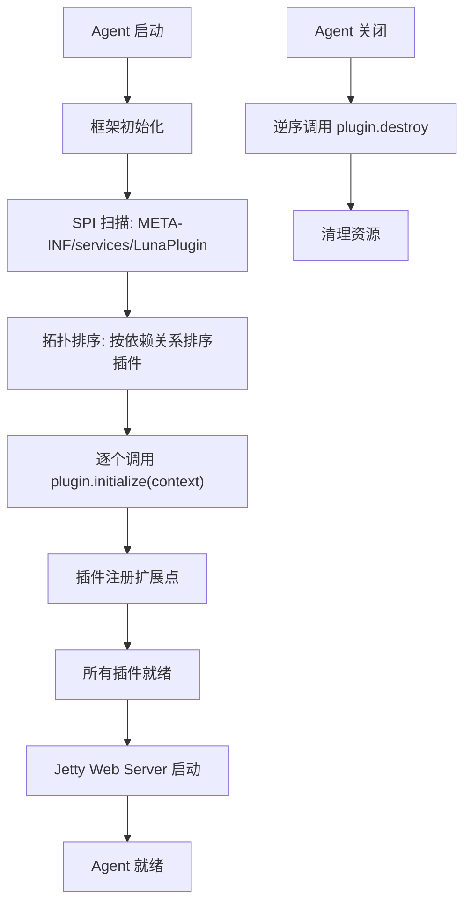
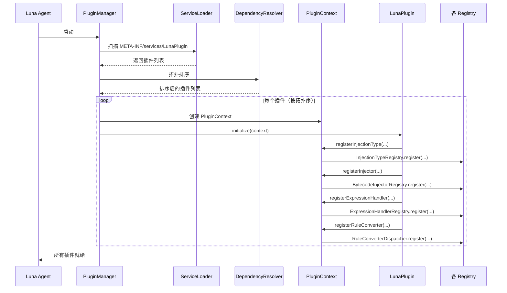
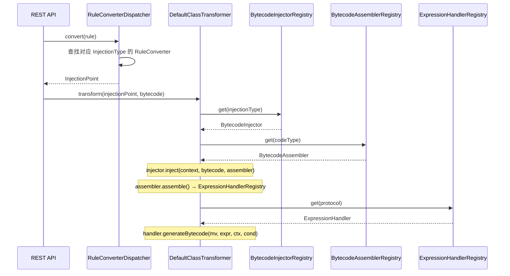
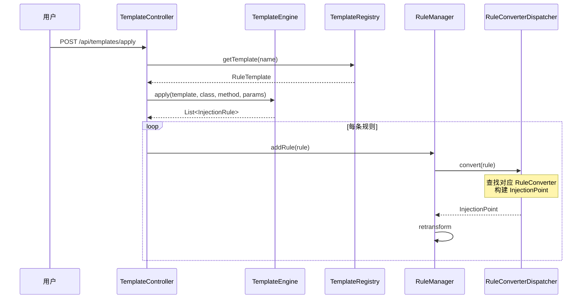
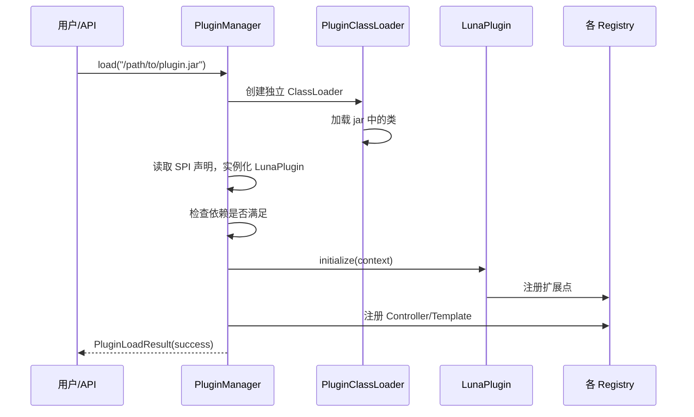
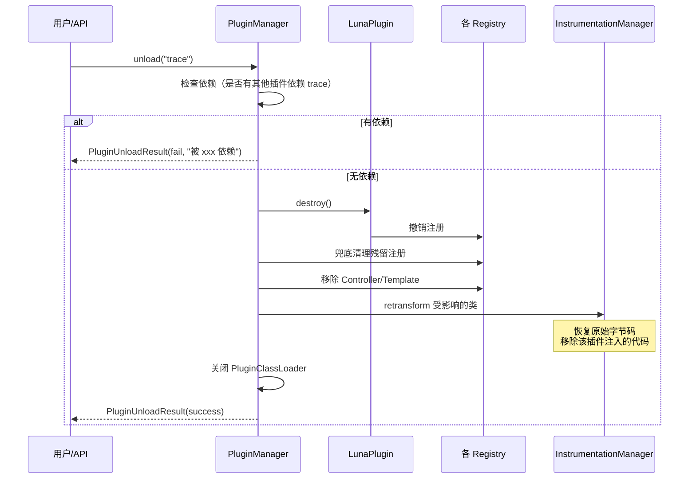
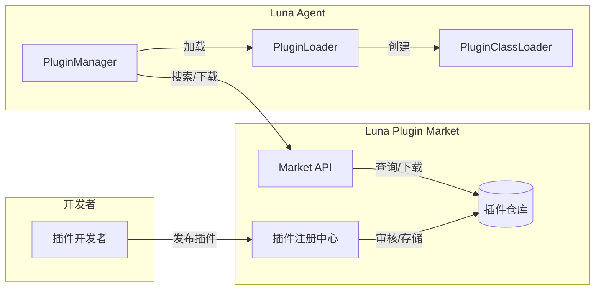
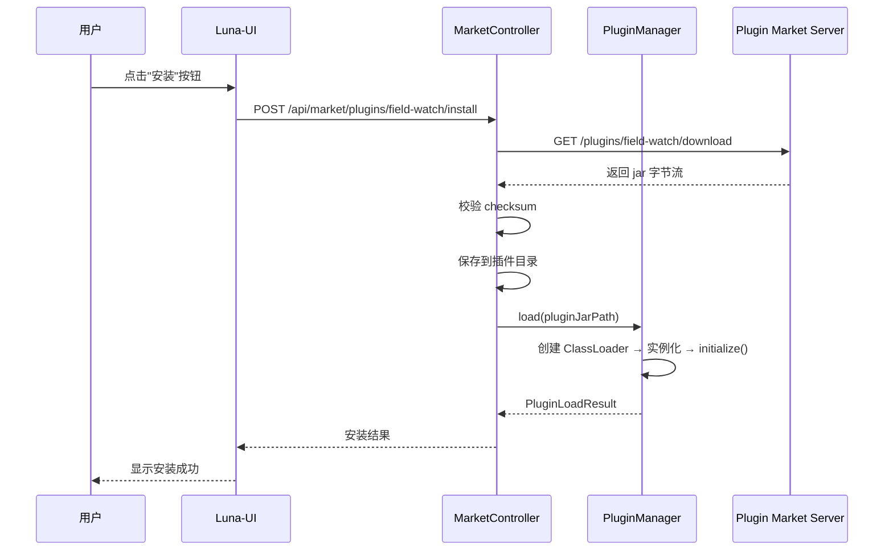
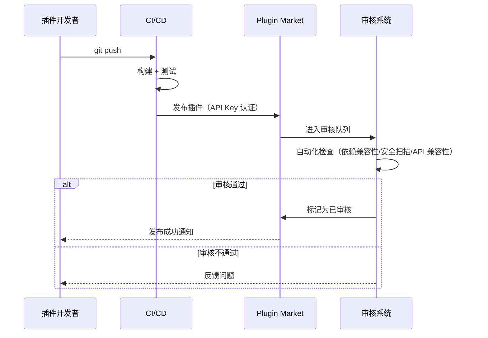

# Luna 插件化架构设计文档

> **版本**: 1.0  
> **作者**: Tony.L  
> **日期**: 2026/05/11  

---

## 1. 背景与目标

### 1.1 现状问题

当前 Luna 的所有功能（方法注入、行号注入、快照、trace）都硬编码在 `luna-core` 中，存在以下问题：

| 问题 | 具体表现 |
|------|---------|
| **扩展性差** | 新增注入类型需修改 7+ 个文件（InjectionType 枚举、Registry 构造器、DefaultInitializer、RuleConverter、Controller 等） |
| **注册逻辑重复** | BytecodeInjectorRegistry 构造器与 DefaultInitializer 双重注册同一映射 |
| **分发逻辑硬编码** | ExpressionBytecodeAssembler 中 `switch("log"/"snapshot"/"trace")` 无法扩展 |
| **类型体系封闭** | InjectionType 私有构造器 + static final 常量，CodeType 是 enum，外部无法扩展 |
| **层次穿透** | Controller 层直接 new 核心领域对象，包含 ASM 逻辑 |
| **解析逻辑重复** | `resolveInjectionType()` 在 3 处独立实现，行为不一致 |

### 1.2 目标架构

```
┌──────────────────────────────────────────────────────────────┐
│                     Luna Plugin Platform                      │
│                                                              │
│  ┌────────────────────────────────────────────────────────┐  │
│  │                   框架层 (Framework)                    │  │
│  │  ┌──────────┐ ┌──────────┐ ┌──────────┐ ┌──────────┐ │  │
│  │  │ ASM 基础 │ │ 反编译   │ │ 变量分析 │ │ 字节码   │ │  │
│  │  │ 设施     │ │ 抽象     │ │ 抽象     │ │ 生成基础 │ │  │
│  │  └──────────┘ └──────────┘ └──────────┘ └──────────┘ │  │
│  │  ┌──────────┐ ┌──────────┐ ┌──────────┐ ┌──────────┐ │  │
│  │  │ Registry │ │ SPI 加载 │ │ 生命周期 │ │ 规则引擎 │ │  │
│  │  │ 体系     │ │ 器       │ │ 管理     │ │ 抽象     │ │  │
│  │  └──────────┘ └──────────┘ └──────────┘ └──────────┘ │  │
│  └────────────────────────────────────────────────────────┘  │
│                              ↕ Plugin SPI                    │
│  ┌────────────────────────────────────────────────────────┐  │
│  │                   插件层 (Plugins)                      │  │
│  │  ┌──────────┐ ┌──────────┐ ┌──────────┐ ┌──────────┐ │  │
│  │  │ 方法注入 │ │ 行号注入 │ │ 快照插件 │ │ 耗时追踪 │ │  │
│  │  │ 插件     │ │ 插件     │ │          │ │ 插件     │ │  │
│  │  └──────────┘ └──────────┘ └──────────┘ └──────────┘ │  │
│  │  ┌──────────┐ ┌──────────────────────────────────────┐ │  │
│  │  │ 条件断点 │ │ 社区插件 (Field Watch / Call Tree...) │ │  │
│  │  │ 插件     │ │                                      │ │  │
│  │  └──────────┘ └──────────────────────────────────────┘ │  │
│  └────────────────────────────────────────────────────────┘  │
└──────────────────────────────────────────────────────────────┘
```

### 1.3 设计原则

1. **微内核 + 插件**：框架只提供基础设施，所有业务功能以插件形式存在
2. **开闭原则**：新增注入类型/表达式协议/模板，零修改框架代码
3. **隔离性**：插件之间互不依赖，可独立加载/卸载
4. **动态性**：支持运行时加载/卸载/热更新插件，无需重启 Agent
5. **社区友好**：一个插件 = 一个 jar + 一个 SPI 声明，贡献门槛最低
6. **市场生态**：提供插件市场，用户可一键浏览、安装、更新插件

---

## 2. 核心概念

### 2.1 Plugin 接口

```java
/**
 * Luna 插件接口 - 所有插件的入口点
 *
 * 插件通过 Java SPI 机制发现：
 * META-INF/services/fun.efto.luna.core.plugin.LunaPlugin
 *
 * 支持动态加载和卸载：
 * - 运行时通过 PluginManager.load(jarPath) 加载新插件
 * - 运行时通过 PluginManager.unload(pluginId) 卸载插件
 */
public interface LunaPlugin {

    /** 插件唯一标识，如 "method-injection" */
    String getId();

    /** 人类可读名称，如 "方法注入" */
    String getDisplayName();

    /** 插件版本 */
    String getVersion();

    /** 插件作者 */
    String getAuthor();

    /** 插件分类，如 "injection", "observability", "debug" */
    String getCategory();

    /**
     * 插件依赖的其他插件 ID
     * 框架按依赖拓扑排序初始化
     */
    default List<String> getDependencies() { return Collections.emptyList(); }

    /**
     * 插件初始化 - 注册扩展点
     *
     * @param context 插件上下文，提供框架服务访问
     */
    void initialize(PluginContext context);

    /**
     * 插件销毁 - 清理资源，撤销注册
     *
     * 动态卸载时必须完整撤销 initialize() 中的所有注册，
     * 否则 Registry 中会残留无效引用
     */
    default void destroy() {}

    /**
     * 插件提供的 REST API 路由
     * 返回 Controller 实例列表，框架自动注册
     */
    default List<Object> getControllers() { return Collections.emptyList(); }

    /**
     * 插件提供的规则模板
     * 返回模板列表，框架自动注册到 TemplateRegistry
     */
    default List<RuleTemplate> getTemplates() { return Collections.emptyList(); }
}
```

### 2.2 PluginContext - 插件访问框架服务的门户

```java
/**
 * 插件上下文 - 插件通过此接口访问框架服务
 *
 * 遵循依赖倒置原则：插件依赖抽象，不依赖框架内部实现
 */
public interface PluginContext {

    // ---- 类型注册 ----

    /** 注册注入类型（替代在 InjectionType 中新增 static final 常量） */
    void registerInjectionType(InjectionType type);

    /** 注册代码类型（替代在 CodeType enum 中新增常量） */
    void registerCodeType(CodeType type);

    // ---- 组件注册 ----

    /** 注册字节码注入器（替代在 BytecodeInjectorRegistry 构造器中硬编码） */
    void registerInjector(InjectionType type, BytecodeInjector injector);

    /** 注册字节码组装器（替代在 BytecodeAssemblerRegistry 构造器中硬编码） */
    void registerAssembler(CodeType type, BytecodeAssembler assembler);

    /** 注册表达式协议处理器（替代 ExpressionBytecodeAssembler 中的 switch） */
    void registerExpressionHandler(String protocol, ExpressionHandler handler);

    // ---- 规则转换 ----

    /** 注册规则转换器（替代 RuleConverter 中的硬编码 if-else） */
    void registerRuleConverter(InjectionType type, RuleConverter converter);

    // ---- 框架服务 ----

    /** 获取类分析器 */
    ClassAnalyzer getClassAnalyzer();

    /** 获取反编译器 */
    Decompiler getDecompiler();

    /** 获取 Spy 桥梁 */
    LunaSpy getSpy();

    /** 获取 RingBuffer */
    RingBuffer<String> getLogBuffer();

    /** 获取 Instrumentation */
    Instrumentation getInstrumentation();

    // ---- 动态卸载 ----

    /** 撤销注入类型注册 */
    void unregisterInjectionType(InjectionType type);

    /** 撤销代码类型注册 */
    void unregisterCodeType(CodeType type);

    /** 撤销字节码注入器注册 */
    void unregisterInjector(InjectionType type);

    /** 撤销字节码组装器注册 */
    void unregisterAssembler(CodeType type);

    /** 撤销表达式协议处理器注册 */
    void unregisterExpressionHandler(String protocol);

    /** 撤销规则转换器注册 */
    void unregisterRuleConverter(InjectionType type);
}
```

### 2.3 ExpressionHandler - 表达式协议扩展点

这是最关键的扩展点，替代当前 `ExpressionBytecodeAssembler` 中的 `switch(type)` 硬编码：

```java
/**
 * 表达式协议处理器
 *
 * 每种表达式协议（log/snapshot/trace/...）实现此接口
 * 通过 PluginContext.registerExpressionHandler() 注册
 */
public interface ExpressionHandler {

    /** 协议名称，如 "log", "snapshot", "trace" */
    String getProtocol();

    /**
     * 生成字节码
     *
     * @param mv ASM MethodVisitor
     * @param expression 协议体内容（如 "start" 或 "end:100"）
     * @param context ASM 注入上下文
     * @param hasCondition 是否有条件表达式
     */
    void generateBytecode(MethodVisitor mv, String expression,
                          AsmInjectionContext context, boolean hasCondition);
}
```

### 2.4 RuleConverter 策略化

```java
/**
 * 规则转换策略 - 每种 InjectionType 可自定义转换逻辑
 */
public interface RuleConverter {

    /**
     * 将 InjectionRule 转换为 InjectionPoint
     *
     * @param rule 注入规则
     * @return 注入点
     */
    InjectionPoint convert(InjectionRule rule);
}
```

### 2.5 CodeType 从 enum 改为 RegisterableType

```java
/**
 * 代码类型 - 从 enum 改为可注册类型
 *
 * 之前: enum CodeType { JAVA, EXPRESSION, SNAPSHOT }
 * 之后: 继承 RegisterableType，支持动态注册
 */
public class CodeType extends RegisterableType<CodeType> {
    private static final TypeRegistry<CodeType> REGISTRY = new TypeRegistry<>();

    public CodeType(String name, String description) {
        super(name, description);
    }

    public static CodeType valueOf(String name) {
        return valueOf(REGISTRY, name);
    }

    @Override
    protected TypeRegistry<CodeType> getRegistry() {
        return REGISTRY;
    }
}
```

### 2.6 InjectionType 开放构造

```java
/**
 * 方法注入类型 - 构造器改为 public，支持外部创建
 */
public class MethodInjectionType extends InjectionType {
    // 保留内置常量作为默认值
    public static final MethodInjectionType ENTER = new MethodInjectionType("method_enter", "方法进入注入");
    public static final MethodInjectionType EXIT  = new MethodInjectionType("method_exit", "方法退出注入");
    public static final MethodInjectionType AROUND = new MethodInjectionType("method_around", "方法环绕注入");

    // 构造器改为 public，允许插件创建新类型
    public MethodInjectionType(String name, String description) {
        super(name, description);
    }
}
```

---

## 3. 插件生命周期



插件注册扩展点包含以下操作：

| 注册操作 | 目标 Registry |
|---------|--------------|
| `registerInjectionType` | InjectionTypeRegistry |
| `registerInjector` | BytecodeInjectorRegistry |
| `registerAssembler` | BytecodeAssemblerRegistry |
| `registerExpressionHandler` | ExpressionHandlerRegistry |
| `registerRuleConverter` | RuleConverterDispatcher |
| `registerCodeType` | CodeType Registry |
| `getTemplates` → | TemplateRegistry |
| `getControllers` → | DispatcherServlet |

### 3.1 初始化顺序

1. **框架层初始化**：Registry 体系、ASM 基础设施、RingBuffer、Spy
2. **插件发现**：ServiceLoader 扫描所有 `LunaPlugin` 实现
3. **拓扑排序**：根据 `getDependencies()` 构建依赖图，按拓扑序排列
4. **插件初始化**：按排序逐个调用 `initialize(context)`，插件在此注册扩展点
5. **Web 层启动**：收集所有插件的 Controller，注册到 DispatcherServlet

### 3.2 依赖解析

```java
public class PluginDependencyResolver {
    /**
     * 拓扑排序插件列表
     *
     * @throws CyclicDependencyException 如果存在循环依赖
     * @throws MissingDependencyException 如果依赖的插件不存在
     */
    public static List<LunaPlugin> resolve(List<LunaPlugin> plugins) {
        // Kahn 算法实现拓扑排序
    }
}
```

---

## 4. 插件示例

### 4.1 方法注入插件（内置插件）

```java
public class MethodInjectionPlugin implements LunaPlugin {

    @Override
    public String getId() { return "method-injection"; }

    @Override
    public String getDisplayName() { return "方法注入"; }

    @Override
    public String getVersion() { return "1.0.0"; }

    @Override
    public String getAuthor() { return "Luna"; }

    @Override
    public String getCategory() { return "injection"; }

    @Override
    public void initialize(PluginContext context) {
        // 注册注入类型
        context.registerInjectionType(MethodInjectionType.ENTER);
        context.registerInjectionType(MethodInjectionType.EXIT);
        context.registerInjectionType(MethodInjectionType.AROUND);

        // 注册注入器
        context.registerInjector(MethodInjectionType.ENTER, new EnterMethodInjector());
        context.registerInjector(MethodInjectionType.EXIT, new ExitMethodInjector());
        context.registerInjector(MethodInjectionType.AROUND, new AroundMethodInjector());

        // 注册规则转换器
        context.registerRuleConverter(MethodInjectionType.ENTER, new MethodRuleConverter());
        context.registerRuleConverter(MethodInjectionType.EXIT, new MethodRuleConverter());
        context.registerRuleConverter(MethodInjectionType.AROUND, new MethodRuleConverter());
    }
}
```

### 4.2 Trace 插件（独立插件）

```java
public class TracePlugin implements LunaPlugin {

    @Override
    public String getId() { return "trace"; }

    @Override
    public String getDisplayName() { return "方法耗时追踪"; }

    @Override
    public List<String> getDependencies() { return Arrays.asList("method-injection"); }

    @Override
    public void initialize(PluginContext context) {
        // 注册表达式协议处理器
        context.registerExpressionHandler("trace", new TraceExpressionHandler());

        // 注册模板
        // getTemplates() 返回的模板会自动注册到 TemplateRegistry
    }

    @Override
    public List<RuleTemplate> getTemplates() {
        return Arrays.asList(
            BuiltinTemplates.methodTiming(),
            BuiltinTemplates.methodTimingWithThreshold(),
            BuiltinTemplates.slowMethodAlert()
        );
    }
}

public class TraceExpressionHandler implements ExpressionHandler {

    @Override
    public String getProtocol() { return "trace"; }

    @Override
    public void generateBytecode(MethodVisitor mv, String expression,
                                  AsmInjectionContext context, boolean hasCondition) {
        String className = context.getInjectionPoint().getTarget().getClassName();
        String methodName = context.getInjectionPoint().getTarget().getMethodName();

        if ("start".equals(expression)) {
            mv.visitMethodInsn(INVOKESTATIC, "fun/efto/luna/core/spy/LunaSpy",
                "onTraceStart", "()V", false);
        } else if (expression.startsWith("end:")) {
            long threshold = parseThreshold(expression.substring(4));
            mv.visitLdcInsn(className);
            mv.visitLdcInsn(methodName);
            mv.visitLdcInsn(threshold);
            mv.visitMethodInsn(INVOKESTATIC, "fun/efto/luna/core/spy/LunaSpy",
                "onTraceEnd", "(Ljava/lang/String;Ljava/lang/String;J)V", false);
        } else if (expression.startsWith("alert:")) {
            long threshold = parseThreshold(expression.substring(6));
            mv.visitLdcInsn(className);
            mv.visitLdcInsn(methodName);
            mv.visitLdcInsn(threshold);
            mv.visitMethodInsn(INVOKESTATIC, "fun/efto/luna/core/spy/LunaSpy",
                "onTraceAlert", "(Ljava/lang/String;Ljava/lang/String;J)V", false);
        }
    }
}
```

### 4.3 社区插件示例：字段监控

```java
/**
 * 社区贡献示例：字段访问监控插件
 *
 * 一个 jar 文件 + META-INF/services/fun.efto.luna.core.plugin.LunaPlugin
 * 即可贡献到 Luna 生态
 */
public class FieldWatchPlugin implements LunaPlugin {

    @Override
    public String getId() { return "field-watch"; }

    @Override
    public String getDisplayName() { return "字段访问监控"; }

    @Override
    public String getCategory() { return "observability"; }

    @Override
    public void initialize(PluginContext context) {
        // 注册新的注入类型
        InjectionType fieldAccessType = new InjectionType("field_access", "字段访问注入") {};
        context.registerInjectionType(fieldAccessType);

        // 注册对应的注入器
        context.registerInjector(fieldAccessType, new FieldAccessInjector());

        // 注册表达式协议
        context.registerExpressionHandler("field", new FieldExpressionHandler());

        // 注册规则转换器
        context.registerRuleConverter(fieldAccessType, new FieldRuleConverter());
    }
}
```

---

## 5. 框架层重构

### 5.1 消除硬编码注册

**Before**（当前）:
```java
// BytecodeInjectorRegistry 构造器
private BytecodeInjectorRegistry() {
    INJECTOR_REGISTRY.put(MethodInjectionType.ENTER, new EnterMethodInjector());
    INJECTOR_REGISTRY.put(MethodInjectionType.EXIT, new ExitMethodInjector());
    // ...
}

// DefaultInitializer.initialize() - 重复注册
public void initialize() {
    BytecodeInjectorRegistry.getInstance().register(MethodInjectionType.ENTER, new EnterMethodInjector());
    // ...
}
```

**After**（插件化后）:
```java
// BytecodeInjectorRegistry 构造器 - 空，不再硬编码
private BytecodeInjectorRegistry() {}

// 各插件自己注册
// MethodInjectionPlugin.initialize():
//   context.registerInjector(MethodInjectionType.ENTER, new EnterMethodInjector());
```

### 5.2 消除 switch 分发

**Before**（当前）:
```java
// ExpressionBytecodeAssembler.doAssemble()
switch (type) {
    case "log":      generateLogBytecode(...);      break;
    case "snapshot": generateSnapshotBytecode(...);  break;
    case "trace":    generateTraceBytecode(...);     break;
    default: throw new IllegalArgumentException("unsupported expression " + content);
}
```

**After**（插件化后）:
```java
// ExpressionBytecodeAssembler.doAssemble()
ExpressionHandler handler = ExpressionHandlerRegistry.getInstance().get(type);
if (handler == null) {
    throw new IllegalArgumentException("unsupported expression protocol: " + type);
}
handler.generateBytecode(mv, expression, asmContext, condition != null);
```

### 5.3 消除 resolveInjectionType 重复

**Before**（当前）: 3 处独立实现

**After**（插件化后）:
```java
// InjectionTypeRegistry - 统一的类型查找
public class InjectionTypeRegistry {
    private static final Map<String, InjectionType> TYPE_MAP = new ConcurrentHashMap<>();

    public static void register(InjectionType type) {
        TYPE_MAP.put(type.getName(), type);
        // 同时注册常见别名
        for (String alias : type.getAliases()) {
            TYPE_MAP.put(alias, type);
        }
    }

    public static InjectionType resolve(String name) {
        InjectionType type = TYPE_MAP.get(name.toLowerCase());
        if (type == null) {
            throw new IllegalArgumentException("Unknown injection type: " + name);
        }
        return type;
    }
}
```

### 5.4 RuleConverter 策略化

**Before**（当前）: 一个巨大的 convert 方法 + instanceof 判断

**After**（插件化后）:
```java
public class RuleConverterDispatcher {
    private static final Map<InjectionType, RuleConverter> CONVERTERS = new ConcurrentHashMap<>();

    public static void register(InjectionType type, RuleConverter converter) {
        CONVERTERS.put(type, converter);
    }

    public static InjectionPoint convert(InjectionRule rule) {
        InjectionType type = InjectionTypeRegistry.resolve(rule.getInjectionType());
        RuleConverter converter = CONVERTERS.get(type);
        if (converter == null) {
            throw new IllegalArgumentException("No converter for type: " + type);
        }
        return converter.convert(rule);
    }
}
```

---

## 6. 包结构重组

### 6.1 重组后的 luna-core 包结构

```
fun.efto.luna.core
├── plugin/                        # 【新增】插件框架
│   ├── LunaPlugin.java            #   插件接口
│   ├── PluginContext.java         #   插件上下文
│   ├── PluginRegistry.java        #   插件注册中心
│   ├── PluginLoader.java          #   SPI 加载器
│   ├── PluginDependencyResolver.java  # 依赖解析
│   └── PluginLifecycle.java       #   生命周期管理
│
├── framework/                     # 【重组】框架基础设施（从各处提取）
│   ├── asm/                       #   ASM 基础设施
│   │   ├── AsmInjectionContext.java
│   │   ├── ClassLoaderAwareClassWriter.java
│   │   ├── LocalVariableScanner.java
│   │   └── Constants.java
│   ├── decompile/                 #   反编译抽象
│   │   ├── Decompiler.java
│   │   └── DecompilerFactory.java
│   ├── analyzer/                  #   类分析抽象
│   │   ├── ClassAnalyzer.java
│   │   └── AnalyzerRegistry.java
│   ├── buffer/                    #   无锁队列
│   │   └── RingBuffer.java
│   ├── expression/                #   条件表达式引擎
│   │   ├── ConditionRegistry.java
│   │   ├── parser/
│   │   ├── ast/
│   │   ├── bytecode/
│   │   └── context/
│   ├── registry/                  #   注册体系
│   │   ├── Registry.java
│   │   ├── TypeRegistry.java
│   │   ├── BaseType.java
│   │   └── RegisterableType.java
│   └── spy/                       #   Spy 桥梁
│       └── LunaSpy.java
│
├── injection/                     # 【重组】注入模型（框架层抽象）
│   ├── InjectionPoint.java
│   ├── InjectionTarget.java
│   ├── InjectableCode.java
│   ├── InjectionType.java         #   开放构造
│   ├── InjectionTypeRegistry.java #   【新增】统一类型查找
│   ├── CodeType.java              #   从 enum 改为 RegisterableType
│   ├── BytecodeInjector.java      #   接口
│   ├── BytecodeAssembler.java     #   接口
│   ├── ExpressionHandler.java     #   【新增】表达式协议扩展点
│   ├── ExpressionHandlerRegistry.java  #   【新增】
│   ├── RuleConverter.java         #   接口（策略化）
│   └── RuleConverterDispatcher.java    #   【新增】
│
├── rule/                          # 规则管理
│   ├── InjectionRule.java
│   ├── RuleManager.java
│   ├── RulePersistenceService.java
│   └── template/
│       ├── RuleTemplate.java
│       ├── TemplateEngine.java
│       └── TemplateRegistry.java
│
└── transformer/                   # ClassFileTransformer 适配层
    ├── ClassTransformer.java
    ├── DefaultClassTransformer.java
    ├── ClassFileTransformerAdapter.java
    └── RuleClassFileTransformer.java
```

### 6.2 插件包结构

```
fun.efto.luna.core.plugins          # 内置插件包
├── method/                         # 方法注入插件
│   ├── MethodInjectionPlugin.java
│   ├── MethodInjectionType.java
│   ├── MethodRuleConverter.java
│   ├── injector/
│   │   ├── EnterMethodInjector.java
│   │   ├── ExitMethodInjector.java
│   │   └── AroundMethodInjector.java
│   └── visitor/
│       ├── EnterMethodVisitor.java
│       ├── ExitMethodVisitor.java
│       └── AroundMethodVisitor.java
│
├── line/                           # 行号注入插件
│   ├── LineInjectionPlugin.java
│   ├── LineNumberInjectionType.java
│   ├── LineRuleConverter.java
│   ├── injector/
│   │   ├── BeforeLineInjector.java
│   │   └── AfterLineInjector.java
│   └── visitor/
│       └── LineNumberVisitor.java
│
├── snapshot/                       # 快照插件
│   ├── SnapshotPlugin.java
│   ├── SnapshotExpressionHandler.java
│   ├── StackFrameCapture.java
│   └── SnapshotSerializer.java
│
├── log/                            # 日志表达式插件
│   ├── LogPlugin.java
│   └── LogExpressionHandler.java
│
└── trace/                          # 耗时追踪插件
    ├── TracePlugin.java
    ├── TraceExpressionHandler.java
    └── BuiltinTemplates.java
```

### 6.3 社区插件包结构

```
# 社区贡献：一个独立 jar
com.example.luna.plugin.fieldwatch
├── FieldWatchPlugin.java           # 实现 LunaPlugin
├── FieldAccessType.java            # 新的 InjectionType
├── FieldAccessInjector.java        # 新的 BytecodeInjector
├── FieldExpressionHandler.java     # 新的表达式协议
├── FieldRuleConverter.java         # 新的规则转换器
└── META-INF/services/
    └── fun.efto.luna.core.plugin.LunaPlugin   # SPI 声明
```

---

## 7. 关键流程

### 7.1 插件发现与加载流程



### 7.2 注入执行流程（插件化后）



### 7.3 模板应用流程



---

## 8. ExpressionHandlerRegistry 设计

这是替代 `switch(type)` 的核心注册表：

```java
public final class ExpressionHandlerRegistry {
    private static final Map<String, ExpressionHandler> HANDLERS = new ConcurrentHashMap<>();
    private static final ExpressionHandlerRegistry INSTANCE = new ExpressionHandlerRegistry();

    public static ExpressionHandlerRegistry getInstance() { return INSTANCE; }

    public void register(ExpressionHandler handler) {
        HANDLERS.put(handler.getProtocol(), handler);
    }

    public ExpressionHandler get(String protocol) {
        return HANDLERS.get(protocol);
    }

    public boolean hasProtocol(String content) {
        if (content == null || content.isEmpty()) return false;
        int colonIdx = content.indexOf(':');
        if (colonIdx <= 0) return false;
        String prefix = content.substring(0, colonIdx);
        return HANDLERS.containsKey(prefix);
    }
}
```

`RuleConverter.hasProtocolPrefix()` 改为委托给此 Registry：

```java
// Before
private static boolean hasProtocolPrefix(String content) {
    return content.startsWith("trace:") || content.startsWith("snapshot:") || content.startsWith("log:");
}

// After
private static boolean hasProtocolPrefix(String content) {
    return ExpressionHandlerRegistry.getInstance().hasProtocol(content);
}
```

---

## 9. 迁移策略

### 9.1 渐进式迁移（3 个阶段）

**阶段 1：基础设施准备**（不破坏现有功能）

| 步骤 | 内容 | 风险 |
|------|------|------|
| 1.1 | 新增 `plugin` 包：LunaPlugin、PluginContext、PluginRegistry 等 | 低 |
| 1.2 | 新增 `ExpressionHandlerRegistry` | 低 |
| 1.3 | 新增 `InjectionTypeRegistry` | 低 |
| 1.4 | 新增 `RuleConverterDispatcher` | 低 |
| 1.5 | CodeType 从 enum 改为 RegisterableType | 中（需全量替换引用） |
| 1.6 | InjectionType 构造器改为 public | 低 |

**阶段 2：适配层桥接**（新旧并存）

| 步骤 | 内容 | 风险 |
|------|------|------|
| 2.1 | ExpressionBytecodeAssembler 改为委托 ExpressionHandlerRegistry | 中 |
| 2.2 | RuleConverter 改为委托 RuleConverterDispatcher | 中 |
| 2.3 | 将现有 log/snapshot/trace 逻辑提取为 ExpressionHandler 实现 | 中 |
| 2.4 | 将现有注入器提取为内置插件 | 低 |
| 2.5 | DefaultInitializer 改为通过 PluginManager 驱动 | 中 |

**阶段 3：清理**（移除旧代码）

| 步骤 | 内容 | 风险 |
|------|------|------|
| 3.1 | 移除 BytecodeInjectorRegistry 构造器中的硬编码注册 | 低 |
| 3.2 | 移除 BytecodeAssemblerRegistry 构造器中的硬编码注册 | 低 |
| 3.3 | 移除 BuiltinTemplates 中的硬编码模板，改为插件提供 | 低 |
| 3.4 | 移除 Controller 层的 resolveInjectionType，统一使用 InjectionTypeRegistry | 中 |
| 3.5 | 移除 Controller 层的 ASM 逻辑，下沉到 core 层 | 中 |

### 9.2 兼容性保证

- 阶段 1-2 期间，所有现有 API 和功能保持不变
- 新增的 Registry 优先查找，找不到时 fallback 到旧逻辑
- 阶段 3 才移除 fallback

---

## 10. 性能考量

### 10.1 插件加载开销

| 操作 | 耗时 | 频率 |
|------|------|------|
| ServiceLoader 扫描 | ~5ms | Agent 启动时 1 次 |
| 拓扑排序 | <1ms | Agent 启动时 1 次 |
| 插件 initialize() | 各插件自定 | Agent 启动时 1 次 |

**结论**：插件加载仅在 Agent 启动时执行一次，对运行时性能零影响。

### 10.2 运行时查找开销

| 操作 | Before | After | 差异 |
|------|--------|-------|------|
| 查找 Injector | ConcurrentHashMap.get() | ConcurrentHashMap.get() | 无变化 |
| 查找 Assembler | ConcurrentHashMap.get() | ConcurrentHashMap.get() | 无变化 |
| 查找 ExpressionHandler | switch(字符串) | ConcurrentHashMap.get() | ~0（HashMap O(1) vs switch O(1)） |
| 查找 RuleConverter | instanceof + if-else | ConcurrentHashMap.get() | 更快 |

**结论**：运行时性能不受影响，部分路径甚至更快。

### 10.3 红线校验

| 红线 | 校验 |
|------|------|
| 单次插桩判定耗时 < 0.1ms | ✅ Registry 查找为 O(1)，不引入额外开销 |
| 非侵入性 | ✅ 插件化不影响 retransform 能力 |
| 线程安全 | ✅ 所有 Registry 使用 ConcurrentHashMap |

---

## 11. 社区贡献流程

### 11.1 贡献一个插件的步骤

1. **创建 Maven 项目**，依赖 `luna-core`
2. **实现 `LunaPlugin` 接口**
3. **在 `initialize()` 中注册扩展点**
4. **添加 SPI 声明**：`META-INF/services/fun.efto.luna.core.plugin.LunaPlugin`
5. **打包为 jar**
6. **将 jar 放入 Agent 的 classpath**

### 11.2 插件可扩展的维度

| 扩展维度 | 接口 | 示例 |
|---------|------|------|
| 注入类型 | `InjectionType` + `BytecodeInjector` | FieldAccess、Constructor、Sync |
| 表达式协议 | `ExpressionHandler` | trace、metric、alert、custom |
| 代码类型 | `CodeType` + `BytecodeAssembler` | Groovy、JavaScript |
| 规则转换 | `RuleConverter` | 自定义规则到注入点的映射 |
| 规则模板 | `RuleTemplate` | 方法耗时、调用链追踪 |
| REST API | `getControllers()` | 自定义管理界面 |
| 反编译器 | `Decompiler` | Procyon、FernFlower |
| 类分析器 | `ClassAnalyzer` | Javassist 分析器 |

---

## 12. 动态加载与卸载

### 12.1 设计目标

插件不仅要在 Agent 启动时加载，还要支持**运行时动态加载和卸载**，这是插件市场的基础能力：

| 能力 | 说明 |
|------|------|
| **动态加载** | 运行时加载新插件 jar，无需重启 Agent |
| **动态卸载** | 运行时卸载插件，撤销所有注册，retransform 恢复原始字节码 |
| **热更新** | 卸载旧版本 → 加载新版本，实现插件升级 |
| **依赖安全** | 卸载插件前检查是否有其他插件依赖它 |

### 12.2 PluginManager 动态操作接口

```java
public class PluginManager {

    private static final PluginManager INSTANCE = new PluginManager();
    private final PluginRegistry registry;
    private final Map<String, PluginClassLoader> classLoaders;

    /**
     * 动态加载插件
     *
     * @param jarPath 插件 jar 文件路径
     * @return 加载结果
     * @throws PluginLoadException 加载失败
     */
    public PluginLoadResult load(String jarPath) {
        // 1. 创建独立 ClassLoader 加载 jar
        // 2. 从 jar 中读取 SPI 声明，实例化 LunaPlugin
        // 3. 检查依赖是否满足
        // 4. 创建 PluginContext，调用 initialize()
        // 5. 注册 Controller 和 Template
        // 6. 返回加载结果
    }

    /**
     * 动态卸载插件
     *
     * @param pluginId 插件 ID
     * @return 卸载结果
     * @throws PluginUnloadException 卸载失败（如被其他插件依赖）
     */
    public PluginUnloadResult unload(String pluginId) {
        // 1. 检查是否有其他已加载插件依赖此插件
        // 2. 调用 plugin.destroy()（插件自行撤销注册）
        // 3. 框架兜底：从所有 Registry 中移除该插件注册的扩展点
        // 4. 移除该插件注册的 Controller 路由
        // 5. 移除该插件注册的 Template
        // 6. retransform 受影响的类，恢复原始字节码
        // 7. 关闭 PluginClassLoader
        // 8. 从 registry 中移除
    }

    /**
     * 热更新插件
     *
     * @param pluginId 插件 ID
     * @param jarPath 新版本 jar 文件路径
     * @return 更新结果
     */
    public PluginUpdateResult update(String pluginId, String jarPath) {
        unload(pluginId);
        return load(jarPath);
    }

    /**
     * 查询已加载插件列表
     */
    public List<PluginInfo> listPlugins() { ... }

    /**
     * 查询插件详情
     */
    public PluginInfo getPluginInfo(String pluginId) { ... }
}
```

### 12.3 动态加载流程



### 12.4 动态卸载流程



### 12.5 PluginClassLoader 隔离

每个动态加载的插件使用独立的 `PluginClassLoader`，实现：

- **类隔离**：不同插件的依赖互不干扰
- **卸载释放**：关闭 ClassLoader 后，插件类可被 GC 回收
- **父委派**：以 Agent ClassLoader 为父，共享框架类

```java
public class PluginClassLoader extends URLClassLoader {
    private final String pluginId;
    private volatile boolean closed = false;

    public PluginClassLoader(String pluginId, URL[] urls, ClassLoader parent) {
        super(urls, parent);
        this.pluginId = pluginId;
    }

    @Override
    protected Class<?> loadClass(String name, boolean resolve) {
        // 框架类（fun.efto.luna.core.*）委派给父 ClassLoader
        // 插件自有类由自己加载
        // 第三方依赖优先从插件 jar 加载，找不到再委派给父
    }

    public void close() {
        closed = true;
        // 释放 jar 文件句柄
    }
}
```

### 12.6 卸载安全检查

卸载插件前必须执行以下检查：

| 检查项 | 说明 | 失败处理 |
|--------|------|---------|
| 依赖检查 | 是否有其他已加载插件依赖此插件 | 拒绝卸载，提示依赖链 |
| 活跃规则检查 | 是否有使用此插件扩展点的活跃规则 | 提示用户先删除相关规则 |
| 活跃注入点检查 | 是否有此插件创建的活跃注入点 | 先 retransform 恢复原始字节码 |
| 内置插件保护 | 是否为内置插件（method-injection 等） | 拒绝卸载内置插件 |

---

## 13. 插件市场

### 13.1 设计目标

提供在线插件市场，用户可从市场直接浏览、下载、安装插件，无需手动操作 jar 文件：



### 13.2 插件元数据

每个插件在市场中注册时需要提供以下元数据：

```json
{
    "id": "field-watch",
    "displayName": "字段访问监控",
    "version": "1.2.0",
    "author": "community-dev",
    "category": "observability",
    "description": "监控对象字段的读写访问，记录访问线程、调用栈和值变更",
    "dependencies": ["method-injection"],
    "minLunaVersion": "2.0.0",
    "maxLunaVersion": "2.*",
    "downloadUrl": "https://market.luna.dev/plugins/field-watch/1.2.0/download",
    "checksum": "sha256:a1b2c3d4...",
    "size": 45678,
    "license": "Apache-2.0",
    "repository": "https://github.com/example/luna-plugin-field-watch",
    "tags": ["field", "monitor", "debug"],
    "ratings": 4.5,
    "downloads": 1234
}
```

### 13.3 Market API 设计

| API | 方法 | 说明 |
|-----|------|------|
| `/api/market/plugins` | GET | 搜索插件列表（支持 keyword/category/tag 过滤） |
| `/api/market/plugins/{id}` | GET | 获取插件详情 |
| `/api/market/plugins/{id}/versions` | GET | 获取插件版本列表 |
| `/api/market/plugins/{id}/download` | GET | 下载插件 jar |
| `/api/market/plugins/{id}/install` | POST | 一键安装（下载 + 动态加载） |
| `/api/market/plugins/{id}/uninstall` | POST | 一键卸载（动态卸载 + 删除 jar） |
| `/api/market/plugins/{id}/update` | POST | 检查更新并安装最新版 |
| `/api/market/installed` | GET | 获取已安装插件列表（含本地 + 市场） |

### 13.4 一键安装流程



### 13.5 插件本地存储

```
~/.luna/
├── plugins/                        # 插件存储目录
│   ├── field-watch/                # 按插件 ID 分目录
│   │   ├── field-watch-1.2.0.jar   # 插件 jar
│   │   └── metadata.json           # 安装元数据（来源、时间、版本）
│   └── call-trace/
│       ├── call-trace-0.9.1.jar
│       └── metadata.json
├── config/
│   └── plugin-repositories.json    # 市场源配置（支持私有市场）
└── logs/
    └── plugin-install.log          # 安装/卸载日志
```

### 13.6 插件市场源配置

支持配置多个市场源，包括官方市场和私有市场：

```json
{
    "repositories": [
        {
            "id": "official",
            "name": "Luna Official Market",
            "url": "https://market.luna.dev/api",
            "trusted": true
        },
        {
            "id": "company-internal",
            "name": "公司内部市场",
            "url": "https://internal-market.company.com/api",
            "trusted": true,
            "auth": {
                "type": "bearer",
                "token": "xxx"
            }
        }
    ]
}
```

### 13.7 安全机制

| 安全措施 | 说明 |
|---------|------|
| **Checksum 校验** | 下载后校验 SHA-256，防止篡改 |
| **签名验证** | 可选的 JAR 签名验证，确保来源可信 |
| **可信源** | 只从 trusted: true 的市场源安装 |
| **权限声明** | 插件元数据声明所需权限（如 retransform、网络访问） |
| **沙箱模式** | 可选：限制插件的 ClassLoader 可访问的包范围 |
| **审核机制** | 官方市场插件需通过审核才能发布 |

### 13.8 插件发布流程



---

## 14. 总结

本设计将 Luna 从"功能硬编码的单体架构"改造为"微内核 + 插件"架构：

| 维度 | Before | After |
|------|--------|-------|
| 新增注入类型 | 修改 7+ 文件 | 实现 1 个插件类 |
| 新增表达式协议 | 修改 switch + 3 处 Registry | 实现 ExpressionHandler + 注册 |
| 社区贡献 | Fork → 修改源码 → PR | 写插件 jar → 放入 classpath |
| 动态扩展 | 需重启 Agent | 运行时 load/unload，无需重启 |
| 插件获取 | 手动下载 jar | 插件市场一键安装/更新 |
| 注册逻辑 | 3 处重复 | 每个插件自注册 1 次 |
| 分发逻辑 | switch/if-else | Registry 查找 |
| 类型体系 | enum + static final | RegisterableType + 动态注册 |
| 运行时性能 | O(1) | O(1)（无退化） |
