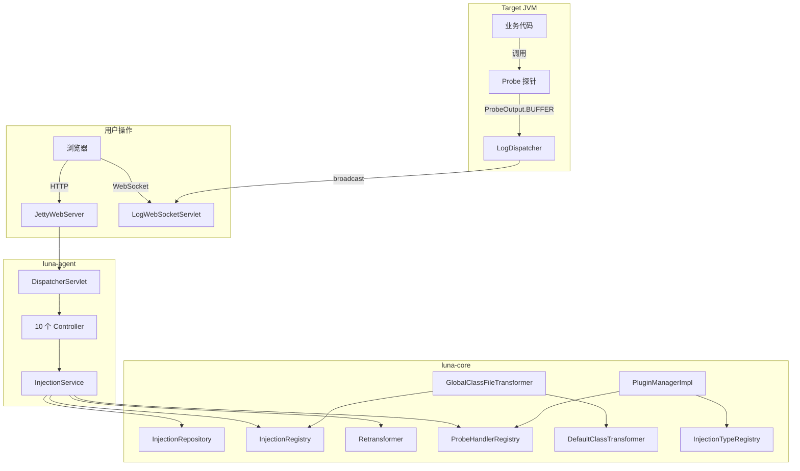
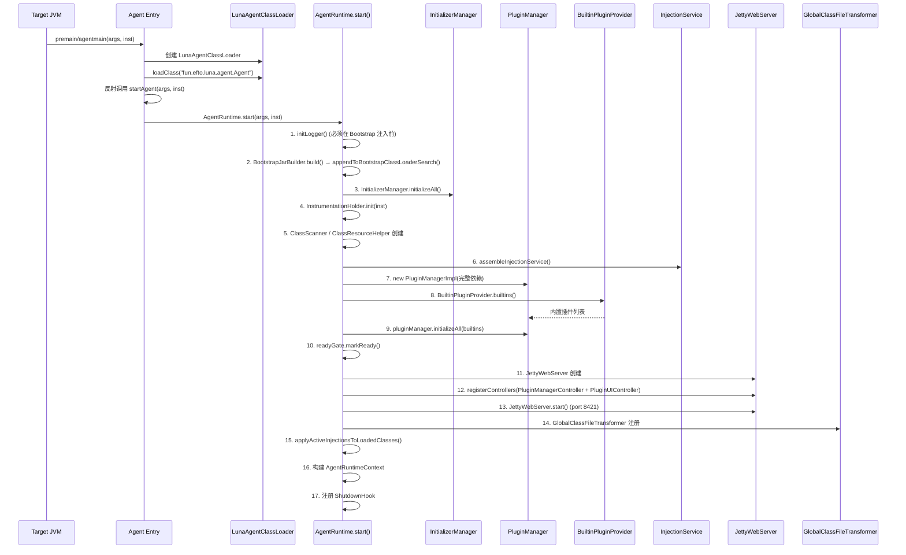

# 数据流向

## 命令流向（用户操作 → 系统）

```text
用户操作 (Web UI)
    → HTTP API (Controller)
    → InjectionService (实现 InjectionLifecycle + InjectionQuery)
    → InjectionRegistry (注册 InjectionPoint)
    → GlobalClassFileTransformer (遍历活跃注入点)
    → DefaultClassTransformer (查找 BytecodeInjector + ProbeHandler)
    → BytecodeInjector.inject() + ProbeHandler.handle()
    → JVM retransformClasses
```

---

## 事件流向（系统 → UI 更新）

```text
业务线程执行注入代码
    → ProbeOutput.offer(ProbeMessage)  [各 Probe 静态方法]
    → RingBuffer (MPSC 无锁队列, 容量 4096)
    → LogDispatcher (消费线程, 轮询 poll)
    → WebSocket broadcast (sendStringByFuture)
    → Web UI 实时更新
```

---

## 模块间协作关系



---

## 扩展点设计

### 策略扩展点

| 策略接口 | 当前实现 | 扩展方式 |
|----------|----------|----------|
| BytecodeInjector | ASM 系 + ByteKit 系注入器（7 种内置） | 通过 BytecodeInjectorRegistry 注册 |
| InjectionLocation | 7 种内置位置 | 通过 PluginContext.registerInjectionLocation() |
| CodeEngine | ExpressionCodeEngine | 通过 CodeEngineRegistry 注册 |
| ProbeHandler | 4 个内置 ProbeHandler | 通过 PluginContext.registerProbeHandler() |
| LunaPlugin | 4 个内置插件 | 通过 SPI (META-INF/services) 发现 |
| Initializer | DefaultInitializer + AsmInitializer | 通过 ServiceLoader 发现 |

### 新增业务能力

1. 实现 LunaPlugin 接口
2. 在 META-INF/services/fun.efto.luna.core.plugin.LunaPlugin 中注册
3. 插件自动被 BuiltinPluginProvider 发现，PluginManager 加载和初始化
4. 在 PluginContext 中注册 InjectionLocation、ProbeHandler、CodeEngine
5. 插件可贡献 LunaController（自动注册到 WebServer）

---

## 设计模式与核心机制

### 模板方法模式

```text
BytecodeInjector (接口)
├── ByteKitInjectorBase (抽象基类 - 模板方法)
│   ├── inject()                    ← 骨架流程：根据是否有 ProbeHandler 分支
│   │   ├── injectWithExpression()  ← 有 ProbeHandler 时，委托给 AsmMethodExpressionInjector
│   │   └── injectWithByteKit()     ← 无 ProbeHandler 时，使用 ByteKit InterceptorProcessor
│   ├── getExpressionPhase()        ← 钩子方法，子类返回 Phase (ENTER/EXIT/AROUND)
│   └── createInterceptorProcessors() ← 钩子方法，子类创建 ByteKit InterceptorProcessor
│       ├── ByteKitEnterInjector       (Phase.ENTER, EnterInterceptor)
│       ├── ByteKitExitInjector        (Phase.EXIT, ExitInterceptor)
│       ├── ByteKitAroundInjector      (Phase.AROUND, AroundInterceptor)
│       ├── ByteKitExceptionExitInjector (ExceptionExitInterceptor)
│       └── ByteKitInvokeInjector      (InvokeInterceptor)
├── BeforeLineInjector  (Tree API，不走模板方法)
├── AfterLineInjector   (Tree API，不走模板方法)
└── AsmMethodExpressionInjector (Tree API，支持 ENTER/EXIT/AROUND 三种 Phase)
```

**骨架流程** (`ByteKitInjectorBase.inject()`):

1. 判断是否有 ProbeHandler
2. 有 ProbeHandler → 创建 `AsmMethodExpressionInjector(phase)`，委托执行表达式注入
3. 无 ProbeHandler → 使用 ByteKit 流程：
   - 创建 `ClassReader` 读取字节码
   - 遍历方法，匹配目标方法
   - 子类 `createInterceptorProcessors()` 创建 InterceptorProcessor
   - `InterceptorProcessor.process(methodProcessor)` 执行转换
   - 返回 `ClassWriter.toByteArray()`

### 策略模式

**ProbeHandler** — 探针行为策略:

```java
public interface ProbeHandler {
    // 核心方法
    String getProbeType();
    boolean usesCode();
    Set<String> supportedInjectionLocations();
    ValidationResult validate(InjectRequest request);
    void handle(CompiledCode code, GenerateContext ctx);
    default void onDelete(PersistentInjection injection, InjectionRepository repository, InjectionRegistry registry) {}

    // UI 元数据
    default String getDisplayName() { return getProbeType(); }
    default String getSyntax() { return ""; }
    default String getIcon() { return ""; }
    default String getCategory() { return "injection"; }
    default String getGlyphColor() { return ""; }
    default QuickActionBehavior getQuickActionBehavior() { ... }
    default List<FormFieldSchema> getConfigSchema() { return Collections.emptyList(); }
}
```

3 个内置策略: `LogProbeHandler`("LOG")、`SnapshotProbeHandler`("SNAPSHOT")、`TraceProbeHandler`("TRACE")

> TRACE 探针使用 `method_around` 单注入点模型，`handle()` 在 AROUND 时被调用两次（Phase.ENTER + Phase.EXIT），根据 `ctx.phase()` 生成不同的探针代码。

> ConditionalBreakpointPlugin 未注册 ProbeHandler，其行号快照功能通过 SnapshotProbeHandler 实现。

**CodeEngine** — 代码编译策略:

```java
public interface CodeEngine {
    String getCodeType();
    CompiledCode compile(PersistentInjection persistent);
}
```

### 注册表模式

所有注册表均使用 `ConcurrentHashMap` 保证线程安全:

| 注册表 | Key | Value | 初始化位置 |
|--------|-----|-------|-----------|
| `ProbeHandlerRegistry` | probeType (String) | ProbeHandler | 插件 onLoad |
| `InjectionTypeRegistry` | locationName (String) | InjectionLocation | CoreModuleInitializer |
| `BytecodeInjectorRegistry` | InjectionLocation | BytecodeInjector | CoreModuleInitializer |
| `CodeEngineRegistry` | codeType (String) | CodeEngine | 插件 onLoad |
| `CoreCapabilityRegistry` | capabilityId | CoreCapabilityRecord | 启动时（register 时校验依赖，声明 READY 但依赖未就绪时降级为 NOT_INITIALIZED） |
| `AnalyzerRegistry` | AnalyzerType | ClassAnalyzer | CoreModuleInitializer |
| `InjectionPointRegistry` | className (String) | List\<InjectionPoint\> | 运行时注册 |

### 六角架构 / 端口-适配器

**应用场景**: InjectionService 的端口定义

```text
InjectionService (核心)
├── port/Retransformer     ← 适配器: Agent Instrumentation 封装
├── port/BytecodeLoader    ← 适配器: ClassResourceHelper.loadClassBytes()
├── port/BytecodePreviewer ← 适配器: InjectionService.preview() 内部实现
├── port/LocalVarValidator ← 适配器: LocalVariableScanner 封装
├── port/InjectionVerifier ← 适配器: InjectionTestHarnessAdapter
└── port/InjectionStore    ← 适配器: DefaultInjectionRepository
```

核心优势: InjectionService 不依赖任何具体技术实现，仅依赖端口接口。

### 观察者模式

**应用场景**: 插件生命周期事件

```java
public interface PluginLifecycleListener {
    default void onLoaded(PluginInfo info) {}
    default void onUnloaded(PluginInfo info) {}
    default void onUpdated(PluginInfo info, String oldVersion, String newVersion) {}
    default void onLoadFailed(String pluginId, String errorMessage) {}
    default void onUnloadFailed(String pluginId, String errorMessage) {}
    default void onDisabled(PluginInfo info) {}
    default void onEnabled(PluginInfo info) {}
}
```

`PluginManagerImpl` 维护监听器列表，状态变更时通知所有监听者。所有方法均为 default，监听者按需实现。

### 组合模式

**应用场景**: AsmMethodExpressionInjector Phase.AROUND = Phase.ENTER + Phase.EXIT

```java
public class AsmMethodExpressionInjector implements BytecodeInjector {
    // Phase.ENTER / Phase.EXIT / Phase.AROUND 组合
    // AROUND = 同时在方法入口和出口注入探针
    // AROUND 时 handle() 被调用两次，GenerateContext.phase() 区分 ENTER/EXIT
}
```

### 单例模式

| 类 | 获取方式 |
|------|---------|
| `ProbeHandlerRegistry` | `ProbeHandlerRegistry.getInstance()` |
| `InjectionTypeRegistry` | `InjectionTypeRegistry.getInstance()` |
| `BytecodeInjectorRegistry` | `BytecodeInjectorRegistry.getInstance()` |
| `CodeEngineRegistry` | `CodeEngineRegistry.getInstance()` |
| `CoreCapabilityRegistry` | `CoreCapabilityRegistry.getInstance()` |
| `InitializerManager` | `InitializerManager.getInstance()` |
| `AnalyzerRegistry` | `AnalyzerRegistry.getInstance()` |
| `InjectionPointRegistry` | `InjectionPointRegistry.getInstance()` |

### 条件表达式求值流程

```text
"${param[1] > 0}::log:参数值: $1"
         │                │
         ▼                ▼
   ConditionRegistry    ExpressionCodeEngine
         │                │
         ▼                ▼
   Tokenizer → Parser → AST (预编译缓存)
         │
         ▼
   EvaluationContext (ThreadLocal)
   └── bind("param[1]", $1)
         │
         ▼
   AST.evaluate(context) → boolean
         │
         ▼ (true)
   执行注入代码
```

### 插件热加载安全机制

```text
PluginManager.load(pluginId)
│
├── 1. SAFETY CHECK: checkUnloadable() → 依赖检查
├── 2. RULE SUSPEND: suspendInjectionsByLocation() → 暂停相关注入
├── 3. WRITE LOCK: StampedLock.writeLock()
├── 4. DESTROY: plugin.destroy() → 清理资源
├── 5. REGISTRY CLEAN: unregisterAll() → 清理注册表
├── 6. RETRANSFORM: 恢复原始字节码
├── 7. WRITE UNLOCK
├── 8. CLOSE ClassLoader
└── 9. GC ELIGIBLE
```

### ReadyGate 启动屏障

确保所有内置插件初始化完成后，才允许外部请求:

```java
public class ReadyGate {
    private volatile boolean ready = false;

    public void markReady() { ready = true; }

    public boolean isReady() { return ready; }
}
```

### ASM 透明化对照

**AsmMethodExpressionInjector (Phase.ENTER)** — 方法入口注入:

```java
// Tree API: mn.instructions.insert(code) 在方法入口插入探针代码
// 等价 Java:
void method(Object param0) {
    LogProbe.onLog(String.format("消息 %s", param0)); // ← 注入
    // ... 原始方法体 ...
}
```

**AsmMethodExpressionInjector (Phase.EXIT)** — 方法退出注入:

```java
// Tree API: insertBeforeReturns(mn, code) 在返回指令前插入探针代码
// 等价 Java:
Object method() {
    Object result = ...;
    LogProbe.onLog("返回: " + result); // ← 注入
    return result;
}
```

**LineNumberVisitor** — 行号注入:

```java
// ASM: visitLineNumber(line, start) 匹配目标行号
// 等价 Java:
void method() {
    int x = 10;           // line 15
    LogProbe.onLog("到达行16"); // ← 注入 (line 16)
    int y = x + 1;        // line 16
}
```

---

## Agent 启动时序



**关键时序约束**:
1. Logger 初始化必须在 `appendToBootstrapClassLoaderSearch()` 之前
2. Bootstrap JAR 仅包含 probe/infra/expression 类，零 Log4j2 依赖
3. PluginManager 在 InjectionService 之后、WebServer 之前创建
4. GlobalClassFileTransformer 在 InjectionService 之后注册
5. ReadyGate.markReady() 在插件初始化完成后调用
6. PluginManagerController/PluginUIController 在 WebServer 启动前注册

---

## 架构演进历程

| 阶段 | 核心变化 | 时间 |
|------|---------|------|
| **1. 初始** | 动态日志埋点工具，InjectionPoint 双轨模型 | 2025/10 |
| **2. 微内核萌芽** | LunaPlugin/PluginContext/ExtensionRegistry | 2026/03 |
| **3. 插件架构** | v1→v2→v3→v4，热加载/卸载，StampedLock 并发安全 | 2026/05 |
| **4. 注入域大一统** | PersistentInjection 统一，抹除 Rule 概念 | 2026/05 |
| **5. 模块边界重塑** | InjectionManager → Repository/Registry/Service | 2026/05 |
| **6. 正交维度分离** | injectionLocation/probeType/codeType 三维度 | 2026/06 |
| **7. 三层持久化** | InjectionDefinition → RuntimeInjection → InjectionPoint | 2026/06 |
| **8. AgentRuntime 统一启动** | Agent 变薄 Adapter，启动编排移入 AgentRuntime，插件管理 Controller 注册到生产路径 | 2026/06 |
| **9. 移除规则/模板功能** | 删除 Rule/Template 全链路（RuleManager, TemplateEngine, RuleClassFileTransformer 等），简化注入模型 | 2026/06 |
| **10. 运行时语义** | Runtime Truth First，Semantic Boundary | 规划中 |

---

## 架构演进方向

### Runtime Semantic Architecture（长期方向）

当前 Luna 的注入定位基于**物理位置**（方法入口/出口、行号前/后），但 JVM 不理解源码行，line number 只是调试投影（Debug Projection），存在不稳定/不唯一/不精确/可能缺失/可能漂移的问题。

长期演进方向是从**物理注入**走向**语义注入**：

```text
当前（物理注入）                    未来（语义注入）
──────────────                    ──────────────
METHOD_ENTER        →             METHOD_ENTRY（语义边界）
METHOD_EXIT         →             METHOD_EXIT（语义边界）
LINE_BEFORE         →             INVOKE_BEFORE（调用前语义边界）
LINE_AFTER          →             INVOKE_AFTER（调用后语义边界）
                                  RETURN（返回语义边界）
                                  THROW（异常抛出语义边界）
```

核心概念：
- **Runtime Truth First**：Runtime Truth → Projection → Source，Source 只是 Human-readable Projection
- **Semantic Boundary**：基于 Runtime IR 和 Control Flow Graph 计算的语义边界
- **ProbeSafetyLevel**：SAFE / FRAME_REWRITE / STACK_UNSTABLE / EXPERIMENTAL
- **Observation Graph**：Runtime Observation Topology，支持调用关系/线程切换/异步续延/因果链

**完整7层架构**:

```text
Bytecode Layer          → JVM 物理表示（instruction, frame, stack map frame, local slot, jump, exception table）
    ↓
Runtime IR              → 语义标准化层（RuntimeIRNode: METHOD_ENTRY/EXIT/INVOKE/RETURN/THROW/JUMP/BRANCH/MONITOR）
    ↓
Control Flow Graph      → 运行时语义拓扑（BasicBlock + ControlFlowEdge，含 normal/exception/finally edge）
    ↓
Semantic Boundary       → 静态运行时语义定义（SemanticBoundaryType: METHOD_ENTRY/EXIT/INVOKE_BEFORE/AFTER/RETURN/THROW/MONITOR_ENTER/EXIT）
    ↓
Probe Point             → 物理插桩映射（bytecodeOffset + ProbeSafetyLevel: SAFE/FRAME_REWRITE/STACK_UNSTABLE/EXPERIMENTAL）
    ↓
Execution Event         → 运行时动态实例（traceId + invocationId + sequence + RuntimeFrame）
    ↓
Observation Graph       → 运行时观测拓扑（ObservationNode + ObservationEdge，支持 invoke/thread handoff/async/causality/blocking）
    ↓
Projection Layer        → 人类可读表示（original source / decompiled source / bytecode view / graph view / timeline view）
```

**Variable Lifetime Model**:

局部变量本质上是 slot lifecycle，而非 source variable。关键问题：
- **slot reuse**：不同作用域的变量可能复用同一 slot（如 `int a` 和 `String b` 共用 slot 0）
- **Variable Version**：必须支持 Variable Lifetime Version（如 `a#1`, `a#2`）
- **Visible Local Capture**：本质上是 Runtime Frame Projection，而非源码变量

```java
// VisibleLocalCapture 接口
public interface VisibleLocalCapture {
    VisibleLocals capture(RuntimeFrame frame, SemanticBoundary boundary);
}
```

**Capability Flags**:

必须显式暴露能力，用于前端和诊断系统判断当前注入点可用能力：

```java
public enum CapabilityFlag {
    DEBUG_SYMBOL_REQUIRED,      // 需要调试符号
    FRAME_REWRITE_REQUIRED,     // 需要帧重写
    LOCAL_CAPTURE_AVAILABLE,    // 局部变量捕获可用
    SOURCE_PROJECTION_AVAILABLE,// 源码投影可用
    VERIFIER_UNSTABLE           // 验证器不稳定
}
```

详细设计参见：`docs/design/运行时语义架构.md`

### Invocation Trace Capability（Phase 3+）

从简单的 trace:start/end/alert 演进为 Runtime Execution Graph：

```text
当前（方法耗时）                    未来（执行图）
──────────────                    ──────────────
method_around + Phase             ActiveInvocation（运行中）
  ENTER → onTraceStart            CompletedInvocation（结束后 immutable）
  EXIT  → onTraceEnd              InvocationRelationship（SYNC/ASYNC/THREAD_HANDOFF/REACTIVE）
                                  ObservationStore（append + stream 查询）
                                  Runtime Governance（限流/超时/快照策略）
```

**4个Phase实现计划**:

| Phase | 目标 | 核心能力 |
|-------|------|----------|
| **Phase 1** | Minimal Invocation Graph | sync method trace、parent-child relation、duration、arguments、return value、throwable |
| **Phase 2** | Projection & Visualization | invocation projection、tree view、flame graph、timeline |
| **Phase 3** | Observation Graph | causality relation、thread relation、exception propagation |
| **Phase 4** | AI Diagnostics | explain plan、bottleneck analysis、anomaly detection、automated diagnosis |

**InvocationContextCarrier**:

不要直接绑定 ThreadLocal，应抽象为接口：

```java
public interface InvocationContextCarrier {
    ActiveInvocation current();
    void push(ActiveInvocation invocation);
    void pop();
    void propagate(InvocationContext context);
}
```

Phase 1 后端使用 ThreadLocal-backed 实现，但 ThreadLocal != Capability，必须明确。

**SamplingPolicy（Root采样）**:

采样必须以 trace root 为边界，而非 method-level random sampling，否则 graph 会断裂：

```java
public interface SamplingPolicy {
    boolean shouldStartTrace(InvocationStartContext context);
}
```

**RuntimeSession（AI场景必需）**:

AI 创建的 injection 必须支持自动生命周期，否则 AI 容易把生产 JVM 变成"永久插桩状态"：

```java
public class RuntimeSession {
    private String sessionId;
    private String owner;         // AI Agent / 测试 / 临时诊断
    private long createdAt;
    private long expireAt;        // TTL 超时自动 cleanup
    private List<String> injectionIds;
}
```

Session 核心属性：来源绑定、TTL（超时自动触发 cleanup）、isolation（不同 session 注入互不干扰）、cleanup 完成同步。

**Runtime Governance**:

Invocation Trace 是高风险能力，必须治理：max active traces、max invocation depth、rate limit、timeout cleanup、snapshot size limit、backpressure。

详细设计参见：`docs/design/方法调用追踪.md`

### 插件扩展机制（当前实现）

插件通过 ProbeHandler 接口声明自己的行为，核心框架提供注入和删除能力，插件自己决定怎么注入、怎么删除。

**核心扩展接口**:

| 接口 | 职责 | 何时被调用 |
|------|------|-----------|
| `ProbeHandler.handle()` | 生成字节码 | transform 时 |
| `ProbeHandler.validate()` | 验证请求 | 注入前 |
| `ProbeHandler.onDelete()` | 删除前清理 | 删除注入点时 |

**插件上下文能力**:

| 方法 | 说明 | 典型用途 |
|------|------|---------|
| `PluginContext.registerInjectionLocation()` | 注册注入位置 | 扩展可注入的位置 |
| `PluginContext.registerProbeHandler()` | 注册探针处理器 | 扩展探针行为 |
| `PluginContext.getClassBytes()` | 访问目标 JVM 字节码 | 静态分析（调用图发现、依赖分析） |
| `PluginContext.getLoadedClassNames()` | 获取已加载类列表 | 模式匹配 |
| `PluginContext.inject()` | 触发注入 | onInject 中创建关联注入点 |

**ProbeMessage 结构化输出**:

```java
ProbeMessage(probeType, message, structuredPayload)
```

- `message` (String): 文本消息，兼容现有 LogViewer
- `structuredPayload` (Map): 结构化数据，前端按 probeType 分派不同渲染器
- LOG/SNAPSHOT: structuredPayload 为 null，走文本渲染
- INVOCATION: structuredPayload 包含 traceId/spans，走调用树渲染

**GenerateContext.Phase**:

当 InjectionLocation 为 `method_around` 时，`handle()` 被调用两次：
- `ctx.phase() == Phase.ENTER`: 方法入口阶段
- `ctx.phase() == Phase.EXIT`: 方法出口阶段

ProbeHandler 通过 `ctx.phase()` 判断当前阶段，生成不同的探针代码。

**扩展原则**:
- 核心框架提供注入/删除/字节码访问等基础能力
- 插件自己决定怎么注入（handle + phase）、怎么删除（onDelete）、需要分析什么（getClassBytes）
- 前端通过 ui-manifest API 获取插件元数据，数据驱动渲染
- 新增探针类型不需要修改核心框架或前端代码

---

## 变更记录

| 日期 | 变更内容 | 变更人 | 关联变更 |
|------|----------|--------|----------|
| 2026/06/16 | 初始版本 | Tony.L | — |
| 2026/06/17 | 迁移设计模式与核心机制章节（7种设计模式+4种核心机制+ASM透明化对照） | Tony.L | — |
| 2026/06/17 | 迁移旧知识库内容：17步Agent启动时序、架构演进历程表、模块间协作图、完整7层架构、Variable Lifetime Model、Capability Flags、Invocation Trace 4 Phase计划、InvocationContextCarrier、SamplingPolicy、RuntimeSession | Tony.L | — |
| 2026/06/17 | 从 architecture-overview.md 拆分为独立文件 | Tony.L | architecture-overview.md 拆分 |
| 2026/07/03 | ProbeHandler 接口同步、TRACE 改为 method_around + Phase、新增插件扩展机制章节 | Tony.L | TRACE 重构 |
| 2026/08/02 | CoreCapabilityRegistry 注册表说明补充：register 时校验依赖，依赖未满足降级为 NOT_INITIALIZED | Tony.L | #feat/phase2-runtime-readiness |
