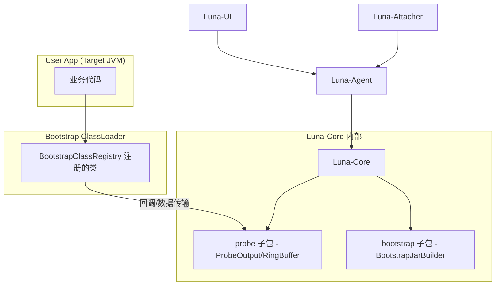

# 依赖规则

## 依赖方向

```text
Luna-UI → Luna-Agent → Luna-Core
Luna-Attacher → Luna-Agent
ProbeOutput ← 业务代码（被注入的字节码调用）
ProbeOutput → RingBuffer → LogDispatcher → WebSocket
```

所有依赖指向内层。外层引用内层接口，内层不依赖外层。

---

## 依赖关系图



---

## 类隔离策略

| 策略 | 说明 |
|------|------|
| LunaAgentClassLoader | 自定义 ClassLoader，打破双亲委派，隔离 Agent 依赖 |
| Maven Shade | 将 ASM 重命名为 fun.efto.luna.shade.asm |
| Bootstrap ClassLoader 注入 | BootstrapJarBuilder 构建 Bootstrap JAR，ProbeOutput 全局可见 |
| Log4j2 Shade | Agent 日志框架重命名隔离 |
| PluginClassLoader | 插件级 ClassLoader 隔离（动态加载的插件） |

---

## 技术栈版本

### 后端

| 类别 | 技术 | 版本 | 用途 |
|------|------|------|------|
| **字节码操作** | ASM | 9.4 | 方法级/行号级字节码注入 |
| **字节码操作** | ByteKit | 0.1.6 | 方法级注入（ASM 之上的高层抽象） |
| **反编译** | CFR | 0.152 | 已加载类源码反编译 |
| **Web 服务器** | Jetty | 9.4.53 | 内嵌 HTTP + WebSocket 服务器 |
| **JSON** | FastJSON | 2.0.40 | 请求/响应序列化 |
| **日志** | Log4j2 (Shade) | 2.20.0 | Agent 自身日志（重命名隔离） |
| **构建** | Maven Shade | 3.5.1 | Fat JAR + ASM 重命名 |
| **Java** | JDK | 8+ | 兼容性基线 |

### 前端

| 类别 | 技术 | 版本 | 用途 |
|------|------|------|------|
| **框架** | Vue | 3.2+ | 响应式 UI |
| **构建** | Vite | 3.0+ | 开发服务器 + 构建 |
| **UI 组件** | Element Plus | 2.2+ | 组件库 |
| **CSS** | Tailwind CSS | 4.2+ | 原子化样式 |
| **代码编辑** | Monaco Editor | 0.54+ | Java 语法高亮 |
| **国际化** | vue-i18n | 9.14+ | 中英文切换 |
| **E2E 测试** | Playwright | 1.52+ | 端到端测试 |

---

## 变更记录

| 日期 | 变更内容 | 变更人 | 关联变更 |
|------|----------|--------|----------|
| 2026/06/16 | 初始版本 | Tony.L | — |
| 2026/06/17 | 迁移旧知识库内容：技术栈版本表 | Tony.L | — |
| 2026/06/17 | 从 architecture-overview.md 拆分为独立文件 | Tony.L | architecture-overview.md 拆分 |
