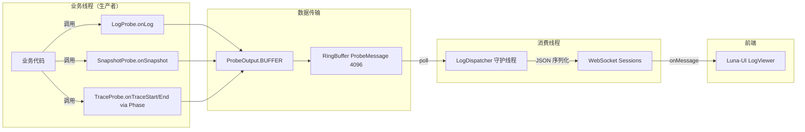

# 业务流程

> **文档定位**: 定义系统数据消费流程与前端扩展点体系
> **更新时机**: 流程变更、扩展点变化时更新
> **读者**: 架构师、开发者

---

## 4. 数据消费流程

**关键设计决策**:
- 所有数据统一投递到同一个 `RingBuffer<ProbeMessage>`
- 满队列丢弃，保护业务线程
- 无 WebSocket 连接时仍消费（丢弃），防止 RingBuffer 积压 OOM
- `LogDispatcher` 无数据时 `Thread.sleep(1)` 避免 CPU 空转

---

## 5. 前端扩展点体系

插件化架构下，前端采用**数据驱动，框架渲染**策略——插件只声明数据，框架用现有组件动态渲染。

### 5.1 设计原则

5 个 Tab 是应用框架，插件只扩展 Tab 内的数据和功能，不添加新 Tab。插件的核心价值是提供新的注入能力和数据格式，而非新的页面布局。

### 5.2 扩展点定义（6 个）

| 扩展点 | 说明 | 数据源 | 所在 Tab | 状态 |
|--------|------|--------|---------|------|
| EP-1 注入类型扩展 | 注册新的注入位置选项 | `ProbeHandler.supportedInjectionLocations()` | 类树 | 已实现（快捷菜单 + InjectionDialog） |
| EP-2 表达式协议扩展 | 注册新的代码协议 | `CodeEngine.getName()` | 类树 | 已实现（快捷菜单 + InjectionDialog） |
| EP-3 模板库扩展 | 插件提供的 RuleTemplate 展示入口 | `PluginManager.listPlugins()` | 规则配置 | 延后 |
| EP-4 插件管理 | 插件列表、启用/禁用/安装/卸载 | `/api/plugins/*` | 插件管理(新) | 延后 |
| EP-5 探针行为 | 快捷菜单行为 + 配置表单 | `ProbeHandler.getQuickActionBehavior()` + `getConfigSchema()` | 类树 | 已实现 |
| EP-6 探针元数据 | 显示名、图标、分类、Glyph 颜色 | `ProbeHandler.getDisplayName()` / `getIcon()` / `getGlyphColor()` 等 | 类树 | 已实现 |

**聚合 API**: `/api/plugins/ui-manifest` 返回所有插件的 UI 扩展信息，前端据此动态渲染。

### 5.3 前后端扩展点对照表

| 前端扩展点 | 对应后端扩展点 | 数据来源 | 所在 Tab | 状态 |
|-----------|-------------|---------|---------|------|
| EP-1 注入类型 | InjectionType 注册 | ui-manifest.injectionTypes | 类树 | 已实现 |
| EP-2 表达式协议 | ExpressionHandler 注册 | ui-manifest.expressionProtocols | 类树 | 已实现 |
| EP-3 模板库 | RuleTemplate 注册 | ui-manifest.templates | 规则配置 | 延后 |
| EP-4 插件管理 | PluginManager API | /api/plugins/* | 插件管理(新) | 延后 |
| EP-5 探针行为 | ProbeHandler.getQuickActionBehavior() + getConfigSchema() | ui-manifest.probeTypes.quickActionBehavior + configSchema | 类树 | 已实现 |
| EP-6 探针元数据 | ProbeHandler.getDisplayName/getIcon/getCategory/getGlyphColor/getConfigSchema | ui-manifest.probeTypes | 类树 | 已实现 |

### 5.4 探针快捷菜单行为

插件通过 `ProbeHandler.getQuickActionBehavior()` 声明快捷菜单点击后的行为：

| 行为 | 说明 | 触发条件 |
|------|------|----------|
| DIRECT | 一键注入，不弹表单 | `getConfigSchema()` 为空时默认 |
| FORM | 弹配置表单 | `getConfigSchema()` 非空时默认 |

表单字段由 `ProbeHandler.getConfigSchema()` 定义，支持 4 种基础类型：text / number / select / textarea。

内置插件行为：

| 插件 | 行为 | configSchema |
|------|------|-------------|
| LOG | FORM | code(textarea,required) + condition(text) |
| SNAPSHOT | FORM | 空（默认 DIRECT，但 SnapshotProbeHandler 显式返回 FORM 以支持行号选择） |
| TRACE | FORM | code(text) |

---

## 变更记录

| 日期 | 变更内容 | 变更人 |
|------|----------|--------|
| 2026/06/17 | 迁移补充：数据消费流程图、前端扩展点体系(4 EP) | Tony.L |
| 2026/06/17 | 从 business-capabilities.md 拆分 | Tony.L |
| 2026/06/17 | 扩展点从 4 个扩展为 6 个（新增 EP-5/EP-6），新增 5.4 探针快捷菜单行为 | Tony.L |
| 2026/06/20 | EP-5/EP-6 状态从 ADR-015 更新为已实现，EP-1/EP-2 扩展到快捷菜单 | Tony.L |
| 2026/07/03 | EP-6 元数据字段更新（删除 getDefaultCode/getLocationLabels，新增 getGlyphColor）、TRACE 数据流改为 Phase | Tony.L | TRACE 重构 |
