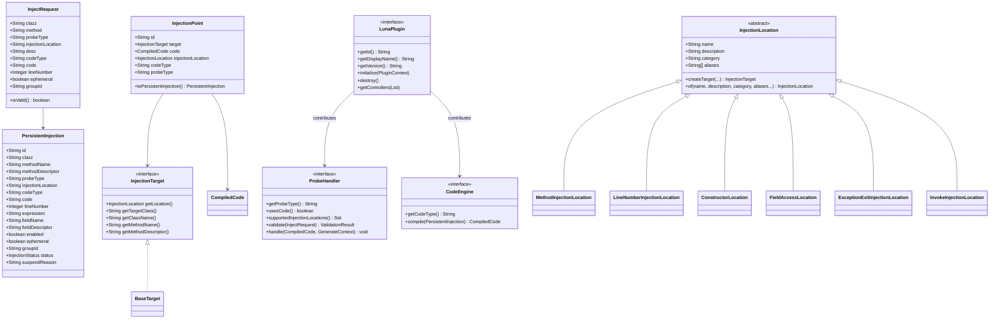

# 实体 (Entity)

> **文档定位**: 定义核心业务实体、属性、业务规则
> **更新时机**: 新增/修改实体属性或业务规则时更新
> **读者**: 架构师、开发者

---

## 1. 领域对象总览

### 1.1 三层模型

Luna 注入域采用三层模型，分离配置、运行时和编译缓存：

```text
InjectionDefinition (配置层 - 规划中)
       │ materialize()
       ▼
PersistentInjection (持久化层 - 当前实现)
       │ InjectionPointFactory.create()
       ▼
InjectionPoint (运行时层 - 编译缓存)
```

> **当前状态**: InjectionDefinition 层尚未实现，当前由 PersistentInjection 同时承担配置和持久化职责。

### 1.2 领域对象关系图



---

## 2. 实体 (Entity)

### 2.1 InjectionPoint

**定义**: 注入点，运行时字节码注入的最小单元，由 UUID 标识。

**属性**:

| 属性名 | 类型 | 说明 | 约束 |
|--------|------|------|------|
| id | String | UUID 唯一标识 | 全局唯一 |
| target | InjectionTarget | 注入目标 | 非空 |
| code | CompiledCode | 编译后的代码 | 非空 |
| injectionLocation | InjectionLocation | 注入位置类型（派生自 target.getLocation()） | 非空 |
| codeType | String | 代码类型 | EXPRESSION/JAVA/SNAPSHOT |
| probeType | String | 探针类型 | 非空 |
| source | PersistentInjection | 原始持久化实体引用 | 非空 |

**创建流程**:

```java
InjectionPoint point = InjectionPointFactory.create(persistentInjection);
// 内部流程:
// 1. 根据 injectionLocation 创建 InjectionTarget (MethodTarget/LineNumberTarget/...)
// 2. 根据 probeType + code 创建 CompiledCode
// 3. 组装 InjectionPoint
```

**业务规则**:
- 同一类的多个注入点按顺序逐个应用
- 注入点可移除，移除后触发 retransform 恢复
- 通过 `toPersistentInjection()` 转换为持久化形态

**对应代码**:
- `luna-core/injection/InjectionPoint.java`
- `luna-core/injection/InjectionPointFactory.java` — 工厂方法

---

### 2.2 PersistentInjection

**定义**: 持久化注入记录，InjectionPoint 的持久化形态。

**属性**:

| 属性名 | 类型 | 必填 | 说明 | 约束 |
|--------|------|------|------|------|
| id | String | 是 | 唯一标识 | 全局唯一 |
| clazz | String | 是 | 目标类全限定名 | 非空，支持通配符 |
| methodName | String | 是 | 目标方法名 | 非空 |
| methodDescriptor | String | 否 | 方法描述符 | 可选 |
| probeType | String | 是 | 探针类型 | log/snapshot/trace 等 |
| injectionLocation | String | 是 | 注入位置名称 | 非空，对应 InjectionLocation 的 name |
| codeType | String | 是 | 代码类型 | EXPRESSION/JAVA/SNAPSHOT |
| code | String | 是 | 注入内容 | 非空 |
| lineNumber | Integer | 否 | 行号 | 行号注入时必填 |
| expression | String | 否 | 条件表达式 | 可选 |
| fieldName | String | 否 | 字段名 | 字段访问注入时必填 |
| fieldDescriptor | String | 否 | 字段描述符 | 字段访问注入时可选 |
| enabled | boolean | 是 | 是否启用 | 默认 true |
| ephemeral | boolean | 否 | 是否临时注入 | 默认 false |
| groupId | String | 否 | 分组标识 | 可选 |
| status | InjectionStatus | 是 | 状态 | ACTIVE/SUSPENDED/DISABLED |
| suspendReason | String | 否 | 挂起原因 | SUSPENDED 时有值 |

**协议前缀 (code 字段)**:

```text
${condition}::protocol:content
     ↑           ↑        ↑
  条件表达式    协议类型   协议内容
```

| 协议 | 格式 | 说明 |
|------|------|------|
| 日志 | `log:消息 $1 $varName` | 输出日志，支持变量引用 |
| 快照 | `snapshot:true` | 捕获局部变量快照 |
| 方法耗时 | `trace:around` | method_around 单注入点，Phase.ENTER/EXIT 自动生成 start/end |

> **注意**: TRACE 探针使用 `method_around` 单注入点模型，不再使用 trace:start/trace:end:N/trace:alert:N 三个独立协议。threshold 参数通过 configSchema 传递，handle() 根据 ctx.phase() 自动生成 onTraceStart 或 onTraceEnd 代码。

**对应代码**:
- `luna-core/injection/PersistentInjection.java`

---

### 2.3 LunaPlugin

**定义**: 插件实体，可贡献多种扩展能力。

**完整接口定义**:

```java
public interface LunaPlugin {
    String getId();                    // 插件唯一标识
    String getDisplayName();           // 显示名称
    String getVersion();               // 版本号
    String getAuthor();                // 作者
    String getCategory();              // 分类：injection / observability / debug / performance
    default List<String> getDependencies() { return Collections.emptyList(); }
    void initialize(PluginContext context);  // 初始化
    default void destroy() {}                // 销毁
    default void getControllers(List<LunaController> controllers) {} // Web 扩展
}
```

**属性**:

| 属性名 | 类型 | 说明 |
|--------|------|------|
| id | String | 插件标识，全局唯一 |
| displayName | String | 显示名称 |
| version | String | 版本号 |
| author | String | 作者 |
| category | String | 分类 |
| dependencies | List | 依赖的其他插件 |

**业务规则**:
- 插件可贡献：ProbeHandler、CodeEngine、InjectionLocation、BytecodeInjector、LunaController
- 通过 PluginContext 注册所有贡献
- 卸载时自动清理所有注册项
- 并发安全：StampedLock 保护 transform 操作

**对应代码**:
- `luna-core/plugin/LunaPlugin.java`

---

### 2.4 CoreCapabilityRecord

**定义**: 核心能力记录，描述系统启动后的能力状态。

**属性**:

| 属性名 | 类型 | 说明 |
|--------|------|------|
| capabilityId | String | 能力标识 |
| displayName | String | 显示名称 |
| kind | CapabilityKind | KERNEL / RUNTIME_SUPPORT / ADAPTER |
| lifecyclePolicy | LifecyclePolicy | CORE_ONLY / BUILTIN_PLUGIN / DYNAMIC_PLUGIN |
| readinessState | ReadinessState | NOT_INITIALIZED / READY / DEGRADED / FAILED |
| providedEntries | List<String> | 提供的类/接口 |
| dependencies | List<String> | 依赖的其他能力 |

**对应代码**:
- `luna-core/bootstrap/capability/CoreCapabilityRecord.java`

---

## 变更记录

| 日期 | 变更内容 | 变更人 |
|------|----------|--------|
| 2026/06/16 | 初始版本 | Tony.L |
| 2026/06/16 | 对照代码补充：InjectionLocation 多态、Port 接口、CoreCapability、实际枚举值 | Tony.L |
| 2026/06/17 | 迁移补充：三层模型、PersistentInjection协议前缀表、InjectionPoint完整字段+创建流程、InjectionTarget classDiagram、InjectionLocation完整表(含适用目标/注册状态)、LunaPlugin完整接口、ProbeHandler完整接口+对照表、PluginContext接口、PluginRegistrationRecord、注入状态流转图 | Tony.L |
| 2026/06/17 | 代码一致性修正：PersistentInjection/InjectRequest.injectionLocation类型改为String、lineNumber类型改为Integer、LunaPlugin.getControllers签名修正、ConstructorLocation/FieldAccessLocation标注为规划中未实现、PluginRegistrationRecord字段修正、CodeType标注为String无枚举约束、ProbeMessage.payload改为String、CoreCapabilityRecord补充displayName/dependencies字段及providedEntries类型修正、InjectionPoint.injectionLocation标注为派生属性、InjectionLocation.of()补充description参数、新增PluginLifecycleListener接口(7个方法) | Tony.L |
| 2026/06/17 | 从 domain-model.md 拆分为目录结构 | Tony.L |
| 2026/07/03 | InjectionLocation 补充 category 字段、TRACE 协议改为 method_around 单注入点 | Tony.L | TRACE 重构 |
