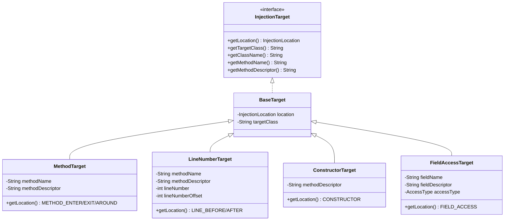
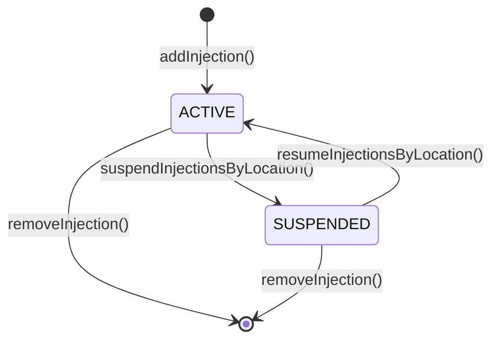

# 值对象 (Value Object) & 枚举类型

> **文档定位**: 定义值对象、接口、枚举类型
> **更新时机**: 新增/修改值对象或枚举时更新
> **读者**: 架构师、开发者

---

## 3. 值对象 (Value Object)

### 3.1 InjectionLocation

**定义**: 注入位置，描述注入在方法/类中的哪个位置。抽象类，子类为具体位置。

**子类型**:

| 子类型 | 静态实例 | 说明 | 适用目标 | 注册状态 |
|--------|----------|------|---------|---------|
| MethodInjectionLocation | METHOD_ENTER, METHOD_EXIT, METHOD_AROUND | 方法级注入位置，最常用，适用于 LOG/TRACE/INVOCATION | MethodTarget | 已注册 |
| LineNumberInjectionLocation | LINE_BEFORE, LINE_AFTER | 行号级注入位置，适用于 LOG 行级注入 | LineNumberTarget | 已注册 |
| InvokeInjectionLocation | INVOKE | 方法调用注入位置 | MethodTarget | 已注册 |
| ExceptionExitInjectionLocation | EXCEPTION_EXIT | 异常退出（ATHROW 路径）注入位置 | MethodTarget | 已注册 |
| ConstructorLocation | CONSTRUCTOR | 构造器注入位置 | ConstructorTarget | 规划中，未实现 |
| FieldAccessLocation | FIELD_GET, FIELD_SET | 字段访问注入位置 | FieldAccessTarget | 规划中，未实现 |

> **注意**: `ConstructorLocation` 和 `FieldAccessLocation` 当前为规划中状态，代码中尚无对应类定义和注册，不可通过 API 使用。

**对应代码**:
- `luna-core/injection/target/InjectionLocation.java`
- `luna-core/plugin/builtin/method/MethodInjectionLocation.java`
- `luna-core/plugin/builtin/line/LineNumberInjectionLocation.java`
- `luna-core/plugin/builtin/invoke/InvokeInjectionLocation.java`
- `luna-core/plugin/builtin/exception/ExceptionExitInjectionLocation.java`

---

### 3.2 InjectionTarget

**定义**: 注入目标，描述注入的目标类和方法。

**子类型**: BaseTarget, MethodTarget, LineNumberTarget, ConstructorTarget, FieldAccessTarget

**类图**:



---

### 3.3 CompiledCode

**定义**: 编译后的注入代码。

**属性**: condition (String) + content (String) + segments (List)

**对应代码**:
- `luna-core/injection/code/CompiledCode.java`

---

### 3.4 ProbeMessage

**定义**: 探针消息，注入代码运行时产生的数据。

**属性**: type (String) + payload (String) + timestamp (long) + structuredPayload (Map<String, Object>)

> **structuredPayload**: 结构化数据载荷，用于前端按 payload 类型分派渲染。LOG/SNAPSHOT 使用纯文本 payload（structuredPayload 为 null），INVOCATION 等需要结构化展示的探针使用 structuredPayload 传递 traceId/spans 等数据。

**对应代码**:
- `luna-core/probe/ProbeMessage.java`

---

### 3.4.1 GenerateContext.Phase

**定义**: 字节码生成的阶段信息，告诉 ProbeHandler 当前是在方法入口还是出口生成代码。

**枚举值**:

| 值 | 说明 |
|----|------|
| ENTER | 方法入口阶段 |
| EXIT | 方法出口阶段 |

**使用场景**: 当 InjectionLocation 为 `method_around` 时，`handle()` 会被调用两次——Phase.ENTER 一次、Phase.EXIT 一次。ProbeHandler 通过 `ctx.phase()` 判断当前阶段，生成不同的探针代码。

```java
public interface GenerateContext {
    // ... 其他方法 ...
    default Phase phase() { return Phase.ENTER; }  // 默认 ENTER，非 AROUND 场景无影响

    enum Phase { ENTER, EXIT }
}
```

**对应代码**:
- `luna-core/plugin/GenerateContext.java`

---

### 3.5 ValidationResult

**定义**: 验证结果。

**工厂方法**: ok() / fail(String) / okWithWarnings(List)

**对应代码**:
- `luna-core/plugin/ValidationResult.java`

---

### 3.6 PluginInfo

**定义**: 插件信息值对象。

**属性**: id, displayName, version, author, category, state, dependencies

---

### 3.7 PluginLifecycleListener

**定义**: 插件生命周期监听接口，用于感知插件的加载、卸载、更新等生命周期事件。

**完整接口定义**:

```java
public interface PluginLifecycleListener {
    default void onLoaded(PluginInfo info) {}
    default void onUnloaded(PluginInfo info) {}
    default void onUpdated(PluginInfo info, String oldVersion, String newVersion) {}
    default void onLoadFailed(String pluginId, String errorMessage) {}
    default void onUnloadFailed(String pluginId, String errorMessage) {}
    default void onDisabled(PluginInfo info) {}
    default void onEnabled(PluginInfo info) {}
}
```

**对应代码**:
- `luna-core/plugin/PluginLifecycleListener.java`

---

### 3.8 ProbeHandler

**定义**: 探针行为接口，定义探针的验证和字节码生成行为。

**完整接口定义**:

```java
public interface ProbeHandler {
    // 核心方法（7 个）
    String getProbeType();                             // 探针类型标识
    boolean usesCode();                                // 是否需要代码内容
    String getCodeType();                              // 代码类型（String），当 usesCode() 为 true 时必须返回非 null 值（如 "EXPRESSION"）
    Set<String> supportedInjectionLocations();         // 支持的注入位置
    ValidationResult validate(InjectRequest request);  // 验证请求
    void handle(CompiledCode code, GenerateContext ctx); // 生成字节码
    default void onDelete(PersistentInjection injection, InjectionRepository repository, InjectionRegistry registry) {} // 删除前钩子

    // UI 元数据方法（7 个 default）
    default String getDisplayName() { return getProbeType(); }  // 显示名称
    default String getSyntax() { return ""; }                  // 代码语法提示
    default String getIcon() { return ""; }                    // Font Awesome 图标类名（如 "fas fa-print"）
    default String getCategory() { return "injection"; }       // 分类
    default String getGlyphColor() { return ""; }              // 编辑器 Glyph 颜色（CSS 颜色值）
    default QuickActionBehavior getQuickActionBehavior() {     // 快捷菜单行为
        return getConfigSchema().isEmpty() ? QuickActionBehavior.DIRECT : QuickActionBehavior.FORM;
    }
    default List<FormFieldSchema> getConfigSchema() { return Collections.emptyList(); } // 配置表单 schema
}
```

**探针行为对照表**:

| ProbeHandler | usesCode | getCodeType | 支持位置 | 验证规则 | 生成行为 | 删除行为 |
|-------------|----------|-------------|---------|---------|---------|---------|
| `LogProbeHandler` | true | "EXPRESSION" | method_enter/exit/around, line_before/after, invoke, exception_exit | code 非空 | 调用 LogProbe.onLog() | 默认（无关联清理） |
| `SnapshotProbeHandler` | false | null | method_enter/exit, line_before/after | 无需 code | 调用 SnapshotProbe.onSnapshot() | 默认（无关联清理） |
| `TraceProbeHandler` | false | null | method_around | 无需 code | 根据 ctx.phase() 生成 onTraceStart(ENTER) / onTraceEnd(EXIT) | 默认（无关联清理） |

> **注意**: TRACE 探针使用 `method_around` 单注入点模型，`handle()` 在 AROUND 时被调用两次（Phase.ENTER + Phase.EXIT），根据 `ctx.phase()` 生成不同的探针代码。用户只需选择"方法耗时"即可，不需要关心入口/出口的实现细节。

> **重要**: `ByteKitInjectorBase.inject()` 在 `probeHandler != null` 时始终走 `injectWithExpression()` 路径（ASM 表达式注入），只有 `probeHandler == null` 时才走 `injectWithByteKit()` 路径（ByteKit 拦截器注入）。`usesCode` 不再作为路由条件。

> **注意**: ConditionalBreakpointPlugin 未注册 ProbeHandler，其行号快照功能通过 SnapshotProbeHandler 实现。

---

### 3.8.1 InjectionLocationUIDescriptor

**定义**: 注入位置的 UI 描述符，与 InjectionLocation（核心领域对象）分离，仅包含 UI 展示属性。

**属性**:

| 属性名 | 类型 | 说明 |
|--------|------|------|
| categoryLabel | String | 位置分类的显示标签（如"方法级"、"行级"） |
| color | String | 位置颜色（CSS 颜色值，用于前端分组显示） |

**注册方式**:
```java
ctx.registerInjectionLocation(location, new InjectionLocationUIDescriptor("方法级", "#6366f1"));
```

**设计约束**: InjectionLocation 核心领域对象不包含 UI 属性（color、categoryLabel），UI 元数据通过 InjectionLocationUIDescriptor 在插件注册时提供，由 InjectionTypeRegistry 存储。

**对应代码**:
- `luna-core/plugin/InjectionLocationUIDescriptor.java`

---

### 3.9 PluginContext

**定义**: 插件初始化时接收的上下文，通过它注册扩展点。

```java
public interface PluginContext {
    void registerProbeHandler(ProbeHandler handler);
    void registerInjectionLocation(InjectionLocation location);
    void registerInjectionLocation(InjectionLocation location, InjectionLocationUIDescriptor uiDescriptor); // 新增重载
    void registerCodeEngine(CodeEngine engine);
    void registerInjector(InjectionLocation location, BytecodeInjector injector);
    void registerBootstrapClass(String internalName);
    ClassAnalyzer getClassAnalyzer();
    Decompiler getDecompiler();
    LogEmitter getLogEmitter();
    RingBuffer<ProbeMessage> getLogBuffer();
    Retransformer getRetransformer();
    Map<String, String> getPluginConfig();
    void savePluginConfig(Map<String, String> config);
    byte[] getClassBytes(String className);                    // 新增：访问目标 JVM 已加载类的字节码
    Set<String> getLoadedClassNames();                         // 新增：获取已加载类列表
    String inject(InjectRequest request);                      // 新增：插件触发的注入能力
}
```

**实现**: `PluginContextImpl`，内部委托各 Registry 的注册方法，同时双写到 `PluginRegistrationRecord`。

> **设计约束**: PluginContext 无任何 `unregister*` 方法。卸载清理由框架根据 PluginRegistrationRecord 自动完成。
>
> **新增能力说明**:
> - `getClassBytes()` — 插件访问目标 JVM 已加载类的字节码，用于静态分析（如调用图发现、依赖分析）
> - `getLoadedClassNames()` — 获取目标 JVM 已加载类列表，用于模式匹配
> - `inject()` — 插件在 onInject 钩子中创建关联注入点（如调用链追踪的批量注入）

---

### 3.10 PluginRegistrationRecord

**定义**: 框架为每个插件维护的注册快照，卸载时自动清理。

```java
public class PluginRegistrationRecord {
    String pluginId;
    List<ProbeHandler> registeredProbeHandlers;
    List<InjectionLocation> injectionLocations;
    List<CodeEngine> registeredCodeEngines;
    List<LunaController> registeredControllers;
    List<BytecodeInjector> injectors;
    List<String> bootstrapClasses;
}
```

**卸载时**: 遍历 record，自动从各 Registry 注销。

---

### 3.11 注入状态流转



| 状态 | 说明 | Registry 状态 |
|------|------|--------------|
| `ACTIVE` | 注入点激活 | 已注册到 InjectionRegistry |
| `SUSPENDED` | 注入点挂起 | 已从 InjectionRegistry 注销 |
| `DISABLED` | 注入点禁用 | 已从 InjectionRegistry 注销 |

**挂起场景**: 插件卸载时，该插件注册的注入位置对应的注入点会被挂起。

---

## 4. 枚举类型

### 4.1 InjectionStatus

```java
ACTIVE      // 活跃
SUSPENDED   // 挂起（插件卸载时关联注入点被挂起）
DISABLED    // 停用
```

### 4.2 CodeType

> **注意**: `codeType` 不是枚举类型，而是 `String` 类型，由 `ProbeHandler.getCodeType()` 声明。当 `usesCode()` 返回 `true` 时，`getCodeType()` 必须返回非 null 值（如 LOG 探针返回 `"EXPRESSION"`）；当 `usesCode()` 返回 `false` 时，`getCodeType()` 返回 `null`。以下为约定值：

```text
EXPRESSION  // 表达式类型（核心，LOG 探针使用）
JAVA        // Java 代码类型
SNAPSHOT    // 快照类型
```

### 4.3 PluginState

```java
LOADING     // 加载中
ACTIVE      // 活跃
DISABLED    // 已禁用
UNLOADING   // 卸载中
UNLOADED    // 已卸载
```

### 4.4 CapabilityKind

```java
KERNEL           // 内核能力
RUNTIME_SUPPORT  // 运行时支撑
ADAPTER          // 适配器
```

### 4.5 ReadinessState

```java
NOT_INITIALIZED  // 未初始化
READY            // 就绪
DEGRADED         // 降级
FAILED           // 失败
```

### 4.6 LifecyclePolicy

```java
CORE_ONLY       // 仅核心
BUILTIN_PLUGIN  // 内置插件
DYNAMIC_PLUGIN  // 动态插件
```

---

## 变更记录

| 日期 | 变更内容 | 变更人 |
|------|----------|--------|
| 2026/06/16 | 初始版本 | Tony.L |
| 2026/06/16 | 对照代码补充：InjectionLocation 多态、Port 接口、CoreCapability、实际枚举值 | Tony.L |
| 2026/06/17 | 迁移补充：三层模型、PersistentInjection协议前缀表、InjectionPoint完整字段+创建流程、InjectionTarget classDiagram、InjectionLocation完整表(含适用目标/注册状态)、LunaPlugin完整接口、ProbeHandler完整接口+对照表、PluginContext接口、PluginRegistrationRecord、注入状态流转图 | Tony.L |
| 2026/06/17 | 代码一致性修正：PersistentInjection/InjectRequest.injectionLocation类型改为String、lineNumber类型改为Integer、LunaPlugin.getControllers签名修正、ConstructorLocation/FieldAccessLocation标注为规划中未实现、PluginRegistrationRecord字段修正、CodeType标注为String无枚举约束、ProbeMessage.payload改为String、CoreCapabilityRecord补充displayName/dependencies字段及providedEntries类型修正、InjectionPoint.injectionLocation标注为派生属性、InjectionLocation.of()补充description参数、新增PluginLifecycleListener接口(7个方法) | Tony.L |
| 2026/06/17 | 从 domain-model.md 拆分为目录结构 | Tony.L |
| 2026/07/03 | 插件扩展机制同步：ProbeHandler 补充 7 个 UI 元数据方法、TRACE 改为 method_around + Phase、新增 InjectionLocationUIDescriptor、GenerateContext.Phase、ProbeMessage.structuredPayload、PluginContext 新增 getClassBytes/getLoadedClassNames/inject | Tony.L |
| 2026/07/19 | 同步InjectionLocation为抽象类体系+codeType改为String：InjectionLocation子类静态实例名称修正(METHOD_ENTER/METHOD_EXIT/METHOD_AROUND/LINE_BEFORE/LINE_AFTER/FIELD_GET/FIELD_SET/CONSTRUCTOR)、说明补充最常用场景和ATHROW路径、对应代码补充InvokeInjectionLocation和ExceptionExitInjectionLocation；ProbeHandler新增getCodeType()方法、探针行为对照表补充getCodeType列；CodeType节强调由ProbeHandler.getCodeType()声明及usesCode()为true时必须返回非null | Tony.L |
