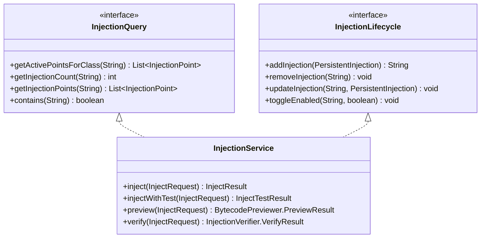

# 服务定义

> **文档定位**: 定义领域服务的职责、依赖、接口
> **更新时机**: 新增服务、修改服务逻辑时更新
> **读者**: 开发者、架构师

---

## 1. 服务总览

| 服务 | 核心职责 | 对应代码 |
|------|----------|----------|
| InjectionService | 注入全生命周期管理（实现 InjectionLifecycle + InjectionQuery） | `luna-core/injection/InjectionService.java` |
| PluginManagerImpl | 插件生命周期管理 | `luna-core/plugin/lifecycle/PluginManagerImpl.java` |
| AgentRuntime | Agent 启动流程编排（11 步） | `luna-agent/runtime/AgentRuntime.java` |
| DefaultInjectionRegistry | 注入点注册与查询（三级索引） | `luna-core/injection/DefaultInjectionRegistry.java` |
| DefaultInjectionRepository | 注入持久化（内存 Map + JSON） | `luna-core/injection/DefaultInjectionRepository.java` |
| CoreCapabilityRegistry | 核心能力注册与就绪管理 | `luna-core/bootstrap/capability/CoreCapabilityRegistry.java` |
| MetricsService | JVM 指标采集 | `luna-agent/web/MetricsService.java` |
| JettyWebServer | Web 服务器 | `luna-agent/web/JettyWebServer.java` |
| ClassScanner | 已加载类扫描 | `luna-agent/clazz/ClassScanner.java` |

---

## 2. InjectionService

### 2.1 职责定义

**核心职责**: 管理注入点的创建、删除、更新、查询全生命周期。

**实现接口**: InjectionLifecycle + InjectionQuery

**具体职责**:
- inject(InjectRequest) — 执行注入
- injectWithTest(InjectRequest) — 带测试的注入
- preview(InjectRequest) — 预览字节码变换
- verify(InjectRequest) — 验证注入效果
- addInjection(PersistentInjection) — 添加注入
- removeInjection(String) — 移除注入
- updateInjection(String, PersistentInjection) — 更新注入
- toggleEnabled(String, boolean) — 启用/停用
- suspendInjectionsByLocation(Set, String) — 按位置挂起
- resumeInjectionsByLocation(Set) — 恢复挂起

**不负责**:
- 字节码具体注入逻辑（委托给 BytecodeInjector）
- 插件管理（委托给 PluginManager）
- 数据持久化（委托给 InjectionRepository）

### 2.2 依赖关系

- InjectionRegistry — 注入点注册表
- InjectionRepository — 注入持久化
- BytecodeLoader — 字节码加载
- BytecodePreviewer — 字节码预览
- LocalVarValidator — 局部变量验证
- InjectionVerifier — 注入验证
- Retransformer — 类重转换

### 2.3 三层服务架构

注入服务采用三层隔离架构，分离存储、注册和编排职责：

#### InjectionRepository — 纯存储层

```java
public interface InjectionRepository {
    void save(PersistentInjection injection);
    void delete(String id);
    PersistentInjection findById(String id);
    List<PersistentInjection> findAll();
    List<PersistentInjection> findByGroupId(String groupId);
}
```

**职责**: 仅负责 PersistentInjection 的 CRUD 操作，无业务逻辑。
**实现**: `DefaultInjectionRepository`（内存 ConcurrentHashMap + JSON 持久化）

#### InjectionRegistry — 高性能内存注册表

```java
public interface InjectionRegistry extends InjectionQuery {
    void register(InjectionPoint point);
    void unregister(String pointId);
    void unregisterByPluginId(String pluginId);
}
```

**职责**: 管理激活且已编译的 InjectionPoint，供 GlobalClassFileTransformer 查询。
**实现**: `DefaultInjectionRegistry`（三级索引: exactIndex + PackageTrie + regexFallback）

#### InjectionService — 领域编排服务

协调验证 → 存储 → 编译 → 注册 → retransform 的完整注入生命周期。

### 2.4 接口隔离



**设计意图**:
- `InjectionQuery`（只读）: 供 `GlobalClassFileTransformer` 查询，不暴露写操作
- `InjectionLifecycle`（写操作）: 供 Controller 使用

---

## 3. PluginManagerImpl

### 3.1 职责定义

**核心职责**: 管理插件的加载、初始化、卸载、更新全生命周期。

**实现接口**: PluginManager

**具体职责**:
- initializeAll(List<LunaPlugin>) — 初始化所有插件
- load(String) — 加载插件
- unload(String) — 卸载插件
- update(String) — 更新插件
- disable(String) / enable(String) — 禁用/启用
- checkUnloadable(String) — 检查是否可卸载
- listPlugins() — 列出所有插件
- getTransformLock() — 获取 transform 锁（StampedLock）

**不负责**:
- 插件的具体业务逻辑
- 字节码注入（委托给注入器）

### 3.2 依赖关系

- LunaPlugin 接口 — 插件定义
- PluginContext — 插件注册上下文
- InjectionTypeRegistry / ProbeHandlerRegistry / CodeEngineRegistry — 注册表
- InjectionService — 注入点管理
- WebServer — Controller 注册/注销
- AffectedClassTracker — 追踪插件影响的类

### 3.3 PluginManager 接口定义

```java
public interface PluginManager {
    PluginLoadResult load(String pluginId);
    PluginUnloadResult unload(String pluginId);
    PluginUpdateResult update(String pluginId);
    UnloadCheckResult checkUnloadable(String pluginId);
    void disable(String pluginId);
    void enable(String pluginId);
    List<PluginInfo> listPlugins();
    LunaPlugin getPlugin(String pluginId);
    PluginState getState(String pluginId);
    void addListener(PluginLifecycleListener listener);
    void removeListener(PluginLifecycleListener listener);
    StampedLock getTransformLock();
    Map<String, String> getPluginConfig(String pluginId);
    void savePluginConfig(String pluginId, Map<String, String> config);
    default Set<InjectionLocation> getInjectionLocationsForPlugin(String pluginId) { return Collections.emptySet(); }
    default Set<ProbeHandler> getProbeHandlersForPlugin(String pluginId) { return Collections.emptySet(); }
}
```

**并发安全**: 使用 `StampedLock` 实现读写分离
- 注入操作持读锁（允许多线程并发注入）
- 加载/卸载操作持写锁（独占，阻塞注入）

### 3.4 PluginLifecycleListener 事件体系

```java
public interface PluginLifecycleListener {
    default void onLoaded(PluginInfo info) {}
    default void onUnloaded(PluginInfo info) {}
    default void onUpdated(PluginInfo info, String oldVersion, String newVersion) {}
    default void onLoadFailed(String pluginId, String errorMessage) {}
    default void onUnloadFailed(String pluginId, String errorMessage) {}
    default void onDisabled(PluginInfo info) {}
    default void onEnabled(PluginInfo info) {}
}
```

**事件消费方**:

| 消费方 | 监听的事件 | 用途 |
|--------|-----------|------|
| luna-ui | 全部 | 实时刷新插件列表、弹出通知 |
| 审计日志 | 全部 | 记录插件变更操作，用于安全审计 |
| MarketClient | onLoaded / onUnloaded | 同步本地安装状态与远端市场 |
| RuleManager | onUnloaded | 触发规则挂起检查 |
| PluginManager | onLoaded | 触发挂起规则恢复 |

---

## 4. AgentRuntime

### 4.1 职责定义

**核心职责**: Agent 启动流程编排与就绪管理。

**11 步启动流程**:

```text
1. InitializerManager.getInstance().initializeAll() + InstrumentationHolder.init(inst) — 初始化核心模块 + Instrumentation
2. ClassScanner & ClassResourceHelper 创建 — 类扫描器与资源助手
3. Injection 基础设施组装 — InjectionRegistry + InjectionRepository + Retransformer + InjectionService
3.5. 恢复持久化注入 — 从 Repository 恢复到 Registry
4. PluginManager 创建 — ReadyGate + PluginManagerImpl
5. 初始化内置插件 — BuiltinPluginProvider + initializeAll + readyGate.markReady()
6. Web 服务器创建 — JettyWebServer
7. 注册插件管理 Controller — PluginManagerController + PluginUIController
8. 启动 Web 服务器 — JettyWebServer.start()
9. 注册 GlobalClassFileTransformer — inst.addTransformer
10. 对已加载类应用活跃注入 — retransform
11. Shutdown hook — Runtime.getRuntime().addShutdownHook
```

**不负责**:
- 具体业务逻辑
- 类隔离策略（由 LunaAgentClassLoader 负责）

### 4.2 恢复注册步骤详解

| 步骤 | 操作 | 说明 |
|------|------|------|
| 1 | Repository 构造时 `persistenceService.load()` | 从 `luna-injections.json` 加载非 ephemeral 注入到内存 Map |
| 2 | `restorePersistentInjections()` | 遍历 Repository 中所有非 ephemeral 注入，调用 `InjectionPointFactory.create()` 创建 InjectionPoint 并注册到 Registry |
| 3 | `applyActiveInjectionsToLoadedClasses()` | 查询 Registry 获取每个类的活跃注入点，对已加载的类执行 retransform |

> **关键设计**: 恢复注册只做 `InjectionPointFactory.create()` + `Registry.register()`，不调用 `InjectionService.addInjection()`（那会触发重复 save 和逐类 retransform）。恢复后统一由 `applyActiveInjectionsToLoadedClasses` 批量 retransform。

---

## 5. DefaultInjectionRegistry

### 5.1 职责定义

**核心职责**: 注入点注册与查询，实现 InjectionRegistry 接口。

**三级索引**:
1. exactIndex — 精确类名匹配
2. PackageTrie — 包前缀通配符匹配
3. regexFallback — 正则表达式匹配

**对应代码**: `luna-core/injection/DefaultInjectionRegistry.java`

---

## 6. CoreCapabilityRegistry

### 6.1 职责定义

**核心职责**: 核心能力注册与就绪状态管理。

**已注册能力**:

| capabilityId | kind | 说明 |
|--------------|------|------|
| method-target | KERNEL | 方法注入目标 |
| line-target | KERNEL | 行号注入目标 |
| bytecode-assembly | KERNEL | 字节码装配 |
| injection-lifecycle | KERNEL | 注入生命周期 |
| code-compiler-dispatch | KERNEL | 代码编译调度 |
| transform-pipeline | KERNEL | 转换管线 |

**对应代码**: `luna-core/bootstrap/capability/CoreCapabilityRegistry.java`

---

## 7. InjectionDefinition 持久化重构设计

> 来源：`docs/design/injection-definition-persistence-refactor-2026-06-05.md`
> 状态：规划中

### 7.1 三层模型

```text
InjectionDefinition (配置层)
  用户保存的注入配置，可持久化，启动时自动 materialize

RuntimeInjection (运行时层)
  当前运行时生效的注入状态，进入 InjectionManager / pointCache

InjectionPoint (编译缓存层)
  编译后的织入点缓存，由 GlobalClassFileTransformer 消费
```

### 7.2 核心不变量

1. `GlobalClassFileTransformer` 只读 `InjectionQuery`，不读 `InjectionDefinitionStore`
2. `InjectionDefinition` 不直接参与 transform
3. 启动时 `InjectionDefinition` 先 materialize 成 `RuntimeInjection`，再进入 `InjectionManager`
4. 用户在 UI 中只管理 Injection，不再管理独立 Rule
5. 是否持久化是创建 Injection 时的一个选项
6. 插件可以声明某种注入能力是否支持持久化
7. 不支持持久化的注入能力，UI 不展示或禁用"重启后自动恢复"选项

### 7.3 Module 设计

| Module | 职责 |
|--------|------|
| InjectionDefinitionStore | 读写持久化定义（list/get/save/delete） |
| InjectionDefinitionService | 用户层操作（create/update/delete/enable/disable/materialize） |
| InjectionMaterializer | definition → RuntimeInjection 转换（字段映射、校验、过滤） |
| InjectionInitializationReporter | 保存和查询 initialization reports |
| InjectionController | 唯一创建入口，增加 persistenceMode |

### 7.4 TDD 迭代计划

1. **锁住当前持久化意图**：saved definition → restart → materialize → active point
2. **引入 InjectionDefinition**：新增数据模型 + Store
3. **Materializer**：definition → runtime injection + InitializationReport
4. **创建入口增加持久化选项**：temporary / saved 分流
5. **插件声明持久化支持**：PersistenceSupport + InjectionCapabilityDescriptor
6. **移除 Rule 执行路径**：删除 RuleClassFileTransformer
7. **UI 收敛**：删除 Rule 页面，Injection 统一管理

---

## 8. codeType/probeType 正交分离重构设计

> 来源：`docs/design/codetype-probetype-orthogonal-refactor.md`
> 状态：规划中

### 8.1 核心设计

三个维度完全正交：

| 维度 | 回答的问题 | 必填 | 值 |
|------|-----------|------|---|
| `injectionLocation` | WHERE — 注入位置 | ✅ | method_enter, line_before, invoke, ... |
| `probeType` | WHAT — 探针行为 | ✅ | LOG, SNAPSHOT, TRACE |
| `codeType` | HOW — 执行引擎 | ❌ 可选 | EXPRESSION, GROOVY, JS |

**`codeType` 可选**：LOG 需要 code + codeType；SNAPSHOT/TRACE 不需要。

### 8.2 ProbeHandler 自描述接口

```java
public interface ProbeHandler {
    String getProbeType();
    boolean usesCode();
    Set<String> supportedInjectionLocations();
    ValidationResult validate(InjectRequest request);
    void handle(CompiledCode code, GenerateContext ctx);
    default void onDelete(PersistentInjection injection, InjectionRepository repository, InjectionRegistry registry) {}
}
```

**校验分层**：API 层 `probe.validate()` 校验拒绝（返回 400）；注入层静默跳过（打 warn 日志）。

### 8.3 关键重命名

| 旧名 | 新名 |
|------|------|
| `InjectionType` | `InjectionLocation` |
| `ExpressionHandler` | `ProbeHandler` |
| `InjectionCommand` | `InjectRequest` |
| `logContent` | `code` |
| `generateBytecode()` | `handle()` |

### 8.4 TDD 迭代计划

1. **数据模型扩展**：所有模型增加 probeType，injectionType → injectionLocation
2. **InjectionType → InjectionLocation 重命名**
3. **ProbeHandler 重命名 + 自描述能力 + 校验**
4. **CodeEngine + CompiledCode 统一**：合并 CodeCompilerStrategy + BytecodeAssembler
5. **CodeType 枚举消除**：枚举 → String
6. **模板与规则转换器适配**：code 去前缀，SNAPSHOT/TRACE codeType=null
7. **命名清理**：logContent → code，InjectionCommand → InjectRequest
8. **前端适配**：动态获取 Probe/Engine 能力
9. **集成验证与清理**

---

## 9. AgentRuntime 迭代计划

> 来源：`docs/design/agent-runtime-unification-design.md`
> 状态：部分完成

### 9.1 里程碑

| 里程碑 | 覆盖迭代 | 结果 |
|--------|---------|------|
| M1：生产启动合流 | Iteration 1-2 | Agent 生产路径初始化插件，插件管理端点可用 |
| M2：统一注入运行时 | Iteration 3-4 | 新注入和模板注入走 InjectionManager + GlobalClassFileTransformer |
| M3：内置能力可观测化 | Iteration 5 | method/line 由核心能力记录追踪 |
| M4：事务与验证深化 | Iteration 6-7 | 插件热更新和验证运行具备集中 Locality |

### 9.2 迭代详情

| 迭代 | 目标 | 关键任务 |
|------|------|---------|
| 1 | AgentRuntime 骨架 | Agent 变薄，启动顺序进入 AgentRuntime |
| 2 | 生产路径初始化 builtin plugins | BuiltinPluginProvider + PluginManagerImpl.initializeAll() + 注册 Plugin Controllers |
| 3 | 接入 GlobalClassFileTransformer | 新注入路径由 GCT 驱动 |
| 4 | 模板应用迁移到 PersistentInjection | TemplateEngine 输出 PersistentInjection |
| 5 | method/line 内置能力补齐注册追踪 | CoreRegistrationRecord + manifest 合并 |
| 6 | 插件生命周期事务深化 | PluginLifecycleTransaction + rollback invariants |
| 7 | 验证运行统一化 | 删除临时 ClassFileTransformerAdapter，复用统一注入运行时 |

---

## 变更记录

| 日期 | 变更内容 | 变更人 |
|------|----------|--------|
| 2026/06/16 | 初始版本 | Tony.L |
| 2026/06/16 | 对照代码补充：InjectionService 实际方法、PluginManagerImpl 实际接口、AgentRuntime 10步流程、三级索引、CoreCapabilityRegistry | Tony.L |
| 2026/06/17 | 迁移补充：注入流程时序图(3个)、三层服务架构、接口隔离classDiagram、PluginManager完整接口、插件生命周期流程图(3个)、PluginLifecycleListener事件体系、Agent启动恢复流程图 | Tony.L |
| 2026/06/17 | 对照代码修正：InjectionQuery补充contains、InjectionRepository补充findByGroupId、PluginState删除FAILED、AgentRuntime修正为11步、CoreCapabilityRegistry修正为6个KERNEL能力、PluginLifecycleListener修正7个方法及参数、ProbeHandler补充onDelete、InjectionService依赖修正、code-compiler-dispatch kind修正为KERNEL | Tony.L |
