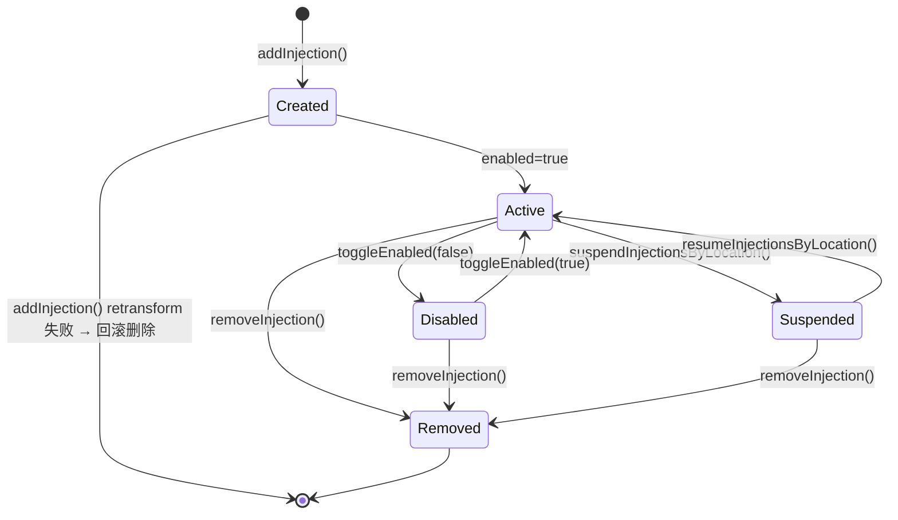
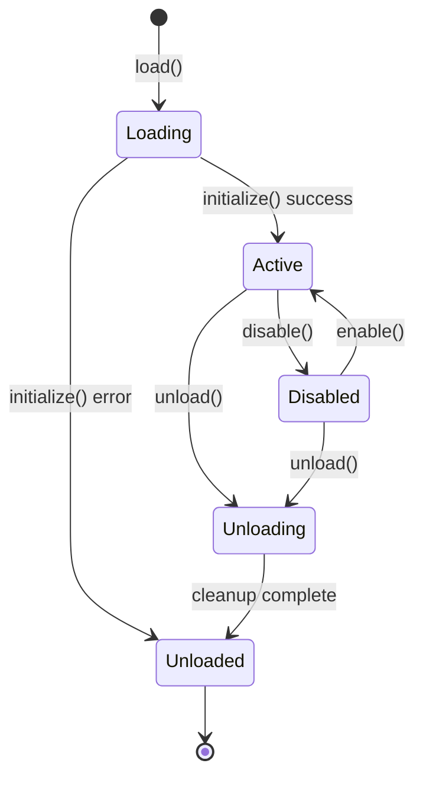
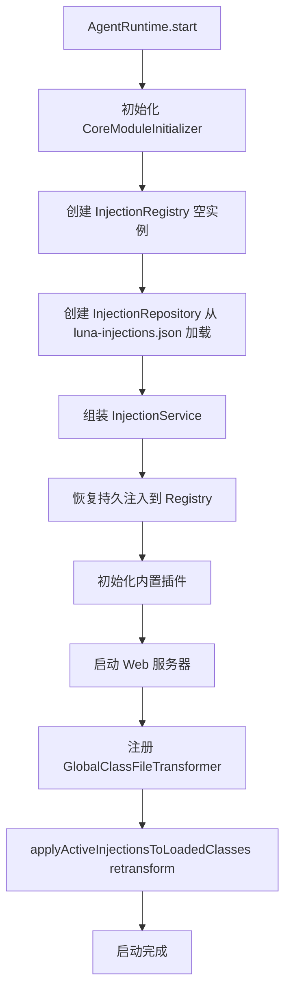
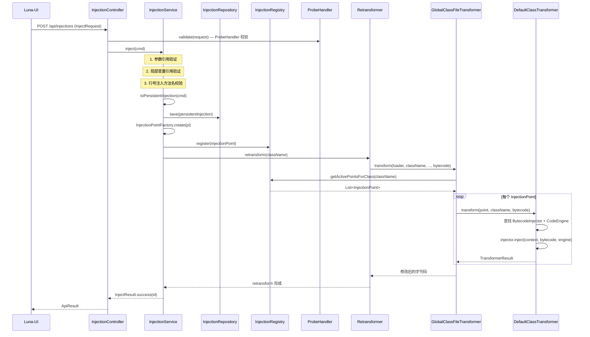
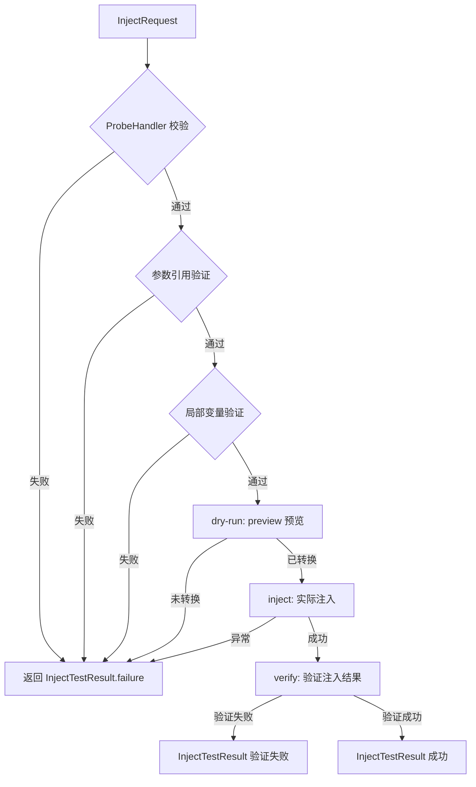
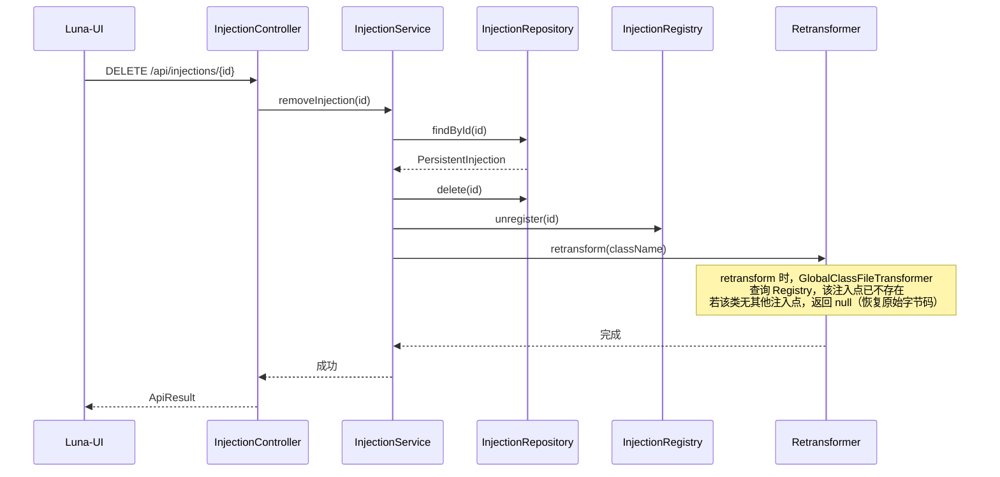
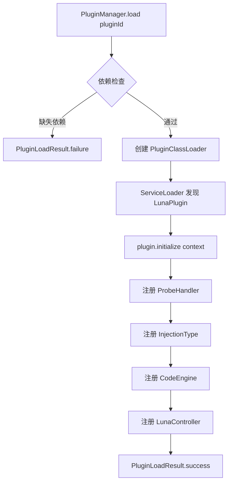
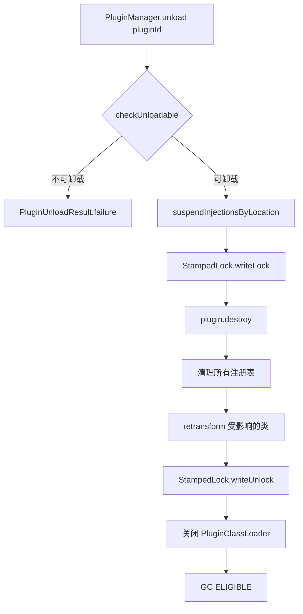
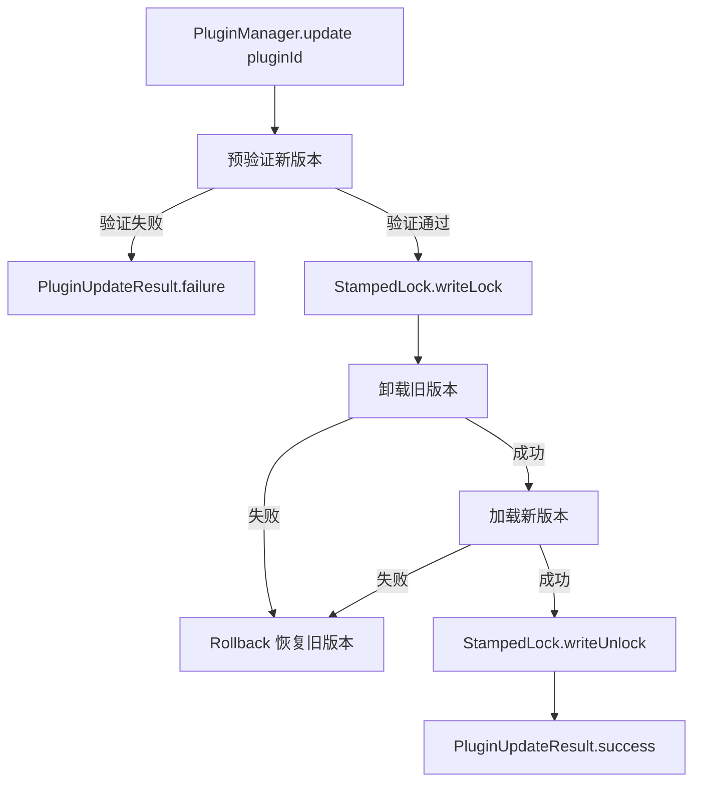

# 状态流转

> **文档定位**: 定义服务状态机、流程时序图
> **更新时机**: 修改状态流转、业务流程时更新
> **读者**: 开发者、架构师

---

## 1. InjectionStatus 状态图

> **回滚路径说明**: `addInjection()` 在 retransform 失败时，会回滚已持久化的 `PersistentInjection`（repository.delete）并从注册表 unregister，抛出 `RuntimeException`。因此 Created 状态的注入不会停留在 ACTIVE 状态，而是被删除回到初始态。

---

## 2. PluginState 状态图

---

## 3. AgentRuntime 启动流程

---

## 4. API 实时注入流程时序图

**关键步骤说明**:

| 步骤 | 说明 | 失败处理 |
|------|------|---------|
| ProbeHandler 校验 | 验证 probeType 合法性、注入位置兼容性 | 返回 InjectResult.failure() |
| 参数引用验证 | 检查 `$N` 引用是否超出方法参数范围 | 返回 InjectResult.failure() |
| 局部变量验证 | 检查 `$varName` 在目标行号处是否可见 | 返回 InjectResult.failure() |
| Repository 存储 | 持久化 PersistentInjection | 异常向上抛出（inject 外层捕获返回 failure） |
| Registry 注册 | 编译并注册 InjectionPoint | 失败时回滚（unregister + repository.delete），抛出 RuntimeException |
| Retransform | 触发 JVM 重新转换类 | 失败时回滚（unregister + repository.delete），抛出 RuntimeException |

**回滚语义说明**（与 `InjectionService` 实际行为一致）:

| 方法 | 失败处理 |
|------|---------|
| `addInjection()` | retransform 失败 → 回滚持久化和注册表（unregister + delete）→ 抛出 `RuntimeException` |
| `updateInjection()` | retransform 失败 → 回滚到旧状态（恢复旧 `PersistentInjection`、重建旧 `InjectionPoint`、retransform 恢复旧字节码） |
| `toggleEnabled()` enable | retransform 失败 → 回滚 enabled 标志为 false + unregister registry 条目 |
| `suspendInjectionsByLocation()` | retransform 失败 → 回滚状态为 ACTIVE + 重新 register + 不加入 suspendedIds |
| `removeInjection()` | retransform 失败 → 仅记录日志（删除操作不需要回滚） |

---

## 5. 注入测试流程 (injectWithTest)

四步验证流程：dry-run → inject → verify → validate

---

## 6. 注入移除流程时序图

---

## 7. 插件加载流程

---

## 8. 插件卸载流程

**卸载关键顺序**: 必须先清空 Registry 强引用，再关 ClassLoader，否则类无法被 GC。

---

## 9. 插件热更新流程

---

## 变更记录

| 日期 | 变更内容 | 变更人 |
|------|----------|--------|
| 2026/06/16 | 初始版本 | Tony.L |
| 2026/06/16 | 对照代码补充：InjectionService 实际方法、PluginManagerImpl 实际接口、AgentRuntime 10步流程、三级索引、CoreCapabilityRegistry | Tony.L |
| 2026/06/17 | 迁移补充：注入流程时序图(3个)、三层服务架构、接口隔离classDiagram、PluginManager完整接口、插件生命周期流程图(3个)、PluginLifecycleListener事件体系、Agent启动恢复流程图 | Tony.L |
| 2026/06/17 | 对照代码修正：InjectionQuery补充contains、InjectionRepository补充findByGroupId、PluginState删除FAILED、AgentRuntime修正为11步、CoreCapabilityRegistry修正为6个KERNEL能力、PluginLifecycleListener修正7个方法及参数、ProbeHandler补充onDelete、InjectionService依赖修正、code-compiler-dispatch kind修正为KERNEL | Tony.L |
| 2026/08/02 | 更新时序图失败处理描述，与 InjectionService 回滚语义一致 | Tony.L |
