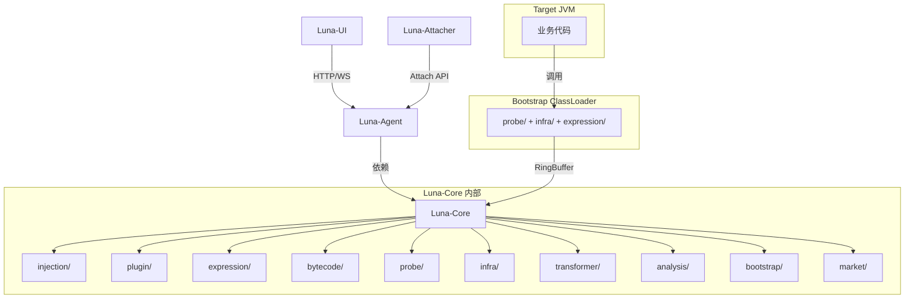
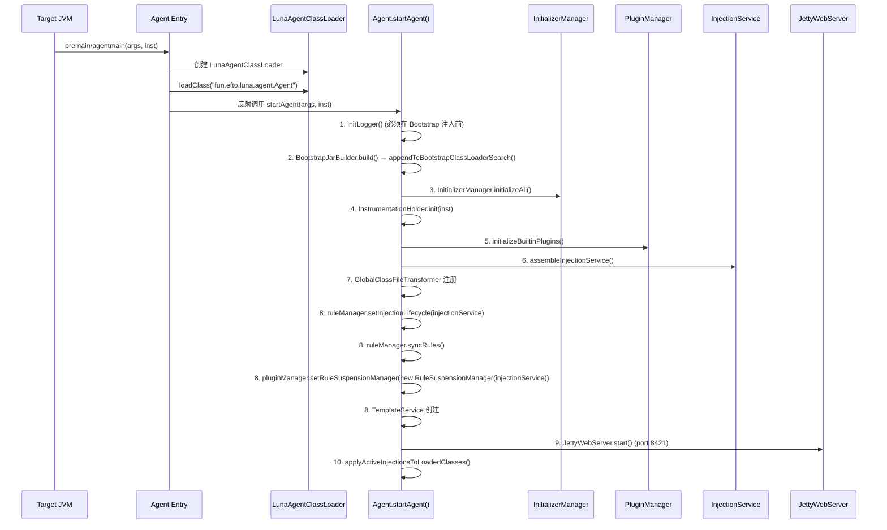
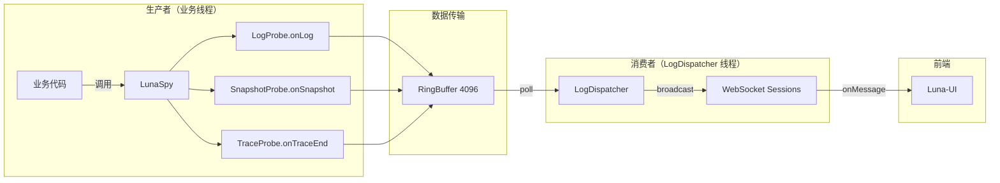

# Luna 系统架构全景

> **更新日期**: 2026/06/07

---

## 1. 架构理念

### 1.1 洋葱架构 (Onion Architecture)

Luna 采用洋葱架构思想，核心原则：

- **内层逻辑独立性**: 核心业务逻辑（注入控制、类型判定、规则匹配）位于中心，不依赖外部框架
- **依赖向内流动**: Web 接口层引用核心接口，核心不引用 Web
- **技术实现外置**: ASM/CFR/Jetty 等均为可替换的基础设施实现

### 1.2 架构分层

```
┌─────────────────────────────────────────────┐
│                  Luna-UI                     │  表现层
│           (Vue 3 + Monaco Editor)            │
├─────────────────────────────────────────────┤
│                Luna-Agent                     │  接入层
│    (Jetty WebServer + MVC + WebSocket)       │
├─────────────────────────────────────────────┤
│                Luna-Core                      │  核心层
│  ┌───────────────────────────────────────┐   │
│  │  injection/  (注入域模型)              │   │
│  │  plugin/     (插件框架)               │   │
│  │  expression/ (表达式引擎)             │   │
│  │  bytecode/   (字节码引擎)             │   │
│  │  probe/      (探针通信)               │   │
│  │  infra/      (基础设施)               │   │
│  │  market/     (插件市场)               │   │
│  │  transformer/(类转换器)               │   │
│  └───────────────────────────────────────┘   │
├─────────────────────────────────────────────┤
│              Luna-Attacher                    │  工具层
│          (VirtualMachine API)                │
└─────────────────────────────────────────────┘
         │                    │
         ▼                    ▼
   Bootstrap CL          Target JVM
   (LunaSpy/RingBuffer)  (业务代码)
```

---

## 2. 模块依赖关系



**依赖规则**:
- Agent 依赖 Core，Core 不依赖 Agent
- UI 通过 HTTP/WebSocket 与 Agent 通信，无编译期依赖
- Attacher 仅依赖 JDK Attach API

---

## 3. 技术栈

### 3.1 后端

| 类别 | 技术 | 版本 | 用途 |
|------|------|------|------|
| **字节码操作** | ASM | 9.4 | 方法级/行号级字节码注入 |
| **字节码操作** | ByteKit | - | 方法级注入（ASM 之上的高层抽象） |
| **反编译** | CFR | 0.152 | 已加载类源码反编译 |
| **Web 服务器** | Jetty | 9.4.53 | 内嵌 HTTP + WebSocket 服务器 |
| **JSON** | FastJSON | 2.0.40 | 请求/响应序列化 |
| **日志** | Log4j2 (Shade) | 2.20.0 | Agent 自身日志（重命名隔离） |
| **构建** | Maven Shade | 3.5.1 | Fat JAR + ASM 重命名 |
| **Java** | JDK | 8+ | 兼容性基线 |

### 3.2 前端

| 类别 | 技术 | 版本 | 用途 |
|------|------|------|------|
| **框架** | Vue | 3.2+ | 响应式 UI |
| **构建** | Vite | 3.0+ | 开发服务器 + 构建 |
| **UI 组件** | Element Plus | 2.2+ | 组件库 |
| **CSS** | Tailwind CSS | 4.2+ | 原子化样式 |
| **代码编辑** | Monaco Editor | 0.54+ | Java 语法高亮 |
| **国际化** | vue-i18n | 9.14+ | 中英文切换 |
| **E2E 测试** | Playwright | 1.52+ | 端到端测试 |

---

## 4. 类隔离策略

Luna 采用三重隔离确保与目标进程零冲突：

### 策略一: LunaAgentClassLoader

- 自定义 `URLClassLoader`，打破双亲委派
- Agent 入口类使用 `SystemClassLoader`，内部切换到 `LunaAgentClassLoader`
- `java.*` 等核心类走双亲委派，Luna 自身类由该 ClassLoader 隔离加载

### 策略二: Maven Shade 重命名

- `org.objectweb.asm` → `fun.efto.luna.shade.asm`
- `org.apache.logging.log4j` → `fun.efto.luna.shade.log4j2`
- 即使宿主应用依赖不同版本，全限定名不同实现完全隔离

### 策略三: Bootstrap JAR 注入

- 通过 `BootstrapJarBuilder` 仅提取 probe/infra/expression 类构建精简 JAR
- `inst.appendToBootstrapClassLoaderSearch()` 加入 Bootstrap CL
- **关键**: 仅注入精简 JAR（不含 Log4j2），避免 Bootstrap CL 加载 Shade 类导致 ClassCastException

---

## 5. Agent 启动流程



**关键时序约束**:
1. Logger 初始化必须在 `appendToBootstrapClassLoaderSearch()` 之前
2. Bootstrap JAR 仅包含 probe/infra/expression 类，零 Log4j2 依赖
3. GlobalClassFileTransformer 在 InjectionService 之后注册

---

## 6. 包结构 (luna-core)

```
fun.efto.luna.core
├── analysis/           # 类分析与反编译
│   ├── analyzer/       #   类分析器 (AsmClassAnalyzer)
│   └── decompile/      #   反编译器 (CFR 实现)
├── bootstrap/          # 启动与初始化
│   ├── init/           #   初始化器 (DefaultInitializer, AsmInitializer)
│   ├── capability/     #   核心能力注册表
│   └── BootstrapJarBuilder  # Bootstrap JAR 构建
├── bytecode/           # 字节码引擎
│   ├── asm/            #   ASM 实现 (核心注入器)
│   │   ├── analyzer/   #     ASM 类分析器
│   │   ├── assembler/  #     表达式解析与片段
│   │   └── injector/   #     字节码注入器注册表
│   └── bytekit/        #   ByteKit 实现 (方法级高层抽象)
│       ├── adapter/    #     注入器适配
│       ├── bridge/     #     LunaSpy 桥接
│       └── interceptor/#     拦截器 (Enter/Exit/Around/Exception/Invoke)
├── expression/         # 条件表达式引擎
│   ├── ast/            #   AST 节点 (7 种)
│   ├── bytecode/       #   表达式字节码生成
│   ├── context/        #   求值上下文 (ThreadLocal)
│   ├── parser/         #   递归下降解析器
│   ├── ConditionRegistry  # 条件注册表
│   ├── ExpressionUtils    # 表达式工具
│   ├── Token              # 词法 Token
│   └── Tokenizer          # 词法分析器
├── infra/              # 基础设施
│   ├── config/         #   配置管理
│   ├── type/           #   类型体系 (BaseType, RegisterableType, TypeRegistry)
│   ├── util/           #   工具类 (AccessFlagsConverter, ClassNameUtils)
│   ├── web/            #   Web 服务器接口
│   ├── BytecodeCache   #   字节码缓存
│   ├── InstrumentationHolder  # Instrumentation 持有者
│   └── RingBuffer      #   MPSC 无锁队列
├── injection/          # 注入域模型 (核心)
│   ├── code/           #   CompiledCode
│   ├── port/           #   六角架构端口 (Retransformer, BytecodeLoader, etc.)
│   ├── rule/           #   规则管理 (RuleManager, TemplateEngine)
│   │   └── template/   #     模板体系 (6 内置模板)
│   ├── target/         #   注入目标 (Method/LineNumber/Constructor/FieldAccess)
│   ├── CodeEngine      #   代码编译引擎接口
│   ├── CodeEngineRegistry  # 代码引擎注册表
│   ├── CodeInjector    #   代码注入器接口
│   ├── DefaultInjectionRegistry  # 默认注册表实现 (三级索引)
│   ├── DefaultInjectionRepository # 默认存储实现
│   ├── InjectionContext       # 注入上下文
│   ├── InjectionPersistenceService  # 持久化服务
│   ├── InjectionPointRegistry # 注入点注册表
│   ├── InjectionValidator     # 注入验证器
│   └── PackageTrie            # 包名字典树
├── market/             # 插件市场
│   ├── MarketClient    #   市场客户端
│   ├── MarketController #  市场 Controller
│   ├── PluginMetadata  #   插件元数据
│   ├── PluginRepository #  插件仓库配置
│   └── RepositoryConfig #  仓库配置
├── plugin/             # 插件框架
│   ├── builtin/        #   内置插件 (Log/Snapshot/Trace/ConditionalBreakpoint)
│   │   ├── log/        #     日志探针
│   │   ├── snapshot/   #     快照探针
│   │   ├── trace/      #     追踪探针
│   │   ├── line/       #     行号注入
│   │   ├── method/     #     方法注入
│   │   ├── conditional/#     条件断点
│   │   ├── AbstractRuleConverter  # 规则转换器基类
│   │   └── CoreModuleInitializer  # 核心模块初始化器
│   ├── codegen/        #   代码生成上下文 (DefaultBytecodeHelper, DefaultGenerateContext)
│   ├── lifecycle/      #   生命周期管理 (PluginManagerImpl, ReadyGate)
│   ├── loader/         #   类加载器 (PluginClassLoader, LunaAgentClassLoader)
│   ├── registry/       #   注册表 (InjectionTypeRegistry, ProbeHandlerRegistry, RuleConverterRegistry)
│   └── web/            #   插件 Web 扩展 (UiManifest, PluginUIController, PluginManagerController, MarketController)
├── probe/              # 探针通信
│   ├── LunaSpy         #   跨 ClassLoader 桥梁
│   ├── ProbeMessage    #   消息模型
│   ├── ProbeOutput     #   输出端口
│   └── BootstrapClassRegistry  # Bootstrap 类注册表
└── transformer/        # ClassFileTransformer 适配层
    ├── ClassFileTransformerAdapter  # 适配器
    ├── ClassTransformer             # 转换器接口
    ├── DefaultClassTransformer      # 默认转换逻辑
    ├── GlobalClassFileTransformer   # 全局转换器 (查询 Registry)
    ├── InjectionResult              # 注入结果
    ├── RuleClassFileTransformer     # 规则自动转换器
    └── TransformerResult            # 转换结果
```

---

## 7. 数据流架构



**关键设计**:
- **MPSC 无锁队列**: `AtomicReferenceArray` + CAS 写 + 单消费者读
- **满队列丢弃**: `offer()` 返回 false，保护业务线程永不阻塞
- **lazySet**: 减少内存屏障开销，最终一致性

---

## 8. 架构演进历程

| 阶段 | 核心变化 | 时间 |
|------|---------|------|
| **1. 初始** | 动态日志埋点工具，InjectionPoint + InjectionRule 双轨 | 2025/10 |
| **2. 微内核萌芽** | LunaPlugin/PluginContext/ExtensionRegistry | 2026/03 |
| **3. 插件架构** | v1→v2→v3→v4，热加载/卸载，StampedLock 并发安全 | 2026/05 |
| **4. 注入域大一统** | PersistentInjection 统一，抹除 Rule 概念 | 2026/05 |
| **5. 模块边界重塑** | InjectionManager → Repository/Registry/Service | 2026/05 |
| **6. 正交维度分离** | injectionLocation/probeType/codeType 三维度 | 2026/06 |
| **7. 三层持久化** | InjectionDefinition → RuntimeInjection → InjectionPoint | 2026/06 |
| **8. 运行时语义** | Runtime Truth First，Semantic Boundary | 规划中 |
