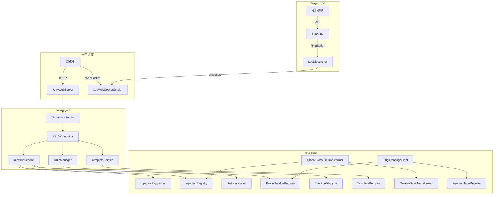

# 模块职责与边界

> **更新日期**: 2026/06/07

---

## 1. luna-core — 核心层

### 职责

- 定义注入域模型（InjectionPoint, PersistentInjection, InjectionTarget）
- 提供字节码注入引擎（ASM + ByteKit 双实现）
- 实现条件表达式引擎（Tokenizer → Parser → AST → 求值）
- 提供插件框架（LunaPlugin, ProbeHandler, PluginManager）
- 实现无锁数据传输（RingBuffer, LunaSpy）
- 管理注入生命周期（InjectionService, InjectionRegistry, InjectionRepository）
- 提供类分析与反编译能力

### 不负责

- 不负责 Agent 启动与生命周期编排
- 不负责 HTTP/WebSocket 服务
- 不负责 JVM Attach 操作
- 不负责 UI 渲染

### 核心子包职责

| 子包 | 职责 | 不负责 |
|------|------|--------|
| `injection/` | 注入域模型、生命周期管理、规则/模板 | 字节码具体操作 |
| `injection/port/` | 六角架构端口定义（Retransformer, BytecodeLoader 等） | 端口实现 |
| `injection/target/` | 注入目标抽象（Method/LineNumber/Constructor/FieldAccess） | 目标匹配逻辑 |
| `injection/rule/` | 规则持久化、模板引擎 | 运行时注入执行 |
| `plugin/` | 插件框架接口与生命周期 | 具体插件业务逻辑 |
| `plugin/builtin/` | 4 个内置插件实现 | 插件框架机制 |
| `plugin/lifecycle/` | PluginManagerImpl、ReadyGate、卸载安全 | 插件业务逻辑 |
| `plugin/registry/` | ProbeHandler/InjectionType/RuleConverter 注册表 | 注册项实现 |
| `bytecode/asm/` | ASM 字节码注入实现 | ByteKit 实现 |
| `bytecode/bytekit/` | ByteKit 方法级注入实现 | ASM 实现 |
| `expression/` | 条件表达式引擎 | 注入逻辑 |
| `probe/` | LunaSpy 通信桥梁、消息模型 | 消费逻辑 |
| `infra/` | RingBuffer、InstrumentationHolder、ConfigManager | 业务逻辑 |
| `transformer/` | ClassFileTransformer 适配层 | 字节码操作 |
| `analysis/` | 类分析、反编译 | 注入操作 |
| `bootstrap/` | 初始化器、核心能力注册 | 运行时逻辑 |

---

## 2. luna-agent — 接入层

### 职责

- Agent 入口（premain/agentmain）
- 类隔离加载器创建与切换
- 组件组装与启动编排
- 内嵌 Jetty Web 服务器
- 自定义 MVC 框架（注解驱动路由）
- WebSocket 实时推送（LogDispatcher）
- 类扫描与过滤
- 日志初始化与隔离

### 不负责

- 不负责核心注入逻辑（委托 luna-core）
- 不负责字节码操作（委托 luna-core）
- 不负责 UI 渲染

### 核心子包职责

| 子包 | 职责 |
|------|------|
| `agent/` | Agent 入口类，启动编排 |
| `agent/web/` | JettyWebServer、JettyConfiguration |
| `agent/web/controller/` | 9 个 Controller（Status/Class/Injection/Rule/Template/Test/Metrics/Capability/Probe） |
| `core/plugin/web/` | 2 个 Controller（PluginManager/PluginUI） |
| `core/market/` | 1 个 Controller（Market） |
| `agent/web/mvc/` | 自定义 MVC 框架（DispatcherServlet、路由、参数解析） |
| `agent/web/ws/` | WebSocket（LogWebSocketServlet/Endpoint/Dispatcher） |
| `agent/web/vo/` | 视图对象（VO） |
| `agent/clazz/` | 类扫描、类资源加载、类过滤 |
| `agent/log/` | LoggerInitializer（Log4j2 上下文隔离） |
| `agent/adapter/` | InjectionTestHarnessAdapter |

---

## 3. luna-attacher — 工具层

### 职责

- 提供 CLI 交互式选择目标 JVM 进程
- 通过 `com.sun.tools.attach.VirtualMachine` API 动态加载 Agent
- 附加后自动 detach

### 不负责

- 不负责 Agent 内部逻辑
- 不负责 Agent 启动后的任何操作

### 核心类

| 类 | 职责 |
|------|------|
| `Attacher` | 列出 JVM 进程 → 用户选择 → attach → loadAgent → detach |

---

## 4. luna-ui — 表现层

### 职责

- 诊断控制台 UI
- 类浏览器（包目录树 + 反编译源码 + 行号注入）
- 规则编辑与管理
- 模板应用
- 实时日志查看（WebSocket）
- JVM 监控仪表盘
- 线程分析器
- 插件管理
- 国际化（中/英）

### 不负责

- 不负责后端业务逻辑
- 不负责字节码操作

### 核心视图

| 视图 | 职责 |
|------|------|
| `Dashboard.vue` | 系统概览、JVM 指标 |
| `ClassTreeViewer.vue` | 类浏览器、反编译、注入操作 |
| `PluginManager.vue` | 插件列表、启用/禁用/卸载 |
| `LogViewer.vue` | 实时日志流（WebSocket） |
| `ThreadAnalyzer.vue` | 线程转储、死锁检测 |
| `ConfigurationViewer.vue` | 规则管理、模板应用 |

### 核心组件

| 组件 | 职责 |
|------|------|
| `RuleEditor.vue` | 规则编辑器 |
| `RuleCard.vue` | 规则卡片展示 |
| `InjectionDialog.vue` | 注入对话框 |
| `InjectionDetailOverlay.vue` | 注入详情覆盖层 |
| `ClassDetail.vue` | 类详情面板 |
| `ClassOutline.vue` | 类结构大纲 |
| `ClassHeader.vue` | 类头部信息 |
| `DebuggerPanel.vue` | 调试面板 |
| `ThreadList.vue` | 线程列表 |
| `ThreadDetail.vue` | 线程详情 |
| `VariableTreeNode.vue` | 变量树节点 |

---

## 5. 模块间协作关系

