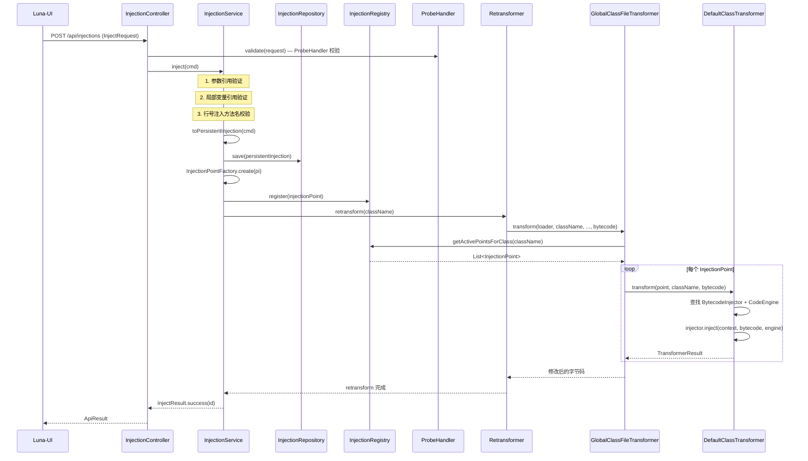
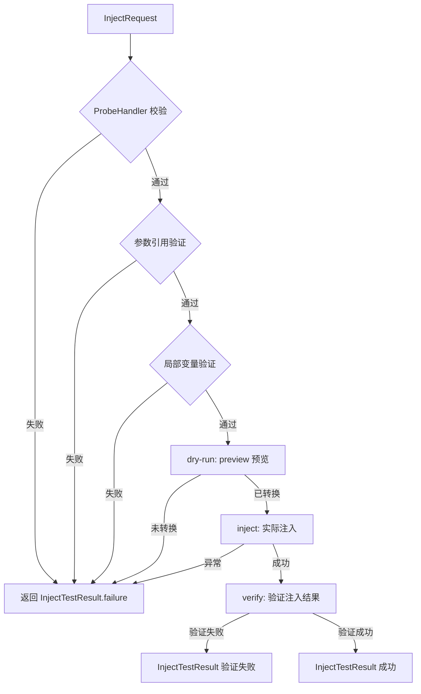
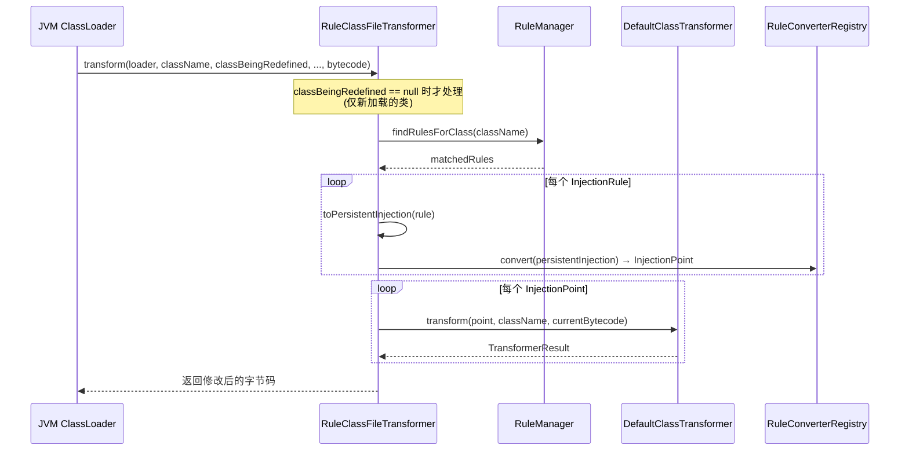
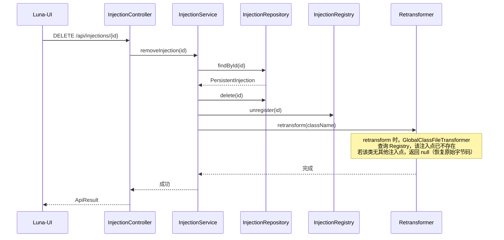
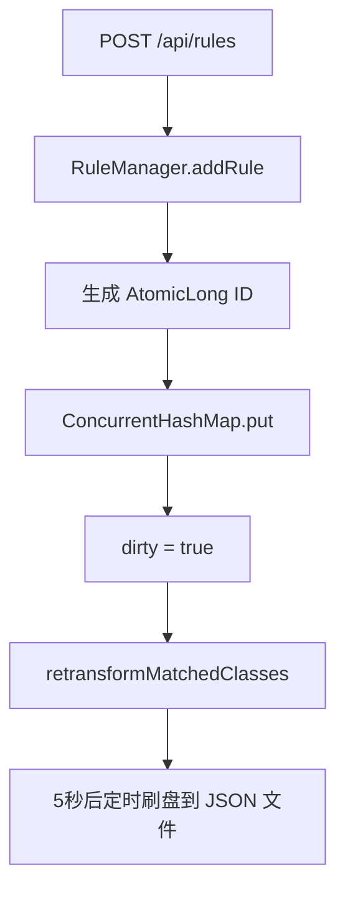
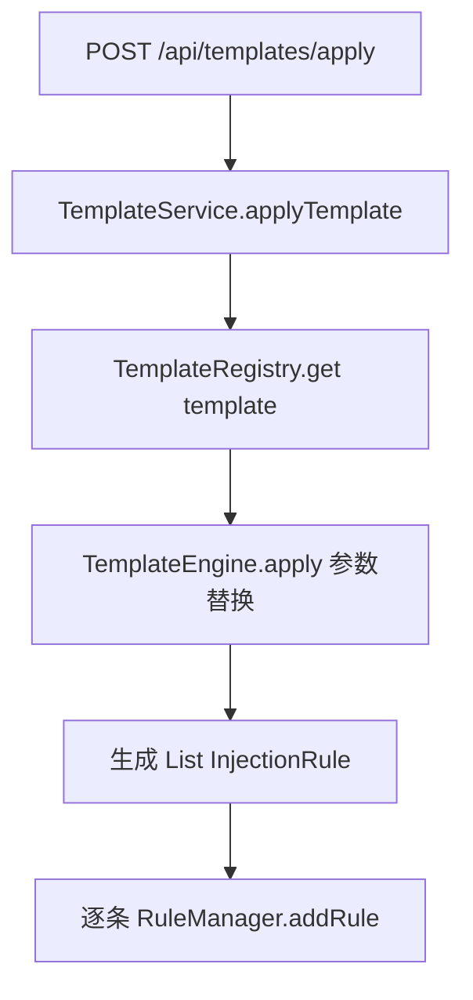
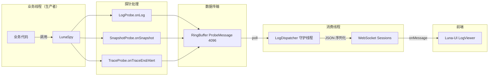
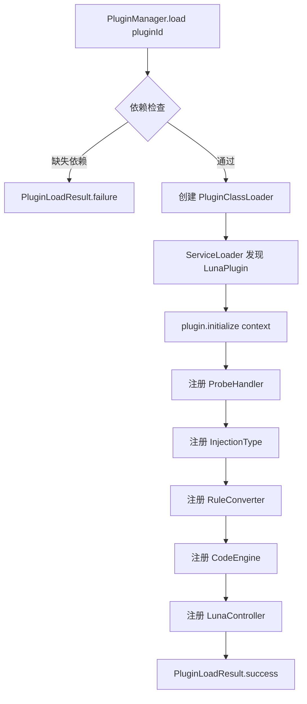
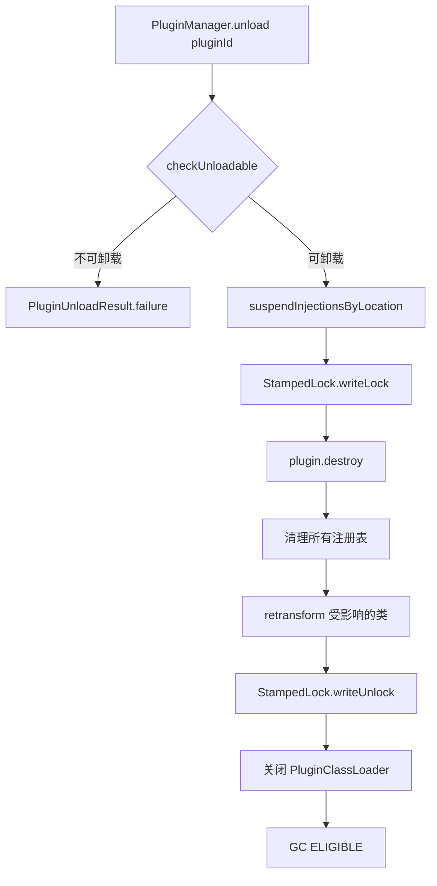
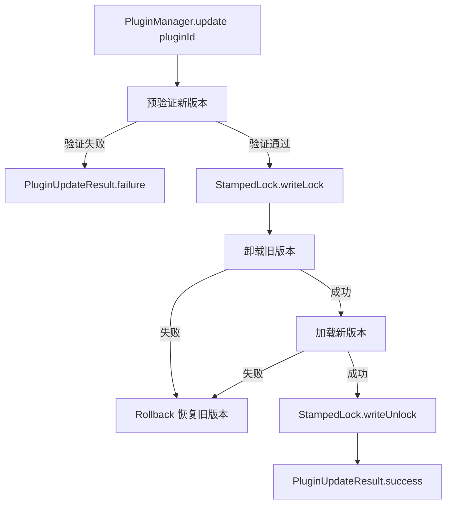

# 核心业务流程

> **更新日期**: 2026/06/07

---

## 1. API 实时注入流程

用户通过 Web UI 或 API 手动触发注入，对已加载的类进行 retransform。

### 关键步骤说明

| 步骤 | 说明 | 失败处理 |
|------|------|---------|
| ProbeHandler 校验 | 验证 probeType 合法性、注入位置兼容性 | 返回 InjectResult.failure() |
| 参数引用验证 | 检查 `$N` 引用是否超出方法参数范围 | 返回 InjectResult.failure() |
| 局部变量验证 | 检查 `$varName` 在目标行号处是否可见 | 返回 InjectResult.failure() |
| Repository 存储 | 持久化 PersistentInjection | 异常捕获，记录日志 |
| Registry 注册 | 编译并注册 InjectionPoint | 异常捕获，记录日志 |
| Retransform | 触发 JVM 重新转换类 | 异常捕获，记录日志 |

---

## 2. 注入测试流程 (injectWithTest)

四步验证流程：dry-run → inject → verify → validate

---

## 3. 规则自动注入流程

类首次加载时，`RuleClassFileTransformer` 自动匹配规则并注入。

---

## 4. 两条注入路径对比

| 特性 | API 实时注入 | 规则自动注入 |
|------|------------|------------|
| **触发方式** | 用户手动触发 | 类首次加载时自动触发 |
| **入口类** | `InjectionController` → `InjectionService` | `RuleClassFileTransformer` |
| **Transformer** | `GlobalClassFileTransformer`（全局注册） | `RuleClassFileTransformer`（全局注册） |
| **注入点来源** | `InjectRequest` → `PersistentInjection` → `InjectionPoint` | `RuleManager` → `InjectionRule` → `InjectionPoint` |
| **适用场景** | 对已加载的类进行 retransform | 对后续新加载的类自动注入 |
| **retransform** | 需要 `Instrumentation.retransformClasses()` | 不需要（类首次加载即转换） |

---

## 5. 注入移除流程

---

## 6. 规则管理流程

### 6.1 创建规则

### 6.2 模板应用

**6 个内置模板**:

| 模板 | 规则数 | 说明 |
|------|--------|------|
| `method-timing` | 2 | ENTER: trace:start + EXIT: trace:end:0 |
| `method-timing-threshold` | 2 | ENTER: trace:start + EXIT: trace:end:${threshold} |
| `method-access-log` | 2 | ENTER: log:→ call: $0 + EXIT: log:← return |
| `slow-method-alert` | 2 | ENTER: trace:start + EXIT: trace:alert:${threshold} |
| `line-snapshot` | 1 | LINE_BEFORE: snapshot:true |
| `conditional-breakpoint` | 1 | LINE_BEFORE: snapshot:true + condition |

---

## 7. 数据消费流程

**关键设计决策**:
- 所有数据统一投递到同一个 `RingBuffer<ProbeMessage>`
- 满队列丢弃，保护业务线程
- 无 WebSocket 连接时仍消费（丢弃），防止 RingBuffer 积压 OOM
- `LogDispatcher` 无数据时 `Thread.sleep(1)` 避免 CPU 空转

---

## 8. 插件生命周期流程

### 8.1 加载

### 8.2 卸载

### 8.3 热更新

