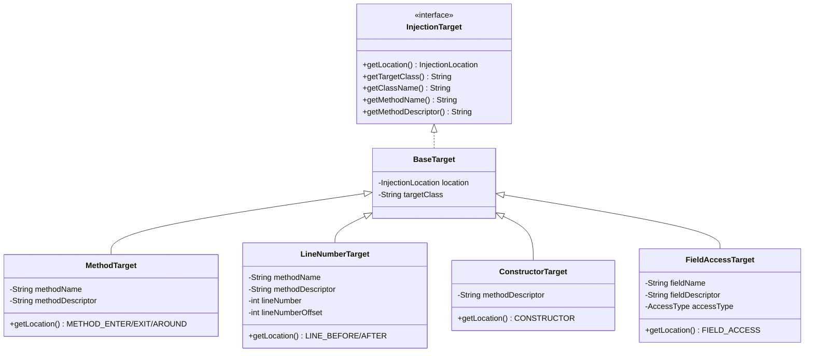
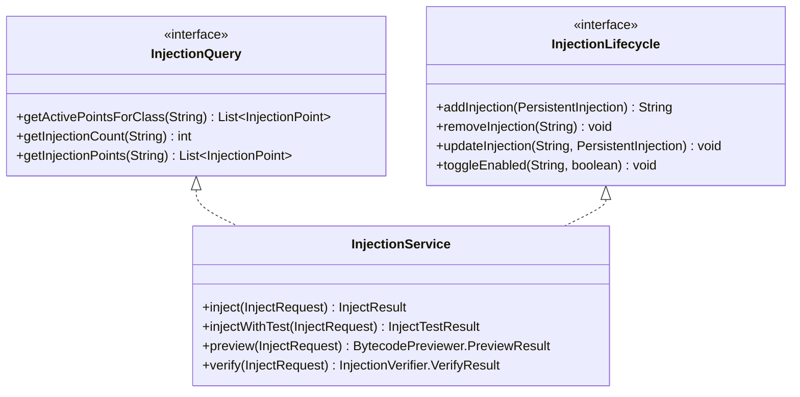
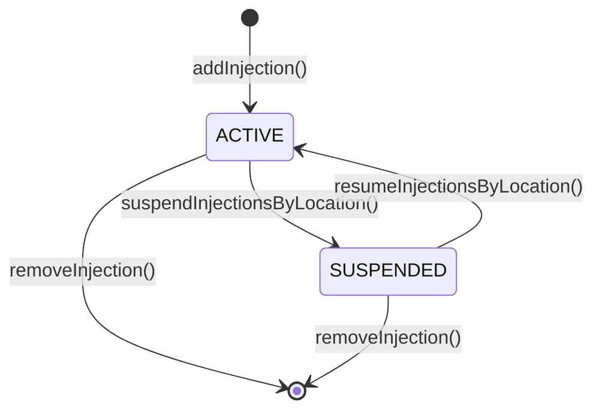

# 注入域模型

> **更新日期**: 2026/06/07

---

## 1. 三层模型

Luna 注入域采用三层模型，分离配置、运行时和编译缓存：

```
InjectionDefinition (配置层 - 规划中)
       │ materialize()
       ▼
PersistentInjection (持久化层 - 当前实现)
       │ InjectionPointFactory.create()
       ▼
InjectionPoint (运行时层 - 编译缓存)
```

> **当前状态**: InjectionDefinition 层尚未实现，当前由 PersistentInjection 同时承担配置和持久化职责。

---

## 2. PersistentInjection — 持久化注入实体

### 字段定义

| 字段 | 类型 | 说明 |
|------|------|------|
| `id` | `String` | UUID 唯一标识 |
| `clazz` | `String` | 目标类全限定名（支持通配符 `*`） |
| `methodName` | `String` | 目标方法名 |
| `methodDescriptor` | `String` | 方法描述符（JVM 格式） |
| `probeType` | `String` | 探针类型（LOG/SNAPSHOT/TRACE） |
| `injectionLocation` | `String` | 注入位置（method_enter/method_exit/method_around/line_before/line_after/invoke/exception_exit） |
| `codeType` | `String` | 代码类型（EXPRESSION） |
| `code` | `String` | 注入代码内容（支持协议前缀） |
| `lineNumber` | `Integer` | 行号（行号注入时使用） |
| `expression` | `String` | 条件表达式 |
| `fieldName` | `String` | 字段名（字段访问注入时使用） |
| `fieldDescriptor` | `String` | 字段描述符 |
| `enabled` | `boolean` | 是否启用 |
| `ephemeral` | `boolean` | 是否临时注入（不持久化） |
| `status` | `InjectionStatus` | 状态（ACTIVE/SUSPENDED/DISABLED） |
| `groupId` | `String` | 分组 ID（成对注入关联） |
| `suspendReason` | `String` | 挂起原因 |

### 协议前缀 (code 字段)

```
${condition}::protocol:content
     ↑           ↑        ↑
  条件表达式    协议类型   协议内容
```

| 协议 | 格式 | 说明 |
|------|------|------|
| 日志 | `log:消息 $1 $varName` | 输出日志，支持变量引用 |
| 快照 | `snapshot:true` | 捕获局部变量快照 |
| 追踪开始 | `trace:start` | 记录方法入口时间 |
| 追踪结束 | `trace:end:N` | 计算耗时，N 为阈值(ms) |
| 慢方法告警 | `trace:alert:N` | 超阈值告警，N 为阈值(ms) |

---

## 3. InjectionPoint — 运行时注入点

### 字段定义

| 字段 | 类型 | 说明 |
|------|------|------|
| `id` | `String` | UUID，与 PersistentInjection.id 一致 |
| `target` | `InjectionTarget` | 注入目标（方法/行号/构造器/字段访问） |
| `code` | `CompiledCode` | 编译后的代码（条件 + 内容 + 片段） |
| `codeType` | `String` | 代码类型 |
| `probeType` | `String` | 探针类型 |
| `source` | `PersistentInjection` | 原始持久化实体引用 |

### 创建流程

```java
InjectionPoint point = InjectionPointFactory.create(persistentInjection);
// 内部流程:
// 1. 根据 injectionLocation 创建 InjectionTarget (MethodTarget/LineNumberTarget/...)
// 2. 根据 probeType + code 创建 CompiledCode
// 3. 组装 InjectionPoint
```

---

## 4. InjectionTarget — 注入目标体系



---

## 5. InjectionLocation — 注入位置

| 位置 | 说明 | 适用目标 | 注册状态 |
|------|------|---------|---------|
| `method_enter` | 方法入口 | MethodTarget | 已注册 |
| `method_exit` | 方法退出 | MethodTarget | 已注册 |
| `method_around` | 方法环绕 | MethodTarget | 已注册 |
| `line_before` | 行号前 | LineNumberTarget | 已注册 |
| `line_after` | 行号后 | LineNumberTarget | 已注册 |
| `invoke` | 方法调用点 | MethodTarget | 已注册 |
| `exception_exit` | 异常退出 | MethodTarget | 已注册 |
| `constructor` | 构造器 | ConstructorTarget | 有类定义，未注册 |
| `field_access` | 字段访问 | FieldAccessTarget | 有类定义，未注册 |

> **注意**: `constructor` 和 `field_access` 有对应的 Target 类定义，但尚未在 `CoreModuleInitializer` 中注册到 `InjectionTypeRegistry`，当前不可通过 API 使用。

---

## 6. 三层服务架构

### InjectionRepository — 纯存储层

```java
public interface InjectionRepository {
    void save(PersistentInjection injection);
    void delete(String id);
    PersistentInjection findById(String id);
    List<PersistentInjection> findAll();
}
```

**职责**: 仅负责 PersistentInjection 的 CRUD 操作，无业务逻辑。
**实现**: `DefaultInjectionRepository`（内存 ConcurrentHashMap）

### InjectionRegistry — 高性能内存注册表

```java
public interface InjectionRegistry extends InjectionQuery {
    void register(InjectionPoint point);
    void unregister(String pointId);
    void unregisterByPluginId(String pluginId);
}
```

**职责**: 管理激活且已编译的 InjectionPoint，供 GlobalClassFileTransformer 查询。
**实现**: `DefaultInjectionRegistry`（三级索引: exactIndex + PackageTrie + regexFallback）

### InjectionService — 领域编排服务

```java
public class InjectionService implements InjectionQuery, InjectionLifecycle {
    // 编排: 验证 → 存储 → 编译 → 注册 → retransform

    // InjectionQuery (只读)
    +getActivePointsForClass(String) List~InjectionPoint~
    +getInjectionCount(String) int
    +getInjectionPoints(String) List~InjectionPoint~

    // InjectionLifecycle (写操作)
    +addInjection(PersistentInjection) String
    +removeInjection(String) void
    +updateInjection(String, PersistentInjection) void
    +toggleEnabled(String, boolean) void

    // 业务方法
    +inject(InjectRequest) InjectResult
    +injectWithTest(InjectRequest) InjectTestResult
    +preview(InjectRequest) BytecodePreviewer.PreviewResult
    +verify(InjectRequest) InjectionVerifier.VerifyResult
    +getInjection(String) PersistentInjection
    +suspendInjectionsByLocation(Set~String~, String) List~String~
    +resumeInjectionsByLocation(Set~String~) void
}
```

**职责**: 协调验证、存储、编译、注册、retransform 的完整注入生命周期。

---

## 7. 接口隔离



**设计意图**:
- `InjectionQuery`（只读）: 供 `GlobalClassFileTransformer` 查询，不暴露写操作
- `InjectionLifecycle`（写操作）: 供 Controller/RuleManager 使用

---

## 8. 注入状态流转



| 状态 | 说明 | Registry 状态 |
|------|------|--------------|
| `ACTIVE` | 注入点激活 | 已注册到 InjectionRegistry |
| `SUSPENDED` | 注入点挂起 | 已从 InjectionRegistry 注销 |
| `DISABLED` | 注入点禁用 | 已从 InjectionRegistry 注销 |

**挂起场景**: 插件卸载时，该插件注册的注入位置对应的注入点会被挂起。
