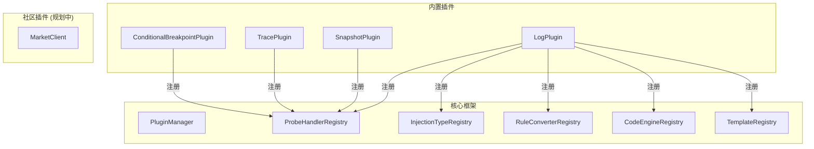
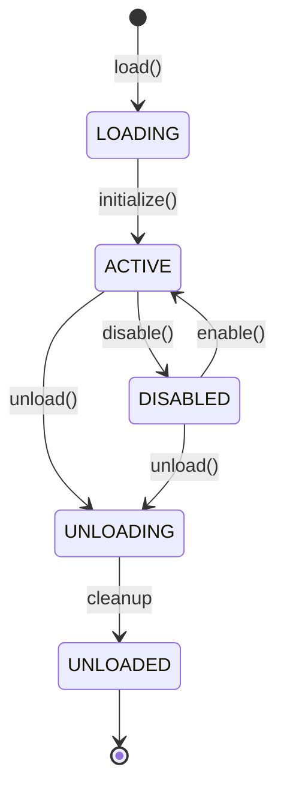

# 插件架构体系

> **更新日期**: 2026/06/07

---

## 1. 插件架构概览

Luna 采用微内核 + 插件架构，核心框架提供扩展点，内置插件和社区插件通过标准接口扩展能力。



---

## 2. LunaPlugin 接口

```java
public interface LunaPlugin {
    String getId();                    // 插件唯一标识
    String getDisplayName();           // 显示名称
    String getVersion();               // 版本号
    String getAuthor();                // 作者
    String getCategory();              // 分类
    default List<String> getDependencies() { return Collections.emptyList(); }
    void initialize(PluginContext context);  // 初始化
    default void destroy() {}                // 销毁
    default void getControllers(List<LunaController> controllers) {} // Web 扩展
}
```

### 4 个内置插件

| 插件 | ID | 分类 | 探针类型 | 注入位置 |
|------|-----|------|---------|---------|
| **LogPlugin** | `log` | observability | LOG | method_enter, method_exit, method_around, line_before, line_after, invoke, exception_exit |
| **SnapshotPlugin** | `snapshot` | debug | SNAPSHOT | method_enter, method_exit, line_before, line_after |
| **TracePlugin** | `trace` | performance | TRACE | method_enter, method_exit |
| **ConditionalBreakpointPlugin** | `conditional_breakpoint` | debug | _(无 ProbeHandler)_ | line_before |

---

## 3. ProbeHandler — 探针行为接口

```java
public interface ProbeHandler {
    String getProbeType();                             // 探针类型标识
    boolean usesCode();                                // 是否需要代码内容
    Set<String> supportedInjectionLocations();         // 支持的注入位置
    ValidationResult validate(InjectRequest request);  // 验证请求
    void handle(CompiledCode code, GenerateContext ctx); // 生成字节码
}
```

### 探针行为对照

| ProbeHandler | usesCode | 支持位置 | 验证规则 | 生成行为 |
|-------------|----------|---------|---------|---------|
| `LogProbeHandler` | true | method_enter/exit/around, line_before/after, invoke, exception_exit | code 非空 | 调用 LunaSpy.onLog() |
| `SnapshotProbeHandler` | false | method_enter/exit, line_before/after | 无需 code | 调用 LunaSpy.onSnapshot() |
| `TraceProbeHandler` | false | method_enter, method_exit | 无需 code | 调用 LunaSpy.onTraceStart/End/Alert() |

> **注意**: ConditionalBreakpointPlugin 未注册 ProbeHandler，仅注册了模板。其行号快照功能通过 SnapshotProbeHandler 实现。

---

## 4. PluginContext — 插件上下文

插件初始化时接收 `PluginContext`，通过它注册扩展点：

```java
public interface PluginContext {
    void registerProbeHandler(ProbeHandler handler);
    void registerInjectionLocation(InjectionLocation location);
    void registerRuleConverter(InjectionRuleConverter converter);
    void registerRuleConverter(InjectionLocation location, InjectionRuleConverter converter);
    void registerCodeEngine(CodeEngine engine);
    void registerInjector(InjectionLocation location, BytecodeInjector injector);
    void registerTemplate(RuleTemplate template);
    void registerBootstrapClass(String internalName);  // JVM 内部名格式，如 com/example/Foo
    ClassAnalyzer getClassAnalyzer();
    Decompiler getDecompiler();
    LogEmitter getLogEmitter();
    RingBuffer<ProbeMessage> getLogBuffer();
    Retransformer getRetransformer();
    Map<String, String> getPluginConfig();
    void savePluginConfig(Map<String, String> config);
}
```

**实现**: `PluginContextImpl`，内部委托各 Registry 的注册方法。

---

## 5. PluginManager — 插件管理器

### 接口定义

```java
public interface PluginManager {
    PluginLoadResult load(String pluginId);
    PluginUnloadResult unload(String pluginId);
    PluginUpdateResult update(String pluginId);
    UnloadCheckResult checkUnloadable(String pluginId);
    void disable(String pluginId);
    void enable(String pluginId);
    List<PluginInfo> listPlugins();
    LunaPlugin getPlugin(String pluginId);
    PluginState getState(String pluginId);
    void addListener(PluginLifecycleListener listener);
    void removeListener(PluginLifecycleListener listener);
    StampedLock getTransformLock();
    Map<String, String> getPluginConfig(String pluginId);
    void savePluginConfig(String pluginId, Map<String, String> config);
    default Set<InjectionLocation> getInjectionLocationsForPlugin(String pluginId) { return Collections.emptySet(); }
    default Set<ProbeHandler> getProbeHandlersForPlugin(String pluginId) { return Collections.emptySet(); }
    default Set<RuleTemplate> getTemplatesForPlugin(String pluginId) { return Collections.emptySet(); }
}
```

### 实现: PluginManagerImpl

**并发安全**: 使用 `StampedLock` 实现读写分离
- 注入操作持读锁（允许多线程并发注入）
- 加载/卸载操作持写锁（独占，阻塞注入）

### 插件状态



---

## 6. 插件类加载器

### LunaAgentClassLoader

- Agent 入口使用，打破双亲委派
- `java.*` / `javax.*` / `sun.*` 走双亲委派
- Luna 自身类由该 ClassLoader 加载

### PluginClassLoader

- 每个插件一个独立 ClassLoader
- **child-first** 策略：优先自己加载，再委派父类
- `PARENT_FIRST_PREFIXES` 保证框架类一致性（`fun.efto.luna.core.*`）
- 卸载时关闭 ClassLoader，使插件类 GC 可回收

---

## 7. 插件注册快照 (PluginRegistrationRecord)

框架自动维护注册快照，卸载时自动清理：

```java
public class PluginRegistrationRecord {
    String pluginId;
    Set<String> registeredProbeHandlers;
    Set<String> registeredInjectionTypes;
    Set<String> registeredRuleConverters;
    Set<String> registeredCodeEngines;
    Set<String> registeredTemplates;
    List<LunaController> registeredControllers;
}
```

**卸载时**: 遍历 record，自动从各 Registry 注销。

---

## 8. 内置插件保护

内置插件（Log/Snapshot/Trace/ConditionalBreakpoint）由 `PluginManagerImpl` 内部通过插件 ID 判断，不允许卸载。`unload()` 调用内置插件时直接返回失败。

> **注意**: `LunaPlugin` 接口中没有 `isBuiltin()` 方法，保护逻辑在 `PluginManagerImpl` 内部实现。

---

## 9. 插件市场 (规划中)

| 组件 | 职责 | 状态 |
|------|------|------|
| `MarketClient` | 从远程仓库获取插件列表、下载插件 | 部分实现 |
| `MarketController` | 插件市场 API（搜索/安装/更新） | 部分实现 |
| `PluginMetadata` | 插件元数据（名称/版本/作者/校验和） | 已实现 |
| `PluginRepository` | 插件仓库配置 | 已实现 |

**安全机制**:
- HTTPS 传输
- Checksum 校验
- 可信源白名单

---

## 10. 前端扩展点体系

插件可通过 `UiManifest` 声明前端扩展：

| 扩展点 | 说明 | 数据源 |
|--------|------|--------|
| EP-1 注入类型扩展 | 注册新的注入位置选项 | `ProbeHandler.supportedInjectionLocations()` |
| EP-2 表达式协议扩展 | 注册新的代码协议 | `CodeEngine.getName()` |
| EP-3 模板库扩展 | 注册新的规则模板 | `TemplateRegistry` |
| EP-4 插件管理 | 插件列表、启用/禁用 | `PluginManager.listPlugins()` |

**聚合 API**: `/api/plugins/ui-manifest` 返回所有插件的 UI 扩展信息，前端据此动态渲染。
