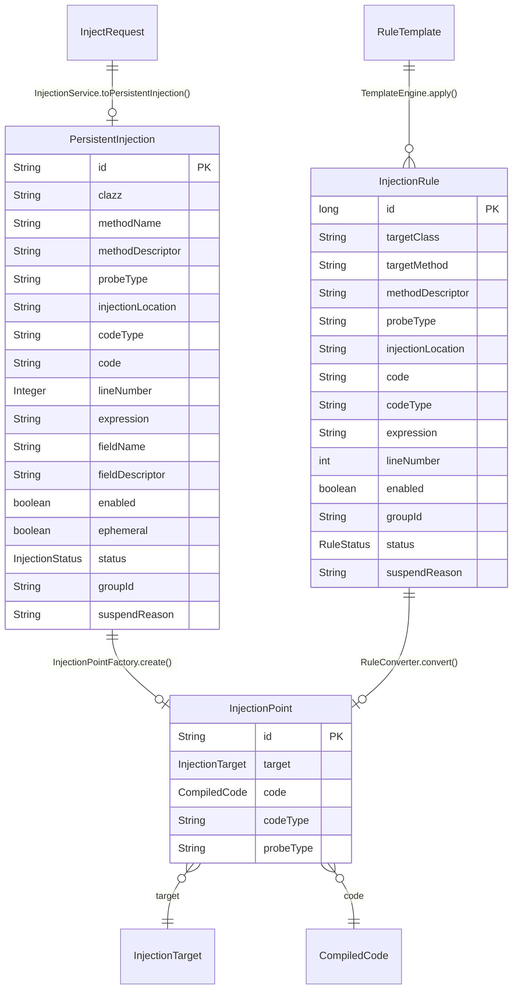

# 数据模型定义

> **更新日期**: 2026/06/07

---

## 1. 核心模型关系

---

## 2. InjectRequest — 注入请求

| 字段 | 类型 | 必填 | 说明 |
|------|------|------|------|
| `clazz` | String | 是 | 目标类全限定名 |
| `method` | String | 是 | 目标方法名 |
| `probeType` | String | 是 | 探针类型 (LOG/SNAPSHOT/TRACE) |
| `injectionLocation` | String | 是 | 注入位置 (method_enter/method_exit/method_around/line_before/line_after/invoke/exception_exit) |
| `desc` | String | 否 | 方法描述符 |
| `codeType` | String | 否 | 代码类型 (EXPRESSION) |
| `code` | String | 否 | 注入代码内容 |
| `lineNumber` | Integer | 否 | 行号（行号注入时必填） |

---

## 3. PersistentInjection — 持久化注入

| 字段 | 类型 | 默认值 | 说明 |
|------|------|--------|------|
| `id` | String | UUID | 唯一标识 |
| `clazz` | String | - | 目标类全限定名（支持 `*` 通配符） |
| `methodName` | String | - | 目标方法名 |
| `methodDescriptor` | String | - | 方法描述符 |
| `probeType` | String | - | 探针类型 |
| `injectionLocation` | String | - | 注入位置 |
| `codeType` | String | - | 代码类型 |
| `code` | String | - | 注入代码（支持协议前缀） |
| `lineNumber` | Integer | 0 | 行号 |
| `expression` | String | - | 条件表达式 |
| `fieldName` | String | - | 字段名 |
| `fieldDescriptor` | String | - | 字段描述符 |
| `enabled` | boolean | true | 是否启用 |
| `ephemeral` | boolean | false | 是否临时注入 |
| `status` | InjectionStatus | ACTIVE | 状态 |
| `groupId` | String | - | 分组 ID |
| `suspendReason` | String | - | 挂起原因 |

---

## 4. InjectionRule — 注入规则

| 字段 | 类型 | 说明 |
|------|------|------|
| `id` | long | 规则 ID（AtomicLong 自增） |
| `targetClass` | String | 目标类全限定名（支持通配符 `*`） |
| `targetMethod` | String | 目标方法名 |
| `methodDescriptor` | String | 方法描述符 |
| `probeType` | String | 探针类型（LOG/SNAPSHOT/TRACE） |
| `injectionLocation` | String | 注入位置（method_enter/method_exit/method_around/line_before/line_after/invoke/exception_exit） |
| `lineNumber` | int | 行号 |
| `expression` | String | 条件表达式 |
| `code` | String | 注入代码（支持协议前缀） |
| `codeType` | String | 代码类型（EXPRESSION） |
| `enabled` | boolean | 是否启用 |
| `groupId` | String | 分组 ID |
| `status` | RuleStatus | 规则状态 |
| `suspendReason` | String | 挂起原因 |

---

## 5. InjectionPoint — 运行时注入点

| 字段 | 类型 | 说明 |
|------|------|------|
| `id` | String | UUID，与 PersistentInjection.id 一致 |
| `target` | InjectionTarget | 注入目标 |
| `code` | CompiledCode | 编译后的代码 |
| `codeType` | String | 代码类型 |
| `probeType` | String | 探针类型 |
| `source` | PersistentInjection | 原始持久化实体 |

---

## 6. InjectionTarget — 注入目标

### MethodTarget

| 字段 | 说明 |
|------|------|
| `targetClass` | 目标类名 |
| `methodName` | 方法名 |
| `methodDescriptor` | 方法描述符 |
| `location` | METHOD_ENTER / EXIT / AROUND |

### LineNumberTarget

| 字段 | 说明 |
|------|------|
| `targetClass` | 目标类名（继承自 BaseTarget） |
| `methodName` | 方法名 |
| `methodDescriptor` | 方法描述符 |
| `lineNumber` | 目标行号 |
| `lineNumberOffset` | 行号偏移量 |
| `location` | LINE_BEFORE / AFTER |

### ConstructorTarget

| 字段 | 说明 |
|------|------|
| `targetClass` | 目标类名 |
| `methodDescriptor` | 构造器描述符 |
| `location` | CONSTRUCTOR |

### FieldAccessTarget

| 字段 | 说明 |
|------|------|
| `targetClass` | 目标类名（继承自 BaseTarget） |
| `fieldName` | 字段名 |
| `fieldDescriptor` | 字段描述符 |
| `accessType` | 访问类型（READ / WRITE） |
| `location` | FIELD_ACCESS |

---

## 7. CompiledCode — 编译后代码

| 字段 | 类型 | 说明 |
|------|------|------|
| `condition` | String | 条件表达式（可为 null） |
| `content` | String | 代码内容 |
| `segments` | List | 解析后的代码片段 |

---

## 8. 枚举类型

### InjectionStatus

| 值 | 说明 |
|-----|------|
| `ACTIVE` | 激活状态 |
| `SUSPENDED` | 挂起状态 |
| `DISABLED` | 禁用状态 |

### RuleStatus

| 值 | 说明 |
|-----|------|
| `ACTIVE` | 启用 |
| `SUSPENDED` | 挂起 |
| `DISABLED` | 禁用 |

### PluginState

| 值 | 说明 |
|-----|------|
| `LOADING` | 加载中 |
| `ACTIVE` | 已激活 |
| `DISABLED` | 已禁用 |
| `UNLOADING` | 卸载中 |
| `UNLOADED` | 已卸载 |

---

## 9. ProbeMessage — 探针消息

| 字段 | 类型 | 说明 |
|------|------|------|
| `type` | String | 消息类型 (LOG/SNAPSHOT/TRACE_END/TRACE_ALERT) |
| `payload` | String | 消息负载（JSON 格式，包含 threadName/content/className/methodName/durationMs 等） |
| `timestamp` | long | 时间戳 |

> **注意**: `threadName`、`content`、`className`、`methodName`、`durationMs` 等信息封装在 `payload` JSON 中，而非 ProbeMessage 的独立字段。

---

## 10. PluginInfo — 插件信息

| 字段 | 类型 | 说明 |
|------|------|------|
| `id` | String | 插件 ID |
| `displayName` | String | 显示名称 |
| `version` | String | 版本号 |
| `author` | String | 作者 |
| `category` | String | 分类 |
| `state` | PluginState | 状态 |
| `dependencies` | List\<String\> | 依赖列表 |

> **注意**: 内置插件保护逻辑在 `PluginManagerImpl` 内部通过插件 ID 判断，不在 PluginInfo 中标记。

---

## 11. RuleTemplate — 规则模板

| 字段 | 类型 | 说明 |
|------|------|------|
| `name` | String | 模板名称 |
| `displayName` | String | 显示名称 |
| `version` | String | 版本号 |
| `author` | String | 作者 |
| `category` | String | 分类 |
| `description` | String | 描述 |
| `parameters` | List\<TemplateParameter\> | 参数定义 |
| `rules` | List\<TemplateRule\> | 模板规则列表 |

### TemplateParameter — 模板参数

| 字段 | 类型 | 说明 |
|------|------|------|
| `name` | String | 参数名 |
| `displayName` | String | 显示名称 |
| `type` | String | 参数类型 |
| `defaultValue` | String | 默认值 |
| `description` | String | 描述 |
| `required` | boolean | 是否必填 |

### TemplateRule — 模板规则

| 字段 | 类型 | 说明 |
|------|------|------|
| `probeType` | String | 探针类型 |
| `injectionLocation` | String | 注入位置 |
| `codeType` | String | 代码类型 |
| `code` | String | 代码内容（支持 ${param} 占位符） |
| `condition` | String | 条件表达式（对应 InjectionRule.expression） |
| `lineNumber` | int | 行号 |
